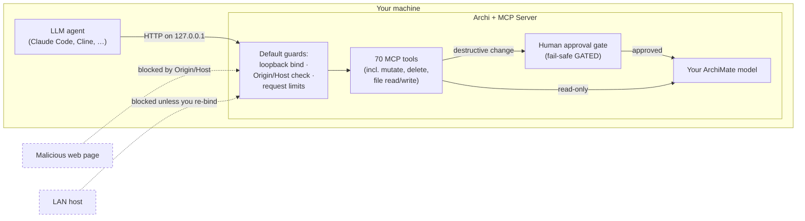

# Security Policy

The ArchiMate MCP Server embeds an HTTP server inside Archi and exposes your
open model — including **mutating** tools (create, update, delete, undo/redo)
and tools that **read and write files** — to a connected LLM agent. That makes
the trust boundary worth stating plainly.

This document says what the server **protects against by default**, what is
**your responsibility as the operator**, and **how to report a vulnerability**.

---

## The threat model in one sentence

> The threat is not the hostile internet. It is **other local processes on your
> machine, LAN neighbours after one preference change, and a prompt-injected
> agent** — and the mitigations are sized for exactly those.

By default the server binds to loopback (`127.0.0.1`) and validates the
`Origin`/`Host` header, so a remote attacker on the network cannot reach it and
a malicious web page cannot drive it through your browser. The realistic risks
are therefore *local* and *agent-mediated*, and the controls below are built
around that.

---

## What the server protects against **by default**

These hold with **zero configuration** — they are on out of the box.

| Protection | What it does | Threat it closes |
|---|---|---|
| **Loopback-only bind** | Default `Bind Address` is `127.0.0.1`; the port is not reachable from the network. | LAN / remote access. |
| **Origin/Host validation** | Requests whose `Host` (or browser-supplied `Origin`) is not a loopback name are rejected with **HTTP 403**, in front of both `/mcp` and `/sse`. Relaxed automatically only when you deliberately bind off-loopback. | **DNS-rebinding** — a web page in your browser silently driving the tools. |
| **Human-owned approval gate** | Approval mode is owned by the human in Archi, not the agent. A fresh install defaults to **GATED** (fail-safe); the agent has **no tool** to ungate itself or approve its own changes — it can only *observe* that it is gated (`list-pending-approvals`, `approvalMode` on `get-model-info`). Turning the gate *off* requires a desktop confirmation. | An agent (or a prompt-injected agent) silently applying destructive changes. |
| **Approval decides on what you actually reviewed** | A card is built when the change is proposed; the command is rebuilt against the current model when you approve. If the blast radius has grown in between, approval is **refused** and both figures are named, rather than applying a larger cascade than the card described. A refusal raised during that rebuild keeps its own reason and remedy instead of a generic "the model changed", and *Approve All* reports that reason when it halts. Cards also state whether Approve re-derives the change or applies the exact compound you reviewed. **The staleness check now also covers a proposal whose target was still queued in an open batch when the card was made** — such a target resolved to nothing, so it was fingerprinted as nothing and every later comparison treated it as fresh. That window opens the moment the batch commits and lasts as long as the human takes to read the card, with the object on the canvas and editable throughout, so a hand edit made in that window could be overwritten silently on approve. Targets are now resolved against the session's open batch as well as committed containment, on both sides of the comparison. **A frozen compound is also vetted against the batch it was resolved in:** fourteen tools apply the exact compound you reviewed rather than re-running the pass, so for them the tracked-target set *is* the whole check — there is no rebuild to throw. A `bulk-mutate` fingerprinted each operation's own not-yet-existing entity id, so a bulk of creates produced an **empty** tracked set and the guard vetted nothing; approving after its enclosing batch had been rolled back reported a placement into a view that gained nothing. Every one of the fourteen now walks the compound's typed child commands — including into nested compounds, and tracking the *container* a placement writes into — and refuses with a message naming the object that went away. | A human authorising a destructive change against a stale, understated description of its effect — or having their own edit silently overwritten by a card that was never checked for staleness at all. |
| **The card describes the whole write** | Everything on a card — its headline sentence, its expanded rows and the `Technical details` disclosure — is derived from one server-built map of the pending change, which is also what `list-pending-approvals` returns. Every parameter the approval will apply must be in that map, and the card's sentence names the aspects that will change rather than one of them: a rename is announced as a rename, a restyle is not announced or validated as a reroute, and a call that discloses nothing says so instead of claiming a change. Both ends are held — under-disclosure hides a write, over-disclosure invents one — by a contract test that parses every proposal site in the server and fails the build unless each is complete or carries a registry line naming the exact parameters it exempts. | A human approving a change the card described only in part, and authorising an aspect of the write — a deletion-adjacent `force`, a styling or anchoring change — they were never shown. |
| **Agent-scoped undo/redo** | The `undo`/`redo` tools stop at — and refuse to cross — any human edit on the stack, so the agent can never silently revert your hand-drawn work. | Agent clobbering human work via undo. |
| **Request-size cap, idle timeout, bounded thread pool** | Jetty rejects oversized request bodies and idle connections, and runs on a bounded worker pool. | Local request-flood / oversized-payload denial of service. |
| **UTF-8 request-body enforcement** | Requests that declare a non-UTF-8 `charset`, or whose body bytes are not well-formed UTF-8 (even with no declared charset), are rejected with **HTTP 415**. Conformant clients (`charset=utf-8` or none) are unaffected; each check has a kill switch. | Mis-encoded payloads producing silent data corruption or parser confusion. |
| **Session / cache / batch eviction** | Per-session state, caches, and batch contexts are evicted on an idle TTL rather than living forever. | Memory-exhaustion DoS from fabricated or abandoned session IDs. |
| **Bounded raster export** | A raster `export-view` is projected to its pixel dimensions and byte estimate **before** any bitmap is allocated, and refused when the machine cannot back it. Archi renders a raster export as one bitmap covering the whole diagram, so a scale inside the accepted 0.1–4.0 range could still ask the operating system for a buffer far larger than free memory — a native fault during the first write, not a catchable exception, which killed the process and took the user's unsaved model with it. The refusal is a structured `INVALID_PARAMETER` naming the projected dimensions, the estimate, the budget compared against, and the largest scale that would have fitted. The budget is free *physical* memory queried at call time, and one bitmap may claim at most half of it, because the export path holds the raster twice while encoding. `svg` and `pdf` allocate no bitmap and are unaffected. | Memory exhaustion and **loss of unsaved work** — an agent-issued export terminating Archi rather than returning an error. |
| **Bounded remote-image download** | Image fetches from a URL are stream-capped *before* buffering, so an oversized or endless response cannot exhaust memory. The batch form of `add-image-to-model` applies the same per-image cap and is itself capped at the `bulk-mutate` operation limit, so batching cannot multiply the ceiling. | Memory DoS via a hostile image URL. |
| **Secrets in the OS keychain** | The bearer token and the TLS keystore password are stored in Equinox secure storage (macOS Keychain / Windows Credential Store), **never** in cleartext on disk. The server **fails closed** rather than falling back to plaintext or to serving unauthenticated. | Secret-scanner exposure; cleartext secret theft. |
| **Keystore password never reaches a command line** | When a self-signed certificate is generated, the keystore password is passed to `keytool` **in the child process's environment**, not as a command-line argument. A process's arguments are readable by other local processes through the process table, so a password on the command line is visible for the lifetime of the call; its environment is not. The same change stopped a failed generation folding most of the password into the exception text that the preferences page writes to the workspace log. | Local disclosure of the keystore password via the process table or the workspace log. |
| **Validation parity with Archi** | Model mutations are never stricter nor more forgiving than Archi itself, so MCP-created models stay consistent and cannot be coerced into an invalid state the GUI would reject. | Malformed-model / inconsistency attacks. |
| **Integrity guards enforced at execute time** | Folder-cycle, view-hierarchy, folder-layer and specialization-usage guards are re-checked when the command *runs*, not only when it is built, so a sibling operation queued in the same batch cannot invalidate a guard between the two. A guard that trips declines that one operation with a named reason (reported in the batch summary and in `bulk-mutate`'s `skippedOperations`) instead of proceeding, and a declined nested folder is protected from its own ancestor's cascade. The same re-check covers the container a create or a placement targets — a view, folder, clone or view object whose destination was removed earlier in the same request is declined rather than written unreachable from the model root, as are a cross-view nesting parent and the connections a placement draws for itself. | Silent model damage — a batched sequence forming a folder containment cycle previously threw nothing and left the affected subtree unreachable from the model root, and an object created into a folder the same request deleted was really written, reported as a success, and gone on reload. |
| **Honest mutation responses** | A mutating tool reports the state the model actually holds after the write, never the values the caller requested; values that are only projected (inside a batch, or awaiting approval) are structurally labelled as previews. A contract test forces every registered tool to classify as read-only, oracle-covered, or a declared gap — an unclassified tool fails the build. The disclosure is **arm-scoped**: a response parked awaiting approval, or queued into a batch, carries the same warnings and remedies the applied response would — rescoped to what has not happened yet, and withholding a count it cannot yet know rather than re-tensing a stale one. | An agent building its next action on a confidently-wrong value it cannot see the canvas to check — including a human approving a card whose stated blast radius was never measured. |

---

## What is **your responsibility** as the operator

These are **not** handled for you. If your deployment needs them, you must turn
them on or put controls around them.

| Your responsibility | Default state | What you should do |
|---|---|---|
| **Transport encryption** | **Plaintext HTTP** on loopback. | Traffic on `127.0.0.1` stays on your machine. If you enable a non-loopback bind, **enable TLS** (Preferences → *Enable TLS* → *Generate Self-Signed Certificate*) so traffic — and any bearer token — is not sent in cleartext. |
| **Client authentication** | **None** — any client that can reach the port can call every tool. | Loopback already restricts *who* can reach the port to processes on your machine. If you want a secret required even on loopback, or you bind off-loopback, **enable the opt-in bearer token** (Preferences → *MCP Server → Authentication*). See the README's *"Enabling authentication"* section. |
| **Other local processes** | Any process on your machine can reach a loopback server. | The bearer token raises the bar to "knows the secret." On a shared or untrusted machine, treat the loopback port as reachable by anything local and gate it with the token. |
| **Binding beyond `127.0.0.1`** | Off by default; a prefs warning appears when you change it. | If you bind to a LAN/`0.0.0.0` address, securing the surface is **on you**: a firewall rule or trusted network, **plus** the bearer token, **plus** TLS. The preferences page warns you when you cross this line. |
| **Prompt injection driving the agent** | The human approval gate is the backstop, not a filter. | A poisoned document can convince an agent to call a destructive or file-touching tool. **Keep approval mode GATED** for any agent acting on untrusted input, and review the plain-language Pending Approvals cards before approving. The gate is your control — use it. This is not hypothetical for the [prompt library](README.md#prompt-library): the repo-to-model and draw.io prompts are *designed* to consume third-party content — a source tree, a `.drawio` file, an accompanying design document, and (for the draw.io prompt) vendor icon packages that may be given as **URLs the agent fetches**. The server's posture is unchanged by these — they are agent instructions, not server code, and they add no tool and no permission — but they are the realistic path by which untrusted text reaches an agent holding your mutation tools. Treat every one of those inputs as untrusted and run those workflows GATED. |
| **Filesystem paths** *(known limitation)* | `add-image-to-model` reads any readable absolute path; `export-view` writes to any writable directory. There is **no workspace-root allowlist yet**. | Until path-allowlisting ships, assume any file the Archi process can read may be read into the model, and any directory it can write may receive an export. Run with approval mode GATED and review file-touching operations. Tracked for hardening. |

---

## Supported versions

This is a single-maintainer project. Security fixes are made against the
**latest released version** only; please upgrade to the latest release before
reporting. The current release line is published on the
[GitHub Releases](https://github.com/fanievh/archi-mcp-server/releases) page.

| Version | Supported |
|---|---|
| Latest release | ✅ |
| Older releases | ❌ — upgrade to latest |

---

## Reporting a vulnerability

**Please report security issues privately — do not open a public GitHub issue.**

1. Go to the repository's **Security** tab and choose **"Report a vulnerability"**
   to open a private [GitHub Security Advisory](https://github.com/fanievh/archi-mcp-server/security/advisories/new).
2. Include: affected version, a description of the issue and its impact, and
   reproduction steps (a minimal proof-of-concept helps).

**What to expect:**

- An acknowledgement of your report.
- An assessment, and where the issue is confirmed, a fix in a subsequent release.
- Credit in the release notes for the fix, if you would like it.

Because this is a solo OSS project, please allow reasonable time for a fix
before any public disclosure. Thank you for helping keep users safe.
