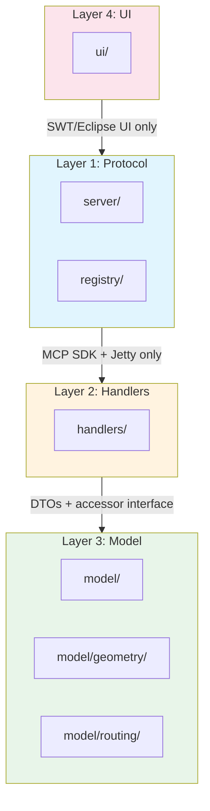
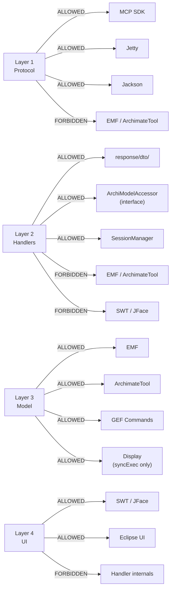
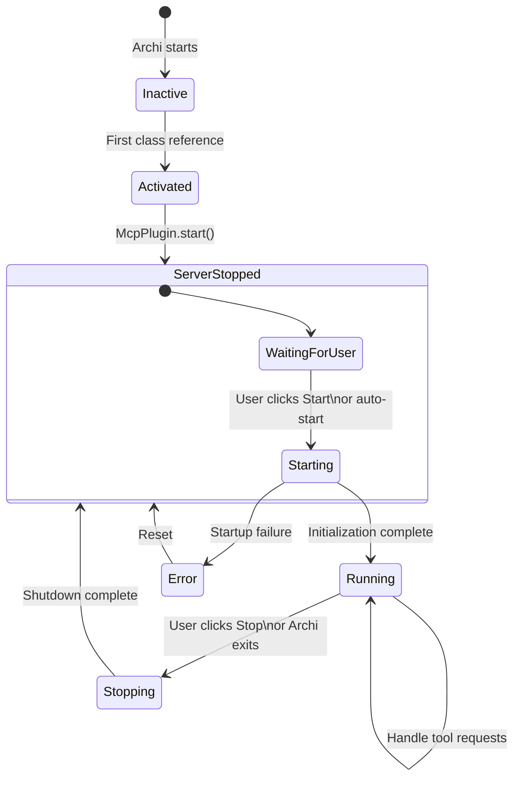
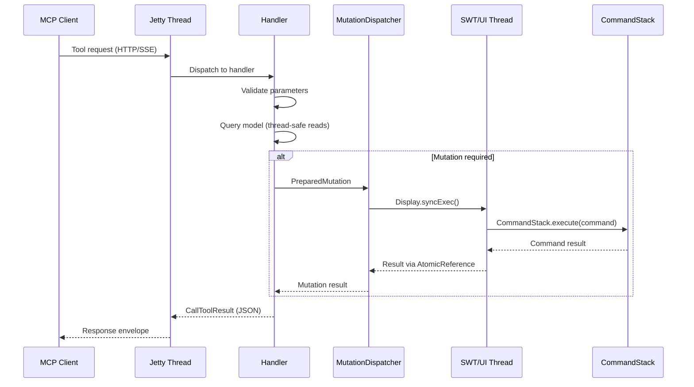

# Architecture Overview

This document describes the internal architecture of the ArchiMate MCP Server plugin, including the layered package structure, threading model, and key design decisions.

## Table of Contents

- [Layered Architecture](#layered-architecture)
- [Package-to-Layer Mapping](#package-to-layer-mapping)
- [Import Rules](#import-rules)
- [Plugin Lifecycle](#plugin-lifecycle)
- [Threading Model](#threading-model)
- [Dependency Summary](#dependency-summary)

## Layered Architecture

The plugin enforces a strict 4-layer architecture. Each layer has clearly defined responsibilities and import boundaries.

| Layer | Packages | Responsibility | Allowed Imports |
|-------|----------|----------------|-----------------|
| **1 - Protocol** | `server/`, `registry/` | Jetty HTTP/SSE transport, MCP SDK server lifecycle, tool/resource registration | MCP SDK, Jetty, Jackson |
| **2 - Handlers** | `handlers/` | Tool implementation, parameter validation, response formatting | DTOs, ResponseFormatter, ArchiModelAccessor (interface), SessionManager |
| **3 - Model** | `model/`, `model/geometry/`, `model/routing/` | EMF model access, mutations, layout algorithms, routing pipeline | EMF, ArchimateTool, GEF Commands, Display (for syncExec) |
| **4 - UI** | `ui/` | Preferences page, status indicator, menu handlers | SWT, JFace, Eclipse UI, McpServerManager |

**Supporting packages** (cross-cutting):

| Package | Purpose |
|---------|---------|
| `response/` | ResponseFormatter, ErrorResponse, ErrorCode, FieldSelector, PaginationCursor |
| `response/dto/` | 55+ immutable Java records for all response types |
| `session/` | SessionManager, session-scoped filters and caching |
| `search/` | FullTextSearchEngine for element search |
| `logging/` | EclipseLogger, EclipseLoggerFactory (SLF4J to Eclipse ILog bridge) |

## Package-to-Layer Mapping

### Layer 1: Protocol (`server/`, `registry/`)

**`server/`** contains:

- `McpServerManager` — singleton orchestrating server lifecycle (STOPPED, STARTING, RUNNING, STOPPING, ERROR state machine)
- `TransportConfig` — embedded Jetty configuration with dual transport support:
  - Streamable-HTTP at `/mcp` (stateful, used by Claude CLI)
  - Server-Sent Events at `/sse` (used by Cline)
- TLS/HTTPS support via optional PKCS12/JKS keystore at the connector level

**`registry/`** contains:

- `CommandRegistry` — thread-safe registry of MCP tool specifications (`CopyOnWriteArrayList`). Supports runtime tool addition after server start. Wraps all tool handlers with timing injection (`durationMs` in `_meta`).
- `ResourceRegistry` — parallel registry for static MCP resources

### Layer 2: Handlers (`handlers/`)

Eighteen handler classes implement all 60 MCP tools:

| Handler | Tools | Domain |
|---------|-------|--------|
| ModelQueryHandler | get-model-info, get-element | Element/model queries |
| ViewHandler | get-views, get-view-contents, update-view | View queries and updates |
| SearchHandler | search-elements, search-relationships | Full-text search for elements and relationships |
| TraversalHandler | get-relationships | Direct + multi-hop relationship traversal |
| ElementCreationHandler | create-element, create-relationship, create-view, clone-view | Element, relationship, and view creation |
| ElementUpdateHandler | update-element, update-relationship | Element and relationship property updates |
| DiscoveryHandler | get-or-create-element, search-and-create | Find-or-create patterns |
| ViewPlacementHandler | add-to-view, add-group-to-view, add-note-to-view, add-connection-to-view, update-view-object, update-view-connection, remove-from-view, clear-view, apply-positions, compute-layout, assess-layout, layout-within-group, layout-flat-view, auto-route-connections, auto-connect-view, auto-layout-and-route, arrange-groups, optimize-group-order, detect-hub-elements, resize-elements-to-fit | View composition, layout, routing, analysis |
| FolderHandler | get-folders, get-folder-tree | Folder structure queries |
| FolderMutationHandler | create-folder, update-folder, move-to-folder | Folder mutations |
| DeletionHandler | delete-element, delete-relationship, delete-view, delete-folder | Cascade deletion |
| MutationHandler | bulk-mutate, begin-batch, end-batch, get-batch-status | Batch operations |
| ApprovalHandler | set-approval-mode, list-pending-approvals, decide-mutation | Human-in-the-loop approval |
| SessionHandler | set-session-filter, get-session-filters | Session-scoped filters |
| CommandStackHandler | undo, redo | Undo/redo operations |
| RenderHandler | export-view | PNG/SVG diagram export |
| ImageHandler | add-image-to-model, list-model-images | Image import and inventory |
| ResourceHandler | *(registers MCP resources, not tools)* | Static reference materials |

### Layer 3: Model (`model/`, `model/geometry/`, `model/routing/`)

- `ArchiModelAccessor` (interface) — abstracts all EMF model queries and mutations. Handlers depend only on this interface.
- `ArchiModelAccessorImpl` — the sole class that imports EMF and ArchimateTool types. Contains 100+ methods for model access, coordinate conversion, and mutation preparation.
- `MutationDispatcher` — routes mutations from Jetty threads to the SWT UI thread via `Display.syncExec()`. Manages operational modes (GUI-attached, batch, approval).
- `PreparedMutation<T>` — immutable record encapsulating a GEF Command plus its DTO result, enabling two-phase execution.
- `LayoutEngine` — Zest-based layout algorithms (tree, spring, directed, radial, grid)
- `ElkLayoutEngine` — ELK Layered algorithm for combined layout + routing
- GEF Command classes for all mutations (create, update, delete, view operations)

**Pure-geometry subpackages** (no EMF/SWT dependencies):

- `model/geometry/` — `LayoutQualityAssessor`, `GeometryUtils`, `CrossingMinimizer`, `AssessmentCollector`
- `model/routing/` — `RoutingPipeline`, `OrthogonalVisibilityGraph`, `VisibilityGraphRouter`, `EdgeNudger`, `PathOrderer`, `EdgeAttachmentCalculator`, `LabelPositionOptimizer`, `CoincidentSegmentDetector`, `PathStraightener`, `CorridorOccupancyTracker`, `RoutingRecommendationEngine`

### Layer 4: UI (`ui/`)

- `McpPreferencePage` — Archi preferences UI (port, bind address, TLS settings, log level)
- `McpPreferenceInitializer` — default preference values
- `McpStatusIndicator` — status bar indicator
- `ToggleServerHandler` — Eclipse command handler with dynamic menu labels
- `McpStartupHandler` — `IStartup` extension for auto-start on Archi launch

## Import Rules

**The most critical boundary:** Handlers (Layer 2) never import EMF or ArchimateTool types. All model access flows through the `ArchiModelAccessor` interface.

## Plugin Lifecycle

The plugin uses Eclipse's lazy activation policy. It activates on first class reference, not on Archi startup.

**McpPlugin** (`AbstractUIPlugin` subclass):

- `start()` — initializes preference defaults, logs startup, sets singleton instance
- `stop()` — gracefully stops McpServerManager if running, disposes status indicator

**McpServerManager startup sequence:**

1. `initializeResources()` — load static MCP resource files (markdown guides)
2. `transportConfig.setToolSpecifications()` — pass tool specs to transport layer
3. `transportConfig.setResourceSpecifications()` — pass resource specs to transport layer
4. `transportConfig.startServer()` — start embedded Jetty with HTTP + SSE servlets
5. `wireCommandRegistryServers()` — connect tool registry to running MCP server instances
6. `wireResourceRegistryServers()` — connect resource registry to running MCP server instances
7. `initializeModelAccessor()` — create ArchiModelAccessorImpl, register model change listeners
8. `initializeHandlers()` — instantiate all 18 handlers, each registers its tools via CommandRegistry

**Preference constants** (defaults in `McpPlugin`):

| Preference | Default | Description |
|------------|---------|-------------|
| `PREF_PORT` | 18090 | HTTP(S) server port |
| `PREF_BIND_ADDRESS` | 127.0.0.1 | Network interface |
| `PREF_AUTO_START` | false | Start server on Archi launch |
| `PREF_LOG_LEVEL` | INFO | DEBUG, INFO, WARN, ERROR |
| `PREF_TLS_ENABLED` | false | Use HTTPS with keystore |
| `PREF_KEYSTORE_PATH` | *(auto)* | Path to Java keystore file |
| `PREF_KEYSTORE_PASSWORD` | *(generated)* | Keystore password |

## Threading Model

The plugin runs across two thread domains with a carefully managed crossing point.

**Jetty threads** handle:

- HTTP request processing
- Parameter validation
- Model queries (thread-safe EMF reads)
- Response formatting

**SWT/UI thread** handles:

- `CommandStack.execute()` for all mutations (via `Display.syncExec()`)
- Menu updates (`Display.asyncExec()` for status indicator refresh)
- Preference page UI

**Key invariants:**

- All mutations go through `MutationDispatcher`, which encapsulates the thread crossing
- `Display.syncExec()` blocks the Jetty thread until the UI thread completes the command
- Results pass back via `AtomicReference` for safe cross-thread transfer
- Read-only queries do NOT use `Display.syncExec()` — EMF reads are thread-safe when no concurrent write transaction is open

**Thread safety mechanisms:**

| Component | Mechanism |
|-----------|-----------|
| CommandRegistry | `CopyOnWriteArrayList` + volatile server references |
| SessionManager | `ConcurrentHashMap<sessionId, SessionState>` |
| MutationDispatcher | `ConcurrentHashMap<sessionId, MutationContext>` |
| EclipseLogger | Thread-safe delegation to Eclipse ILog |

## Dependency Summary

### Eclipse/OSGi

- `org.eclipse.ui`, `org.eclipse.core.runtime` — Eclipse workbench and runtime
- `org.eclipse.swt`, `org.eclipse.jface` — UI toolkit
- `com.archimatetool.model`, `com.archimatetool.editor` — Archi model and editor APIs
- `org.eclipse.zest.layouts` — Graph layout algorithms
- `com.google.guava` — General utilities

### MCP SDK

- `io.modelcontextprotocol` (v0.17.2) — Model Context Protocol Java SDK
- `reactor-core`, `reactive-streams` — Project Reactor (MCP SDK dependency)

### Jetty

- `jetty-server`, `jetty-ee10-servlet`, `jetty-http`, `jetty-util`, `jetty-security` (v12.0.18) — Embedded HTTP server
- `jakarta.servlet-api` (v6.0.0) — Servlet API

### JSON

- `jackson-core`, `jackson-databind`, `jackson-annotations` (v2.16.1) — JSON serialization
- `jackson-dataformat-yaml`, `snakeyaml` — YAML support

### Layout

- `org.eclipse.elk` (v0.11.0) — ELK Layered layout algorithm

### Logging

- `slf4j-api` (v2.0.11) — Logging facade, bridged to Eclipse ILog via custom adapter

---

**See also:** [Mutation Model](mutation-model.md) | [MCP Integration](mcp-integration.md) | [Extension Guide](extension-guide.md)
