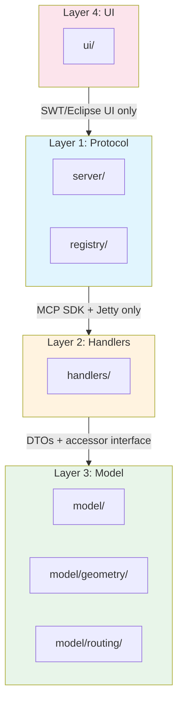
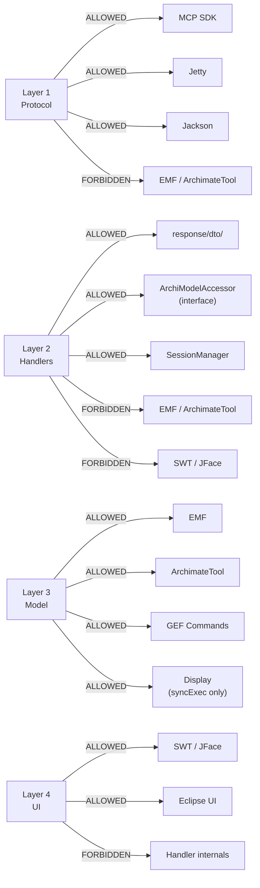
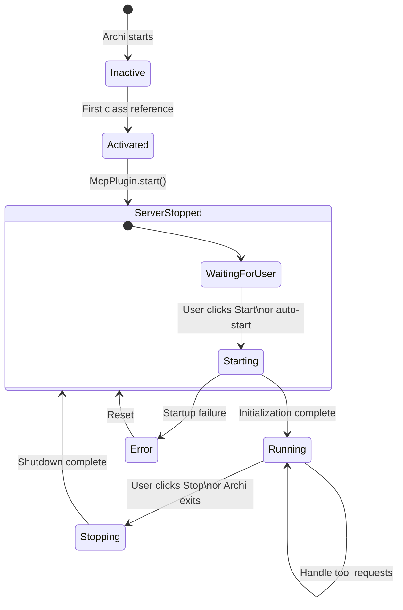
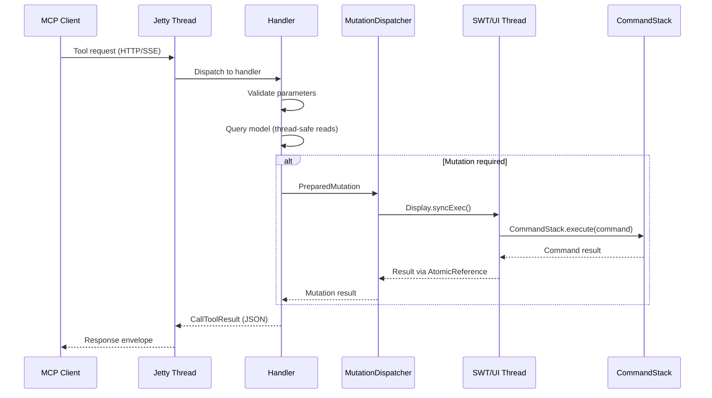

# Architecture Overview

This document describes the internal architecture of the ArchiMate MCP Server plugin, including the layered package structure, threading model, and key design decisions.

## Table of Contents

- [Layered Architecture](#layered-architecture)
- [Package-to-Layer Mapping](#package-to-layer-mapping)
- [Import Rules](#import-rules)
- [Enforced Invariants](#enforced-invariants)
- [Plugin Lifecycle](#plugin-lifecycle)
- [Threading Model](#threading-model)
- [Dependency Summary](#dependency-summary)

## Layered Architecture

The plugin enforces a strict 4-layer architecture. Each layer has clearly defined responsibilities and import boundaries.

```mermaid
flowchart TD
    subgraph L1["Layer 1: Protocol"]
        server["server/"]
        registry["registry/"]
    end
    subgraph L2["Layer 2: Handlers"]
        handlers["handlers/"]
    end
    subgraph L3["Layer 3: Model"]
        model["model/"]
        geometry["model/geometry/"]
        routing["model/routing/"]
    end
    subgraph L4["Layer 4: UI"]
        ui["ui/"]
    end

    L1 -->|"MCP SDK + Jetty only"| L2
    L2 -->|"DTOs + accessor interface"| L3
    L4 -->|"SWT/Eclipse UI only"| L1

    style L1 fill:#e1f5fe
    style L2 fill:#fff3e0
    style L3 fill:#e8f5e9
    style L4 fill:#fce4ec
```

| Layer | Packages | Responsibility | Allowed Imports |
|-------|----------|----------------|-----------------|
| **1 - Protocol** | `server/`, `registry/` | Jetty HTTP/SSE transport, MCP SDK server lifecycle, tool/resource registration | MCP SDK, Jetty, Jackson |
| **2 - Handlers** | `handlers/` | Tool implementation, parameter validation, response formatting | DTOs, ResponseFormatter, ArchiModelAccessor (interface), SessionManager |
| **3 - Model** | `model/`, `model/geometry/`, `model/routing/` | EMF model access, mutations, layout algorithms, routing pipeline | EMF, ArchimateTool, GEF Commands, Display (for syncExec) |
| **4 - UI** | `ui/` | Preferences page, status indicator, menu handlers | SWT, JFace, Eclipse UI, McpServerManager |

**Supporting packages** (cross-cutting):

| Package | Purpose |
|---------|---------|
| `response/` | ResponseFormatter, ErrorResponse, ErrorCode, FieldSelector, PaginationCursor |
| `response/dto/` | 55+ immutable Java records for all response types |
| `session/` | SessionManager, session-scoped filters and caching |
| `search/` | FullTextSearchEngine for element search |
| `logging/` | EclipseLogger, EclipseLoggerFactory (SLF4J to Eclipse ILog bridge) |

## Package-to-Layer Mapping

### Layer 1: Protocol (`server/`, `registry/`)

**`server/`** contains:

- `McpServerManager` — singleton orchestrating server lifecycle (STOPPED, STARTING, RUNNING, STOPPING, ERROR state machine)
- `TransportConfig` — embedded Jetty configuration with dual transport support:
  - Streamable-HTTP at `/mcp` (stateful, used by Claude CLI)
  - Server-Sent Events at `/sse` (used by Cline)
- TLS/HTTPS support via optional PKCS12/JKS keystore at the connector level

**`registry/`** contains:

- `CommandRegistry` — thread-safe registry of MCP tool specifications (`CopyOnWriteArrayList`). Supports runtime tool addition after server start. Wraps all tool handlers with timing injection (`durationMs` in `_meta`).
- `ResourceRegistry` — parallel registry for static MCP resources

### Layer 2: Handlers (`handlers/`)

Nineteen handler classes implement all 70 MCP tools (the SpecializationHandler was added in v1.3; the adjust/apply spacing tools in v1.4; `update-model`, `find-concept-usage`, `add-view-reference-to-view`, and `add-image-to-view` in v1.5; the legacy `compute-layout` tool and the two agent-side approval-control tools were removed in v1.7):

| Handler | Tools | Domain |
|---------|-------|--------|
| ModelQueryHandler | get-model-info, get-element, update-model, find-concept-usage, list-specializations | Model-level queries, model metadata writes, specialization browse, reverse where-used |
| ViewHandler | get-views, get-view-contents, update-view | View queries and updates |
| SearchHandler | search-elements, search-relationships | Full-text search for elements and relationships |
| TraversalHandler | get-relationships | Direct + multi-hop relationship traversal |
| ElementCreationHandler | create-element, create-relationship, create-view, clone-view | Element, relationship, and view creation |
| ElementUpdateHandler | update-element, update-relationship | Element and relationship property updates |
| DiscoveryHandler | get-or-create-element, search-and-create | Find-or-create patterns |
| SpecializationHandler | create-specialization, update-specialization, delete-specialization, get-specialization-usage | Specialization (profile) management with icon support |
| ViewPlacementHandler | add-to-view, add-group-to-view, add-note-to-view, add-view-reference-to-view, add-image-to-view, add-connection-to-view, update-view-object, update-view-connection, remove-from-view, clear-view, apply-positions, assess-layout, layout-within-group, layout-flat-view, auto-route-connections, auto-connect-view, auto-layout-and-route, arrange-groups, optimize-group-order, detect-hub-elements, resize-elements-to-fit, adjust-view-spacing, apply-element-spacing-recommendations, apply-group-spacing-recommendations, apply-spacing-recommendations | View composition, layout, routing, analysis, spacing |
| FolderHandler | get-folders, get-folder-tree | Folder structure queries |
| FolderMutationHandler | create-folder, update-folder, move-to-folder | Folder mutations |
| DeletionHandler | delete-element, delete-relationship, delete-view, delete-folder | Cascade deletion (including view-reference visual placeholders on delete-view) |
| MutationHandler | bulk-mutate, begin-batch, end-batch, get-batch-status | Batch operations |
| ApprovalHandler | list-pending-approvals | Read-only view of the human-owned approval gate (the gate toggle and approve/reject live in the Archi UI / `ApprovalService`, not on the MCP surface) |
| SessionHandler | set-session-filter, get-session-filters | Session-scoped filters |
| CommandStackHandler | undo, redo | Undo/redo operations |
| RenderHandler | export-view | PNG / JPG / SVG / PDF diagram export |
| ImageHandler | add-image-to-model, list-model-images | Image import and inventory |
| ResourceHandler | `get-guidance` | Static reference materials — registers them as MCP resources *and* resource templates, and serves the same bodies through `get-guidance` for clients that do not expose resource reads to the model |

### Layer 3: Model (`model/`, `model/geometry/`, `model/routing/`)

- `ArchiModelAccessor` (interface) — abstracts all EMF model queries and mutations. Handlers depend only on this interface.
- `ArchiModelAccessorImpl` — the sole class that imports EMF and ArchimateTool types. Contains 100+ methods for model access, coordinate conversion, and mutation preparation.
- `MutationDispatcher` — routes mutations from Jetty threads to the SWT UI thread via `Display.syncExec()`. Manages operational modes (GUI-attached, batch, approval).
- `PreparedMutation<T>` — immutable record encapsulating a GEF Command plus its DTO result, enabling two-phase execution.
- `ElkLayoutEngine` — ELK Layered algorithm for combined layout + routing
- GEF Command classes for all mutations (create, update, delete, view operations)

**Pure-geometry subpackages** (no EMF/SWT dependencies):

- `model/geometry/` — `LayoutQualityAssessor`, `GeometryUtils`, `CrossingMinimizer`, `AssessmentCollector`
- `model/routing/` — `RoutingPipeline`, `OrthogonalVisibilityGraph`, `VisibilityGraphRouter`, `EdgeNudger`, `PathOrderer`, `EdgeAttachmentCalculator`, `LabelPositionOptimizer`, `CoincidentSegmentDetector`, `PathStraightener`, `CorridorOccupancyTracker`, `RoutingRecommendationEngine`

### Layer 4: UI (`ui/`)

- `McpPreferencePage` — Archi preferences UI (port, bind address, TLS settings, bearer-token authentication, log level)
- `McpPreferenceInitializer` — default preference values
- `McpStatusIndicator` — status bar indicator
- `ToggleServerHandler` — Eclipse command handler with dynamic menu labels
- `McpStartupHandler` — `IStartup` extension for auto-start on Archi launch

## Import Rules

```mermaid
flowchart LR
    L1["Layer 1\nProtocol"] -->|"ALLOWED"| MCP["MCP SDK"]
    L1 -->|"ALLOWED"| Jetty["Jetty"]
    L1 -->|"ALLOWED"| Jackson["Jackson"]
    L1 -->|"FORBIDDEN"| EMF["EMF / ArchimateTool"]

    L2["Layer 2\nHandlers"] -->|"ALLOWED"| DTO["response/dto/"]
    L2 -->|"ALLOWED"| Accessor["ArchiModelAccessor\n(interface)"]
    L2 -->|"ALLOWED"| Session["SessionManager"]
    L2 -->|"FORBIDDEN"| EMF2["EMF / ArchimateTool"]
    L2 -->|"FORBIDDEN"| SWT["SWT / JFace"]

    L3["Layer 3\nModel"] -->|"ALLOWED"| EMF3["EMF"]
    L3 -->|"ALLOWED"| Archi["ArchimateTool"]
    L3 -->|"ALLOWED"| GEF["GEF Commands"]
    L3 -->|"ALLOWED"| Display["Display\n(syncExec only)"]

    L4["Layer 4\nUI"] -->|"ALLOWED"| SWT2["SWT / JFace"]
    L4 -->|"ALLOWED"| EclipseUI["Eclipse UI"]
    L4 -->|"FORBIDDEN"| Handlers["Handler internals"]
```

**The most critical boundary:** Handlers (Layer 2) never import EMF or ArchimateTool types. All model access flows through the `ArchiModelAccessor` interface.

## Enforced Invariants

Several architectural rules are checked by the build rather than left to review. Each is a *ratchet*: it can only be tightened, so a rule cannot be relaxed by accident.

| Invariant | Enforced by | Failure mode it prevents |
|---|---|---|
| **Accessor facade does not grow** | `tools/size-ratchet.sh` — `CEILING_LOC` and a public-method ceiling on `ArchiModelAccessorImpl`, plus a signature baseline (`tools/accessor-interface-baseline.txt`) for the `ArchiModelAccessor` interface | The Layer-3 facade accreting logic that belongs in a collaborator. The ceiling is **never raised**: new code is paid for by folding duplication out, and the ceiling is clicked *down* by the same commit. A legitimate interface change updates the baseline explicitly. |
| **Every mutating tool reports effective state** | `EffectiveStateContractTest` + the `tools/effective-state-gaps.txt` registry, walked via `HandlerRegistrar` | A tool echoing the caller's request back as if it were the model's state. A tool classified nowhere fails the build; the registry's entry count is a lower-only ceiling. See [Mutation Model](mutation-model.md#effective-state-reporting). |
| **No guidance pointer resolves nowhere** | `GuidancePointerReachabilityTest` | A tool description or response telling an agent to consult an `archimate://` URI that no longer exists. The scan concatenates adjacent string literals before matching, because pointers are split across `+` to satisfy line length — a per-line scan would read a fragment as a dead URI and train the next reader to weaken the assertion. The found count is pinned, so a scanner that silently stops matching cannot pass as clean. |
| **A gated card discloses every parameter the approval will write** | `ApprovalCardContractTest` + the `tools/approval-card-gaps.txt` registry, parsed over every proposal site | A human authorising a change the card described only in part. A proposal's `proposedChanges` map is the *only* description of a pending write anyone gets — it goes verbatim onto the wire and verbatim into the card's `Technical details` — so a parameter the accessor accepts and applies but never discloses is approved and named nowhere. Every site must be **complete** (the test parses it and asserts the disclosure covers every parameter the enclosing method accepts) or carry a registry line naming the exact parameters it exempts; a site classified in neither — or in both — fails the build, and the registry's entry count is a lower-only ceiling. The test asserts it found all 42 sites before asserting anything about their contents, because a parser that matches nothing reads exactly like a clean scan. It parses source only, so it runs in the headless lane on every commit. See [Mutation Model](mutation-model.md#the-disclosure-contract). |
| **A structured warning code is owned by exactly one tool, and every enumeration of that tool is complete** | `StructuredWarningCodeSurfaceParityTest` + the `tools/structured-warning-code-map.txt` registry | An enumeration lying by omission. Several published surfaces present themselves as *the* list of codes a tool emits, so an absence has to mean "this code does not exist", not "nobody updated this file". The split cannot be derived from constant names — one flat holder is shared by the routing, layout and spacing families, and each family's enumerations correctly omit the others' codes — so ownership is committed here, measured from each **emitting call site**, with every constant classified exactly once. A constant absent from the map fails the build; so does a line naming a code that is not a constant or a tool that is not registered. Once classified, the same test demands the code in every surface that enumerates its tool's codes. |
| **No internal project-tracking code reaches a reader who cannot resolve it** | `InternalCodeContractTest` + the `tools/internal-code-gaps.txt` registry | A log line, comment or tool description naming something only the project's own tracker can explain. Four surfaces are gated at **zero** with no deferrals available: any string literal in the plugin source (these become log output and MCP tool descriptions, so they leave the plugin), every file under `resources/` (the bundle serves these to the agent whole), and `.github/**` and `tools/**` (GitHub renders them inline to contributors). A code family with matches and no registry entry fails the build, and the family-entry ceiling is lowered — never raised — by the commit that cleans a family. |

The pattern is the same in each case: **register or fail**. Adding a tool that cannot satisfy a rule requires a deliberate, reviewable admission in a committed file, never silence.

## Plugin Lifecycle

The plugin uses Eclipse's lazy activation policy. It activates on first class reference, not on Archi startup.

```mermaid
stateDiagram-v2
    [*] --> Inactive: Archi starts
    Inactive --> Activated: First class reference
    Activated --> ServerStopped: McpPlugin.start()

    state ServerStopped {
        [*] --> WaitingForUser
        WaitingForUser --> Starting: User clicks Start\nor auto-start
    }

    Starting --> Running: Initialization complete
    Starting --> Error: Startup failure
    Running --> Stopping: User clicks Stop\nor Archi exits
    Stopping --> ServerStopped: Shutdown complete
    Error --> ServerStopped: Reset

    Running --> Running: Handle tool requests
```

**McpPlugin** (`AbstractUIPlugin` subclass):

- `start()` — initializes preference defaults, logs startup, sets singleton instance
- `stop()` — gracefully stops McpServerManager if running, disposes status indicator

**McpServerManager startup sequence:**

1. `initializeResources()` — load static MCP resource files (markdown guides)
2. `transportConfig.setToolSpecifications()` — pass tool specs to transport layer
3. `transportConfig.setResourceSpecifications()` — pass resource specs to transport layer
4. `transportConfig.startServer()` — start embedded Jetty with HTTP + SSE servlets
5. `wireCommandRegistryServers()` — connect tool registry to running MCP server instances
6. `wireResourceRegistryServers()` — connect resource registry to running MCP server instances
7. `initializeModelAccessor()` — create ArchiModelAccessorImpl, register model change listeners
8. `initializeHandlers()` — instantiate all 19 handlers, each registers its tools via CommandRegistry

**Preference constants** (defaults in `McpPlugin`):

| Preference | Default | Description |
|------------|---------|-------------|
| `PREF_PORT` | 18090 | HTTP(S) server port |
| `PREF_BIND_ADDRESS` | 127.0.0.1 | Network interface |
| `PREF_AUTO_START` | false | Start server on Archi launch |
| `PREF_LOG_LEVEL` | INFO | DEBUG, INFO, WARN, ERROR |
| `PREF_TLS_ENABLED` | false | Use HTTPS with keystore |
| `PREF_KEYSTORE_PATH` | *(auto)* | Path to Java keystore file |
| `PREF_KEYSTORE_PASSWORD` | *(generated)* | Keystore password |
| `PREF_AUTH_TOKEN_ENABLED` | false | Require an `Authorization: Bearer` token on every request |
| `PREF_APPROVAL_MODE` | true | Require human approval before mutations are applied (GATED) |

## Threading Model

The plugin runs across two thread domains with a carefully managed crossing point.

```mermaid
sequenceDiagram
    participant Client as MCP Client
    participant Jetty as Jetty Thread
    participant Handler as Handler
    participant Dispatcher as MutationDispatcher
    participant SWT as SWT/UI Thread
    participant CS as CommandStack

    Client->>Jetty: Tool request (HTTP/SSE)
    Jetty->>Handler: Dispatch to handler
    Handler->>Handler: Validate parameters
    Handler->>Handler: Query model (thread-safe reads)

    alt Mutation required
        Handler->>Dispatcher: PreparedMutation
        Dispatcher->>SWT: Display.syncExec()
        SWT->>CS: CommandStack.execute(command)
        CS-->>SWT: Command result
        SWT-->>Dispatcher: Result via AtomicReference
        Dispatcher-->>Handler: Mutation result
    end

    Handler-->>Jetty: CallToolResult (JSON)
    Jetty-->>Client: Response envelope
```

**Jetty threads** handle:

- HTTP request processing
- Parameter validation
- Model queries (thread-safe EMF reads)
- Response formatting

**SWT/UI thread** handles:

- `CommandStack.execute()` for all mutations (via `Display.syncExec()`)
- Menu updates (`Display.asyncExec()` for status indicator refresh)
- Preference page UI

**Key invariants:**

- All mutations go through `MutationDispatcher`, which encapsulates the thread crossing
- `Display.syncExec()` blocks the Jetty thread until the UI thread completes the command
- Results pass back via `AtomicReference` for safe cross-thread transfer
- Read-only queries do NOT use `Display.syncExec()` — EMF reads are thread-safe when no concurrent write transaction is open

**Thread safety mechanisms:**

| Component | Mechanism |
|-----------|-----------|
| CommandRegistry | `CopyOnWriteArrayList` + volatile server references |
| SessionManager | `ConcurrentHashMap<sessionId, SessionState>` |
| MutationDispatcher | `ConcurrentHashMap<sessionId, MutationContext>` |
| EclipseLogger | Thread-safe delegation to Eclipse ILog |

## Dependency Summary

### Eclipse/OSGi

- `org.eclipse.ui`, `org.eclipse.core.runtime` — Eclipse workbench and runtime
- `org.eclipse.swt`, `org.eclipse.jface` — UI toolkit
- `com.archimatetool.model`, `com.archimatetool.editor` — Archi model and editor APIs
- `com.google.guava` — General utilities

### MCP SDK

- `io.modelcontextprotocol` (v0.17.2) — Model Context Protocol Java SDK
- `reactor-core`, `reactive-streams` — Project Reactor (MCP SDK dependency)

### Jetty

- `jetty-server`, `jetty-ee10-servlet`, `jetty-http`, `jetty-util`, `jetty-security` (v12.0.18) — Embedded HTTP server
- `jakarta.servlet-api` (v6.0.0) — Servlet API

### JSON

- `jackson-core`, `jackson-databind`, `jackson-annotations` (v2.16.1) — JSON serialization
- `jackson-dataformat-yaml`, `snakeyaml` — YAML support

### Layout

- `org.eclipse.elk` (v0.11.0) — ELK Layered layout algorithm

### Logging

- `slf4j-api` (v2.0.11) — Logging facade, bridged to Eclipse ILog via custom adapter

---

**See also:** [Mutation Model](mutation-model.md) | [MCP Integration](mcp-integration.md) | [Extension Guide](extension-guide.md)
