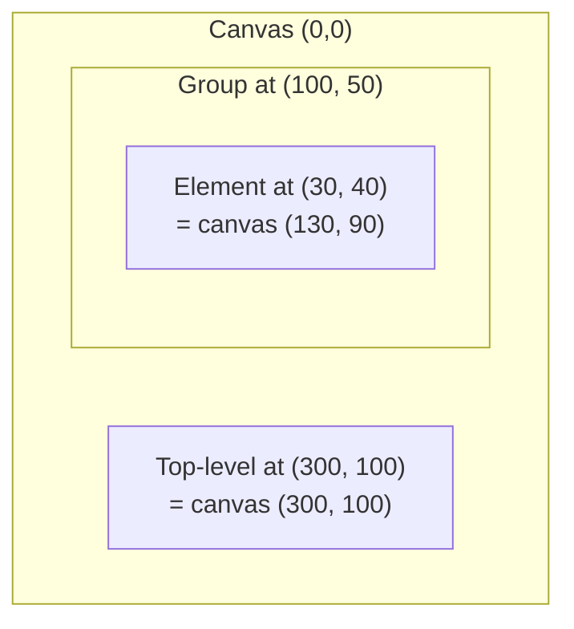
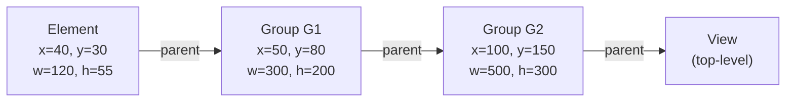
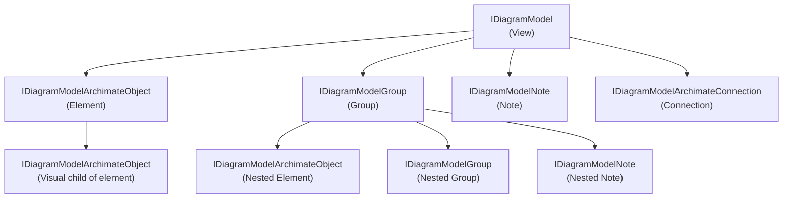

# Coordinate Model and View System

This document describes how the ArchiMate MCP Server handles element positions, nested coordinates, bendpoints, and view object hierarchies.

## Table of Contents

- [Coordinate Systems](#coordinate-systems)
- [Nested Element Coordinates](#nested-element-coordinates)
- [Absolute Center Computation](#absolute-center-computation)
- [Bendpoint Types and Conversion](#bendpoint-types-and-conversion)
- [View Object Hierarchy](#view-object-hierarchy)
- [Auto-Placement Logic](#auto-placement-logic)
- [Geometry Utilities](#geometry-utilities)
- [Constants Reference](#constants-reference)

## Coordinate Systems

The plugin uses two coordinate frames depending on element nesting context.

### Absolute Canvas Coordinates

- Origin (0, 0) at the top-left corner of the canvas
- Used for all top-level elements, groups, and notes
- Used internally by layout engines, routing algorithms, and quality assessment
- Stored directly in the EMF model `IBounds` objects for top-level elements

### Relative Coordinates

- Used for child view objects placed inside parent containers (groups or elements)
- Coordinates are relative to the **immediate parent's top-left corner**
- **Not cumulative** — never relative to ancestors beyond the direct parent



### Coordinate Context in API Responses

In `get-view-contents` responses, the coordinate meaning depends on `parentViewObjectId`:

**Top-level object** (`parentViewObjectId: null`):

```json
{
  "viewObjectId": "vo-123",
  "x": 100, "y": 150,
  "width": 120, "height": 55,
  "parentViewObjectId": null
}
```

Here `x=100, y=150` are **absolute** canvas coordinates.

**Nested object** (`parentViewObjectId` set):

```json
{
  "viewObjectId": "vo-789",
  "x": 30, "y": 40,
  "width": 120, "height": 55,
  "parentViewObjectId": "group-123"
}
```

Here `x=30, y=40` are **relative** to the top-left corner of `group-123`.

### Coordinate Context in Mutation Requests

When placing elements via `add-to-view`, `add-group-to-view`, or `add-note-to-view`, coordinate interpretation depends on the `parentViewObjectId` parameter:

- `parentViewObjectId: null` — coordinates are absolute canvas positions
- `parentViewObjectId: "group-123"` — coordinates are relative to the group's top-left corner

## Nested Element Coordinates

### Parent Chain Walk

To compute the true canvas position of a nested element, walk the parent chain and accumulate offsets:



**Canvas position of Element:**

1. Start: centerX = 40 + 120/2 = 100, centerY = 30 + 55/2 = 57
2. Add G1: centerX = 100 + 50 = 150, centerY = 57 + 80 = 137
3. Add G2: centerX = 150 + 100 = 250, centerY = 137 + 150 = 287

**Final canvas center: (250, 287)**

### Assessment Nodes (Absolute Coordinates)

The quality assessment system converts all elements to absolute coordinates via `AssessmentCollector.collectAssessmentNodesRecursive()`:

```text
For each child of container:
  absX = child.bounds.x + parentOffsetX
  absY = child.bounds.y + parentOffsetY
  Create AssessmentNode with absolute coordinates
  If child is a container: recurse with (absX, absY) as new offsets
```

This ensures that routing, overlap detection, and spacing calculations operate in a single coordinate space.

## Absolute Center Computation

The method `computeAbsoluteCenter(IDiagramModelObject)` returns `int[2]` with the element's center in absolute canvas coordinates.

**Algorithm:**

1. Get bounds: `centerX = x + width/2`, `centerY = y + height/2`
2. Walk parent chain (`eContainer() instanceof IDiagramModelObject`):
   - For each parent: add `parent.bounds.x` to centerX, `parent.bounds.y` to centerY
3. Stop at `IDiagramModel` (the view itself, which is the top-level container)

**Used by:** bendpoint conversions, connection anchor calculations, layout quality assessment.

**Source:** `ArchiModelAccessorImpl.computeAbsoluteCenter()`, `ConnectionResponseBuilder.computeAbsoluteCenter()`

## Bendpoint Types and Conversion

### EMF Native Format (Archi's Model Storage)

Archi stores bendpoints as **dual offsets** from source and target centers:

```java
IDiagramModelBendpoint {
    int startX, startY;  // offset from source center
    int endX, endY;      // offset from target center
}
```

### DTO Formats

**BendpointDto** (relative offset format):

```java
record BendpointDto(int startX, int startY, int endX, int endY)
```

Used for: API input/output in relative format, matching Archi's native storage.

**AbsoluteBendpointDto** (absolute canvas coordinates):

```java
record AbsoluteBendpointDto(int x, int y)
```

Used for: routing pipeline output, layout engine output, absolute bendpoint API input.

### Conversion Formulas

**Relative to Absolute** (`convertRelativeToAbsolute`):

```text
For each bendpoint bp:
  absX = (bp.startX + srcCenterX + bp.endX + tgtCenterX) / 2
  absY = (bp.startY + srcCenterY + bp.endY + tgtCenterY) / 2
```

This average formula reflects Archi's semantic: the bendpoint is at the midpoint between the source-referenced and target-referenced positions.

**Absolute to Relative** (`convertAbsoluteToRelative`):

```text
For each absolute bendpoint abs:
  startX = abs.x - srcCenterX
  startY = abs.y - srcCenterY
  endX = abs.x - tgtCenterX
  endY = abs.y - tgtCenterY
```

### Conversion Example

Connection from element at center (100, 100) to element at center (300, 300), with a bendpoint at canvas position (180, 180):

```text
Relative (stored in EMF):
  startX = 180 - 100 = 80
  startY = 180 - 100 = 80
  endX   = 180 - 300 = -120
  endY   = 180 - 300 = -120

Reconstructing absolute:
  absX = (80 + 100 + (-120) + 300) / 2 = 180
  absY = (80 + 100 + (-120) + 300) / 2 = 180
```

### Mutual Exclusion

In mutation requests, `bendpoints` and `absoluteBendpoints` parameters are **mutually exclusive**. The server validates this via `validateBendpointMutualExclusion()`. If `absoluteBendpoints` are provided, they are converted to relative format before storage.

## View Object Hierarchy



### View Object Types

| EMF Type | DTO Type | Can Contain Children | API Tool |
|----------|----------|---------------------|----------|
| `IDiagramModelArchimateObject` | `ViewNodeDto` | Yes (visual nesting) | `add-to-view` |
| `IDiagramModelGroup` | `ViewGroupDto` | Yes (primary container) | `add-group-to-view` |
| `IDiagramModelNote` | `ViewNoteDto` | No | `add-note-to-view` |
| `IDiagramModelArchimateConnection` | `ViewConnectionDto` | No | `add-connection-to-view` |

### Response Structure (`get-view-contents`)

The `collectViewContents()` method recursively collects all view objects:

- **Elements:** viewObjectId, elementId, x, y, width, height, parentViewObjectId, styling
- **Groups:** id, name, x, y, width, height, parentViewObjectId, childIds, styling
- **Notes:** id, content, x, y, width, height, parentViewObjectId, styling
- **Connections:** viewConnectionId, relationshipId, sourceViewObjectId, targetViewObjectId, bendpoints, absoluteBendpoints, sourceAnchor, targetAnchor, textPosition, styling

### Parent Container Resolution

When placing elements, `resolveParentContainer()` handles three cases:

1. **Batch back-reference** (`batchParentContainer != null`) — use pre-resolved container from bulk-mutate `$N.id` syntax
2. **Explicit parent** (`parentViewObjectId != null`) — look up in view objects, validate it is a group or element (not a note or connection)
3. **No parent** (both null) — use the view itself as the container (top-level placement)

## Auto-Placement Logic

When `x` and `y` are omitted from `add-to-view`, `add-group-to-view`, or `add-note-to-view`, the server auto-calculates a position.

**Algorithm** (`calculateAutoPlacement()`):

1. Collect all existing bounds recursively
2. If empty: return `(START_X, START_Y)` = `(50, 50)`
3. Find the bottom row: elements with the lowest y-coordinates
4. Place to the right of the rightmost element in the bottom row
5. If exceeding `MAX_ROW_WIDTH` (800px): wrap to a new row below
6. If overlapping: shift right (up to 100 attempts), then wrap to new row
7. Fallback: place below all existing elements

## Geometry Utilities

### Liang-Barsky Line-Rectangle Intersection

`GeometryUtils.lineSegmentIntersectsRect()` tests whether a line segment intersects an axis-aligned rectangle using the Liang-Barsky parametric clipping algorithm.

Available in both integer and double precision.

**Used by:**

- Pass-through detection (LayoutQualityAssessor)
- Obstacle-crossing validation (RoutingPipeline)
- Edge attachment calculation (EdgeAttachmentCalculator)

## Constants Reference

| Constant | Value | Usage |
|----------|-------|-------|
| `DEFAULT_VIEW_OBJECT_WIDTH` | 120 | Default element width |
| `DEFAULT_VIEW_OBJECT_HEIGHT` | 55 | Default element height |
| `DEFAULT_GROUP_WIDTH` | 300 | Default group width |
| `DEFAULT_GROUP_HEIGHT` | 200 | Default group height |
| `DEFAULT_NOTE_WIDTH` | 185 | Default note width |
| `DEFAULT_NOTE_HEIGHT` | 80 | Default note height |
| `START_X` | 50 | Auto-placement starting X |
| `START_Y` | 50 | Auto-placement starting Y |
| `H_GAP` | 30 | Horizontal spacing for auto-placement |
| `V_GAP` | 30 | Vertical spacing for auto-placement |
| `MAX_ROW_WIDTH` | 800 | Wrap threshold for auto-placement |
| `MAX_ATTEMPTS` | 100 | Overlap retry limit |
| `MAX_AUTO_CONNECTIONS` | 50 | Connection limit for auto-connect |

---

**See also:** [Architecture Overview](architecture.md) | [Routing Pipeline](routing-pipeline.md) | [Layout Engine](layout-engine.md)
