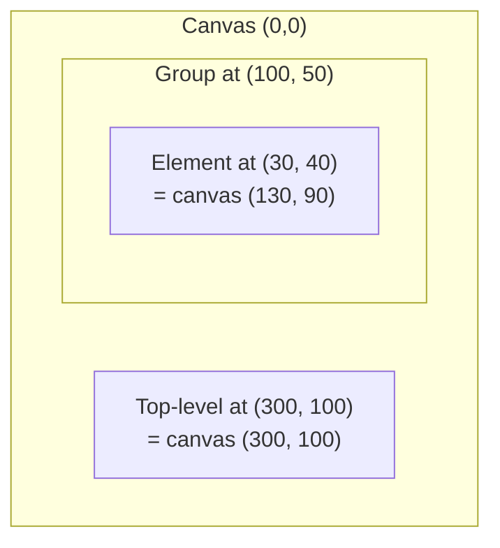
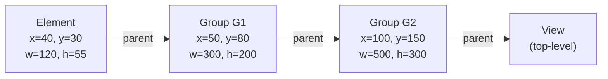
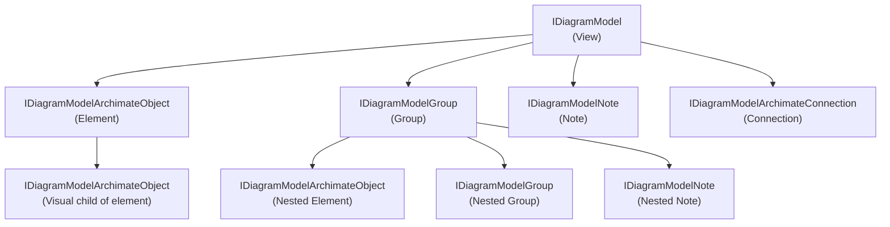

# Coordinate Model and View System

This document describes how the ArchiMate MCP Server handles element positions, nested coordinates, bendpoints, and view object hierarchies.

## Table of Contents

- [Coordinate Systems](#coordinate-systems)
- [Nested Element Coordinates](#nested-element-coordinates)
- [Absolute Center Computation](#absolute-center-computation)
- [Bendpoint Types and Conversion](#bendpoint-types-and-conversion)
- [View Object Hierarchy](#view-object-hierarchy)
- [Auto-Placement Logic](#auto-placement-logic)
- [Geometry Utilities](#geometry-utilities)
- [Constants Reference](#constants-reference)

## Coordinate Systems

The plugin uses two coordinate frames depending on element nesting context.

### Absolute Canvas Coordinates

- Origin (0, 0) at the top-left corner of the canvas
- Used for all top-level elements, groups, and notes
- Used internally by layout engines, routing algorithms, and quality assessment
- Stored directly in the EMF model `IBounds` objects for top-level elements

### Relative Coordinates

- Used for child view objects placed inside parent containers (groups or elements)
- Coordinates are relative to the **immediate parent's top-left corner**
- **Not cumulative** — never relative to ancestors beyond the direct parent


```mermaid
flowchart TD
    subgraph Canvas["Canvas (0,0)"]
        subgraph G["Group at (100, 50)"]
            E["Element at (30, 40)\n= canvas (130, 90)"]
        end
        T["Top-level at (300, 100)\n= canvas (300, 100)"]
    end
```

### Coordinate Context in API Responses

In `get-view-contents` responses, the coordinate meaning depends on `parentViewObjectId`:

**Top-level object** (`parentViewObjectId: null`):

```json
{
  "viewObjectId": "vo-123",
  "x": 100, "y": 150,
  "width": 120, "height": 55,
  "parentViewObjectId": null
}
```

Here `x=100, y=150` are **absolute** canvas coordinates.

**Nested object** (`parentViewObjectId` set):

```json
{
  "viewObjectId": "vo-789",
  "x": 30, "y": 40,
  "width": 120, "height": 55,
  "parentViewObjectId": "group-123"
}
```

Here `x=30, y=40` are **relative** to the top-left corner of `group-123`.

### Coordinate Context in Mutation Requests

When placing elements via `add-to-view`, `add-group-to-view`, or `add-note-to-view`, coordinate interpretation depends on the `parentViewObjectId` parameter:

- `parentViewObjectId: null` — coordinates are absolute canvas positions
- `parentViewObjectId: "group-123"` — coordinates are relative to the group's top-left corner

## Nested Element Coordinates

### Parent Chain Walk

To compute the true canvas position of a nested element, walk the parent chain and accumulate offsets:


```mermaid
flowchart LR
    E["Element\nx=40, y=30\nw=120, h=55"] -->|"parent"| G1["Group G1\nx=50, y=80\nw=300, h=200"]
    G1 -->|"parent"| G2["Group G2\nx=100, y=150\nw=500, h=300"]
    G2 -->|"parent"| V["View\n(top-level)"]
```

**Canvas position of Element:**

1. Start: centerX = 40 + 120/2 = 100, centerY = 30 + 55/2 = 57
2. Add G1: centerX = 100 + 50 = 150, centerY = 57 + 80 = 137
3. Add G2: centerX = 150 + 100 = 250, centerY = 137 + 150 = 287

**Final canvas center: (250, 287)**

### Assessment Nodes (Absolute Coordinates)

The quality assessment system converts all elements to absolute coordinates via `AssessmentCollector.collectAssessmentNodesRecursive()`:

```text
For each child of container:
  absX = child.bounds.x + parentOffsetX
  absY = child.bounds.y + parentOffsetY
  Create AssessmentNode with absolute coordinates
  If child is a container: recurse with (absX, absY) as new offsets
```

This ensures that routing, overlap detection, and spacing calculations operate in a single coordinate space.

## Absolute Center Computation

The method `computeAbsoluteCenter(IDiagramModelObject)` returns `int[2]` with the element's center in absolute canvas coordinates.

**Algorithm:**

1. Get bounds: `centerX = x + width/2`, `centerY = y + height/2`
2. Walk parent chain (`eContainer() instanceof IDiagramModelObject`):
   - For each parent: add `parent.bounds.x` to centerX, `parent.bounds.y` to centerY
3. Stop at `IDiagramModel` (the view itself, which is the top-level container)

**Used by:** bendpoint conversions, connection anchor calculations, layout quality assessment.

**Source:** `ArchiModelAccessorImpl.computeAbsoluteCenter()`, `ConnectionResponseBuilder.computeAbsoluteCenter()`

## Bendpoint Types and Conversion

### EMF Native Format (Archi's Model Storage)

Archi stores bendpoints as **dual offsets** from source and target centers:

```java
IDiagramModelBendpoint {
    int startX, startY;  // offset from source center
    int endX, endY;      // offset from target center
}
```

### DTO Formats

**BendpointDto** (relative offset format):

```java
record BendpointDto(int startX, int startY, int endX, int endY)
```

Used for: API input/output in relative format, matching Archi's native storage.

**AbsoluteBendpointDto** (absolute canvas coordinates):

```java
record AbsoluteBendpointDto(int x, int y)
```

Used for: routing pipeline output, layout engine output, absolute bendpoint API input.

### Conversion Formulas

**Relative to Absolute** (`convertRelativeToAbsolute`):

```text
For bendpoint i of n (i counted from 0):
  srcWeight = n - i
  tgtWeight = i + 1
  absX = ((bp.startX + srcCenterX) * srcWeight + (bp.endX + tgtCenterX) * tgtWeight) / (n + 1)
  absY = ((bp.startY + srcCenterY) * srcWeight + (bp.endY + tgtCenterY) * tgtWeight) / (n + 1)
```

This interpolates between the source-referenced and target-referenced positions at the weight Archi
draws with: bendpoint `i` of `n` carries weight `(i + 1) / (n + 1)` toward the target. Archi's
renderer sets that weight in `DiagramConnectionEditPart.refreshBendpoints` and applies it in draw2d's
`RelativeBendpoint.getLocation`, blending the two `ChopboxAnchor` reference points — which are
`x + width / 2` on integer division, the same whole-pixel centres used here.

The midpoint is the special case `n = 1`, and only that case. For a single bendpoint the formula
above reduces to `(startX + srcCenterX + endX + tgtCenterX) / 2` exactly, so a single-bendpoint
connection reports the same coordinate under either form.

While both reconstructions of a bendpoint agree — which is true of every path the router writes,
because it derives both offsets from one absolute point — every weight yields the same coordinate and
the conversion is exact. They disagree once an endpoint is moved or resized after the route was
written; `assess-layout` reports that disagreement as `anchorDriftCount`. While it is non-zero the
drawn polyline is sheared, each point displaced from the halfway position by
`(weight − 0.5) × drift`, most at the first and last bendpoints and least in the middle.

The interpolation is carried in integer arithmetic with a single division, which keeps a bendpoint
whose reconstructions agree exact at every weight. Evaluating the same weight in floating point — as
`DiagramModelUtils.getAbsoluteBendpointPositions` does — loses the last bits on a weight that is not
a binary fraction, and the truncation can then land a whole pixel low on a point that should be
exact.

**Absolute to Relative** (`convertAbsoluteToRelative`):

```text
For each absolute bendpoint abs:
  startX = abs.x - srcCenterX
  startY = abs.y - srcCenterY
  endX = abs.x - tgtCenterX
  endY = abs.y - tgtCenterY
```

### Conversion Example

Connection from element at center (100, 100) to element at center (300, 300), with a bendpoint at canvas position (180, 180):

```text
Relative (stored in EMF):
  startX = 180 - 100 = 80
  startY = 180 - 100 = 80
  endX   = 180 - 300 = -120
  endY   = 180 - 300 = -120

Reconstructing absolute (n = 1, so srcWeight = tgtWeight = 1 and the divisor is 2):
  absX = ((80 + 100) * 1 + ((-120) + 300) * 1) / 2 = 180
  absY = ((80 + 100) * 1 + ((-120) + 300) * 1) / 2 = 180
```

Both reconstructions give 180 here, so the weight cannot matter: this bendpoint was written from an
absolute position and its two offsets agree by construction.

### Mutual Exclusion

In mutation requests, `bendpoints` and `absoluteBendpoints` parameters are **mutually exclusive**. The server validates this via `validateBendpointMutualExclusion()`. If `absoluteBendpoints` are provided, they are converted to relative format before storage.

## View Object Hierarchy


```mermaid
flowchart TD
    View["IDiagramModel\n(View)"]
    View --> E1["IDiagramModelArchimateObject\n(Element)"]
    View --> G1["IDiagramModelGroup\n(Group)"]
    View --> N1["IDiagramModelNote\n(Note)"]
    View --> C1["IDiagramModelArchimateConnection\n(Connection)"]

    G1 --> E2["IDiagramModelArchimateObject\n(Nested Element)"]
    G1 --> G2["IDiagramModelGroup\n(Nested Group)"]
    G1 --> N2["IDiagramModelNote\n(Nested Note)"]

    E1 --> E3["IDiagramModelArchimateObject\n(Visual child of element)"]
```

### View Object Types

| EMF Type | DTO Type | Can Contain Children | API Tool |
|----------|----------|---------------------|----------|
| `IDiagramModelArchimateObject` | `ViewNodeDto` | Yes (visual nesting) | `add-to-view` |
| `IDiagramModelGroup` | `ViewGroupDto` | Yes (primary container) | `add-group-to-view` |
| `IDiagramModelNote` | `ViewNoteDto` | No | `add-note-to-view` |
| `IDiagramModelArchimateConnection` | `ViewConnectionDto` | No | `add-connection-to-view` |

### Response Structure (`get-view-contents`)

The `collectViewContents()` method recursively collects all view objects:

- **Elements:** viewObjectId, elementId, x, y, width, height, parentViewObjectId, styling
- **Groups:** id, name, x, y, width, height, parentViewObjectId, childIds, styling
- **Notes:** id, content, x, y, width, height, parentViewObjectId, styling
- **Connections:** viewConnectionId, relationshipId, sourceViewObjectId, targetViewObjectId, bendpoints, absoluteBendpoints, sourceAnchor, targetAnchor, sourceRenderFace, targetRenderFace, textPosition, styling, nameVisible (false when label hidden, omitted when visible)

The **styling** block on `ViewNodeDto`, `ViewGroupDto`, `ViewNoteDto`, and `ViewConnectionDto` surfaces the full set of fields that the corresponding add-/update-tools accept: `labelExpression`, `figureType`, `textAlignment` / `verticalTextAlignment`, `fontName` / `fontSize` / `fontStyle`, `gradient`, `borderType` (notes only), `deriveLineColor`, `outlineOpacity`, and `lineStyle`. Connections are the exception: `ViewConnectionDto` carries the typography fields and `labelExpression` but deliberately has no `lineStyle` — a connection's line style is determined by its ArchiMate relationship type, so the connection tools reject the parameter rather than accepting one they cannot honour (use `lineColor` + `lineWidth` for view-level emphasis instead). Every styling field is serialized under `@JsonInclude(NON_NULL)`, so it appears only when set. One field is set without being asked for: a `Grouping`, group or note is created carrying its type's Archi default `textAlignment` of `left`, so those three read back with that field present even when the caller supplied no styling at all. This makes a styling mutation written via `update-view-object` or `update-view-connection` directly verifiable on the next read.

#### `sourceRenderFace` / `targetRenderFace`

The element **face** the connection is drawn leaving and entering — one of `top`, `bottom`, `left`,
`right` — or absent when it cannot be established.

This is not derivable from anything else in the payload. `sourceAnchor` and `targetAnchor` are the
element centres the renderer aims *from*, and a stored bendpoint is a waypoint it aims *at*; the
point where the line actually meets the box is computed at paint time by a connection anchor, from
the element's untruncated bounds. A caller holding only the published centre can rebuild the near
edge exactly, because the same truncating halving is added back, but lands a pixel short on the far
edge of any odd dimension — and over half the elements in the routing fixture corpus carry one.

**How it is derived.** Archi installs an orthogonal anchor on every element figure but the Junction.
It bands the reference point against the element's own bounds on each axis and the pair of bands
selects the attachment directly: past one edge and within the other axis's extent gives that edge's
face. The reference is the outermost stored bendpoint when the connection has any, and the other
element's centre when it does not — and always the other element's centre on a view routed
`manhattan`, which ignores stored bendpoints entirely. Before banding, a reference sitting at the
other figure's centre is replaced by the midpoint of the two boxes' overlap, which is what makes
Archi draw a straight horizontal line between two boxes that overlap on one axis.

**One pixel, on negative coordinates.** The reference the derivation uses on a connection with
bendpoints is the published `absoluteBendpoints` value, whose single division truncates toward zero.
The renderer blends the same two reconstructions in `double` and converts with `floor`. The two
agree everywhere the blend is non-negative and can differ by one pixel where it is not — and at a
band boundary one pixel changes the face. The field takes the published value, so on such a
coordinate it declines where the renderer attaches: it under-claims rather than guessing.

**When it is absent, and why.** Absence never means "no face" — it means no single face is the
truthful answer:

| reason | what is happening |
|---|---|
| the attachment is a **corner** | the reference is outside the box on both axes, so the anchor returns the box corner, which lies on two face lines at once and nothing in the point's own position chooses between them |
| the reference lands **inside the box** | the anchor answers with the box centre, a point on no part of the boundary |
| a **rounded corner's arc** | twenty ArchiMate types draw through a rounded delegate on their default figure; near a corner the attachment sits on the curve, which belongs to neither face that meets there |
| a **zero-size element** | a degenerate box has no interior, so no band can select a face over a corner |
| a **Junction** | anchors on an ellipse, which has no faces — and it is the one element in the product that refuses the orthogonal anchor whatever the preference says |
| a **Grouping on its alternate figure** | its preference-off anchor is shifted down by a tab height, which is figure state rather than model state, so the two configurations cannot be compared |
| the two **anchor configurations disagree** | the attachment depends on Archi's `orthogonalAnchor` preference, which the model file does not carry, so the face is published only where both algorithms name the same one — over both census denominators that gate removed no value that would otherwise have been published |

**Interaction with anchor drift.** While `assess-layout` reports a non-zero `anchorDriftCount`, an
endpoint has moved since the route was written, so the reference the renderer now uses is not the
one the stored geometry describes, and the face can differ from what those bendpoints suggest.

### Containment Tree (`format: "tree"`)

`get-view-contents` with `format: "tree"` returns the view's containment hierarchy instead of a flat list. The tree descends **both** container kinds symmetrically:

- **Visual groups** (`IDiagramModelGroup`) — always emit a `children` array and a `childCount`.
- **ArchiMate-element containers** (`IDiagramModelArchimateObject`) — emit `children` and `childCount` **only when they actually contain nested children** (placed via `add-to-view` or `bulk-mutate` with the element's view-object ID as the parent). Element nodes with no children stay leaf-shaped, so the tree wire format is unchanged for views without element-container nesting.

The aggregate `stats.totalElements` counts nested elements regardless of parent type. Pairing the tree view with `layout-within-group` (which accepts both container kinds) lets an agent discover a layoutable element container and arrange its children in two calls.

**What the group stats count.** `stats.totalGroups` / `topLevelGroups` / `nestedGroups` count the containers the *group-arrangement* family acts on, which is a narrower set than "nodes with children": a visual group, **and** an ArchiMate `Grouping` element — the same predicate `TopLevelGroupTargets.isTarget` applies in the model layer. Every such node emits `isGroup: true`, at any depth, so an agent never needs to know which type names arrange. The scopes line up exactly: marked nodes at the **root** of `tree` equal `topLevelGroups`, and marked nodes **anywhere in the tree** equal `totalGroups`. Emptiness is not the discriminator — an empty top-level container is still counted, because it is still positioned, and a marked container always emits `childCount`/`children` even when empty so that both container kinds present the same node shape.

**One definition, three formats.** The type test lives in exactly one place above the model layer, `ViewContainers` in `response/` — `handlers/` and `response/` may not import EMF, so a string test copied to each report would be three chances to drift from `TopLevelGroupTargets` and from each other. `format=summary` sizes its `Containers: N groups` clause from `ViewContainers.countContainers` (notes are reported under their own label, since a `Grouping` is a model concept rather than a visual annotation), and `format=graph` marks every container node `isGroup: true`, including the `Grouping` element nodes that arrive outside the `_nodeType: "group"` bucket. Changing `format` never changes how many containers a view is said to have. `GroupingContainerTypeNameTest` pins the shared literal against `IArchimateFactory` output *and* asserts no consumer has re-inlined it.

`topLevelGroups` is the stat that equals `arrange-groups`' `groupsPositioned` **on a call that omits `groupIds` and on a view with no container drawn inside a host**, because `TopLevelGroupTargets.collect` reads `view.getChildren()` — the view's **direct** children only, which is the population `arrange-groups` lays out in *canvas* coordinates. A `Grouping` nested inside a host element is `nestedGroups`, not `topLevelGroups`, and that split is deliberate: this surface reports where a container is drawn. `arrange-groups` arranges such a container anyway — inside its host, in that host's own coordinate space, reported in `nestedContainersArranged` rather than in `groupsPositioned` — so where a view holds one, this stat is the lower of the two numbers and the difference is exactly those nested containers. A call that *does* name containers in `groupIds` reports a `groupsPositioned` of its own choosing: the parameter can exclude a counted target, and it can include a top-level element acting as a container, which this stat never counts. When a view has containers but none at top level, `layout-within-group` still applies, and `optimize-group-order` / `adjust-view-spacing` position nothing **by default**. `arrange-groups` is the exception: it arranges those nested containers where they sit, in their host's own coordinate space. The host element is itself a top-level container and `arrange-groups` will position *it* when the caller names its `viewObjectId` in `groupIds`; the tree's `nextSteps` say both things instead of recommending or dismissing the tools outright.

The counters split deliberately at that line. `totalElements` stays one-for-one with `visualMetadata` and therefore keeps counting a `Grouping` as the ArchiMate element it is. `ungroupedElements` answers a different question — what is still sitting loose on the canvas — so a top-level container is excluded from it, being the thing loose elements get placed *into*. A non-`Grouping` element container such as an `ApplicationComponent` holding functions is a host rather than a zone: it nests in the tree and accepts `layout-within-group`, but carries no `isGroup` marker and does not move the group counts, because `arrange-groups` will not reposition **the host itself** by default — it does arrange the zones drawn inside it. Naming its `viewObjectId` in `groupIds` does arrange it — a per-call opt-in that deliberately leaves these counts alone, so they keep describing the default and stay comparable across calls.

### Parent Container Resolution

When placing elements, `resolveParentContainer()` handles three cases:

1. **Batch back-reference** (`batchParentContainer != null`) — use pre-resolved container from a bulk-mutate back-reference (`$N.id` or `$name.id`)
2. **Explicit parent** (`parentViewObjectId != null`) — look up in view objects, validate it is a group or element (not a note or connection)
3. **No parent** (both null) — use the view itself as the container (top-level placement)

Case 2's lookup is no longer restricted to objects that already exist in the view. It also consults what the current unit of work has **queued but not yet written** — a container created earlier in the same `bulk-mutate` call, or queued earlier in an open `begin-batch`. This is the same finder that answers the update-target question (`viewObjectId` on a later `update-view-object`), so an id cannot resolve on one path and report "not found" on the other. Whether a resolved hit may legally serve as a *parent* is still decided here, in case 2 — notes and connections are rejected as containers exactly as before.

## Auto-Placement Logic

When `x` and `y` are omitted from `add-to-view`, `add-group-to-view`, or `add-note-to-view`, the server auto-calculates a position.

**Algorithm** (`calculateAutoPlacement()`):

1. Collect all existing bounds recursively
2. If empty: return `(START_X, START_Y)` = `(50, 50)`
3. Find the bottom row: elements with the lowest y-coordinates
4. Place to the right of the rightmost element in the bottom row
5. If exceeding `MAX_ROW_WIDTH` (800px): wrap to a new row below
6. If overlapping: shift right (up to 100 attempts), then wrap to new row
7. Fallback: place below all existing elements

## Geometry Utilities

### Liang-Barsky Line-Rectangle Intersection

`GeometryUtils.lineSegmentIntersectsRect()` tests whether a line segment intersects an axis-aligned rectangle using the Liang-Barsky parametric clipping algorithm.

Available in both integer and double precision.

**Used by:**

- Pass-through detection (LayoutQualityAssessor)
- Obstacle-crossing validation (RoutingPipeline)
- Edge attachment calculation (EdgeAttachmentCalculator)

## Constants Reference

| Constant | Value | Usage |
|----------|-------|-------|
| `DEFAULT_VIEW_OBJECT_WIDTH` | 120 | Default element width |
| `DEFAULT_VIEW_OBJECT_HEIGHT` | 55 | Default element height |
| `DEFAULT_GROUP_WIDTH` | 300 | Default group width |
| `DEFAULT_GROUP_HEIGHT` | 200 | Default group height |
| `DEFAULT_NOTE_WIDTH` | 185 | Default note width |
| `DEFAULT_NOTE_HEIGHT` | 80 | Default note height |
| `START_X` | 50 | Auto-placement starting X |
| `START_Y` | 50 | Auto-placement starting Y |
| `H_GAP` | 30 | Horizontal spacing for auto-placement |
| `V_GAP` | 30 | Vertical spacing for auto-placement |
| `MAX_ROW_WIDTH` | 800 | Wrap threshold for auto-placement |
| `MAX_ATTEMPTS` | 100 | Overlap retry limit |
| `MAX_AUTO_CONNECTIONS` | 50 | Connection limit for auto-connect |

---

**See also:** [Architecture Overview](architecture.md) | [Routing Pipeline](routing-pipeline.md) | [Layout Engine](layout-engine.md)
