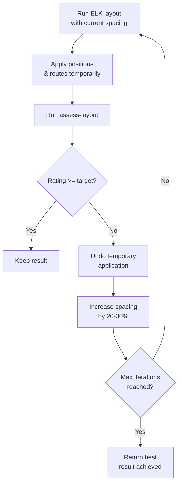

# Layout Engine

This document describes the layout and quality assessment systems, including Zest-based algorithms, ELK Layered integration, group-aware layout, and the multi-metric quality assessment framework.

## Table of Contents

- [Layout Algorithms (Zest)](#layout-algorithms-zest)
- [ELK Layered Algorithm](#elk-layered-algorithm)
- [Layout Presets](#layout-presets)
- [Flat View Layout](#flat-view-layout)
- [Group-Aware Layout](#group-aware-layout)
- [Hub Element Detection](#hub-element-detection)
- [Element Auto-Sizing](#element-auto-sizing)
- [Layout Quality Assessment](#layout-quality-assessment)
- [Auto-Layout-and-Route with Target Rating](#auto-layout-and-route-with-target-rating)
- [Configuration Constants](#configuration-constants)

## Layout Algorithms (Zest)

The `LayoutEngine` computes element positions using Eclipse Zest graph layout algorithms. It produces **positions only** (no connection routing).

### Supported Algorithms

| Algorithm | Description | Best For |
|-----------|-------------|----------|
| `tree` | Top-down hierarchical tree | Hierarchical relationships |
| `spring` | Force-directed/spring-based | Organic clustering |
| `directed` | Sugiyama-style layered hierarchy | Complex directed graphs |
| `radial` | Concentric circles | Hub/network views |
| `grid` | Regular grid arrangement | Information-dense layouts |
| `horizontal-tree` | Left-to-right tree | Horizontal hierarchies |

### Computation Pipeline

1. Resolve spacing from options (default: 50px)
2. Instantiate Zest algorithm with `NO_LAYOUT_NODE_RESIZING` style
3. Build `SimpleNode`/`SimpleRelationship` graph from layout nodes and edges
4. Compute canvas dimensions: `ceil(sqrt(nodeCount)) * (avgDimension + spacing) + 2 * padding`
5. Run `algorithm.applyLayout()` with computed canvas bounds
6. Extract positions from Zest entities (round to integers)
7. Post-layout overlap resolution via `OverlapResolver`

### Post-Layout Overlap Resolution

After Zest completes, the `OverlapResolver` eliminates sibling overlaps:

- Group elements by `parentId` (separate resolution per sibling group)
- For each group, iterate up to 10 times:
  1. Horizontal pass: sort by x, push right elements to maintain spacing gap
  2. Vertical pass: sort by y, push down elements to maintain spacing gap
  3. If zero overlaps remain, stop
- Elements in different sibling groups are never compared

**Source:** `model/LayoutEngine.java`

## ELK Layered Algorithm

The `ElkLayoutEngine` uses the ELK (Eclipse Layout Kernel) Layered algorithm, a production-quality Sugiyama-style hierarchical layout that computes **both positions and connection routes** in a single operation.

### Key Characteristics

- Orthogonal routing (right-angle segments)
- Configurable direction: DOWN, RIGHT, UP, LEFT
- Native hierarchical element support (children stay inside parents)
- Combined layout + routing in one pass

### Spacing Configuration

| Parameter | Value |
|-----------|-------|
| Node-to-node | `effectiveSpacing` (default 50px) |
| Edge-to-node | `effectiveSpacing / 2` |
| Between layers | `effectiveSpacing` |
| Component-to-component | `effectiveSpacing` |

### Group Padding

Scales with spacing to accommodate Archi's group labels (~24px rendered at group top):

```text
topPad  = max(25, 24 + effectiveSpacing * 0.3)
sidePad = max(12, effectiveSpacing * 0.25)
```

### Hierarchical Construction (Two-Pass)

**First pass:** Create top-level ELK nodes. Pre-configure parent nodes that have children:
- Set `NODE_SIZE_CONSTRAINTS = MINIMUM_SIZE`
- Enable subgraph layout
- Assign group padding

**Second pass:** Create child nodes inside their parents. Orphaned children (parent not found) are promoted to top-level.

### Edge Containment

Edges are placed in the **lowest common ancestor** of their source and target nodes. The engine walks ancestor chains from both ends until they meet.

### Routing Output

Only **intermediate bendpoints** are extracted from ELK output. Start/end attachment points are omitted because Archi's ChopboxAnchor computes perimeter intersections automatically at render time.

**Source:** `model/ElkLayoutEngine.java`

## Layout Presets

Semantic mappings from preset names to algorithm + default spacing:

| Preset | Algorithm | Spacing | Use Case |
|--------|-----------|---------|----------|
| `compact` | grid | 20px | Tight grid for information density |
| `spacious` | tree | 80px | Generous spacing for readability |
| `hierarchical` | tree | 50px | Top-down tree reflecting relationships |
| `organic` | spring | 50px | Force-directed for related elements |

**Source:** `model/LayoutPreset.java`

## Flat View Layout

The `layout-flat-view` tool positions all top-level elements and groups on a view using row, column, or grid arrangements. It eliminates manual x/y coordinate calculation for flat (non-grouped) views.

### Parameters

| Parameter | Default | Description |
|-----------|---------|-------------|
| `viewId` | required | View to layout |
| `arrangement` | required | `"row"`, `"column"`, or `"grid"` |
| `spacing` | 40 | Gap between elements (px) — same default as `layout-within-group` (40px) |
| `padding` | 20 | Space from view origin (px) |
| `sortBy` | *(none)* | Sort elements before positioning: `"name"`, `"type"`, or `"layer"` |
| `categoryField` | *(none)* | Group elements into visual sections: `"type"` or `"layer"` — inserts 2x spacing between sections |
| `columns` | *(auto)* | Column count for grid mode — auto-detected via `ceil(sqrt(n))` if omitted |

### Behavior

- Positions all top-level elements and groups (not elements inside groups)
- Respects heterogeneous element sizes (elements with embedded children treated as larger boxes)
- Does NOT route connections — run `auto-route-connections` after
- Full command stack integration (undo/redo, batch mode, approval mode)

### When to Use

| Tool | Use Case |
|------|----------|
| `layout-flat-view` | Flat views with no groups — automatic positioning with sorting/categorization |
| `layout-within-group` | Position children inside a specific group container |
| `compute-layout` | Graph-aware layout using Zest algorithms (tree, spring, directed, etc.) |
| `auto-layout-and-route` | Combined ELK layout + routing in one operation |

**Source:** `model/ArchiModelAccessorImpl.java`, `handlers/ViewPlacementHandler.java`

## Group-Aware Layout

### layout-within-group

Arranges children within a single group container.

**Parameters:**

| Parameter | Default | Description |
|-----------|---------|-------------|
| `arrangement` | required | `"row"`, `"column"`, or `"grid"` |
| `spacing` | 40 | Gap between children (px) |
| `padding` | 10 | Space from group edges (px) |
| `columns` | *(auto)* | Column count for grid mode |
| `elementWidth` | *(original)* | Uniform child width |
| `elementHeight` | *(original)* | Uniform child height |
| `autoWidth` | false | Compute width from label text length |
| `autoResize` | false | Resize group to fit children |
| `recursive` | false | Propagate sizing upward through ancestors |

**Behavior:** Positions direct children only (not recursive into sub-groups). Parent group size changes only if `autoResize=true`. With `recursive=true` and `autoResize=true`, ancestor groups resize to fit.

### arrange-groups

Positions top-level groups relative to each other.

**Parameters:**

| Parameter | Default | Description |
|-----------|---------|-------------|
| `arrangement` | required | `"grid"`, `"row"`, or `"column"` |
| `spacing` | 40 | Gap between groups (px) |
| `columns` | *(auto)* | Column count for grid mode |
| `groupIds` | *(all)* | Specific groups to arrange; null = all |

Groups not in `groupIds` remain at their current positions.

### optimize-group-order

Reorders elements within groups to minimize inter-group edge crossings using the barycentric heuristic.

**Algorithm:**

1. Build inter-group edges from assessment connections
2. For up to 10 iterations:
   - For each group: compute barycenter for each element (average position index of connected elements in other groups)
   - Sort elements by barycenter (unconnected elements sorted to end)
   - Evaluate crossing count, keep ordering if improved
   - If converged, stop
3. Re-layout each group with the new ordering
4. Resize groups to fit children

**Crossing count:** Straight-line segment intersection test between inter-group edge segments. O(n^2) pairwise comparison.

### Grouped View Assembly Workflow

```text
1. Create groups           → add-group-to-view
2. Add elements to groups  → add-to-view with parentViewObjectId
3. Internal layout         → layout-within-group (per group)
4. Group arrangement       → arrange-groups
5. Connect elements        → auto-connect-view (showLabel: false for cleaner routing)
6. Crossing optimization   → optimize-group-order → arrange-groups
7. Resize hub elements     → detect-hub-elements → update-view-object
8. Route connections       → auto-route-connections (autoNudge: true for automatic fixing)
9. Assess quality          → assess-layout → iterate if needed
```

### Flat View Assembly Workflow

```text
1. Add elements            → add-to-view (positions don't matter)
2. Automatic layout        → layout-flat-view (row/column/grid, optional sortBy/categoryField)
3. Connect elements        → auto-connect-view
4. Route connections       → auto-route-connections (autoNudge: true)
5. Assess quality          → assess-layout → iterate if needed
```

## Hub Element Detection

The `detect-hub-elements` tool identifies high-connectivity elements on a view — elements that act as hubs in hub-and-spoke topologies (e.g., API gateways, ESBs, shared databases). These hubs cause **port congestion** where many connections compete for attachment points on a small perimeter, producing bundled overlapping paths.

### Connection Counting

The tool traverses all visual elements and connections on a view, counting connections per `viewObjectId`:

```text
For each archimate connection on the view:
  connectionCounts[sourceViewObjectId] += 1
  connectionCounts[targetViewObjectId] += 1
```

A connection between A and B increments both counts. An element that is source of 3 connections and target of 4 has `connectionCount = 7`. Counts are per visual instance (`viewObjectId`), not per model element — the same element appearing multiple times on a view has independent counts per instance.

Elements with zero connections are excluded from the result.

### Hub Sizing Suggestions

Elements exceeding the hub threshold (>6 connections) receive sizing suggestions based on the hub element formula:

```text
suggestedDimension = baseDimension + 15px × (connectionCount - 6)
```

Suggestions are flow-direction-aware:
- **Horizontal layouts** (left-to-right groups): increase **height** for more vertical perimeter
- **Vertical layouts** (top-to-bottom groups): increase **width** for more horizontal perimeter
- **True hubs** (connections from all directions): increase **both**

### Response Structure

```json
{
  "result": {
    "viewId": "abc-123",
    "totalElements": 15,
    "totalConnections": 22,
    "averageConnectionCount": 3.1,
    "elements": [
      {
        "viewObjectId": "vo-1", "elementId": "el-1",
        "elementName": "API Gateway", "elementType": "ApplicationComponent",
        "connectionCount": 12, "width": 120, "height": 55
      }
    ],
    "suggestions": [
      "Element 'API Gateway' has 12 connections (hub threshold: 6). Consider increasing height to 145px (55 + 15 × 6) for horizontal layouts, or width to 210px (120 + 15 × 6) for vertical layouts."
    ]
  },
  "nextSteps": ["Use update-view-object to resize hub elements..."]
}
```

### Workflow Position

Hub detection slots between group optimization and connection routing:

```text
... → optimize-group-order → arrange-groups
    → detect-hub-elements → update-view-object (resize hubs)
    → auto-route-connections → assess-layout
```

**Source:** `model/ArchiModelAccessorImpl.java`, `handlers/ViewPlacementHandler.java`

## Element Auto-Sizing

Elements placed at the default size (120x55) may truncate long names. Two mechanisms ensure labels are fully visible.

### Auto-Size at Placement (`autoSize` on `add-to-view`)

When `autoSize: true` is passed to `add-to-view`, the server computes element dimensions from the label text using SWT font metrics before the element is placed on the view.

**Algorithm:**

1. Measure label text width and height using `GC.textExtent()` on the SWT UI thread
2. Add horizontal padding (20px) and vertical padding (10px)
3. Apply aspect-ratio-aware sizing with target ratio 1.5:1 (acceptable range [1.2:1, 2.5:1])
4. If the computed width exceeds target ratio, increase height to bring the ratio within range
5. Short names (≤15 characters) keep the default 120x55 — auto-sizing only activates for longer names
6. Explicit `width`/`height` parameters take precedence over `autoSize`

This is the recommended approach for flat views — it eliminates the need for a post-placement resize pass.

### Resize Elements to Fit (`resize-elements-to-fit`)

The `resize-elements-to-fit` tool resizes all (or selected) elements on an existing view to fit their labels. It handles nested containment with a two-pass algorithm:

**Algorithm:**

1. **Child pass:** Identify all elements with children. Process leaf elements first — compute dimensions from label text using SWT font metrics with the same aspect-ratio-aware algorithm as `autoSize`
2. **Parent pass:** For each parent element, compute the bounding box of all children, add padding (horizontal: 20px, vertical: 30px to accommodate label above children), and set the parent's dimensions to contain both its own label and all children
3. Apply all size changes as a single compound command (atomic undo)

**Parameters:**

| Parameter | Default | Description |
|-----------|---------|-------------|
| `viewId` | required | View to resize elements on |
| `elementIds` | *(all)* | Specific elements to resize; null = all elements on the view |

### When to Use Which

| Scenario | Approach |
|----------|----------|
| Placing elements on flat view | `add-to-view` with `autoSize: true` |
| Bulk-creating elements | `bulk-mutate` with `autoSize: true` per `add-to-view` operation |
| Elements inside groups | `layout-within-group` with `autoWidth: true` (existing feature) |
| Existing view with truncated labels | `resize-elements-to-fit` on the view |

**Source:** `model/ArchiModelAccessorImpl.java`, `handlers/ViewPlacementHandler.java`

## Layout Quality Assessment

The `LayoutQualityAssessor` computes multi-dimensional layout quality metrics. All coordinates are in absolute canvas space. This is a pure-geometry class with no EMF dependencies.

### Metric Categories

The assessor evaluates 8 metric categories, each producing an individual rating.

#### Element Overlaps

| Type | Definition | Impact |
|------|------------|--------|
| Sibling overlaps | Same-parent elements with AABB intersection | Primary metric — penalized |
| Containment overlaps | Parent-child / ancestor-descendant | Excluded (intentional nesting) |
| Note overlaps | Note-to-element overlaps | Informational only |

**Rating:** 0 = "pass", 1-3 = "fair", 4+ = "poor"

#### Edge Crossings

```text
crossing_ratio = edgeCrossingCount / connectionCount
```

| Condition | Rating |
|-----------|--------|
| crossings < 5 | "pass" |
| 5-20 crossings | "good" |
| crossings >= 20, ratio <= 1.5 | "good" |
| ratio <= 4.0 | "fair" |
| crossings < 30 | "fair" |
| crossings >= 30 | "poor" |

**Grouped view leniency:** If a view has groups and overlaps == 0, passThroughs <= 3, labelOverlaps == 0, alignment > 30, and spacing > 15.0, crossing ratings get a one-tier boost ("poor" to "fair", "fair" to "good"). This acknowledges that cross-group edge crossings are topologically unavoidable.

#### Element Spacing

Average minimum gap between sibling elements:

```text
avgSpacing = mean(minGap(A, B)) for all sibling pairs
```

**Rating:** > 30px = "pass", > 15px = "good", <= 15px = "fair"

#### Alignment Score

Measures edge alignment of leaf (non-group) elements along left edges, centers, top edges, and vertical centers (5px tolerance):

```text
alignment = (aligned_pair_count / max_possible_pairs) * 100
```

**Rating:** > 60 = "pass", > 30 = "good", <= 30 = "fair"

#### Label Overlaps

Estimates label bounding boxes from text length and path position. Uses 10px inset on both label and element rectangles to absorb estimation error. Also detects near-miss proximity within 5px.

**Rating:** 0 = "pass", > 0 = "fair"

#### Pass-Throughs

Detects connections that cross through element rectangles. Clips connection paths from element centers to perimeter (using Archi's OrthogonalAnchor model). Excludes ancestors, descendants, and groups (transparent containers). Uses 10px inset to absorb corner-arc imprecision.

Also detects **self-element pass-throughs** — cases where non-terminal segments of a connection's route pass through the connection's own source or target element body (using 5px inset). This catches routes that enter endpoint elements through interior points rather than approaching cleanly from an edge.

**Rating:** 0 = "pass", 1-3 = "fair", 4+ = "poor"

#### Coincident Segments

Counts connection segments from different connections that share identical coordinates (within tolerance) and have overlapping parallel ranges.

**Rating:** 0 = "pass", 1-3 = "good", 4-8 = "fair", 9+ = "poor"

#### Non-Orthogonal Terminals

Counts connections whose terminal segments (first two or last two points) form diagonal rather than perpendicular approaches to elements. Checked per-connection (not per-segment).

**Rating:** 0 = "pass", 1-3 = "fair", 4+ = "poor"

### Overall Rating (Severity-Tiered)

The overall rating uses a **three-tier severity system** instead of simple worst-metric-wins. Each tier has a cap on how much it can degrade the overall rating:

| Tier | Severity | Metrics | Cap |
|------|----------|---------|-----|
| **Tier 1** | Critical | overlaps, passThroughs, coincidentSegments | No cap — drives overall rating directly |
| **Tier 2** | Moderate | edgeCrossings, nonOrthogonalTerminals | Capped at "fair" |
| **Tier 3** | Cosmetic | spacing, alignment, labelOverlaps | Capped at "good" |

```text
Rating levels: pass/excellent = 0, good = 1, fair = 2, poor = 3

overall = max(worstTier1, min(worstTier2, 2), min(worstTier3, 1))

Map: 0 → "excellent", 1 → "good", 2 → "fair", 3+ → "poor"
```

This prevents cosmetic issues (spacing, alignment) from masking structural quality. A view with perfect structure but poor alignment still achieves "good". Conversely, overlaps or excessive pass-throughs drive the rating to "poor" regardless of cosmetic scores.

### Suggestion Generation

The assessor generates actionable suggestions when thresholds are exceeded:

- Overlaps > 0: suggest specific overlap pairs
- Crossings > 10: suggest routing or element reordering
- Spacing < 15px: suggest increasing spacing
- Alignment < 30: suggest alignment tools
- Boundary violations: list children extending outside parents
- Off-canvas elements: warn about negative or extreme coordinates

### Assessment Result Structure

```json
{
  "overlapCount": 0,
  "edgeCrossingCount": 12,
  "averageSpacing": 35.2,
  "alignmentScore": 45,
  "labelOverlapCount": 1,
  "passThroughCount": 0,
  "coincidentSegmentCount": 2,
  "nonOrthogonalTerminalCount": 1,
  "overallRating": "good",
  "ratingBreakdown": {
    "overlaps": "pass",
    "edgeCrossings": "good",
    "spacing": "pass",
    "alignment": "good",
    "labelOverlaps": "pass",
    "passThroughs": "pass",
    "coincidentSegments": "good",
    "nonOrthogonalTerminals": "fair"
  },
  "suggestions": ["..."],
  "contentBounds": {"x": 50, "y": 50, "width": 800, "height": 600},
  "crossingsPerConnection": 1.2
}
```

**Source:** `model/LayoutQualityAssessor.java`

## Auto-Layout-and-Route with Target Rating

The `auto-layout-and-route` tool supports two layout modes and optional quality iteration.

### Mode: `auto` (default) — ELK Layered

Uses the ELK Layered algorithm to compute both element positions and connection routes in a single operation. Best for flat views or when no specific structural intent is needed.

### Mode: `grouped` — Orchestrated Grouped Workflow

Orchestrates the full Branch 2 grouped-view workflow in a single atomic tool call:

1. `layout-within-group` for each group (sizes groups to fit contents)
2. `arrange-groups` with topology arrangement (orders groups by connection density)
3. `optimize-group-order` (minimises inter-group edge crossings)
4. `auto-route-connections` (obstacle-aware orthogonal routing)

This replaces the manual 5-7 step grouped workflow with a single call. Requires the view to have groups with children. Produces obstacle-aware orthogonal routing between groups — best choice for views with ArchiMate groups (layered architecture, producer-consumer flows, etc.).

### Without targetRating

Run layout once (ELK in `auto` mode, or the orchestrated workflow in `grouped` mode), apply positions and routes, return result.

### With targetRating

Multi-iteration quality loop (max 5 attempts):



### Router Mode Switch

ELK generates orthogonal bendpoints. The view's connection router is automatically switched to manual/bendpoint mode so ELK paths render correctly.

### Limitation

ELK does not see elements inside groups as obstacles for inter-group connections. Inter-group edges may clip through internal elements. Workaround: follow ELK with `auto-route-connections` for element-aware obstacle routing.

## Configuration Constants

### LayoutEngine (Zest)

| Constant | Value |
|----------|-------|
| Default spacing | 50px |
| Canvas padding | 20px |
| Overlap resolution max iterations | 10 |

### ElkLayoutEngine

| Constant | Value |
|----------|-------|
| Default spacing | 50px |
| Top group padding | max(25, 24 + spacing * 0.3) |
| Side group padding | max(12, spacing * 0.25) |

### LayoutQualityAssessor

| Constant | Value | Purpose |
|----------|-------|---------|
| `EXCELLENT_MAX_CROSSINGS` | 5 | Crossing threshold for "pass" |
| `EXCELLENT_MIN_SPACING` | 30.0px | Spacing threshold for "pass" |
| `EXCELLENT_MIN_ALIGNMENT` | 60 | Alignment threshold for "pass" |
| `GOOD_MAX_CROSSINGS` | 20 | Crossing threshold for "good" |
| `GOOD_MIN_SPACING` | 15.0px | Spacing threshold for "good" |
| `GOOD_MIN_ALIGNMENT` | 30 | Alignment threshold for "good" |
| `GOOD_MAX_COINCIDENT` | 3 | Coincident segment threshold for "good" |
| `FAIR_MAX_OVERLAPS` | 3 | Overlap threshold for "fair" |
| `FAIR_MAX_CROSSINGS` | 30 | Crossing threshold for "fair" |
| `FAIR_MAX_COINCIDENT` | 8 | Coincident segment threshold for "fair" |
| `FAIR_MAX_PASS_THROUGHS` | 3 | Pass-through threshold for "fair" (also leniency gate) |
| `FAIR_MAX_NON_ORTHOGONAL` | 3 | Non-orthogonal terminal threshold for "fair" |
| `CROSSING_RATIO_GOOD` | 1.5 | crossings/connections for "good" |
| `CROSSING_RATIO_MODERATE` | 4.0 | crossings/connections for "fair" |
| `ALIGNMENT_TOLERANCE` | 5.0px | Edge alignment detection tolerance |
| `LABEL_OVERLAP_INSET` | 10.0px | Label bounding box inset |
| `LABEL_PROXIMITY_THRESHOLD` | 5.0px | Near-miss detection threshold |
| `PASS_THROUGH_INSET` | 10.0px | Obstacle inset for pass-through detection |
| `SELF_ELEMENT_INSET` | 5.0px | Inset for self-element pass-through detection |

---

**See also:** [Routing Pipeline](routing-pipeline.md) | [Coordinate Model](coordinate-model.md) | [Architecture Overview](architecture.md)
