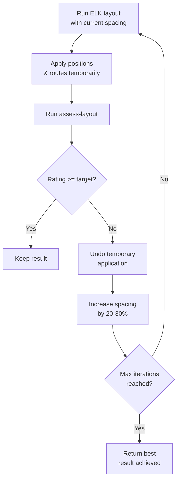

# Layout Engine

This document describes the layout and quality assessment systems, including ELK Layered integration, group-aware layout, and the multi-metric quality assessment framework.

## Table of Contents

- [ELK Layered Algorithm](#elk-layered-algorithm)
- [Flat View Layout](#flat-view-layout)
- [Group-Aware Layout](#group-aware-layout)
- [Hub Element Detection](#hub-element-detection)
- [Element Auto-Sizing](#element-auto-sizing)
- [Layout Quality Assessment](#layout-quality-assessment)
- [Auto-Layout-and-Route with Target Rating](#auto-layout-and-route-with-target-rating)
- [View Spacing Adjustment](#view-spacing-adjustment)
- [Configuration Constants](#configuration-constants)

## ELK Layered Algorithm

The `ElkLayoutEngine` uses the ELK (Eclipse Layout Kernel) Layered algorithm [10], a production-quality Sugiyama-style hierarchical layout [7] that computes **both positions and connection routes** in a single operation. ELK Layered uses Brandes–Köpf horizontal coordinate assignment [11] internally; the project consumes ELK output rather than calling the algorithm directly.

### Key Characteristics

- Orthogonal routing (right-angle segments)
- Configurable direction: DOWN, RIGHT, UP, LEFT
- Native hierarchical element support (children stay inside parents)
- Combined layout + routing in one pass

### Spacing Configuration

| Parameter | Value |
|-----------|-------|
| Node-to-node | `effectiveSpacing` (default 50px) |
| Edge-to-node | `effectiveSpacing / 2` |
| Between layers | `effectiveSpacing` |
| Component-to-component | `effectiveSpacing` |

### Connection-Label Width Reservation

To stop connection labels crowding on dense views, the engine hands ELK an `ElkLabel` sized to each connection label's estimated glyph width, so the Layered algorithm reserves corridor space for the label while it spaces the elements (`EDGE_LABELS_PLACEMENT = CENTER`, `SPACING_EDGE_LABEL = 4`). The displayed label text is resolved through `StylingHelper.resolveConnectionLabelText`, and its width is estimated with the same `len × 8 + 10` yardstick the layout-quality label-overlap detector uses (`LabelWidthEstimator` reuses the detector's constants), so the reserver and the detector agree. A suppressed (`showLabel: false`) or empty label resolves to width 0 and reserves nothing — manual label suppression stays an effective way to de-clutter a busy view, and label-free views lay out exactly as before. The reserver deliberately uses the **raw** estimate; the overlap *detector* applies an additional render-calibration factor (see [Label Overlaps](#label-overlaps)), so the detector is intentionally the more render-accurate of the two.

### Group Padding

Scales with spacing to accommodate Archi's group labels (~24px rendered at group top):

```text
topPad  = max(25, 24 + effectiveSpacing * 0.3)
sidePad = max(12, effectiveSpacing * 0.25)
```

### Hierarchical Construction (Two-Pass)

**First pass:** Create top-level ELK nodes. Pre-configure parent nodes that have children:
- Set `NODE_SIZE_CONSTRAINTS = MINIMUM_SIZE`
- Enable subgraph layout
- Assign group padding

**Second pass:** Create child nodes inside their parents. Orphaned children (parent not found) are promoted to top-level.

### Edge Containment

Edges are placed in the **lowest common ancestor** of their source and target nodes. The engine walks ancestor chains from both ends until they meet.

### Routing Output

Only **intermediate bendpoints** are extracted from ELK output. Start/end attachment points are omitted because Archi's ChopboxAnchor computes perimeter intersections automatically at render time.

**Source:** `model/ElkLayoutEngine.java`

## Flat View Layout

The `layout-flat-view` tool positions all top-level elements and groups on a view using row, column, or grid arrangements. It eliminates manual x/y coordinate calculation for flat (non-grouped) views.

### Parameters

| Parameter | Default | Description |
|-----------|---------|-------------|
| `viewId` | required | View to layout |
| `arrangement` | required | `"row"`, `"column"`, or `"grid"` |
| `spacing` | 40 | Gap between elements (px) — same default as `layout-within-group` (40px) |
| `padding` | 20 | Space from view origin (px) |
| `sortBy` | *(none)* | Sort elements before positioning: `"name"`, `"type"`, or `"layer"` |
| `categoryField` | *(none)* | Group elements into visual sections: `"type"` or `"layer"` — inserts 2x spacing between sections |
| `columns` | *(auto)* | Column count for grid mode — auto-detected via `ceil(sqrt(n))` if omitted |

### Behavior

- Positions all top-level elements and groups (not elements inside groups)
- Respects heterogeneous element sizes (elements with embedded children treated as larger boxes)
- Does NOT route connections — run `auto-route-connections` after
- Full command stack integration (undo/redo, batch mode, approval mode)

### When to Use

| Tool | Use Case |
|------|----------|
| `layout-flat-view` | Flat views with no groups — automatic positioning with sorting/categorization |
| `layout-within-group` | Position children inside a specific container — a visual group or an ArchiMate-element container |
| `auto-layout-and-route` | Combined ELK layout + routing in one operation |

**Source:** `model/ArchiModelAccessorImpl.java`, `handlers/ViewPlacementHandler.java`

## Group-Aware Layout

### layout-within-group

Arranges children within a single container view-object. The container may be a visual group (`IDiagramModelGroup`) **or** an ArchiMate-element container (`IDiagramModelArchimateObject` — `ApplicationComponent`, `Node`, `ApplicationFunction`, and any other element that holds nested children). The same parameters and behaviour apply to both; only the set of accepted containers is polymorphic. Notes, view-references, and connections cannot be containers and are rejected.

**Parameters:**

| Parameter | Default | Description |
|-----------|---------|-------------|
| `arrangement` | required | `"row"`, `"column"`, or `"grid"` |
| `spacing` | 40 | Gap between children (px) |
| `padding` | 10 | Space from group edges (px) |
| `columns` | *(auto)* | Column count for grid mode |
| `elementWidth` | *(original)* | Uniform child width |
| `elementHeight` | *(original)* | Uniform child height |
| `autoWidth` | false | Compute width from label text length |
| `autoResize` | false | Resize group to fit children |
| `recursive` | false | Propagate sizing upward through ancestors |

**Behavior:** Positions direct children only (not recursive into sub-containers). The container resizes only if `autoResize=true`. With `recursive=true` and `autoResize=true`, ancestor containers resize to fit. When the container is an ArchiMate-element node rather than a group, child coordinates remain relative to that element's top-left corner, consistent with the [coordinate model](coordinate-model.md). Caveat: running `autoWidth` on an *outer* container that itself nests sub-containers shrinks each sub-container to its own label width, clipping the grandchildren inside it — lay out inner-first (`autoWidth` on the innermost containers) and then the outer container with `autoWidth` off, so the outer pass sizes to the already-correct inner boxes.

### arrange-groups

Positions top-level groups relative to each other.

**Parameters:**

| Parameter | Default | Description |
|-----------|---------|-------------|
| `arrangement` | required | `"grid"`, `"row"`, or `"column"` |
| `spacing` | 40 | Gap between groups (px) |
| `columns` | *(auto)* | Column count for grid mode |
| `groupIds` | *(all)* | Specific groups to arrange; null = all |

Groups not in `groupIds` remain at their current positions.

### optimize-group-order

Reorders elements within groups to minimize inter-group edge crossings using the barycentric heuristic [7].

**Algorithm:**

1. Build inter-group edges from assessment connections
2. For up to 10 iterations:
   - For each group: compute barycenter for each element (average position index of connected elements in other groups)
   - Sort elements by barycenter (unconnected elements sorted to end)
   - Evaluate crossing count, keep ordering if improved
   - If converged, stop
3. Re-layout each group with the new ordering
4. Resize groups to fit children

**Crossing count:** Straight-line segment intersection test between inter-group edge segments. O(n^2) pairwise comparison.

### Grouped View Assembly Workflow

```text
1. Create groups           → add-group-to-view
2. Add elements to groups  → add-to-view with parentViewObjectId
3. Internal layout         → layout-within-group (per group)
4. Group arrangement       → arrange-groups
5. Connect elements        → auto-connect-view (showLabel: false for cleaner routing)
6. Crossing optimization   → optimize-group-order → arrange-groups
7. Resize hub elements     → detect-hub-elements → update-view-object
8. Route connections       → auto-route-connections (autoNudge: true for automatic fixing)
9. Assess quality          → assess-layout → iterate if needed
```

### Flat View Assembly Workflow

```text
1. Add elements            → add-to-view (positions don't matter)
2. Automatic layout        → layout-flat-view (row/column/grid, optional sortBy/categoryField)
3. Connect elements        → auto-connect-view
4. Route connections       → auto-route-connections (autoNudge: true)
5. Assess quality          → assess-layout → iterate if needed
```

## Hub Element Detection

The `detect-hub-elements` tool identifies high-connectivity elements on a view — elements that act as hubs in hub-and-spoke topologies (e.g., API gateways, ESBs, shared databases). These hubs cause **port congestion** where many connections compete for attachment points on a small perimeter, producing bundled overlapping paths.

### Canonical Hub Thresholds

The codebase carries four distinct connection-count thresholds with different roles. They are **not interchangeable**:

| Threshold | Constant / Source | Role |
|-----------|-------------------|------|
| ≥ 5 connections | `LayoutQualityAssessor.HUB_DETECTION_THRESHOLD` (public canonical) | Hub *candidate* signal for the LLM ("this element is worth examining") |
| > 6 connections | `LayoutQualityAssessor.HUB_DETECTION_THRESHOLD + 1` (the `detect-hub-elements` 1D-suggestion-emit gate) — derived from the candidacy threshold; the formula's growth term `15 × (count − 6)` is non-positive at exactly 5, so suggestions only emit one above candidacy. Note: `EdgeAttachmentCalculator.HUB_FACE_REDISTRIBUTION_THRESHOLD = 6` shares this value but is a separate Phase-1.1 routing-internal redistribution gate, NOT the suggestion-emit threshold. | *1D sizing-suggestion* trigger — `detect-hub-elements` emits resize suggestions for the perimeter perpendicular to the connection flow |
| > 12 connections | `LayoutQualityAssessor.HUB_2D_RESIZE_THRESHOLD` | *2D sizing-suggestion* trigger — for very high-fan-out hubs, `detect-hub-elements` additionally surfaces a 2D-resize suggestion (`width += 15 × ⌈excess/2⌉`, `height += 15 × ⌊excess/2⌋`) so connections can spread across all four faces |
| ≥ 4 connections per face | `LayoutQualityAssessor.M5_FACE_GUARD_MIN_CONNECTIONS` | M5 *hub-port-quality* face-count guard — a separate per-face metric, not a hub-detection threshold |

For a deeper walkthrough of when each threshold applies and when to use `detect-hub-elements` versus `resize-elements-to-fit`, see the `archimate://prompts/routing-preconditions-checklist` MCP resource and the [Hub Sizing Suggestions](#hub-sizing-suggestions) section below.

### Connection Counting

The tool traverses all visual elements and connections on a view, counting connections per `viewObjectId`:

```text
For each archimate connection on the view:
  connectionCounts[sourceViewObjectId] += 1
  connectionCounts[targetViewObjectId] += 1
```

A connection between A and B increments both counts. An element that is source of 3 connections and target of 4 has `connectionCount = 7`. Counts are per visual instance (`viewObjectId`), not per model element — the same element appearing multiple times on a view has independent counts per instance.

Elements with zero connections are excluded from the result.

### Hub Sizing Suggestions

Elements exceeding the hub threshold (>6 connections) receive sizing suggestions based on the hub element formula. The Kandinsky orthogonal-layout model [8] is the relevant background reference for treating high-degree vertices specially; the formula itself is empirical (project contribution, not paper-derived):

**1D suggestion (>6 connections):**

```text
suggestedDimension = baseDimension + 15px × (connectionCount - 6)
```

Suggestions are flow-direction-aware:

- **Horizontal layouts** (left-to-right groups): increase **height** for more vertical perimeter
- **Vertical layouts** (top-to-bottom groups): increase **width** for more horizontal perimeter
- **True hubs** (connections from all directions): increase **both**

**2D suggestion (>12 connections, additional):**

```text
width  += 15 × ⌈(connectionCount - 12) / 2⌉
height += 15 × ⌊(connectionCount - 12) / 2⌋
```

Surfaced alongside the 1D pair so the calling agent can pick 2D inflation when the connection fan-out warrants distributing ports across all four edges (~N/4 connections per edge). The 2D formula keeps the resize aspect-ratio-neutral by splitting the growth term between width and height.

### Response Structure

```json
{
  "result": {
    "viewId": "abc-123",
    "totalElements": 15,
    "totalConnections": 22,
    "averageConnectionCount": 3.1,
    "elements": [
      {
        "viewObjectId": "vo-1", "elementId": "el-1",
        "elementName": "API Gateway", "elementType": "ApplicationComponent",
        "connectionCount": 12, "width": 120, "height": 55
      }
    ],
    "suggestions": [
      "Element 'API Gateway' has 12 connections (hub threshold: 6). Consider increasing height to 145px (55 + 15 × 6) for horizontal layouts, or width to 210px (120 + 15 × 6) for vertical layouts."
    ]
  },
  "nextSteps": ["Use update-view-object to resize hub elements..."]
}
```

### Workflow Position

Hub detection slots between group optimization and connection routing:

```text
... → optimize-group-order → arrange-groups
    → detect-hub-elements → update-view-object (resize hubs)
    → auto-route-connections → assess-layout
```

**Source:** `model/ArchiModelAccessorImpl.java`, `handlers/ViewPlacementHandler.java`

## Element Auto-Sizing

Elements placed at the default size (120x55) may truncate long names. Two mechanisms ensure labels are fully visible.

### Auto-Size at Placement (`autoSize` on `add-to-view`)

When `autoSize: true` is passed to `add-to-view`, the server computes element dimensions from the label text using SWT font metrics before the element is placed on the view.

**Algorithm:**

1. Measure label text width and height using `GC.textExtent()` on the SWT UI thread
2. Add horizontal padding (20px) and vertical padding (10px)
3. Apply aspect-ratio-aware sizing with target ratio 1.5:1 (acceptable range [1.2:1, 2.5:1])
4. If the computed width exceeds target ratio, increase height to bring the ratio within range
5. Short names (≤15 characters) keep the default 120x55 — auto-sizing only activates for longer names
6. Explicit `width`/`height` parameters take precedence over `autoSize`

This is the recommended approach for flat views — it eliminates the need for a post-placement resize pass.

### Resize Elements to Fit (`resize-elements-to-fit`)

The `resize-elements-to-fit` tool resizes all (or selected) elements on an existing view to fit their labels. It handles nested containment with a two-pass algorithm:

**Algorithm:**

1. **Child pass:** Identify all elements with children. Process leaf elements first — compute dimensions from label text using SWT font metrics with the same aspect-ratio-aware algorithm as `autoSize`
2. **Parent pass:** For each parent element, compute the bounding box of all children, add padding (horizontal: 20px) plus a **dynamic containment label height** computed per parent from font metrics and word-wrap simulation, and set the parent's dimensions to contain both its own label and all children
3. **Child shift:** When the parent's wrapped label height exceeds the previously assumed top margin, children are shifted down so they clear the multi-line label rather than being obscured by its lower lines
4. **Parent height never shrinks** — only grows to accommodate the wrapped label and its children
5. Apply all size changes as a single compound command (atomic undo)

The dynamic label height replaces the previous fixed `CONTAINMENT_LABEL_TOP = 25` constant. Long parent labels that wrap across two or three lines now correctly reserve vertical space for every line, eliminating the failure mode where a multi-line parent label visually obscured its first child.

**Parameters:**

| Parameter | Default | Description |
|-----------|---------|-------------|
| `viewId` | required | View to resize elements on |
| `elementIds` | *(all)* | Specific elements to resize; null = all elements on the view |

### When to Use Which

| Scenario | Approach |
|----------|----------|
| Placing elements on flat view | `add-to-view` with `autoSize: true` |
| Bulk-creating elements | `bulk-mutate` with `autoSize: true` per `add-to-view` operation |
| Elements inside groups | `layout-within-group` with `autoWidth: true` (existing feature) |
| Existing view with truncated labels | `resize-elements-to-fit` on the view |

**Source:** `model/ArchiModelAccessorImpl.java`, `handlers/ViewPlacementHandler.java`

## Layout Quality Assessment

The `LayoutQualityAssessor` computes multi-dimensional layout quality metrics. All coordinates are in absolute canvas space. This is a pure-geometry class with no EMF dependencies.

### Metric Categories

The assessor evaluates 8 metric categories, each producing an individual rating.

#### Element Overlaps

| Type | Definition | Impact |
|------|------------|--------|
| Sibling overlaps | Same-parent elements with AABB intersection | Primary metric — penalized |
| Containment overlaps | Parent-child / ancestor-descendant | Excluded (intentional nesting) |
| Note overlaps | Note-to-element overlaps | Informational only |

**Rating:** 0 = "pass", 1-3 = "fair", 4+ = "poor"

#### Edge Crossings

```text
crossing_ratio = edgeCrossingCount / connectionCount
```

| Condition | Rating |
|-----------|--------|
| crossings < 5 | "pass" |
| 5-20 crossings | "good" |
| crossings >= 20, ratio <= 1.5 | "good" |
| ratio <= 4.0 | "fair" |
| crossings < 30 | "fair" |
| crossings >= 30 | "poor" |

**Grouped view leniency:** If a view has groups and overlaps == 0, passThroughs <= 3, labelOverlaps == 0, alignment > 30, and spacing > 15.0, crossing ratings get a one-tier boost ("poor" to "fair", "fair" to "good"). This acknowledges that cross-group edge crossings are topologically unavoidable.

#### Element Spacing

Average minimum gap between sibling elements:

```text
avgSpacing = mean(minGap(A, B)) for all sibling pairs
```

**Rating:** > 30px = "pass", > 15px = "good", <= 15px = "fair"

#### Alignment Score

Measures edge alignment of leaf (non-group) elements along left edges, centers, top edges, and vertical centers (5px tolerance):

```text
alignment = (aligned_pair_count / max_possible_pairs) * 100
```

**Rating:** > 60 = "pass", > 30 = "good", <= 30 = "fair"

#### Label Overlaps

Estimates label bounding boxes from text length and path position. Uses 10px inset on both label and element rectangles to absorb estimation error. Also detects near-miss proximity within 5px.

The estimated glyph box is **render-calibrated**: the glyph run (not the padding chrome) is widened by `LABEL_RENDER_WIDTH_FACTOR = 1.35` — the same render-versus-measure ratio the label-truncation check uses — because Archi renders glyphs ~1.35× wider than the raw `len × 8 + 10` estimate, so short, tight segments were previously under-flagged. This is detection-only; the ELK-side [width reserver](#connection-label-width-reservation) keeps the raw estimate.

The detector also flags a connection label rendered on its **own** source or target box. The base overlap test excludes a connection's own endpoints (a Middle label always grazes the box it attaches to, which would otherwise false-positive); a separate asymmetric rule flags the own-endpoint case only when more than `LABEL_OWN_ENDPOINT_OVERLAP_FRACTION = 0.30` of the label's render-calibrated area falls on that endpoint, naming the more-overlapped end. Three companion rules cover what the area fraction alone misses:

- **Box-coverage** — a label that blankets a *tiny* endpoint box (e.g. a 14×14 junction sitting almost entirely under the label) registers a low label-area fraction but a high *box*-area fraction, so it is also flagged when the overlap covers at least `LABEL_OWN_ENDPOINT_BOX_COVERAGE_FRACTION = 0.6` of the endpoint box. This is structurally self-limiting — coverage ≥ 0.6 requires the box to be no larger than `labelArea / 0.6`, so an ordinary element box can never trip it.
- **Short-segment promotion** — when the label is wider than the first/last segment it anchors to (a long source/target label on a short terminal segment), the area-fraction bar is lowered to `LABEL_OWN_ENDPOINT_SHORT_SEGMENT_OVERLAP_FRACTION = 0.15`, catching the terminal-label bleed the 0.30 bar under-counted.
- **Junction near-zero bar** — when the endpoint is an ArchiMate Junction (a solid dark shape scaled to its bounds with no usable interior), the box-grazing tolerance a normal box earns is wrong: *any* non-trivial label area on it is unreadable. For that endpoint the own-endpoint bar drops to `LABEL_OWN_ENDPOINT_JUNCTION_OVERLAP_FRACTION = 0.05`, catching an *oversized* junction (e.g. the 120×55 default) grazed by a label — the case the box-coverage rule (which only fires on a *tiny* junction fully under the label) and the 0.30 area bar both miss. The small non-zero floor tolerates a 1 px graze by a label that has genuinely cleared the junction. `AssessmentNode` carries the per-endpoint `isJunction` flag the threshold reads.

The own-endpoint test is **offset-aware**: an `AssessmentConnection` carries the applied Label Offset (`relativePosition`), so a Middle label already lifted clear by an Archi 5.10 [Label Offset](routing-pipeline.md#connection-label-offset-archi-510) is not re-reported as bleeding (the offset is otherwise the defect this detection drives the router to apply). A label whose connection has `showLabel: false` is not visible, resolves to an empty box, and is dropped from every label path — so suppression is never penalised with a phantom overlap.

**Rating:** 0 = "pass", > 0 = "fair"

#### Pass-Throughs

Detects connections that cross through element rectangles. Clips connection paths from element centers to perimeter (using Archi's OrthogonalAnchor model) and tests segment-vs-rectangle intersection using the Liang–Barsky line-clipping algorithm [13]. Excludes ancestors, descendants, and groups (transparent containers). Uses 10px inset to absorb corner-arc imprecision.

Also detects **self-element pass-throughs** — cases where non-terminal segments of a connection's route pass through the connection's own source or target element body (using 5px inset). This catches routes that enter endpoint elements through interior points rather than approaching cleanly from an edge.

**Rating:** counted from cross-element pass-throughs only — 0 = "pass", 1-3 = "fair", 4+ = "poor". Self-element pass-throughs are reported in the assessment output (informational) but **excluded from rating**. Self-element geometry frequently cannot be resolved by re-routing alone, and penalising it masks the structural quality of cross-element routing.

#### Coincident Segments

Counts connection segments from different connections that share identical coordinates (within tolerance) and have overlapping parallel ranges.

**Rating:** 0 = "pass", 1-3 = "good", 4-8 = "fair", 9+ = "poor"

#### Non-Orthogonal Terminals

Counts connections whose terminal segments (first two or last two points) form diagonal rather than perpendicular approaches to elements. Checked per-connection (not per-segment).

**Rating:** 0 = "pass", 1-3 = "fair", 4+ = "poor"

### Assessor Redesign

The assessor redesign introduces five perception-aligned metrics (M1 corrected, M2–M5 new), a corridor-utilisation metric (R8), an informational narrow-corridor signal (`parallelConnectionGap_V_p10`), and a two-dimensional overall rating (M6) that decouples layout quality from routing quality. The redesign was driven by ArchiMate manual-routed reference calibration and visual-severity owner sign-off that pre-redesign metrics misaligned with user perception.

| Metric | Field | Definition |
|--------|-------|------------|
| **M1** (corrected) | `nonOrthogonalTerminalCount` | Visible-segment-length guard. Pre-redesign, the metric over-reported clipped diagonals — bendpoints inside the source/target element bounds were counted as if visible. The corrected M1 ignores Archi-clipped diagonals (post-clip visible segment only) and was calibrated against the V4 manual oracle (manual = 21). |
| **M2** | `interiorTerminatingCount` | Connections whose terminal bendpoint lands inside the source or target element bounds. Routing Tier 1R. Previously unmeasured. |
| **M3** | `zigzagCount` | Reversal patterns where two consecutive segments meet at a shared axis (zigzag triple). Routing Tier 1R. Previously unmeasured. M3 **skips connections already classified as pass-throughs** by `detectPassThroughs` (classification-precedence guard at `LayoutQualityAssessor.countZigzags()`): for the failed-detour-around-element pattern the visually-correct label is passthrough-only — the small reversal is a consequence of the failed detour, not an independent defect. Pinned by `RoutingClassificationPrecedenceTest`. |
| **M4** | `connectionEdgeCoincidenceCount` | Connection segments running parallel to and within `EDGE_COINCIDENCE_TOLERANCE_PX` (3px) of a foreign element's edge line. Routing Tier 1R with thresholds `EDGE_COINCIDENCE_GOOD_MAX = 2` and `EDGE_COINCIDENCE_FAIR_MAX = 5`. Pre-redesign only conn-vs-conn coincidence was measured under an earlier self-exclusion guard. Removing that guard makes M4 always flag parallel-coincident segments. **v1.3 oracle baseline corrected to M4 = 12** (previously documented as 2 — the discrepancy was a measurement artefact, not a routing change). **Topology-bound floor caveat:** on hub-and-spoke layouts at hub-port-quality-fixed hub sizes, M4 has a structural floor that does not respond to spacing inflation. M4 above the floor reflects routable congestion; M4 at the floor reflects topology. **Per-element enumeration:** the detector now enumerates every distinct `(connection, element)` graze rather than stopping at the first per connection, surfacing the informational `edgeCoincidenceGrazedElementCount` (sum of distinct grazed elements across all connections) and an `edgeCoincidenceGrazedElements` element-id violator key. The rating-bearing `connectionEdgeCoincidenceCount` and its connection-id `edgeCoincidence` key are byte-identical — both are gated behind a once-per-connection `legacyFlagged` flag — so the rating and legacy report are unchanged; the new count feeds no rating. |
| **M5** | `hubPortQualityScore`, `hubPortQualityFaces` | View-aggregate mean of per-hub-face distinct-slot ratios for any element face with ≥ 4 connections. Catastrophic example pre-redesign: 1 face slot for 7 connections (HPQ 0.18). v1.3 oracle HPQ measured 0.18 (catastrophic, invisible to old assessor); current pipeline preserves 0.77 — roughly five times better. Thresholds: `pass` ≥ 0.95, `good` ≥ 0.75, `fair` ≥ 0.5, `poor` < 0.5. |
| **R8** | `corridorUtilisation`, `corridorUtilisationDetails` | Wide-corridor utilisation — measures how well wide corridors carry connections in proportion to their width. Pinned ≥ 0.25 on the V4 oracle by `V4OracleCorridorUtilisationRegressionTest`. |
| **`parallelConnectionGap_V_p10`** | `vAxisParallelGapP10`, `vAxisParallelGapNarrow25Count`, `parallelConnectionGapDetail` | Informational narrow-corridor signal. The primary value is the 10th-percentile pairwise parallel gap on the V axis (in pixels); the ArchiMate manual-routed reference anchors at 13.30 ± 0.5. The secondary `vAxisParallelGapNarrow25Count` counts V-axis segments below 25 px gap (more = worse). Calibration validated against an ordered reference set of four views (gold > hub-heavy-source > standard-source > narrow-corridor regime — monotonic by owner perception). **Currently no rating impact** — surfaces the structural narrow-corridor floor so an LLM agent can recognise when convenience spacing tools cannot mitigate further. Full per-axis detail (mean / min / p10 / narrowGapCount@{15,25,40} for V and H axes) returned in `parallelConnectionGapDetail` when `includeViolatorIds: true`. Pinned by `ParallelConnectionGapMetricTest`. |
| **Hub-to-neighbour crowding** | `hubNeighbourClearanceMin` | The smallest clearance (px) between a hub element's edge and the row of spoke neighbours packed against it, measured only on a face carrying at least `CROWDING_MIN_ADJACENT_K = 3` overlapping spoke neighbours; `NO_HUB_NEIGHBOUR_CLEARANCE = -1.0` when no face qualifies. Pure geometry. **Rating-affecting (layout tier):** a clearance ≥ 0 and below `CROWDING_FLOOR_PX = 60.0` caps the layout tier so a hub enlarged until it crowds its neighbours can no longer rate `good` (see [Rating Re-Anchors](#rating-re-anchors)). At or above the floor, and at the `-1.0` sentinel, the rating is untouched. Closes the gap where enlarging a hub to fix M5 port distribution traded edge-coincidence for neighbour crowding that no prior metric could see. |
| **Connection-through-note/image** | `connectionThroughNoteCount`, `connectionThroughNoteDescriptions` | Connections whose route runs through a Note's box or an element's rendered image rectangle, detected by reusing the same `clipPathToVisualEdges` + `pathPassesThroughNode` (10 px inset) the element pass-through check uses. **Rating-affecting (routing tier, Tier-3R cap-good), binary presence:** any nonzero count caps the routing tier at `good` — a line through a note/image is always jarring, so one crossing and several rate the same (`FLOOR = 1`, count == 0 → pass, ≥ 1 → good). Notes are excluded from the element pass-through scoring set, and for image-bearing elements this tests the rendered image *rectangle* (which can overhang the box), so it catches clutter the box-based `connectionPassThroughs` (Tier-1R) misses. Disjoint from `connectionPassThroughs` by construction, but where a route trips both the routing tier takes the max, so the Tier-1R pass-through dominates (no double penalty). A visual on a connection's own endpoint/container is not flagged. Counted per connection × visual. |
| **Non-orthogonal interior segment** | `nonOrthogonalInteriorSegmentCount`, `nonOrthogonalInteriorSegmentDescriptions` | Generalises M1 from the source/target segments to the route interior: any segment off-cardinal by more than the M1 `isNonOrthogonal` 5° angular threshold that sits at index `i = 1 … n-3` (strictly between the two terminal segments — no clip guard is needed because mid-segments are fully visible). **Rating-affecting (routing tier, Tier-2R cap-fair):** ratio-bucketed identically to M1 (reusing `NON_ORTH_RATIO_GOOD` / `NON_ORTH_RATIO_FAIR`), so a low interior-diagonal-per-connection ratio rates `good` and a high one `fair`. A separate breakdown entry from `nonOrthogonalTerminalCount`, but the routing tier combines the two by `max` (disjoint by construction — the loop excludes segments 0 and n-2), so a connection diagonal at both a terminal and an interior segment is capped once. Counted per connection. |
| **Off-face parallel terminal** | `offFaceParallelTerminalCount`, `offFaceParallelTerminalDescriptions` | A connection whose terminal route *departs* an element face then runs **parallel to and hugging** that same face — the first exterior segment travels along the departed face within `OFF_FACE_MIN_STUB_PX = 8` of it. Closes a blind spot in M1: when a route exits a fraction of a pixel off the perimeter and turns to run just beside the face, the exit stub is a sub-perceptible diagonal that the M1 visible-length guard suppresses, so the terminal detector sees nothing — yet the parallel hugging trunk is plainly visible. The departed face is resolved through the same terminal-slot helper M1 uses (which attributes a face even for a bendpoint a pixel off the perimeter), not the raw segment angle. **Informational only** — never feeds the rating; `nonOrthogonalTerminalCount` and its calibration are untouched. Counted per connection, with its own `checked` coverage dimension. It is the oracle the router's terminal egress-clearance work drives to zero (see [routing-pipeline.md](routing-pipeline.md)). |

#### Rating Re-Anchors

Two cut-points were re-anchored to align with the visual-severity hierarchy:

- **`overlapCount` → binary `>0 → poor`** (Tier 1L). Any sibling overlap caps the layout tier at `poor`. Previously rated `fair / poor` with a count-based cut-point that under-rated views with isolated overlaps. Aligns with the user's perceptual gate that any visible overlap reads as a broken layout.
- **`parentLabelObscuredCount` → Tier 1L binary `>0 → poor`** (promoted from informational). When a parent element's label is obscured by a child, the diagram fails its primary purpose — reading the element's name. Promoted into the layout-tier rating via M6.
- **Hub-to-neighbour crowding → layout-tier cap** (Tier 2L). A measured `hubNeighbourClearanceMin` below `CROWDING_FLOOR_PX = 60.0` caps the layout tier at `fair`, so a hub enlarged until its spoke neighbours are crowded against it cannot rate `good`. The floor sits above the ~45 px crowded evidence and below typical organic inter-row spacing, so a crowded resize is caught while a sparse hub keeping a readable corridor is not. The `-1.0` "no measurable hub" sentinel and any clearance at/above the floor leave the rating untouched — no previously-clean view changes tier.

#### M6 — Two-Dimensional Overall Rating

M6 replaces the earlier single-tier overall rating with two independently computed tier indices: a **layout tier** (driven by element-level metrics) and a **routing tier** (driven by connection-level metrics including M2/M3/M4 routing-tier promotions and M5 hub-port quality). The overall rating is the worse of the two:

```text
overallRating = levelToRating(max(layoutLevel, routingLevel))
```

This decouples layout quality from routing quality so a poor-routing fix does not drag a strong-layout view's tier and vice versa. `parentLabelObscuredCount` and `labelTruncationCount` (informational detections) are promoted into the layout tier under M6.

#### De-Noised Headline (`overallExcludingAcceptedCosmetics`)

`ratingBreakdown` carries an additional key, `overallExcludingAcceptedCosmetics` — the same overall rating recomputed on a **copy** of the rating inputs with the `nonOrthogonalTerminals` contribution forced to `pass`. Diagonal terminal segments are the straight-line signature of ELK auto-layout and routinely push an otherwise-clean view to `fair`, so this reading separates an *accepted ELK cosmetic* from a *real defect*:

- When `overallRating` is `fair` but `overallExcludingAcceptedCosmetics` is `good`/`excellent`, the `fair` is terminal cosmetics only — clear it with `auto-route-connections` mode `terminals-only`, or accept it.
- When the two readings are **equal**, the rating reflects a real routing/layout defect to fix.

It is a **floor, never a lift**: recomputing with one Tier-2R contributor removed can only equal or improve the rating, never worsen it, so no previously-clean view changes tier. The existing `overall` value is byte-identical (the de-noised value is computed on a copy via `computeRoutingTierLevel`, leaving the headline untouched).

#### Whole-Model Scope (`scope: all-views`)

`assess-layout` accepts a `scope` parameter (`single`, the default, or `all-views`). Under `all-views` the handler iterates every diagram (`getViews(null)` → `assessLayout(id, false)`) and returns a compact map keyed by view id, each value `{name, overallRating, overallExcludingAcceptedCosmetics, elementCount, connectionCount, overlapCount, nonOrthogonalTerminalCount, connectionPassThroughCount}`. It omits violator ids, descriptions, and the per-metric breakdown — one cheap overview call for a final close-out sweep, after which an agent drills into any `fair`/`poor` view with a single-scope call. `viewId` is ignored under `all-views`; an empty model returns an empty map. The per-view `overallExcludingAcceptedCosmetics` falls back to `overallRating` on a degenerate view whose `ratingBreakdown` is empty, so the compact entry's key set is always complete.

### JUnit-Protected Release-Gate Metrics

Every quality threshold introduced by the assessor redesign ships with a JUnit regression test pinning the metric on the ArchiMate manual-routed reference oracle. This codifies the project convention that every routing or layout improvement ships with a test pinning the new threshold — wins were lost repeatedly in prior cycles because nothing protected them.

| Bound | Threshold | Test |
|------|-----------|------|
| `hubPortQualityScore` (M5) | ≥ 0.70 | `V4OracleQualityRegressionTest` |
| `coincidentSegmentCount` (legacy parallel-coincident metric) | ≤ 3 | `V4OracleQualityRegressionTest` |
| `nonOrthogonalTerminalCount` (M1) | ≤ 5 | `V4OracleQualityRegressionTest` |
| `corridorUtilisationScore` (R8) | ≥ 0.25 | `V4OracleCorridorUtilisationRegressionTest` |
| `vAxisParallelGapP10` (`parallelConnectionGap_V_p10`) | ≥ 13.30 ± 0.5 | `ParallelConnectionGapMetricTest` |
| Zigzag↔passthrough classification precedence | Failed-detour fixture: zigzag count after guard = 0 | `RoutingClassificationPrecedenceTest` |
| Post-autoNudge parent-group bounds | All children remain within parent group bounds after `auto-route-connections(autoNudge=true)` | `AutoNudgeGroupBoundsFollowupTest` (15 tests) |
| Post-spacing-tool parent-group bounds | All children remain within parent group bounds after `apply-spacing-recommendations` / `apply-element-spacing-recommendations` / `apply-group-spacing-recommendations` / `adjust-view-spacing` | `SpacingToolParentBoundsTest` (12 tests) |

A future routing or spacing change that regresses any of these thresholds fails the protected test rather than silently shipping. The middle row of `V4OracleQualityRegressionTest` is bounded by a constant the test names `M5_CEILING`; the name reflects the constant's release-gate slot, not the M5 hub-port-quality metric (which is bounded by `HPQ_FLOOR` on the first row). The bound applies to the legacy `coincidentSegmentCount` getter, not the new M4 `connectionEdgeCoincidenceCount`.

### Overall Rating (Severity-Tiered)

The overall rating uses a **three-tier severity system** instead of simple worst-metric-wins. Each tier has a cap on how much it can degrade the overall rating:

| Tier | Severity | Metrics | Cap |
|------|----------|---------|-----|
| **Tier 1** | Critical | overlaps, passThroughs, coincidentSegments | No cap — drives overall rating directly |
| **Tier 2** | Moderate | edgeCrossings | Capped at "fair" |
| **Tier 3** | Cosmetic | spacing, alignment, labelOverlaps, nonOrthogonalTerminals | Capped at "good" |

```text
Rating levels: pass/excellent = 0, good = 1, fair = 2, poor = 3

overall = max(worstTier1, min(worstTier2, 2), min(worstTier3, 1))

Map: 0 → "excellent", 1 → "good", 2 → "fair", 3+ → "poor"
```

This prevents cosmetic issues (spacing, alignment) from masking structural quality. A view with perfect structure but poor alignment still achieves "good". Conversely, overlaps or excessive pass-throughs drive the rating to "poor" regardless of cosmetic scores.

### Informational Detections (Non-Rating)

Nine additional detections appear in the assessment output but do **not** affect the overall rating. They give LLM agents actionable signals to fix label, image, route, and colour quality without entering the severity-tiered rating system.

#### Label Truncation

Word-wrap-aware vertical overflow check. For each element, the assessor estimates how many lines the label will wrap to at the element's current width using SWT font metrics, then compares the wrapped label height against the element's height. Elements where the wrapped label would not fit vertically are flagged.

#### Parent Label Obscured by Child

Flags parent elements whose label area at the top of the element is overlapped by a child element. Notes are excluded from this detection (notes are not subject to ArchiMate containment rules).

#### Image Sibling Overlap

Flags an element whose image area overlaps a sibling element at the same containment level (`imageSiblingOverlapCount` / `imageSiblingOverlapDescriptions`). The detector examines both a custom image (`imagePath` set) **and** a specialization / profile icon — resolved from the element's profile when the view object carries no custom image — and sizes the image rectangle from the archive's **true pixel dimensions** rather than a fixed assumption, so it neither misses real icon overlaps nor mis-measures a large image. The natural-dimension archive read is shared with the placement path; the assessor itself stays pure geometry, consuming dimensions pre-computed in the collector.

#### Note Text Clip

Flags a note whose text content needs more height than its box provides, so the text renders clipped (`noteClipCount` / `noteClipDescriptions`). The required height is pre-computed in the collector with the **same** `ElementSizer` text-fit measurement (width inset, padding, `MAX_NOTE_HEIGHT`) the note auto-fit path uses, so the detection fires exactly on the case it is meant to catch: an explicit `height` that defeats the server's auto-fit. Blank notes are skipped; the assessor compares `required > height` with a 1 px tolerance and stays pure geometry. Remedy: omit the note `height` to let the server fit it, raise the height, or reduce the font size.

#### Redundant Bendpoint

Flags a bendpoint that sits on — and between — its two neighbours along a horizontal or vertical run, so removing it would not change the rendered orthogonal route (`connectionRedundantBendpointCount` / `connectionRedundantBendpointDescriptions` — the "many unnecessary bendpoints / wobbles" defect). `countRedundantBendpoints` mirrors the `countZigzags` triple loop, but its predicate is now an **axis-aligned** collinearity test — the triple's `min(spanX, spanY)` must be ≤ `REDUNDANT_BENDPOINT_AXIS_COLLINEAR_EPSILON_PX` (0.5 px, the ±0.5 px int→double element-centre reconstruction noise) — **and** betweenness (the point lies within the neighbours' exact axis-aligned bounding box, the guard widened by the same epsilon on both axes). Axis-alignment replaced the earlier any-angle 1.0 px perpendicular-distance test so the metric matches the router's exact axis-aligned `removeCollinearPoints` contract — the agent's only remediation lever: a near-collinear *diagonal* micro-jog is no longer flagged, because removing it would diagonalise an orthogonal segment. The betweenness guard is what distinguishes a redundant point from a *zigzag*: a collinear out-and-back spike fails betweenness and is left to M3.

The detector is also **node-aware**: `countRedundantBendpoints(connections, layoutNodes, collectViolatorIds)` skips the first/last triple when its bendpoint sits on the source/target element's perimeter face (`isOnPerimeterFace` → `inferFace`, with an `ON_FACE_STUB_TOLERANCE_PX` of 1.5 px because Archi stores router-attached ports up to ~1 px off the exact perimeter line). Those terminal egress-stub ports are pinned by the router for terminal anchoring / port distribution, so a full re-route never removes them — counting them would falsely assert removability. The legacy 2-arg overload delegates with empty nodes (no exclusion), so existing callers are unchanged; the exclusion keys on the geometric face test, not the window index, so an off-face collinear point falling in a terminal window still counts. Every point is evaluated (no early break), and every connection is examined (unlike M3, redundant-bendpoint detection does not skip pass-throughs). Counted per redundant point. Remedy: straighten the route or re-run `auto-route-connections` (`mode: "terminals-only"` collapses the interior collinear survivors).

#### Coincident Face Port

Flags an element face on which two or more connection terminals collide onto the same perimeter port within `HUB_PORT_SLOT_TOLERANCE_PX` (1.0 px) along the face axis (`coincidentFacePortCount` / `coincidentFacePortDescriptions`), so two edges appear to leave one point. This closes a blind spot in M5 `computeHubPortQuality`: its `M5_FACE_GUARD_MIN_CONNECTIONS` (4) face guard never scores a face carrying only two or three coincident connections, so such a face reads a vacuous `hubPortQualityScore` of `1.0` despite the collision. `countCoincidentFacePorts` mirrors the `countOffFaceParallelTerminals` pattern (an id-carrying `recordTerminalWithId`), and `collidingConnectionIds` clusters ports with the same greedy sweep `countDistinctSlots` uses, flagging only a cluster holding **two or more distinct connection ids** — so it neither over-attributes a chain of near-tolerance ports nor mistakes a self-referencing connection for a collision. Informational only: the count never enters `computeRatingWithBreakdown`, so M5 and every existing rating are untouched. Counted per face. It is the oracle the router's [coincident same-face port dissolution](routing-pipeline.md) drives to zero. Remedy: spread the terminals with `auto-route-connections`.

#### Container Fill Equals Child (flat-blob)

Flags a container whose **authored** fill colour equals a nested child's fill, so the parent and its children merge into one flat single-colour block (`containerFillEqualsChildCount` / `containerFillEqualsChildDescriptions`). This is the assessor-side backstop for the [auto-recede container fill](mutation-model.md#container-fill-recession-auto-backdrop) behaviour: because placing a child inside an *unauthored*-fill container now auto-recedes the parent to a `#F4F4F4` backdrop, this detection only fires on a blob produced by an *explicit* same-colour fill the recession deliberately leaves alone. Counted per container. Remedy: give the container a distinct (lighter) fill.

#### Connection Grazes Visual Border

Flags a connection whose route touches or clips the **border band** of a Note or image — the outer strip that the connection-through-note/image interior test (`connectionThroughNoteCount`) discards via its 10 px inset — including a visual too small to inset that a route crosses at all (`connectionGrazesVisualCount` / `connectionGrazesVisualDescriptions`). The detector adds an `else if (pathIntersectsRect full-rect)` branch to the through-visual scan, so it is **disjoint from `connectionThroughNoteCount` by construction**: a single crossing is classified as exactly one of *through* (interior penetration) or *graze* (border-only), never both. It rescues the sub-inset case the inset-based interior test silently dropped. Counted per connection × visual. No rating impact. This is the detection that flips the `connectionThroughNote` coverage dimension from `partial` back to `checked`. Remedy: reroute the connection or move the note/image clear.

#### Label on Note

Flags a connection **label** (not its route) rendered on a Note's rectangle (`labelOnNoteCount` / `labelOnNoteDescriptions`). A label is positioned independently of the line it annotates, so this caption/legend collision is invisible to the route detectors above. `countLabelOnNote` reuses `estimateLabelBounds` + `insetRectOverlap` against the note partition that `countLabelOverlaps` never sees, with boolean overlap (no box-coverage dilution) per (label, note) pair, connection labels only, no own-endpoint exclusion. Counted per label × note. No rating impact; flips the new `labelOnNote` coverage dimension to `checked`. Remedy: reposition the label (apply a Label Offset or re-run `auto-route-connections`) or move the note clear.

#### Label on Group Title Band

Flags a connection label rendered on a visual Group's **title band** — the top title strip — which `countLabelOverlaps` cannot see because it skips groups wholesale as transparent containers (`labelOnGroupCount` / `labelOnGroupDescriptions`). `countLabelOnGroup` reuses `estimateLabelBounds` + `insetRectOverlap` + the `ESTIMATED_LABEL_HEIGHT` (20 px) band against the title strip of each *named* visual Group — **band-only, not the full-group rect**, which is the calibration crux: a label sitting inside the group *body* is normal and never flagged. Boolean overlap, per (label, group) pair, connection labels only; unnamed groups are skipped. Counted per label × group. No rating impact; flips the new `labelOnGroup` coverage dimension to `checked`. Remedy: reposition the label or reroute the connection clear of the group title.

### Violator IDs

When `includeViolatorIds: true` is passed to `assess-layout`, the response includes a `violatorIds` map returning the specific visual object IDs that violate each metric. This enables targeted per-element fixes instead of global re-layout.

| Metric | IDs Returned |
|--------|-------------|
| `overlaps` | Both element IDs from each overlapping pair |
| `passThroughs` | Connection IDs (cross-element only) |
| `coincidentSegments` | Connection IDs sharing corridor segments |
| `nonOrthogonalTerminals` | Connection IDs with diagonal source/target entry |
| `boundaryViolations` | Child element IDs extending outside parent group bounds |
| `interiorTerminations` | Connection IDs terminating inside an element body |
| `zigzags` | Connection IDs with a reversal/zigzag triple |
| `edgeCoincidence` | Connection IDs coincident with a foreign element edge (M4) |
| `redundantBendpoints` | Connection IDs carrying a removable interior collinear bendpoint (terminal egress-stub ports excluded) |
| `coincidentFacePorts` | Connection IDs colliding onto a shared perimeter face port |
| `nonOrthogonalInteriorSegments` | Connection IDs with an off-cardinal interior segment |
| `containerFillRecession` | Container element / group IDs whose authored fill equals a child's |
| `labelOnNote` | Note IDs carrying a connection label rendered on the note |
| `labelOnGroup` | Group IDs whose title band carries a connection label |
| `hubPortLowQuality` | Element IDs whose hub-port-quality score is below threshold |
| `parallelConnectionGapV` | Connection IDs with a V-axis parallel gap < 25 px |
| `parallelConnectionGapH` | Connection IDs with an H-axis parallel gap < 25 px |

Empty metrics are omitted from the map.

**Explicitly excluded:** Crossings are treated as an emergent property best addressed by global tools (e.g. `optimize-group-order`, `auto-route-connections`), not per-connection fixes.

### Coverage Declaration

Every normal assessment returns a `coverage` map keyed by defect dimension, so a consumer can tell **"we checked it and it is clean"** apart from **"we never looked"**. Each value is one of:

- **`checked`** — the detector ran and fully covers this dimension's failure modes. A zero or absent metric on a `checked` dimension means genuinely clean.
- **`partial`** — a detector ran but covers only *some* of this dimension's failure modes. A zero or absent metric means only the *covered* modes are clean, so the uncovered modes must be render-verified before certifying the dimension clean.
- **`not-checked`** — this defect class was *not* evaluated (there is no detector for it yet), so absence of a finding is **not** evidence of absence. Treat it as unknown, never as clean.
- **`not-applicable`** — the view structurally cannot exhibit the defect.

The map is registry-driven and informational only — it never affects any rating. It is always present on a normal assessment; an empty map appears only on degenerate empty / single-element views (the new widest-overload main path appends `result.coverage(...)` so the populated map is not lost). A correct **done-gate reads both `coverage` and `ratingBreakdown`**: a dimension counts as clean only when `coverage == checked` **and** the breakdown for it passes — a `partial` dimension is **not** certifiable from the metric alone (render-verify its uncovered modes).

The `CoverageDimension` level is a `String` (it began as a boolean `checked`/`not-checked` flag and was widened to the four-value enum so `partial` could be expressed). The `partial` level was introduced for two dimensions whose detectors were known to miss adjacent modes — `connectionThroughNote` (the interior 10 px-inset test missed border grazes) and `labelOverlaps` (the own-endpoint test under-counted long labels on short segments). The `connectionThroughNote` gap is now closed: the [connection-grazes-visual-border](#connection-grazes-visual-border) detection flips it back to `checked`, and the two new label detectors register their own `checked` dimensions (`labelOnNote`, `labelOnGroup`).

`labelOverlaps`, however, now carries a **contextual** coverage value — the first registry dimension whose level depends on the run's findings. `buildCoverageMap` takes a `labelExceedsSegment` argument (`labelResult.shortSegmentCount() > 0`); the registry still *declares* `labelOverlaps` as `checked`, but on any run where a label is wider than its hosting segment the map downgrades it to `partial`. The rationale: a label wider than its segment can crowd a neighbour box while still clearing it geometrically, so the overlap count is honestly zero yet the crowding mode is unverified. A clean run (no over-wide labels) keeps the whole map `checked`; detection, rating, `ratingBreakdown`, and suggestions are byte-identical (this is an informational projection only).

Separately, a `corridorCentering` dimension ships as a standing **`not-checked`**: it makes explicit that the R8 `corridorUtilisationScore` measures multi-occupant corridor *occupancy/spread*, not whether a single route centres in its corridor band versus hugs an edge (a single-occupant corridor is skipped — vacuous 1.0 — and multi-occupant wall-hugging clamps to 1.0, so an edge-hugging trunk over a wide unused corridor scored a misleading "perfect"). `corridorUtilisation` itself stays `checked` — it fully covers its own scoped question. So `connectionThroughNote`, `labelOnNote`, and `labelOnGroup` report `checked`; `labelOverlaps` reports `checked` on clean runs and a contextual `partial` when a label exceeds its segment; `corridorCentering` is `not-checked` by design; the `partial` and `not-checked` levels stay defined for dimensions added later.

The complete ID set is returned for each metric (no cap), unlike descriptions which cap at 10. Empty metrics are omitted from the map. The parameter defaults to `false` for backward compatibility — existing consumers see no change.

**Source:** `model/LayoutQualityAssessor.java`, `model/routing/CoincidentSegmentDetector.java`

### Suggestion Generation

The assessor generates actionable suggestions when thresholds are exceeded:

- Overlaps > 0: suggest specific overlap pairs
- Crossings > 10: suggest routing or element reordering
- Spacing < 15px: suggest increasing spacing
- Alignment < 30: suggest alignment tools
- Boundary violations: list children extending outside parents
- Containment overlaps > 0: informational note clarifying these are expected ancestor-descendant overlaps that need no action
- Off-canvas elements: warn about negative or extreme coordinates

### Assessment Result Structure

```json
{
  "overlapCount": 0,
  "edgeCrossingCount": 12,
  "averageSpacing": 35.2,
  "alignmentScore": 45,
  "labelOverlapCount": 1,
  "passThroughCount": 0,
  "coincidentSegmentCount": 2,
  "nonOrthogonalTerminalCount": 1,
  "overallRating": "good",
  "ratingBreakdown": {
    "overlaps": "pass",
    "edgeCrossings": "good",
    "spacing": "pass",
    "alignment": "good",
    "labelOverlaps": "pass",
    "passThroughs": "pass",
    "coincidentSegments": "good",
    "nonOrthogonalTerminals": "fair"
  },
  "suggestions": ["..."],
  "violatorIds": {
    "coincidentSegments": ["conn-abc", "conn-def"],
    "nonOrthogonalTerminals": ["conn-xyz"]
  },
  "contentBounds": {"x": 50, "y": 50, "width": 800, "height": 600},
  "crossingsPerConnection": 1.2
}
```

The `violatorIds` field is only present when `includeViolatorIds: true` is passed. Metrics with zero violations are omitted from the map.

**Source:** `model/LayoutQualityAssessor.java`

## Auto-Layout-and-Route with Target Rating

The `auto-layout-and-route` tool supports two layout modes and optional quality iteration.

### Mode: `auto` (default) — ELK Layered

Uses the ELK Layered algorithm to compute both element positions and connection routes in a single operation. Best for flat views or when no specific structural intent is needed.

### Mode: `grouped` — Orchestrated Grouped Workflow

Orchestrates the full Branch 2 grouped-view workflow in a single atomic tool call:

1. `layout-within-group` for each group (sizes groups to fit contents)
2. `arrange-groups` with topology arrangement (orders groups by connection density)
3. `optimize-group-order` (minimises inter-group edge crossings)
4. `auto-route-connections` (obstacle-aware orthogonal routing)

This replaces the manual 5-7 step grouped workflow with a single call. Requires the view to have groups with children. Produces obstacle-aware orthogonal routing between groups — best choice for views with ArchiMate groups (layered architecture, producer-consumer flows, etc.).

#### Intra-Group Arrangement Heuristic

`computeGroupedLayoutPass()` and `computeOptimizeGroupOrderPass()` choose the intra-group arrangement based on element count and the layout's flow direction:

| Flow Direction | Element Count | Arrangement |
|---|---|---|
| Vertical (DOWN, UP) | 1–3 | row |
| Vertical (DOWN, UP) | 4+ | grid |
| Horizontal (RIGHT, LEFT) | any | column |

This replaces the previous hardcoded column arrangement that produced very tall narrow groups (e.g. 1:12 aspect ratio strips) on vertical-flow views. The heuristic keeps groups roughly square on vertical-flow layouts while preserving the column orientation that horizontal-flow layouts need.

### Without targetRating

Run layout once (ELK in `auto` mode, or the orchestrated workflow in `grouped` mode), apply positions and routes, return result.

### With targetRating

Multi-iteration quality loop (max 5 attempts). The v1.4 **smart iteration strategy** replaces the earlier monotonic spacing-bump loop with a factor-aware iteration over four orthogonal levers: spacing, corridor diversity (`occupancyWeight` bumped up to 4× the default), reverse-sweep crossing minimisation (`CrossingMinimizer.reverseSweep = true`), and a tier-weighted score with a Tier-1 veto. Plateau detection short-circuits once successive iterations stop improving. Iteration helpers consume the M6 layout-tier × routing-tier model so a stuck factor in one dimension can still unlock progress in the other.


```mermaid
flowchart TD
    A["Run ELK layout\nwith current spacing"] --> B["Apply positions\n& routes temporarily"]
    B --> C["Run assess-layout"]
    C --> D{"Rating >= target?"}
    D -->|Yes| E["Keep result"]
    D -->|No| F["Undo temporary\napplication"]
    F --> G["Increase spacing\nby 20-30%"]
    G --> H{"Max iterations\nreached?"}
    H -->|No| A
    H -->|Yes| I["Return best\nresult achieved"]
```

### Router Mode Switch

ELK generates orthogonal bendpoints. The view's connection router is automatically switched to manual/bendpoint mode so ELK paths render correctly.

### Limitation

ELK does not see elements inside groups as obstacles for inter-group connections. Inter-group edges may clip through internal elements. Workaround: follow ELK with `auto-route-connections` for element-aware obstacle routing.

## View Spacing Adjustment

The `adjust-view-spacing` tool (v1.4) inflates the inter-element and inter-group spacing on an existing view and re-routes connections in a single atomic operation. It is the targeted alternative to re-running ELK from scratch when an existing arrangement only needs more breathing room.

### When to Use

| Scenario | Tool |
|----------|------|
| View needs more breathing room without changing element positions or group order | `adjust-view-spacing` |
| Apply density heuristic to within-group element spacing in one call | `apply-element-spacing-recommendations` |
| Apply density heuristic to inter-group corridor spacing in one call | `apply-group-spacing-recommendations` |
| Apply both heuristics in one call with the inflation-knee guard | `apply-spacing-recommendations(scope=both)` |
| View needs full re-layout from scratch | `auto-layout-and-route` (mode `auto` or `grouped`) |
| Specific elements need resizing for label fit | `resize-elements-to-fit` |
| Hub elements need port-fanout sizing | `detect-hub-elements` → `update-view-object` |

### Behavior

- Scales current element positions outward by a uniform factor while preserving relative ordering and parent-child containment.
- Resizes parent groups to accommodate the new child positions.
- Runs `auto-route-connections` after the spacing adjustment so connections re-route through the larger corridors.
- Runs a post-pass overflow-detection check that catches any child element whose new position pushes it outside its parent group's bounds and resizes the parent. The pass shares an extracted `childExceedsParentBounds` predicate and `resizeParentGroupIfNeeded` helper with the `auto-route-connections` autoNudge path so the rule is computed in exactly one place. Pinned by `SpacingToolParentBoundsTest`.
- All mutations bundled in a single compound command (atomic undo).

### Density-Aware Default (v1.4)

When `interElementDelta` is omitted on a view that already has a problematic spacing-related metric (`coincidentSegmentCount > 2` OR `connectionEdgeCoincidenceCount > 4`), `adjust-view-spacing` derives a heuristic-driven default from the view's connection count instead of using 0:

| Total connections on view | Target element spacing |
|---|---|
| ≤ 15 | 60 px |
| 16–30 | 80 px |
| > 30 | 100 px |

Pass `interElementDelta: 0` explicitly to suppress default-resolution. The response DTO's `defaultResolutionReason` field reports whether the tool resolved a default and which trigger metric and tier it used.

The same heuristic table is the source-of-truth for `apply-element-spacing-recommendations` (see below) and is published to LLM agents via `archimate://reference/archimate-view-patterns` Pre-Layout Planning §2.

### Convenience Tools (Routing Preconditions)

Three convenience tools bundle "read view's current geometry → consult heuristics table → call `adjust-view-spacing` with the computed delta" into a single transactional call. They expose the same heuristic the density-aware default uses, but with explicit opt-in semantics, a `dryRun` preview mode, and before/after `assess-layout` snapshots in one envelope.

| Tool | Inflates | Knee guard | Heuristic source-of-truth |
|---|---|---|---|
| `apply-element-spacing-recommendations` | `interElementDelta` (within-group element spacing) | No | `archimate://reference/archimate-view-patterns` Pre-Layout Planning §2, intra-group tiers |
| `apply-group-spacing-recommendations` | `interGroupDelta` (inter-group corridor widening) | No | `archimate://reference/archimate-view-patterns` Pre-Layout Planning §2, inter-group tiers |
| `apply-spacing-recommendations` (composed) | Both, selected via `scope: "both" / "element" / "group"` | **Yes** — per-iteration step caps of +80 px (element) / +100 px (inter-group) inside each loop | Same source-of-truth, both tiers |

All three tools:

- Compute `delta = max(0, target - current)` from the heuristic so they never shrink existing spacing.
- Use the MIN current spacing across the view (most-tight wins) so a single tight pair triggers inflation.
- Select the hub-aware tier (element: 80/100/120 px; inter-group connected: 100/140/160 px) automatically when `detect-hub-elements` reports one or more hub candidates on the view. The hub-aware tier accounts for the corridor space formula-resized hubs consume — without it, the heuristic UNDERSHOOTS post-hub-resize and coincident-segment residuals persist.
- Return the before/after `assess-layout` snapshot in one envelope so the visual-quality impact is visible immediately.
- Are no-ops when the view has no connections (or no inter-group connections, for the group sibling).
- Combine with hub sizing (`detect-hub-elements` + `update-view-object`) to form the routing-preconditions triad. The triad is the canonical pre-routing setup for non-trivial views — see `archimate://prompts/routing-preconditions-checklist`.

The composed tool's inflation-knee guard prevents the **cumulative-inflation-past-the-knee** failure mode — spacing pushed past the narrow-corridor structural floor, which introduces zigzags and pass-throughs faster than it removes residual defects. When a per-iteration step cap fires, the response surfaces `elementKneeClampApplied` / `groupKneeClampApplied = true` plus the proposed-vs-clamped delta values. All three convenience tools run the control loop described next; the composed tool additionally enforces the per-iteration step caps.

### Embedded Control Loop and Density-Aware Termination

The three convenience tools do not apply one spacing delta and return. Each embeds an **observe → decide → density-aware-terminate** control loop (`SpacingControlLoop`; the composed tool drives two arms in sequence via `ComposerSpeculativeReplay`). The caller makes one tool call; the loop iterates internally and reports what it did.

Per iteration the loop:

1. Takes a spacing step — a `+10 px`-per-step monotone ladder while the view is improving; a larger step when escalating.
2. Applies the step and re-runs `auto-route-connections` + `assess-layout`.
3. Classifies the result on a 2×2 of *aggregate-quality trend* × *spacing-regime position*:

| Aggregate trend | Below the prescribed ~100–124 px / fan-out-sized-hub regime | Already at/above the prescribed regime |
|---|---|---|
| Still climbing | **CONTINUE** (monotone step) | **CONTINUE** (monotone step) |
| Stalled | **ESCALATE** — large steps toward the ~112 px mid-band plus a one-shot hub-resize | **PASS-HONEST** — more spacing cannot help; stop |

A degrading step is always reverted, so the loop never presents a silently-degraded view. All accepted iterations from a single call wrap in one `NonNotifyingCompoundCommand`, so one tool call is always one undo-stack entry. The loop's objective is the aggregate `thresholds_met` scalar only — per-metric monotonicity is deliberately not used because it spuriously stops on net-positive mutations. `iterationBudget` defaults to 5 (single-arm) / 8 (composed, split across arms), caller-tunable in `[1, 20]`.

The response DTO reports `terminationReason` (exactly one of eight branches), `iterationCount`, and `appliedDeltas[]` (per arm for the composed tool):

| `terminationReason` | Meaning |
|---|---|
| `goal_reached_at_iteration_N` | Target quality envelope met. |
| `budget_exhausted_after_N_iterations` | `iterationBudget` cap hit; last accepted step commits. |
| `aggregate_threshold_regressed_at_iteration_N_reverted_to_iteration_M` | Back-off fired; reverted to the best non-degraded state. |
| `structural_no_change_<reason>` | Nothing to inflate (no groups / no groups with 2+ children / no connections). |
| `heuristic_already_met_no_change` | Current spacing already ≥ target at iteration 0. |
| `dry_run_recommendation_not_applied` | `dryRun: true` short-circuit; no mutation; `iterationCount = 0`. |
| `iteration_apply_failed_at_iteration_N_reverted_after_M_accepted_iterations` | A contained mutation threw mid-application; best-effort rollback, prior accepted iterations preserved. |
| `density_floor_reflow_required` | PASS-HONEST: sound infeasibility certificate fired (see below). |

### Sound Pre-Routing Infeasibility Certificate

`SpacingPreconditionInfeasibilityCertificate` is a pure-geometry, zero-false-positive predicate evaluated from the view's measured geometry before the loop commits more spacing. It fires when the average element spacing is already in the prescribed 100–124 px band and the hub is sized for its connection count, yet aggregate quality has stalled. In that state more spacing *physically cannot* satisfy the precondition — the elements are too many for the view's area.

This is the engine's principled response to a strategic finding: the residual quality ceiling on dense hub-and-spoke views is an **infeasible-input-geometry / layout-precondition failure, not a routing-algorithm limit**. The router can refine routes; it cannot manufacture the area a dense view needs. The certificate makes that distinction explicit and tells the calling agent *which* views need structural change instead of leaving it to iterate spacing tools indefinitely.

When the certificate fires the loop:

- Stops without degrading the view (the best non-degraded state is preserved — pre-existing manual placement and pins are untouched).
- Returns `terminationReason: density_floor_reflow_required` and a `densityFloorDiagnosis` string naming the violated precondition (measured average spacing vs the 100–124 px band; hub W×H vs connection count). The composed tool returns this per arm.
- **Never auto-reflows.** A structural reflow moves user-placed elements, so the tool surfaces the reflow as an explicit user-consentable next step — *surface + offer + wait for consent, never surface + act*. The decision to discard manual placement intent belongs to the user, not the tool.

The certificate is implemented as a standalone predicate with a thin caller at each spacing-tool request-build site, sibling-symmetric with the routing-not-beneficial degraded path; the control-loop body itself is unchanged, so the certificate's soundness (zero false positives on feasible views) is the property that lets it coexist with the loop without disturbing the preserved-state guarantees. It is the authoritative stop signal; the informational `parallelConnectionGap.vAxisParallelGapP10` narrow-corridor indicator points at the same remedy class but is heuristic, not a certificate.

### Density-Aware Default in `arrange-groups`

`arrange-groups` carries a sibling-symmetric density-aware default for its `spacing` parameter. When `spacing` is omitted on a view that has inter-group connections, the tool derives a heuristic-driven default from the connection count instead of using the static 40 px:

| Total connections on view | Inter-group spacing default |
|---|---|
| ≤ 15 | 80 px |
| 16–30 | 100 px |
| > 30 | 120 px |

Pass an explicit `spacing` value (including 0 or 40) to suppress default-resolution. Applies to direct `arrange-groups` invocations only — internal compound flows that pass the static 40 default are unaffected.

**Source:** `handlers/ViewPlacementHandler.java`, `model/ArchiModelAccessorImpl.java`, `layout/SpacingControlLoop.java`, `layout/SpacingPreconditionInfeasibilityCertificate.java`, `layout/ComposerSpeculativeReplay.java`, `layout/SpacingIterationDecision.java`, `layout/SpacingIterationStep.java`, `response/dto/AdjustViewSpacingResultDto.java`, `response/dto/ApplyElementSpacingRecommendationsResultDto.java`, `response/dto/ApplyGroupSpacingRecommendationsResultDto.java`

## Configuration Constants

### ElkLayoutEngine

| Constant | Value |
|----------|-------|
| Default spacing | 50px |
| Top group padding | max(25, 24 + spacing * 0.3) |
| Side group padding | max(12, spacing * 0.25) |

### LayoutQualityAssessor

| Constant | Value | Purpose |
|----------|-------|---------|
| `EXCELLENT_MAX_CROSSINGS` | 5 | Crossing threshold for "pass" |
| `EXCELLENT_MIN_SPACING` | 30.0px | Spacing threshold for "pass" |
| `EXCELLENT_MIN_ALIGNMENT` | 60 | Alignment threshold for "pass" |
| `GOOD_MAX_CROSSINGS` | 20 | Crossing threshold for "good" |
| `GOOD_MIN_SPACING` | 15.0px | Spacing threshold for "good" |
| `GOOD_MIN_ALIGNMENT` | 30 | Alignment threshold for "good" |
| `GOOD_MAX_COINCIDENT` | 3 | Coincident segment threshold for "good" |
| `FAIR_MAX_OVERLAPS` | 3 | Overlap threshold for "fair" |
| `FAIR_MAX_CROSSINGS` | 30 | Crossing threshold for "fair" |
| `FAIR_MAX_COINCIDENT` | 8 | Coincident segment threshold for "fair" |
| `FAIR_MAX_PASS_THROUGHS` | 3 | Pass-through threshold for "fair" (also leniency gate) |
| `NON_ORTH_RATIO_GOOD` | 0.10 | Non-orth terminals/connections ratio for "good" |
| `NON_ORTH_RATIO_FAIR` | 0.30 | Non-orth terminals/connections ratio for "fair" |
| `CROSSING_RATIO_GOOD` | 1.5 | crossings/connections for "good" |
| `CROSSING_RATIO_MODERATE` | 4.0 | crossings/connections for "fair" |
| `ALIGNMENT_TOLERANCE` | 5.0px | Edge alignment detection tolerance |
| `LABEL_OVERLAP_INSET` | 10.0px | Label bounding box inset |
| `LABEL_PROXIMITY_THRESHOLD` | 5.0px | Near-miss detection threshold |
| `PASS_THROUGH_INSET` | 10.0px | Obstacle inset for pass-through detection |
| `SELF_ELEMENT_INSET` | 5.0px | Inset for self-element pass-through detection |

## References

[7]: bibliography.md#ref-7
[8]: bibliography.md#ref-8
[10]: bibliography.md#ref-10
[11]: bibliography.md#ref-11
[13]: bibliography.md#ref-13

Inline citations above (e.g. `[7]`) link to the entry of the same number in [bibliography.md](bibliography.md).

---

**See also:** [Routing Pipeline](routing-pipeline.md) | [Bibliography](bibliography.md) | [Coordinate Model](coordinate-model.md) | [Architecture Overview](architecture.md)
