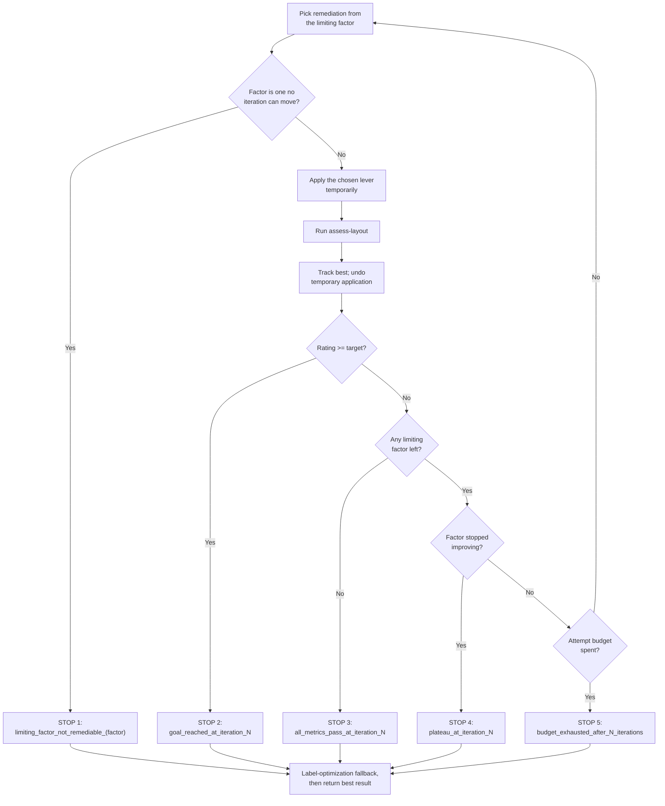

# Layout Engine

This document describes the layout and quality assessment systems, including ELK Layered integration, group-aware layout, and the multi-metric quality assessment framework.

## Table of Contents

- [ELK Layered Algorithm](#elk-layered-algorithm)
- [Flat View Layout](#flat-view-layout)
- [What counts as a container](#what-counts-as-a-container)
- [Group-Aware Layout](#group-aware-layout)
- [Hub Element Detection](#hub-element-detection)
- [Element Auto-Sizing](#element-auto-sizing)
- [Layout Quality Assessment](#layout-quality-assessment)
- [Auto-Layout-and-Route with Target Rating](#auto-layout-and-route-with-target-rating)
- [View Spacing Adjustment](#view-spacing-adjustment)
- [Configuration Constants](#configuration-constants)

## ELK Layered Algorithm

The `ElkLayoutEngine` uses the ELK (Eclipse Layout Kernel) Layered algorithm [10], a production-quality Sugiyama-style hierarchical layout [7] that computes **both positions and connection routes** in a single operation. ELK Layered uses Brandes–Köpf horizontal coordinate assignment [11] internally; the project consumes ELK output rather than calling the algorithm directly.

### Key Characteristics

- Orthogonal routing (right-angle segments)
- Configurable direction: DOWN, RIGHT, UP, LEFT
- Native hierarchical element support (children stay inside parents)
- Combined layout + routing in one pass

### Spacing Configuration

| Parameter | Value |
|-----------|-------|
| Node-to-node | `effectiveSpacing` (default 50px) |
| Edge-to-node | `effectiveSpacing / 2` |
| Between layers | `effectiveSpacing` |
| Component-to-component | `effectiveSpacing` |

### Connection-Label Width Reservation

To stop connection labels crowding on dense views, the engine hands ELK an `ElkLabel` sized to each connection label's estimated glyph width, so the Layered algorithm reserves corridor space for the label while it spaces the elements (`EDGE_LABELS_PLACEMENT = CENTER`, `SPACING_EDGE_LABEL = 4`). The displayed label text is resolved through `StylingHelper.resolveConnectionLabelText`, and its width is estimated with the same `len × 8 + 10` yardstick the layout-quality label-overlap detector uses (`LabelWidthEstimator` reuses the detector's constants), so the reserver and the detector agree. A suppressed (`showLabel: false`) or empty label resolves to width 0 and reserves nothing — label suppression stays an effective way to de-clutter a busy view, and label-free views lay out exactly as before. Suppression can be applied by hand per connection (`showLabel: false`), or delegated to the router for the labels that provably have nowhere to sit — see [Unplaceable labels](#unplaceable-labels). The reserver deliberately uses the **raw** estimate; the overlap *detector* applies an additional render-calibration factor (see [Label Overlaps](#label-overlaps)), so the detector is intentionally the more render-accurate of the two.

### Group Padding

Scales with spacing to accommodate Archi's group labels (~24px rendered at group top):

```text
topPad  = max(25, 24 + effectiveSpacing * 0.3)
sidePad = max(12, effectiveSpacing * 0.25)
```

### Hierarchical Construction (Two-Pass)

**First pass:** Create top-level ELK nodes. Pre-configure parent nodes that have children:
- Set `NODE_SIZE_CONSTRAINTS = MINIMUM_SIZE`
- Enable subgraph layout
- Assign group padding

**Second pass:** Create child nodes inside their parents. Orphaned children (parent not found) are promoted to top-level.

### Edge Containment

Edges are placed in the **lowest common ancestor** of their source and target nodes. The engine walks ancestor chains from both ends until they meet.

### Routing Output

Only **intermediate bendpoints** are extracted from ELK output. Start/end attachment points are omitted because Archi's ChopboxAnchor computes perimeter intersections automatically at render time.

**Source:** `model/ElkLayoutEngine.java`


## Unplaceable labels

The label optimizer evaluates all three candidate text positions (source, middle, target) for every
labelled connection and keeps the least-colliding one. On a dense view some labels collide at **all
three**, and on Archi 5.10 the perpendicular Label Offset cannot lift them clear either. Until the
label policy existed the optimizer computed that fact and discarded it: the all-equal tie-break
re-picks the current position, so an unplaceable label emitted no position change and was
indistinguishable downstream from a label that was already perfect.

`LabelPositionOptimizer` now retains that per-connection verdict and carries it out through
`RoutingResult.unresolvableLabels`. A connection is counted unresolvable only when **every** candidate
position carries a collision the engine cannot escape — an overlap with a non-excluded element, an
overlap with an already-locked label, or an own-endpoint bleed no offset direction clears. A mere
proximity near-miss does **not** count: `scorePosition` weights a near-miss at 0.5 and a real overlap
at 1.0, so a residual keyed on the score alone would hide a perfectly readable label that happened to
pass close to two boxes.

`auto-route-connections` and `auto-layout-and-route` expose this through `labelPolicy`. The default, `keep`, never changes label
visibility. `auto-hide-on-collision` hides exactly the unresolvable labels and reports each one under
`hiddenLabels` by connection ID with a reason — identity rather than a count, and never truncated, so
every hide can be audited and reversed. The decision is orientation-blind by construction: this path
consults no vertical/horizontal predicate, unlike the assessor's own narrower detector.

One asymmetry is deliberate. `auto-layout-and-route` honours the policy only where a routing pass
actually runs — grouped mode, and flat mode with a `targetRating`. Flat mode *without* a target
applies ELK's own edge routes and never invokes `LabelPositionOptimizer`, so it holds no evidence
about where a label can sit; requesting the policy there is **rejected** rather than accepted and
ignored, for the same reason the policy was never put on `auto-connect-view`: a tool that computes no
label geometry cannot honestly act on a label collision.

## Flat View Layout

The `layout-flat-view` tool positions all top-level elements and groups on a view using row, column, or grid arrangements. It eliminates manual x/y coordinate calculation for flat (non-grouped) views.

### Parameters

| Parameter | Default | Description |
|-----------|---------|-------------|
| `viewId` | required | View to layout |
| `arrangement` | required | `"row"`, `"column"`, or `"grid"` |
| `spacing` | 40 | Gap between elements (px) — same default as `layout-within-group` (40px) |
| `padding` | 20 | Space from view origin (px) |
| `sortBy` | *(none)* | Sort elements before positioning: `"name"`, `"type"`, or `"layer"` |
| `categoryField` | *(none)* | Group elements into visual sections: `"type"` or `"layer"` — inserts 2x spacing between sections |
| `columns` | *(auto)* | Column count for grid mode — auto-detected via `ceil(sqrt(n))` if omitted |

### Behavior

- Positions all top-level elements and groups (not elements inside groups)
- Respects heterogeneous element sizes (elements with embedded children treated as larger boxes)
- Does NOT route connections — run `auto-route-connections` after
- Full command stack integration (undo/redo, batch mode, approval mode)

### When to Use

| Tool | Use Case |
|------|----------|
| `layout-flat-view` | Flat views with no groups — automatic positioning with sorting/categorization |
| `layout-within-group` | Position children inside a specific container — a visual group or an ArchiMate-element container |
| `auto-layout-and-route` | Combined ELK layout + routing in one operation |

**Source:** `model/ArchiModelAccessorImpl.java`, `handlers/ViewPlacementHandler.java`

## What counts as a container

Archi renders two different objects as a labelled box that holds other objects:

| Container | Created by | Reaches the model layer as |
|---|---|---|
| Native view group | `add-group-to-view` | `IDiagramModelGroup` — a diagram-only device with no model semantics |
| ArchiMate `Grouping` element | `create-element` + `add-to-view` | `IDiagramModelArchimateObject` whose concept is an `IGrouping` — a real model concept that participates in relationships |

**They are not interchangeable, and the tools do not all answer "is this a container?" the same way.** Seven predicates decide it, and all six that differ from the canonical one differ *deliberately*, because they are asking different questions. This table is the vocabulary those tools share; it is the definition the parity statements elsewhere in this document and in the routing-preconditions checklist are measured against. Locate each row by its symbol — line numbers drift.

| Predicate (the symbol that owns it) | Admits | Used by | Why it differs |
|---|---|---|---|
| **`TopLevelGroupTargets.isTarget`** — the canonical model-layer predicate | native view group **or** an element whose concept is an `IGrouping` | `TopLevelGroupTargets` itself (`collect`, `collectPopulated`, `collectOutermost`, `collectOutermostPopulated`, `collectSkipped`, `describeSkipped`, `describeUnhandled`, `effectiveGeometryOf`, `topLevelGroupOf`, `containerOf`, `countInterGroupConnections`, `interContainerWeights`); `AssessmentCollector`'s `isContainer`; `ArrangeGroupsStandaloneLane.classify` | — this is the baseline the rest are stated against |
| **`ViewContainers.isContainerType`** | the type-name string `"Grouping"`. A native group has already been separated into `ViewContentsDto.groups()` before this layer sees it | the response layer: `format=tree`, `format=summary`, `format=graph` | A deliberate second copy. Handlers and formatters may not import EMF, so the DTO's type name is all there is to test up here. There is exactly one copy of the string, and `GroupingContainerTypeNameTest` pins it against what the ArchiMate factory actually produces |
| **DTO shaping and sort keys** | native view group **only**; a `Grouping` is bucketed among the **elements** | `ArchiModelAccessorImpl.collectViewContents`, `getFlatViewSortKey`, `getFlatViewCategoryValue` | Correct by design. A `Grouping` is a real model concept, so `get-view-contents` returns it where an agent can read its documentation, properties and relationships. The `topLevelGroups` / `totalGroups` stats count both kinds, so no count disagrees with the layout tools |
| **The upward ancestor re-fit** | native view group **only, at both ends** | `NestedLayoutOperations.propagateToAncestors`, `resizeAncestorGroups`, `terminationReason`; `ParentFitCascade`; `IconBandReservation`; the grouped arms of `auto-layout-and-route` and `layout-within-group` | A deliberate **narrowing**, and the only row that leaves work undone. Growing an ArchiMate element as a side effect of arranging a child is a semantic act rather than a geometric one, so the pass **discloses** rather than widens: every `layout-within-group` response carries `ancestorPropagation`, whose `container-not-a-native-group` and `stopped-at-non-native-ancestor` codes exist for exactly this. The gap it leaves surfaces as a `boundaryViolationCount` in `assess-layout` |
| **Downward layout eligibility and recursion** | native view group **or any** element view-object — a `Node`, an `ApplicationComponent`, a `Grouping` alike. Notes are excluded | `ArchiModelAccessorImpl.layoutWithinGroup`'s container resolution; `NestedLayoutOperations.isRecursableContainer` and `clampInsideParent` | A deliberate **widening**, wider than the canonical predicate and the exact opposite ruling to the row above it. Descending is not the same question as ascending: arranging the children of the container the caller *named* changes no semantics, so refusing what the caller pointed at would be a dead end |
| **`TopLevelGroupTargets.resolveRequested`** — the `groupIds` per-call opt-in | any **direct child of the view** that is a container: every native group and every element view-object, `Grouping` or not — **and** any container `collectOutermost` finds, which is a zone drawn inside a host the canonical predicate declines. A container that is a member of another arrangement target is still refused: it moves with the target holding it. Excludes a note, an image and a view reference, none of which is a container | `arrange-groups`, when the caller passes `groupIds` | A deliberate per-call **override** of the canonical predicate. The caller can see the canvas and the collection cannot, and it has already been told by `skippedContainers` which box was left standing and why. Read it as an opt-in, not as drift |
| **`TopLevelGroupTargets.collectElementViewObjects`** — the `resize-elements-to-fit` target walk, and **`TopLevelGroupTargets.isGroupingZone`**, which decides what happens to each thing it collects | the walk admits every **element** view-object, a `Grouping` included. A native view group is **never collected as a target** — the walk descends through it to reach the elements inside — and is still grown afterwards by the parent-fit cascade when a child the pass widened overflows it, reported in `resizedGroups` | `resize-elements-to-fit` | A deliberate **split**: collection is wide, treatment is not. `isGroupingZone` is the ArchiMate half of the canonical predicate above, so the two cannot drift apart. A `Grouping` is a zone — this tool grows one to contain its children and never shrinks one or sizes one to its own name — while every other element is sized to its label, which is the tool's job. Until it was fixed the two kinds got opposite treatments here; see the measurements below |

### `resize-elements-to-fit` and the two kinds

**The rule, and it is now pinned rather than observed:** this tool sizes **elements** to their labels. An ArchiMate `Grouping` is a zone, not a label-bearing element — the tool will **grow** one to contain its children, and will never shrink one or size one to its own name.

| Subject | Before the fix, measured 2026-08-29 at `c344d81d` | Now |
|---|---|---|
| `Grouping` **with** a child, narrower than the box | **160×300** — the width was re-fitted to `max(label, children) + padding` and **shrank**; the height was already grow-only | **400×300** — the width follows the children only, and is grow-only on both axes |
| `Grouping` with **no** children | **123×68** — not a parent, so it fell to the leaf pass and was sized to its own **label text** on both axes (**120×55** is the label-independent floor, for a name of fifteen characters or fewer) | **unchanged** — not sized at all. Name it in `elementIds` and the response says so in `skippedContainers`, with the reason; a zone the walk merely found is left silent, exactly as a native view group in the same position is |
| `Grouping` whose child **overflows** it | grew | **still grows** — that is what makes this tool the `boundaryViolationCount` remedy, and it is pinned separately |
| Native view group | never **collected as a target** | **unchanged**, and "never collected" is not "never touched": the cascade grows one when a child this pass widened overflows it — measured, 400×300 → 450×325 — and reports it in `resizedGroups` |

The two numbers **123×68** and **120×55** are both correct measurements of the old behaviour; they differ only in label length, because `ElementSizer.computeAutoSize` returns the element defaults for a name of fifteen characters or fewer and measures font metrics above that. A number is only meaningful with its frame attached.

Pinned by `ResizeElementsToFitGroupingZoneTest`, headless, one pin per subject.

### Which container is "top-level": settled

**Retracted.** This section recorded a live divergence: `TopLevelGroupTargets.topLevelGroupOf`
returned the outermost matching **ancestor** wherever it sat, while the `arrange-groups` route
seeded from `TopLevelGroupTargets.collect`, which admitted **direct children of the view only**.
The shape that separated them — a `Grouping` drawn inside a `Node` typing a cloud region — was
counted by the spacing tools and refused by `arrange-groups`, so one view handed a caller two
answers about its own containers.

**The outermost qualifying container wins, wherever it sits, and it wins in every route.**
`TopLevelGroupTargets.collectOutermost` is that definition asked downward and `topLevelGroupOf` is
the same walk asked upward; both admit through `isTarget`, and one private traversal serves both,
so there is no second walk left to drift. The gates and counters in
`apply-group-spacing-recommendations` and `apply-spacing-recommendations` read it, and
`arrange-groups` sees such zones instead of refusing the view.

**Seeing and positioning were settled separately, and only the first is family-wide.** A nested
zone's x/y are stored relative to its host, so it cannot join a canvas grid: `arrange-groups`
arranges each host's zones **in that host's own coordinate space** and reports them in
`nestedContainersArranged`, a field that sits **outside** the four-bucket identity because those
buckets count the view's direct children and a nested zone is not one. `optimize-group-order`,
`adjust-view-spacing` and `auto-layout-and-route mode:"grouped"` widened their **refusal wording**
only: each still gates and positions on the view's own containers, and a nested zone is neither
counted into the set they act on nor moved by them. What changed is that none of them may describe
such a view as having no groups — all three share one refusal naming how many containers the view
holds and pointing at `arrange-groups`. Widening their counting and positioning is separate work. Statements below about the arrangement family treating both container kinds alike
are about **kind**, not **depth** — a depth qualifier is attached wherever it applies.

## Group-Aware Layout

### layout-within-group

Arranges children within a single container view-object. The container may be a visual group (`IDiagramModelGroup`) **or** an ArchiMate-element container (`IDiagramModelArchimateObject` — `ApplicationComponent`, `Node`, `ApplicationFunction`, and any other element that holds nested children). The same parameters and behaviour apply to both; only the set of accepted containers is polymorphic. Notes, view-references, and connections cannot be containers and are rejected.

**Parameters:**

| Parameter | Default | Description |
|-----------|---------|-------------|
| `arrangement` | required | `"row"`, `"column"`, or `"grid"` |
| `spacing` | 40 | Gap between children (px) |
| `padding` | 10 | Space from group edges (px) |
| `columns` | *(auto)* | Column count for grid mode |
| `elementWidth` | *(original)* | Uniform child width |
| `elementHeight` | *(original)* | Uniform child height |
| `autoWidth` | false | Compute width from label text length |
| `autoResize` | false | Resize group to fit children |
| `recursive` | false | Propagate sizing **upward** through ancestors — native view groups only, at both ends |
| `recursiveChildren` | false | Descend **downward** into nested containers, arranging every level |

Note the two recursion flags travel in opposite directions and compose: `recursive` propagates *sizing* up to ancestors, `recursiveChildren` propagates *arrangement* down to descendants.

**Behavior:** By default positions direct children only, treating sub-containers as fixed boxes. The container resizes only if `autoResize=true`. With `recursive=true` and `autoResize=true`, **ancestor *native view groups*** resize to fit.

**The upward pass is scoped to native groups at both ends, and says so per call.** It starts only from a native view group — name an ArchiMate-element container (a `Node`, an `ApplicationComponent`, a `Grouping`) as the `groupViewObjectId` and the pass does not run at all — and it stops at the first non-native *ancestor* rather than skipping past it, leaving that ancestor potentially too small for the child just grown. This is the opposite ruling to the one `arrange-groups` takes on what counts as a container (both are tabulated in [What counts as a container](#what-counts-as-a-container)), and the asymmetry is deliberate: `arrange-groups` acts on containers the caller **names**, where refusing the thing the caller pointed at is a dead end, whereas this pass traverses ancestors the caller never named, and growing an ArchiMate element as a side effect of arranging its child is a semantic act rather than a geometric one. So it does not widen — it **discloses**.

`ancestorPropagation` carries that disclosure on **every** response, as a stable kebab-case code, a colon and a short phrase:

| code | meaning | what to do |
|---|---|---|
| `not-requested` | `recursive` was not set | nothing; change the call if you wanted it |
| `auto-resize-not-requested` | `recursive` set without `autoResize` | set `autoResize` too |
| `container-not-a-native-group` | you named an element container, so the pass never started | call again naming an enclosing view group |
| `no-ancestor` | the container is top-level in the view | nothing — terminal |
| `stopped-at-non-native-ancestor` | it met a `Grouping` or element parent and stopped | call again on **that** parent, which is now too small |
| `depth-cap-reached` | nesting deeper than the pass will walk | call again higher up |
| `all-ancestors-already-fitted` | it walked and found nothing to change | nothing — terminal |
| `propagated` | it re-fitted everything up to the view | nothing — terminal |

The field is deliberately **not** conditional on `ancestorsResized == 0`, because **the count does not partition the codes in either direction**:

- `propagated` — the only code that guarantees a count **above** zero.
- `not-requested`, `auto-resize-not-requested`, `container-not-a-native-group`, `no-ancestor`, `all-ancestors-already-fitted` — always **zero**.
- `stopped-at-non-native-ancestor`, `depth-cap-reached` — **either**. The pass re-fits two groups and then meets a `Grouping` it cannot grow, or exhausts its depth budget with more above; both report what they did and stop.

Those last two are exactly the cases a zero-only explanation could never have carried, and they are the only two that leave work undone — so a positive count there is the most misleading number the response can contain. Reading the count and inferring the rest is what the field exists to replace. `adjust-view-spacing` drives the same upward pass under the same restriction; it reports no reason code, so treat its `resizedAncestors` the same way and verify a non-native parent with `assess-layout`.

With `recursiveChildren=true`, descendants are arranged **post-order** — innermost containers first, so each outer pass sizes to already-correct inner boxes. This is the ordering the `autoWidth` caveat below prescribes by hand, applied automatically: a functions-in-components-in-domains or region → availability-zone → node → artifact stack is arranged in one call rather than one call per container, and the whole descent is a single atomic command with one undo step. The response reports the descent with `nestedContainersArranged`, `maxDepthReached` (0 = direct children only), and **`nestedContainersFitted`** — each descendant container's id plus the rectangle it landed at, the downward mirror of `resizedAncestors`, omitted when empty. A count of re-sized containers is an index into geometry a caller who cannot see the canvas does not have, so the same rule that produced `resizedAncestors` upward applies downward. Descendant layout lives in the `NestedLayoutOperations` collaborator, not in the accessor facade.

**The call also re-sizes leaf children, on both paths — and now says which.** Every child is written a *full rectangle*, not just an origin, and in a grid that rectangle is the child's **cell** — so a leaf sharing a column with a container that fitted wide is stretched to that column's width. This is conditional on neither `autoWidth` nor `recursiveChildren`: leaving `autoWidth` unset does not opt out of it. Measured on a live view, a 120 px element landed at 2230 px while the response said only that 69 elements had been "repositioned" — a count of moves that silently also covers re-sizes is a report of neither. **`resizedElements`** names each such child with the rectangle it ended at. It is an *observation*, so a child re-written to the size it already had does not appear, and it reports **size alone** — a child that only moved and kept its size is not in it. It is disjoint from `nestedContainersFitted` by construction: the two are the arms of one `if`/`else` on whether the walk recursed into the child, so a container left in place at the depth cap and then stretched by its column is named here rather than nowhere. Omitted from JSON when empty. In proposal mode the count rides as `elementsResized`, named like `ancestorsResized`, with the rectangles under `preview`.

**Per-column grid widths under the descent.** A grid normally gives every cell the width of the widest element in the whole grid. At one nesting level that is visible and correctable — the caller lays out one container and reads the result — but across the levels of a single `recursiveChildren` call it is neither: a single over-wide descendant widens its siblings, their container fits to the widened row, and that container then widens its own siblings one level up. A live run turned one 420 px sub-component into a 4300 px top-level band that way. Under the recursive descent each column is therefore sized from its **own** widest member. Columns still line up across rows (column *j* has one width in every row), so no grid alignment is lost — only the inflation. The default does not move: `computeGridLayout` gained an additive overload and the existing signature delegates with uniform widths, so its other callers, including `layout-flat-view` and `optimize-group-order`, are untouched. Note that `columns` **does** propagate to descendants, and the uniform-cell-width rule applies whether or not `autoWidth` is set.

**`auto-layout-and-route mode="grouped"` drives the same recursion.** It previously treated every direct child of a top-level group as a leaf: a child that had children of its own was sized from its *own label text* — name length × character width, with no reference to what it contained — and then never descended into, so its contents kept their old coordinates and escaped the box that had just been shrunk around them. An ArchiMate element acting as a container and a nested group failed identically. Each top-level group is now delegated to this same post-order recursion, which sizes a container from its contents and reserves each container kind's title band; `elementsRepositioned` counts every descendant moved rather than only direct children, each re-fitted nested container is reported with its landed rectangle, and inter-group arrangement measures the *fitted* rectangle rather than the pre-descent one (otherwise the fix would trade boundary violations for group overlaps). When the container is an ArchiMate-element node rather than a group, child coordinates remain relative to that element's top-left corner, consistent with the [coordinate model](coordinate-model.md). Caveat: running `autoWidth` on an *outer* container that itself nests sub-containers shrinks each sub-container to its own label width, clipping the grandchildren inside it — lay out inner-first (`autoWidth` on the innermost containers) and then the outer container with `autoWidth` off, so the outer pass sizes to the already-correct inner boxes.

### arrange-groups

Positions top-level **containers** relative to each other.

**Two kinds of container are arranged, and the arrangement family treats them alike** — `arrange-groups`, `optimize-group-order`, `adjust-view-spacing` and `auto-layout-and-route mode:"grouped"`, which share one predicate. That parity is about container **kind**; on **depth** the four part company — all of them *count* a container drawn inside a host, and only `arrange-groups` *positions* one. The three spacing convenience tools close the gap between those two verbs by declining: where the corridor they measured lies between containers their own step does not position, they return a zero delta under `structural_no_change_containers_not_positioned_by_this_tool` and name `arrange-groups`, rather than publishing a recommendation the applied path cannot honour.

| Container | Created by | Title band reserved |
|---|---|---|
| Native view group (`IDiagramModelGroup`) | `add-group-to-view` | 24 px |
| ArchiMate `Grouping` element | `create-element` + `add-to-view` | 46 px |

**The wider layout family does not.** Parity holds for the tools listed above and stops there: `layout-within-group`'s upward pass is scoped to native groups at both ends and discloses that per call via `ancestorPropagation`, its downward pass is *wider* than this predicate, and `resize-elements-to-fit` treats a `Grouping` as a zone rather than as a label-bearing element — it grows one, never shrinks one, and never collects a native view group as a target at all. See [What counts as a container](#what-counts-as-a-container) for the full table — that section, not this sentence, is the definition to measure a parity claim against.

Every collection site shares one predicate, `TopLevelGroupTargets.isTarget` — which owns the test, the collection, the `groupIds` resolution and the post-write geometry read-back. Before that extraction, seven layout tools each open-coded "collect this view's top-level groups" against the native type alone, and the failure differed by view shape: `arrange-groups` on a *mixed* view positioned the native groups, skipped every `Grouping` and still reported success, while `auto-layout-and-route` (grouped), `adjust-view-spacing` and `optimize-group-order` **rejected** such a view outright as having no groups. The second is the worse failure — a confident falsehood about a canvas full of populated containers, which a client that cannot see the canvas has no way to contradict.

**The two title bands are why widening the collection alone would not have been enough.** Three passes hard-coded the native group's 24 px label band as their child start offset; an element container reserves 46 px, so a `Grouping` admitted to the collection without that correction would have had its first row of children laid *under its own title*. Those lines never mentioned the native group type, so a type census could not have found them.

**Parameters:**

| Parameter | Default | Description |
|-----------|---------|-------------|
| `arrangement` | required | `"grid"`, `"row"`, or `"column"` |
| `spacing` | 40 | Gap between containers (px) |
| `columns` | *(auto)* | Column count for grid mode |
| `groupIds` | *(all)* | Specific containers to arrange; null = the view's own top-level targets **plus every container drawn inside a host**. Accepts **any direct child of the view that can hold children** — both container kinds above, and also a plain ArchiMate element acting as a container, which is *not* arranged by default — **and any container `collectOutermost` finds**, which is a zone drawn inside such a host. Naming a nested one restricts the arrangement inside that host to the ids you named. A container that is a member of another arrangement target is still refused. Note that a `Grouping` id arrives in `get-view-contents`' **elements**, not its `groups` bucket |

Containers not in `groupIds` remain at their current positions.

**Naming a container is a per-call opt-in that overrides the default predicate.** `isTarget` is deliberately narrow — a `Node` holding an account branch is a host, not a zone, and arranging every such element by default was measured across the corpus as 2103 containers on 254 views, sweeping capability decomposition trees in as if they were deployment zones. But that narrowness is a *default*, and a caller that names an id has already overridden it with information the tool does not have: it can see the canvas, and `skippedContainers` has just told it which object was left standing. `resolveRequested` is therefore the one place where the resolution and `isTarget` deliberately disagree, and only for the ids the caller listed. Omitting `groupIds` leaves every view arranged exactly as before, so reflow risk is nil by construction.

Two consequences follow, on the opt-in call only. Every descendant of the named container now resolves *to* it — `TopLevelGroupTargets.containerOf` admits the arranged set, so a connection into that subtree becomes an inter-container edge: `topology` may order the zones differently, and the density-aware `spacing` default may resolve to a different value. Both are correct — the host is now one of the things being ordered.

**Every refusal carries a remedy.** A `groupIds` entry that cannot be arranged is told *why*, because each case asks for a different next call:

| The id names | Response |
|---|---|
| nothing in the model | `VIEW_OBJECT_NOT_FOUND` — an unknown id, not an object missing from this view |
| a model concept rather than the view object drawn from it | `INVALID_PARAMETER` — pass the view-object id |
| this view itself | `INVALID_PARAMETER` — the view is named by `viewId`, not by `groupIds` |
| an object drawn on a different view | `INVALID_PARAMETER` — names the view it does belong to |
| a connection on this view | `INVALID_PARAMETER` — a connection follows the objects it joins; re-route it instead |
| an object that is a **member** of a container this tool arranges | `INVALID_PARAMETER` — *not top-level*; it moves with the container holding it. Name the **outermost** container it sits in, or run `layout-within-group` on that container. A container drawn inside a *host* is **not** in this row — it is admissible, and is arranged in the host's own space |
| a top-level note, image or view reference | `INVALID_PARAMETER` — *not a container*; place it with `apply-positions` or `update-view-object` |

Collapsing these into one *not found* denied the existence of an object the caller held a live id for, and its hint sent the caller to re-read a listing that would show the object — spending the next call to learn nothing. Collapsing them into *each other* is worse than vague, it is false: a model concept belongs to no view, so answering it "belongs to another view" would be a lie, and a view and a connection are both `IDiagramModelComponent` without being `IDiagramModelObject`, so a single view-object test answers all three wrongly. The nested row's remedy points `layout-within-group` at the **outermost container** rather than at the named object, because that row is reached by any object that is a member of an arranged container — a nested note or a childless nested element included — and telling one of those to "lay out its children" would be a false statement about an object that has none.

**Response.** `groupsPositioned` counts what moved on the canvas; **`positionedContainers`** gives each container's id and the rectangle it actually landed at, read back from the model *after* the arrangement is applied. Containers arranged inside a host are in **`nestedContainersArranged`** instead, read back the same way. The count alone is what allowed a run that silently skipped fifteen containers to read as a success, so the per-container rectangles are the honest report — an agent can compare them against what it asked for without re-querying.

**The response accounts for the entire view, and the accounting is a build-enforced invariant.** `topLevelObjects` is the number of direct children the call measured against, and the four buckets partition them exactly:

```
groupsPositioned + standaloneElementsPlaced + skippedContainers + unhandled = topLevelObjects
```

**`nestedContainersArranged` sits outside that identity**, and is counted by none of the four. It reports each container arranged *inside a host* — its landed rectangle plus the `hostViewObjectId` those coordinates are relative to. Such a container is not a direct child of the view, so it is not in `topLevelObjects` either, and adding it to `groupsPositioned` would make the equality above arithmetically false on exactly the views the field exists for. The host itself is still in `skippedContainers` — it was not moved — with a reason saying the containers inside it were. A host too small to hold the arrangement is declined whole rather than half-filled: the parent-fit cascade grows native view groups, and a host that is an ArchiMate element is not one.

Without a denominator the three counters could not contradict each other, so a shortfall was undetectable from the response by construction: `groupsPositioned: 8` was unfalsifiable on a view of nine containers. `skippedContainers` closed the case where the unarranged object *holds children*; `unhandled` closes the rest of the view. Each entry carries `viewObjectId`, `name`, `elementType` and a `reason` that leads with a stable code, so the list is triageable without parsing prose:

| Reason code | The object |
|---|---|
| `not-requested` | is a container the caller excluded by passing `groupIds` |
| `not-an-archimate-element` | is a note, image or view reference — never a layout target |
| `lane-not-run` | is lane-eligible by type, but the call was not `topology` resolving to a row or column |
| `no-inter-container-gap` | is lane-eligible and the lane ran, but the call arranged fewer than two containers **on the canvas**, so there is no gap to place it in — decided before the connection count, because no connection would change it. Reads zero on a view whose containers all sit inside a host: those are arranged in the host's own space and place nothing on the canvas |
| `insufficient-connections` | is lane-eligible and the lane ran, but it reaches fewer than 2 arranged containers. A connection reaches a container both when it terminates on an element **inside** it and when it terminates on the container's **own box**; two connections to the same container count once |
| `type-not-lane-eligible` | is an element of a type the standalone lane never places |

`unhandled` is computed as a **residual** — the view's own children minus the other three buckets — rather than as a fifth predicate, so it cannot drift away from the population it completes. That makes the arithmetic true by construction, which is why the invariant test asserts over *ids*: pairwise disjointness and union-equals-`getChildren()` are what actually catch an object claimed twice or a traversal that has wandered off the view. The measured worst case in the 430-view work corpus is 97 entries on one view, and the p50 is 2; the field is deliberately neither scoped nor capped, and the reasons are kept to one short line each because the guidance belongs in the tool description, transmitted once rather than once per entry.

Both `skippedContainers` and `unhandled` are decided from the view **as read**, so — unlike `positionedContainers` — they are populated and honest on a queued or proposed call, where no geometry exists yet.

The predicates overlap in two ways and the assembly resolves both in one place, by subtracting **every id this call positioned** — arranged and lane-placed alike — from the skipped list. A populated `Node` wired to two arranged containers satisfies *skipped* (a populated non-target) and the *standalone lane* at once; a container named in `groupIds` is arranged *because* it was named and so is a non-target this call moved. Leaving either in `skippedContainers` would both double-count it and state that something this call repositioned was "left where it is".

**The same overlap reaches the lane's own classification, and there it discards work rather than mis-describing it.** The lane excludes arrangement targets by asking `isTarget`, which is correct for a widening of the predicate but blind to a per-call opt-in: `isTarget` still answers false for a named host. Such a container was classified as a lane qualifier as well and received an `UpdateViewObjectCommand` from the arrangement *and* a second from the lane in the same compound — and because the lane's is added later, the lane position silently won and the arrangement the caller asked for was discarded. `classify` therefore also skips anything present in its `targetGroups` argument. Neither guard subsumes the other: the predicate check excludes a container the caller filtered *out* of this call, which is still not a loose element; the containment check excludes what this call is arranging.

### optimize-group-order

Reorders elements within containers to minimize inter-group edge crossings using the barycentric heuristic [7]. Operates on **all** top-level containers in the view simultaneously — native view groups and ArchiMate `Grouping` elements alike, via the same `TopLevelGroupTargets` predicate `arrange-groups` uses. It is narrower than `arrange-groups` on **depth**: it reorders the view's own containers, and a container drawn inside a host is neither counted into the set it reorders nor reordered itself. A view whose containers all sit inside a host is refused with a message that says exactly that and points at `arrange-groups`, rather than the former *View has no groups*.

**Algorithm:**

1. Build inter-group edges from assessment connections
2. For up to 10 iterations:
   - For each group: compute barycenter for each element (average position index of connected elements in other groups)
   - Sort elements by barycenter (unconnected elements sorted to end)
   - Evaluate crossing count, keep ordering if improved
   - If converged, stop
3. Re-layout each group with the new ordering
4. Resize groups to fit children

**Crossing count:** Straight-line segment intersection test between inter-group edge segments. O(n^2) pairwise comparison.

### Grouped View Assembly Workflow

```text
1. Create groups           → add-group-to-view
2. Add elements to groups  → add-to-view with parentViewObjectId
3. Internal layout         → layout-within-group (per group)
4. Group arrangement       → arrange-groups
5. Connect elements        → auto-connect-view (showLabel: false for cleaner routing)
6. Crossing optimization   → optimize-group-order → arrange-groups
7. Resize hub elements     → detect-hub-elements → update-view-object
8. Route connections       → auto-route-connections (autoNudge: true for automatic fixing)
9. Assess quality          → assess-layout → iterate if needed
```

### Flat View Assembly Workflow

```text
1. Add elements            → add-to-view (positions don't matter)
2. Automatic layout        → layout-flat-view (row/column/grid, optional sortBy/categoryField)
3. Connect elements        → auto-connect-view
4. Route connections       → auto-route-connections (autoNudge: true)
5. Assess quality          → assess-layout → iterate if needed
```

## Hub Element Detection

The `detect-hub-elements` tool identifies high-connectivity elements on a view — elements that act as hubs in hub-and-spoke topologies (e.g., API gateways, ESBs, shared databases). These hubs cause **port congestion** where many connections compete for attachment points on a small perimeter, producing bundled overlapping paths.

### Canonical Hub Thresholds

The codebase carries four distinct connection-count thresholds with different roles. They are **not interchangeable**:

| Threshold | Constant / Source | Role |
|-----------|-------------------|------|
| ≥ 5 connections | `LayoutQualityAssessor.HUB_DETECTION_THRESHOLD` (public canonical) | Hub *candidate* signal for the LLM ("this element is worth examining") |
| > 6 connections | `LayoutQualityAssessor.HUB_DETECTION_THRESHOLD + 1` (the `detect-hub-elements` 1D-suggestion-emit gate) — derived from the candidacy threshold; the formula's growth term `15 × (count − 6)` is non-positive at exactly 5, so suggestions only emit one above candidacy. Note: `EdgeAttachmentCalculator.HUB_FACE_REDISTRIBUTION_THRESHOLD = 6` shares this value but is a separate Phase-1.1 routing-internal redistribution gate, NOT the suggestion-emit threshold. | *1D sizing-suggestion* trigger — `detect-hub-elements` emits resize suggestions for the perimeter perpendicular to the connection flow |
| > 12 connections | `LayoutQualityAssessor.HUB_2D_RESIZE_THRESHOLD` | *2D sizing-suggestion* trigger — for very high-fan-out hubs, `detect-hub-elements` additionally surfaces a 2D-resize suggestion (`width += 15 × ⌈excess/2⌉`, `height += 15 × ⌊excess/2⌋`) so connections can spread across all four faces |
| ≥ 4 connections per face | `LayoutQualityAssessor.M5_FACE_GUARD_MIN_CONNECTIONS` | M5 *hub-port-quality* face-count guard — a separate per-face metric, not a hub-detection threshold |

For a deeper walkthrough of when each threshold applies and when to use `detect-hub-elements` versus `resize-elements-to-fit`, see the `archimate://prompts/routing-preconditions-checklist` MCP resource and the [Hub Sizing Suggestions](#hub-sizing-suggestions) section below.

### Connection Counting

The tool traverses all visual elements and connections on a view, counting connections per `viewObjectId`:

```text
For each archimate connection on the view:
  connectionCounts[sourceViewObjectId] += 1
  connectionCounts[targetViewObjectId] += 1
```

A connection between A and B increments both counts. An element that is source of 3 connections and target of 4 has `connectionCount = 7`. Counts are per visual instance (`viewObjectId`), not per model element — the same element appearing multiple times on a view has independent counts per instance.

Elements with zero connections are excluded from the result.

Three details of this rule matter, because each is a place a second counter would drift from this one:

- **A self-loop counts twice.** Both of its endpoint ids are the same object, and both are incremented.
- **Only ArchiMate connections count.** A plain diagram connection — the line Archi lets you draw to a Note — is not an `IDiagramModelArchimateConnection` and contributes nothing, so this number can be lower than the count of lines visibly touching the object.
- **It is a view count, not a model count.** A relationship that exists in the model but was never placed on this view is not here.

This is deliberately a *different* question from two neighbouring counts. `computeHubNeighbourCrowding` skips self-loops, because a loop has no neighbour to crowd. `M5_FACE_GUARD_MIN_CONNECTIONS` counts terminals on one face. Three counts, three jobs.

`detect-hub-elements` and the [fan-out sizing preconditions](#fan-out-sizing-preconditions) that `assess-layout` publishes both read the single walk in `HubDataCollector.collect`, so an agent reading the two in consecutive calls cannot be handed two different numbers for the same element.

### Hub Sizing Suggestions

Elements exceeding the large-hub threshold (>6 connections) receive sizing suggestions based on the hub element formula. The Kandinsky orthogonal-layout model [8] is the relevant background reference for treating high-degree vertices specially; the formula itself is empirical (project contribution, not paper-derived):

**1D suggestion (>6 connections):**

```text
suggestedDimension = baseDimension + 15px × (connectionCount - 6)
```

Suggestions are flow-direction-aware:

- **Horizontal layouts** (left-to-right groups): increase **height** for more vertical perimeter
- **Vertical layouts** (top-to-bottom groups): increase **width** for more horizontal perimeter
- **True hubs** (connections from all directions): increase **both**

**2D suggestion (>12 connections, additional):**

```text
excess  = connectionCount - 6
width  += 15 × ⌈excess / 2⌉
height += 15 × ⌊excess / 2⌋
```

The term split across the two axes is the same `excess` the 1D formula above
inflates by, not a second term measured from the 2D trigger. `> 12` decides
*whether* the 2D suggestion is offered; it is not subtracted to size it.

Surfaced alongside the 1D pair so the calling agent can pick 2D inflation when the connection fan-out warrants distributing ports across all four edges (~N/4 connections per edge). The 2D formula keeps the resize aspect-ratio-neutral by splitting the growth term between width and height.

### Response Structure

```json
{
  "result": {
    "viewId": "abc-123",
    "totalElements": 15,
    "totalConnections": 22,
    "averageConnectionCount": 3.1,
    "elements": [
      {
        "viewObjectId": "vo-1", "elementId": "el-1",
        "elementName": "API Gateway", "elementType": "ApplicationComponent",
        "connectionCount": 12, "width": 120, "height": 55
      }
    ],
    "suggestions": [
      "Element 'API Gateway' has 12 connections (large hub: > 6). Consider increasing height to 145px (55 + 15 × 6) for horizontal layouts, or width to 210px (120 + 15 × 6) for vertical layouts."
    ]
  },
  "nextSteps": ["Use update-view-object to resize hub elements..."]
}
```

### Workflow Position

Hub detection slots between group optimization and connection routing:

```text
... → optimize-group-order → arrange-groups
    → detect-hub-elements → update-view-object (resize hubs)
    → auto-route-connections → assess-layout
```

**Source:** `model/ArchiModelAccessorImpl.java`, `handlers/ViewPlacementHandler.java`

## Element Auto-Sizing

Elements placed at the default size (120x55) may truncate long names. Two mechanisms ensure labels are fully visible.

### Auto-Size at Placement (`autoSize` on `add-to-view`)

When `autoSize: true` is passed to `add-to-view`, the server computes element dimensions from the label text using SWT font metrics before the element is placed on the view.

**Algorithm:**

1. Measure label text width and height using `GC.textExtent()` on the SWT UI thread
2. Add horizontal padding (20px) and vertical padding (10px)
3. Apply aspect-ratio-aware sizing with target ratio 1.5:1 (acceptable range [1.2:1, 2.5:1])
4. If the computed width exceeds target ratio, increase height to bring the ratio within range
5. Short names (≤15 characters) keep the default 120x55 — auto-sizing only activates for longer names
6. Explicit `width`/`height` parameters take precedence over `autoSize`

This is the recommended approach for flat views — it eliminates the need for a post-placement resize pass.

### Resize Elements to Fit (`resize-elements-to-fit`)

The `resize-elements-to-fit` tool resizes all (or selected) **elements** on an existing view to fit their labels. It handles nested containment with a two-pass algorithm:

> ⚠️ **A container is not sized like an element.** An ArchiMate **`Grouping` is collected** as a target, but it is treated as a **zone**: with children it goes to the parent pass below and **grows** to contain them, grow-only on both axes; with **no** children it is **not sized at all**, and if the caller named it in `elementIds` the response discloses it in `skippedContainers` with the reason. A **native view group is never collected as a target** — the walk descends *through* it to reach the elements inside — but it is still **grown** by the parent-fit cascade when a child this pass widened overflows it, and that growth is reported in `resizedGroups`. See [What counts as a container](#what-counts-as-a-container) for the measurements.

**Algorithm:**

1. **Child pass:** Identify all elements with children. Process leaf elements first — compute dimensions from label text using SWT font metrics with the same aspect-ratio-aware algorithm as `autoSize`
2. **Parent pass:** For each parent element, compute the bounding box of all children, add padding (horizontal: 20px) plus a **dynamic containment label height** computed per parent from font metrics and word-wrap simulation, and set the parent's dimensions to contain both its own label and all children
3. **Child shift:** When the parent's wrapped label height exceeds the previously assumed top margin, children are shifted down so they clear the multi-line label rather than being obscured by its lower lines
4. **Parent height never shrinks** — only grows to accommodate the wrapped label and its children
5. Apply all size changes as a single compound command (atomic undo)

The dynamic label height replaces the previous fixed `CONTAINMENT_LABEL_TOP = 25` constant. Long parent labels that wrap across two or three lines now correctly reserve vertical space for every line, eliminating the failure mode where a multi-line parent label visually obscured its first child.

**Parameters:**

| Parameter | Default | Description |
|-----------|---------|-------------|
| `viewId` | required | View to resize elements on |
| `elementIds` | *(all)* | Specific elements to resize; null = all elements on the view |

### When to Use Which

| Scenario | Approach |
|----------|----------|
| Placing elements on flat view | `add-to-view` with `autoSize: true` |
| Bulk-creating elements | `bulk-mutate` with `autoSize: true` per `add-to-view` operation |
| Elements inside groups | `layout-within-group` with `autoWidth: true` (existing feature) |
| Existing view with truncated labels | `resize-elements-to-fit` on the view — it sizes elements to their labels and leaves `Grouping` zones to grow around their contents, so it is safe to aim at a whole view |

**Source:** `model/ArchiModelAccessorImpl.java`, `handlers/ViewPlacementHandler.java`

## Layout Quality Assessment

The `LayoutQualityAssessor` computes multi-dimensional layout quality metrics. All coordinates are in absolute canvas space. This is a pure-geometry class with no EMF dependencies.

### Metric Categories

The assessor evaluates 8 metric categories, each producing an individual rating.

#### Element Overlaps

| Type | Definition | Impact |
|------|------------|--------|
| Sibling overlaps | Same-parent elements with AABB intersection | Primary metric — penalized |
| Containment overlaps | Parent-child / ancestor-descendant | Excluded (intentional nesting) |
| Note overlaps | Note-to-element overlaps | Informational only |

**Rating:** binary — 0 = "pass", > 0 = "poor". Any sibling overlap reads as a broken layout, so there is no intermediate band (see [Rating Re-Anchors](#rating-re-anchors)).

#### Edge Crossings

```text
crossing_ratio = edgeCrossingCount / connectionCount
```

| Condition | Rating |
|-----------|--------|
| crossings < 5 | "pass" |
| 5-20 crossings | "good" |
| crossings >= 20, ratio <= 1.5 | "good" |
| ratio <= 4.0 | "fair" |
| crossings < 30 | "fair" |
| crossings >= 30 | "poor" |

**Grouped view leniency:** If a view has groups and overlaps == 0, passThroughs <= 3, labelOverlaps == 0, alignment > 30, and spacing > 15.0, crossing ratings get a one-tier boost ("poor" to "fair", "fair" to "good"). This acknowledges that cross-group edge crossings are topologically unavoidable.

#### Element Spacing

Average minimum gap between sibling elements:

```text
avgSpacing = mean(minGap(A, B)) for all sibling pairs
```

**Rating:** > 30px = "pass", > 15px = "good", <= 15px = "fair"

#### Alignment Score

Measures edge alignment of leaf (non-group) elements along left edges, centers, top edges, and vertical centers (5px tolerance):

```text
alignment = (aligned_pair_count / max_possible_pairs) * 100
```

**Rating:** > 60 = "pass", > 30 = "good", <= 30 = "fair"

#### Label Overlaps

Estimates label bounding boxes from text length and path position. Uses 10px inset on both label and element rectangles to absorb estimation error. Also detects near-miss proximity within 5px.

The estimated glyph box is **render-calibrated**: the glyph run (not the padding chrome) is widened by `LABEL_RENDER_WIDTH_FACTOR = 1.35` — the same render-versus-measure ratio the label-truncation check uses — because Archi renders glyphs ~1.35× wider than the raw `len × 8 + 10` estimate, so short, tight segments were previously under-flagged. This is detection-only; the ELK-side [width reserver](#connection-label-width-reservation) keeps the raw estimate.

The detector also flags a connection label rendered on its **own** source or target box. The base overlap test excludes a connection's own endpoints (a Middle label always grazes the box it attaches to, which would otherwise false-positive); a separate asymmetric rule flags the own-endpoint case only when more than `LABEL_OWN_ENDPOINT_OVERLAP_FRACTION = 0.30` of the label's render-calibrated area falls on that endpoint, naming the more-overlapped end. Three companion rules cover what the area fraction alone misses:

- **Box-coverage** — a label that blankets a *tiny* endpoint box (e.g. a 14×14 junction sitting almost entirely under the label) registers a low label-area fraction but a high *box*-area fraction, so it is also flagged when the overlap covers at least `LABEL_OWN_ENDPOINT_BOX_COVERAGE_FRACTION = 0.6` of the endpoint box. This is structurally self-limiting — coverage ≥ 0.6 requires the box to be no larger than `labelArea / 0.6`, so an ordinary element box can never trip it.
- **Short-segment promotion** — when the label is wider than the first/last segment it anchors to (a long source/target label on a short terminal segment), the area-fraction bar is lowered to `LABEL_OWN_ENDPOINT_SHORT_SEGMENT_OVERLAP_FRACTION = 0.15`, catching the terminal-label bleed the 0.30 bar under-counted.
- **Junction near-zero bar** — when the endpoint is an ArchiMate Junction (a solid dark shape scaled to its bounds with no usable interior), the box-grazing tolerance a normal box earns is wrong: *any* non-trivial label area on it is unreadable. For that endpoint the own-endpoint bar drops to `LABEL_OWN_ENDPOINT_JUNCTION_OVERLAP_FRACTION = 0.05`, catching an *oversized* junction (e.g. the 120×55 default) grazed by a label — the case the box-coverage rule (which only fires on a *tiny* junction fully under the label) and the 0.30 area bar both miss. The small non-zero floor tolerates a 1 px graze by a label that has genuinely cleared the junction. `AssessmentNode` carries the per-endpoint `isJunction` flag the threshold reads.

The own-endpoint test is **offset-aware**: an `AssessmentConnection` carries the applied Label Offset (`relativePosition`), so a Middle label already lifted clear by an Archi 5.10 [Label Offset](routing-pipeline.md#connection-label-offset-archi-510) is not re-reported as bleeding (the offset is otherwise the defect this detection drives the router to apply). A label whose connection has `showLabel: false` is not visible, resolves to an empty box, and is dropped from every label path — so suppression is never penalised with a phantom overlap.

**Rating:** 0 = "pass", <= 2 = "good", > 2 = "fair"

#### Pass-Throughs

Detects connections that cross through element rectangles. Clips connection paths from element centers to perimeter (using Archi's OrthogonalAnchor model) and tests segment-vs-rectangle intersection using the Liang–Barsky line-clipping algorithm [13]. Excludes groups (transparent containers), and those ancestors and descendants of the connection's own endpoints whose rectangles still overlap that endpoint — one that has drifted fully clear of it is a real element in the way and is counted. Uses 10px inset to absorb corner-arc imprecision.

Also detects **self-element pass-throughs** — cases where non-terminal segments of a connection's route pass through the connection's own source or target element body (using 5px inset). This catches routes that enter endpoint elements through interior points rather than approaching cleanly from an edge.

**Rating:** counted from cross-element pass-throughs only — 0 = "pass", 1-3 = "fair", 4+ = "poor". Self-element pass-throughs are reported in the assessment output (informational) but **excluded from rating**. Self-element geometry frequently cannot be resolved by re-routing alone, and penalising it masks the structural quality of cross-element routing.

**Two published quantities, and they are not interchangeable.** `crossElementPassThroughCount` is the number the rating above is computed on. `connectionPassThroughs` is a capped description list naming both kinds, so its size overstates the charged count when self-element pass-throughs are present and understates it once the cap truncates the list — it is what was described, never what was charged. The complete, uncapped register of the charged crossings is the `passThroughs` violator-id key (`includeViolatorIds: true`).

#### Coincident Segments

Counts connection segments from different connections that share identical coordinates (within tolerance) and have overlapping parallel ranges.

**Rating:** 0 = "pass", 1-3 = "good", 4-8 = "fair", 9+ = "poor"

#### Non-Orthogonal Terminals

Counts connections whose terminal segments (first two or last two points) form diagonal rather than perpendicular approaches to elements. Checked per-connection (not per-segment).

**Rating:** density-aware, on the diagonal-terminals-per-connection ratio — not on a raw count:

| Condition | Rating |
|-----------|--------|
| count == 0 | "pass" |
| ratio <= 0.10 (`NON_ORTH_RATIO_GOOD`) | "good" |
| ratio <= 0.30 (`NON_ORTH_RATIO_FAIR`) | "fair" |
| ratio > 0.30 | "poor" |

The ratio is undefined when `connectionCount` is zero, so a non-zero count with no connections — a degenerate state the collector should never produce, guarded against rather than expected — falls back to "fair" instead of dividing. `nonOrthogonalInteriorSegments` reuses the same two ratio thresholds.

### Assessor Redesign

The assessor redesign introduces five perception-aligned metrics (M1 corrected, M2–M5 new), a corridor-utilisation metric (R8), an informational narrow-corridor signal (`parallelConnectionGap_V_p10`), and a two-dimensional overall rating (M6) that decouples layout quality from routing quality. The redesign was driven by ArchiMate manual-routed reference calibration and visual-severity owner sign-off that pre-redesign metrics misaligned with user perception.

| Metric | Field | Definition |
|--------|-------|------------|
| **M1** (corrected) | `nonOrthogonalTerminalCount` | Visible-segment-length guard. Pre-redesign, the metric over-reported clipped diagonals — bendpoints inside the source/target element bounds were counted as if visible. The corrected M1 ignores Archi-clipped diagonals (post-clip visible segment only) and was calibrated against the V4 manual oracle (manual = 21). |
| **M2** | `interiorTerminationCount` | Connections whose terminal bendpoint lands inside the source or target element bounds. Routing Tier 1R. Previously unmeasured. |
| **M3** | `zigzagCount` | Reversal patterns where two consecutive segments meet at a shared axis (zigzag triple). Routing Tier 1R. Previously unmeasured. M3 **skips connections already classified as pass-throughs** by `detectPassThroughs` (classification-precedence guard at `LayoutQualityAssessor.countZigzags()`): for the failed-detour-around-element pattern the visually-correct label is passthrough-only — the small reversal is a consequence of the failed detour, not an independent defect. Pinned by `RoutingClassificationPrecedenceTest`. |
| **M4** | `connectionEdgeCoincidenceCount` | Connection segments running parallel to and within `EDGE_COINCIDENCE_TOLERANCE_PX` (3px) of a foreign element's edge line. Routing Tier 2R (cap `fair`) with thresholds `EDGE_COINCIDENCE_GOOD_MAX = 2` and `EDGE_COINCIDENCE_FAIR_MAX = 5`; an egregious count (at or above `EDGE_COINCIDENCE_EGREGIOUS_MAX = 7`) escalates it into Tier 1R so a hug-storm can drive `poor` instead of being masked at `fair`. Pre-redesign only conn-vs-conn coincidence was measured under an earlier self-exclusion guard. Removing that guard makes M4 always flag parallel-coincident segments. **v1.3 oracle baseline corrected to M4 = 12** (previously documented as 2 — the discrepancy was a measurement artefact, not a routing change). **Topology-bound floor caveat:** on hub-and-spoke layouts at hub-port-quality-fixed hub sizes, M4 has a structural floor that does not respond to spacing inflation. M4 above the floor reflects routable congestion; M4 at the floor reflects topology. **Per-element enumeration:** the detector now enumerates every distinct `(connection, element)` graze rather than stopping at the first per connection, surfacing the informational `edgeCoincidenceGrazedElementCount` (sum of distinct grazed elements across all connections) and an `edgeCoincidenceGrazedElements` element-id violator key. The rating-bearing `connectionEdgeCoincidenceCount` and its connection-id `edgeCoincidence` key are byte-identical — both are gated behind a once-per-connection `legacyFlagged` flag — so the rating and legacy report are unchanged; the new count feeds no rating. |
| **M5** | `hubPortQualityScore`, `hubPortQualityFaces` | View-aggregate mean of per-hub-face distinct-slot ratios for any element face with ≥ 4 connections. Catastrophic example pre-redesign: 1 face slot for 7 connections (HPQ 0.18). v1.3 oracle HPQ measured 0.18 (catastrophic, invisible to old assessor); current pipeline preserves 0.77 — roughly five times better. Thresholds: `pass` ≥ 0.95, `good` ≥ 0.75, `fair` ≥ 0.5, `poor` < 0.5. |
| **R8** | `corridorUtilisation`, `corridorUtilisationChannels` | Wide-corridor utilisation — measures how well wide corridors carry connections in proportion to their width. Pinned ≥ 0.25 on the V4 oracle by `V4OracleCorridorUtilisationRegressionTest`. |
| **`parallelConnectionGap_V_p10`** | `vAxisParallelGapP10`, `vAxisParallelGapNarrow25Count`, `hAxisParallelGapNarrow25Count`, `parallelConnectionGapDetail` | Informational narrow-corridor signal. The primary value is the 10th-percentile pairwise parallel gap on the V axis (in pixels); the ArchiMate manual-routed reference anchors at 13.30 ± 0.5. The secondary `vAxisParallelGapNarrow25Count` counts V-axis segments below 25 px gap (more = worse), and `hAxisParallelGapNarrow25Count` is the same count on the H axis — measured on the same pass and, until it gained a top-level field, readable only inside `parallelConnectionGapDetail`. Calibration validated against an ordered reference set of four views (gold > hub-heavy-source > standard-source > narrow-corridor regime — monotonic by owner perception). **Currently no rating impact** — surfaces the structural narrow-corridor floor so an LLM agent can recognise when convenience spacing tools cannot mitigate further. Full per-axis detail (mean / min / p10 / narrowGapCount@{15,25,40} for V and H axes) returned in `parallelConnectionGapDetail` when `includeViolatorIds: true`. Pinned by `ParallelConnectionGapMetricTest`. |
| **Hub-to-neighbour crowding** | `hubNeighbourClearanceMin` | The smallest clearance (px) between a hub element's edge and the row of spoke neighbours packed against it, measured only on a face carrying at least `CROWDING_MIN_ADJACENT_K = 3` overlapping spoke neighbours; `NO_HUB_NEIGHBOUR_CLEARANCE = -1.0` when no face qualifies. Pure geometry. **Rating-affecting (layout tier):** a clearance ≥ 0 and below `CROWDING_FLOOR_PX = 60.0` caps the layout tier so a hub enlarged until it crowds its neighbours can no longer rate `good` (see [Rating Re-Anchors](#rating-re-anchors)). At or above the floor, and at the `-1.0` sentinel, the rating is untouched. Closes the gap where enlarging a hub to fix M5 port distribution traded edge-coincidence for neighbour crowding that no prior metric could see. |
| **Connection-through-note/image** | `connectionThroughNoteCount`, `connectionThroughNoteDescriptions` | Connections whose route runs through a Note's box or an element's rendered image rectangle, detected by reusing the same perimeter clip + 10 px inward inset the element pass-through check uses — `GeometryUtils.clipPathToRectEdges` + `GeometryUtils.pathPassesThroughRect`. **The routing tool discloses these too:** `auto-route-connections` returns `CONNECTION_ROUTED_THROUGH_NOTE` naming each (connection, note) pair on the call that applied the route, so the ids do not have to be scraped out of `connectionThroughNoteDescriptions`. Both callers go through that one shared geometry deliberately, so the metric and the disclosure cannot drift apart; note that it is **not** the router's own obstacle geometry, which expands rectangles outward by the margin instead of shrinking them inward by the inset. The disclosure covers **notes only**, while the count below covers notes *and* element-embedded images. **Rating-affecting (routing tier, Tier-3R cap-good), binary presence:** any nonzero count caps the routing tier at `good` — a line through a note/image is always jarring, so one crossing and several rate the same (`FLOOR = 1`, count == 0 → pass, ≥ 1 → good). Notes are excluded from the element pass-through scoring set, so it catches note clutter the box-based `connectionPassThroughs` (Tier-1R) misses. For image-bearing elements this tests the rendered image *rectangle*, which is clipped to the element box — an image never renders outside its element — so a route through an element's image also crosses that element's box. Where a route trips both, the routing tier takes the max, so the Tier-1R pass-through dominates (no double penalty). A visual on a connection's own endpoint/container is not flagged. Counted per connection × visual. |
| **Non-orthogonal interior segment** | `nonOrthogonalInteriorSegmentCount`, `nonOrthogonalInteriorSegmentDescriptions` | Generalises M1 from the source/target segments to the route interior: any segment off-cardinal by more than the M1 `isNonOrthogonal` 5° angular threshold that sits at index `i = 1 … n-3` (strictly between the two terminal segments — no clip guard is needed because mid-segments are fully visible). **Rating-affecting (routing tier, Tier-2R cap-fair):** ratio-bucketed identically to M1 (reusing `NON_ORTH_RATIO_GOOD` / `NON_ORTH_RATIO_FAIR`), so a low interior-diagonal-per-connection ratio rates `good` and a high one `fair`. A separate breakdown entry from `nonOrthogonalTerminalCount`, but the routing tier combines the two by `max` (disjoint by construction — the loop excludes segments 0 and n-2), so a connection diagonal at both a terminal and an interior segment is capped once. Counted per connection. |
| **Off-face parallel terminal** | `offFaceParallelTerminalCount`, `offFaceParallelTerminalDescriptions` | A connection whose terminal route *departs* an element face then runs **parallel to and hugging** that same face — the first exterior segment travels along the departed face within `OFF_FACE_MIN_STUB_PX = 8` of it. Closes a blind spot in M1: when a route exits a fraction of a pixel off the perimeter and turns to run just beside the face, the exit stub is a sub-perceptible diagonal that the M1 visible-length guard suppresses, so the terminal detector sees nothing — yet the parallel hugging trunk is plainly visible. The departed face is resolved through the same terminal-slot helper M1 uses (which attributes a face even for a bendpoint a pixel off the perimeter), not the raw segment angle. **Rating-bearing**: a Tier-2R entry capped at `fair` on **binary presence** — any nonzero count caps the routing tier, because ratio-bucketing would let a low hug-per-connection ratio still read `good` and defeat the point of detecting it. `nonOrthogonalTerminalCount` and its calibration are untouched, and the two are separate breakdown entries. It is deliberately **not** carved out of `overallExcludingAcceptedCosmetics`: a layout-bound hug is a real, actionable defect, not an ELK cosmetic, and the layout-bound flag is not available at rating-assembly time in any case. Counted per connection, with its own `checked` coverage dimension. It is the oracle the router's terminal egress-clearance work drives to zero (see [routing-pipeline.md](routing-pipeline.md)); when the router reports `EGRESS_LIFT_LAYOUT_BOUND`, the remedy is spreading the elements rather than another re-route. |
| **Anchor drift** | `anchorDriftCount`, `anchorDriftDescriptions` | Connections whose two stored bendpoint reconstructions — one relative to the source centre, one relative to the target centre — disagree by more than `ANCHOR_DRIFT_NOISE_FLOOR_PX` (1.0) on either axis, meaning an endpoint moved or was resized after the route was written. Measured in `AssessmentCollector`, which is the only place it exists: the collector blends the two reconstructions into the single polyline every other detector is handed, so the disagreement is structurally invisible downstream rather than merely under-tuned. Descriptions carry the measured drift in px per axis. Informational — no rating impact. |
| **Lateral-jog reversal** | `lateralJogReversalCount`, `lateralJogReversalDescriptions` | Connections containing a four-point window whose two outer arms run in opposite directions along one axis, separated by a perpendicular sidestep no wider than `LATERAL_JOG_MAX_PX` (8.0). Descriptions carry the four coordinates **exactly** — unrounded, because a reconstructed coordinate is half-integral on an odd box dimension and that half pixel is the same representable-precision effect the anchor-drift floor is derived from. Classification precedence: pass-through, then zigzag, then this — a connection is never counted under two reversal dimensions. Informational — no rating impact. |

#### Rating Re-Anchors

Two cut-points were re-anchored to align with the visual-severity hierarchy:

- **`overlapCount` → binary `>0 → poor`** (Tier 1L). Any sibling overlap caps the layout tier at `poor`. Previously rated `fair / poor` with a count-based cut-point that under-rated views with isolated overlaps. Aligns with the user's perceptual gate that any visible overlap reads as a broken layout.
- **`parentLabelObscuredCount` → Tier 1L binary `>0 → poor`** (promoted from informational). When a parent element's label is obscured by a child, the diagram fails its primary purpose — reading the element's name. The band tested is the one that RENDERS: clipped to the parent's own height, so a child at or below the parent's bottom edge is reported by `boundaryViolationCount` instead — the metric that describes it correctly — and not counted twice. Both are Tier 1L, so which one fires does not change the rating. **One gap, stated because a clean pair of counts would otherwise imply more than it proves:** `boundaryViolations` uses a strict `>`, so a *zero-height* child sitting exactly on the parent's bottom edge escapes both metrics. Such a child draws nothing, which is why it is accepted rather than chased — but neither count certifies its absence. Promoted into the layout-tier rating via M6.
- **Hub-to-neighbour crowding → layout-tier cap** (Tier 2L). A measured `hubNeighbourClearanceMin` below `CROWDING_FLOOR_PX = 60.0` caps the layout tier at `fair`, so a hub enlarged until its spoke neighbours are crowded against it cannot rate `good`. The floor sits above the ~45 px crowded evidence and below typical organic inter-row spacing, so a crowded resize is caught while a sparse hub keeping a readable corridor is not. The `-1.0` "no measurable hub" sentinel and any clearance at/above the floor leave the rating untouched — no previously-clean view changes tier.

#### M6 — Two-Dimensional Overall Rating

M6 replaces the earlier single-tier overall rating with two independently computed tier indices: a **layout tier** (driven by element-level metrics) and a **routing tier** (driven by connection-level metrics including M2/M3/M4 routing-tier promotions and M5 hub-port quality). The overall rating is the worse of the two:

```text
overallRating = levelToRating(max(layoutLevel, routingLevel))
```

This decouples layout quality from routing quality so a poor-routing fix does not drag a strong-layout view's tier and vice versa. `parentLabelObscuredCount` and `labelTruncationCount` (informational detections) are promoted into the layout tier under M6.

Each dimension folds its own metrics with a per-band cap:

```text
Rating levels: pass/excellent = 0, good = 1, fair = 2, poor = 3

layoutLevel  = max(worstTier1L, min(worstTier2L, 2), min(worstTier3L, 1))
routingLevel = max(worstTier1R, min(worstTier2R, 2), min(worstTier3R, 1))

Map: 0 -> "excellent", 1 -> "good", 2 -> "fair", 3+ -> "poor"
```

Band membership is fixed except for one metric: `connectionEdgeCoincidence` is folded into
`worstTier1R` as well once its count reaches the egregious threshold, so reading `routingLevel`
off the formula alone under-rates a hug-storm. The Tier 1R row below states the condition.

| Band | Metrics | Cap |
|------|---------|-----|
| **Tier 1L** | `overlaps`, `boundaryViolations`, `parentLabelObscured` | No cap — drives the layout tier directly, including to `poor` |
| **Tier 2L** | `spacing`, `offCanvas`, `hubNeighbourCrowding` | Caps at `fair` |
| **Tier 3L** | `alignment` | Caps at `good` |
| **Tier 1R** | `passThroughs`, `interiorTerminations`, `zigzags`, `coincidentSegments` | No cap — drives the routing tier directly, including to `poor`. `connectionEdgeCoincidence` escalates into this band once `connectionEdgeCoincidenceCount` reaches `EDGE_COINCIDENCE_EGREGIOUS_MAX` (7); below that count it stays Tier 2R |
| **Tier 2R** | `nonOrthogonalTerminals`, `nonOrthogonalInteriorSegments`, `offFaceParallelTerminals`, `connectionEdgeCoincidence`, `hubPortQuality`, `labelOverlaps`, `labelTruncations` | Caps at `fair` |
| **Tier 3R** | `edgeCrossings`, `connectionThroughNote` | Caps at `good` |

**A cap is a ceiling, not a pin.** `min(worstTier2, 2)` means a Tier-2 metric contributes *at most* `fair`; it does not hold the dimension there. A lone Tier-2 metric bucketed to `good` contributes level 1 and the view still rates `good` — it is a Tier-2 metric bucketed to `fair` or `poor` that holds the dimension at `fair`. The caps exist so cosmetic issues cannot mask structural ones: a view with perfect structure but poor alignment still reaches `good`, while a sibling overlap or excessive pass-throughs drive the rating to `poor` regardless of cosmetic scores.

Band membership is pinned against the assessor by `RatingTierSurfaceParityTest`, which derives each metric's band by driving the live tier folds rather than reading a second committed list.

#### De-Noised Headline (`overallExcludingAcceptedCosmetics`)

`ratingBreakdown` carries an additional key, `overallExcludingAcceptedCosmetics` — the same overall rating recomputed on a **copy** of the rating inputs with the `nonOrthogonalTerminals` contribution forced to `pass`. Diagonal terminal segments are the straight-line signature of ELK auto-layout and routinely push an otherwise-clean view to `fair`, so this reading separates an *accepted ELK cosmetic* from a *real defect*:

- When `overallRating` is `fair` but `overallExcludingAcceptedCosmetics` is `good`/`excellent`, the `fair` is terminal cosmetics only — clear it with `auto-route-connections` mode `terminals-only`, or accept it.
- When the two readings are **equal**, the rating reflects a real routing/layout defect to fix.

It is a **floor, never a lift**: recomputing with one Tier-2R contributor removed can only equal or improve the rating, never worsen it, so no previously-clean view changes tier. The existing `overall` value is byte-identical (the de-noised value is computed on a copy via `computeRoutingTierLevel`, leaving the headline untouched).

#### Whole-Model Scope (`scope: all-views`)

`assess-layout` accepts a `scope` parameter (`single`, the default, or `all-views`). Under `all-views` the handler iterates every diagram (`getViews(null)` → `assessLayout(id, false)`) and returns a compact map keyed by view id, each value `{name, overallRating, overallExcludingAcceptedCosmetics, elementCount, connectionCount, overlapCount, cousinOverlapCount, ownIconOverLabelCount, boundaryViolationCount, parentLabelObscuredCount, nonOrthogonalTerminalCount, crossElementPassThroughCount, contextualPartialDimensions}`. It omits violator ids, descriptions, and the per-metric breakdown — one cheap overview call for a final close-out sweep, after which an agent drills into any `fair`/`poor` view with a single-scope call. `viewId` is ignored under `all-views`; an empty model returns an empty map. The per-view `overallExcludingAcceptedCosmetics` falls back to `overallRating` on a degenerate view whose `ratingBreakdown` is empty, so the compact entry's key set is always complete.

### JUnit-Protected Release-Gate Metrics

Every quality threshold introduced by the assessor redesign ships with a JUnit regression test pinning the metric on the ArchiMate manual-routed reference oracle. This codifies the project convention that every routing or layout improvement ships with a test pinning the new threshold — wins were lost repeatedly in prior cycles because nothing protected them.

| Bound | Threshold | Test |
|------|-----------|------|
| `hubPortQualityScore` (M5) | ≥ 0.70 | `V4OracleQualityRegressionTest` |
| `coincidentSegmentCount` (legacy parallel-coincident metric) | ≤ 3 | `V4OracleQualityRegressionTest` |
| `nonOrthogonalTerminalCount` (M1) | ≤ 5 | `V4OracleQualityRegressionTest` |
| `corridorUtilisationScore` (R8) | ≥ 0.25 | `V4OracleCorridorUtilisationRegressionTest` |
| `vAxisParallelGapP10` (`parallelConnectionGap_V_p10`) | ≥ 13.30 ± 0.5 | `ParallelConnectionGapMetricTest` |
| `hAxisParallelGapNarrow25Count` | 2 for two overlapping H segments 20 px apart; 0 when they are 200 px apart | `ParallelConnectionGapMetricTest` |
| Zigzag↔passthrough classification precedence | Failed-detour fixture: zigzag count after guard = 0 | `RoutingClassificationPrecedenceTest` |
| Post-autoNudge parent-group bounds | All children remain within parent group bounds after `auto-route-connections(autoNudge=true)` | `AutoNudgeGroupBoundsFollowupTest` (15 tests) |
| Post-spacing-tool parent-group bounds | All children remain within parent group bounds after `apply-spacing-recommendations` / `apply-element-spacing-recommendations` / `apply-group-spacing-recommendations` / `adjust-view-spacing` | `SpacingToolParentBoundsTest` (12 tests) |

A future routing or spacing change that regresses any of these thresholds fails the protected test rather than silently shipping. The middle row of `V4OracleQualityRegressionTest` is bounded by a constant the test names `M5_CEILING`; the name reflects the constant's release-gate slot, not the M5 hub-port-quality metric (which is bounded by `HPQ_FLOOR` on the first row). The bound applies to the legacy `coincidentSegmentCount` getter, not the new M4 `connectionEdgeCoincidenceCount`.

### Informational Detections (Non-Rating)

Each detection in this section has its own subsection below. **They give LLM agents actionable signals to fix label, image, route, and colour quality without entering the severity-tiered rating system** — with the two exceptions named in the next paragraph, none of them appears in any `ratingBreakdown` entry or moves any tier.

*(No count of these detections is stated here, deliberately. This paragraph used to carry two, and both had drifted: the section kept gaining subsections while the sentence counting them stayed still. A tally maintained by hand beside the list it counts goes stale the moment a detector is added, and it is the one claim on the page a reader cannot check without recounting. The exceptions are **named** instead, which a reader can confirm against the subsections themselves.)*

**The exceptions are `labelTruncations` and `parentLabelObscured`. Both *do* affect the rating**, and are documented here for locality with their detection algorithms: *Label Truncation* was promoted to Tier-2R and caps `routingRating` at `fair`, and *Parent Label Obscured by Child* was promoted to Tier-1L and caps `layoutRating` at `poor`. Do not read their presence in this section as an absence of rating impact.

**Every detection in this section is named in `suggestions` on any run where its count is nonzero.** A count that moves no rating *and* appears in no prose is invisible: an agent that cannot see the canvas reads an `excellent` headline beside a suggestion list that never mentions the finding, and closes the view out holding it. Almost all of them do so through a sentence of their own — the two exceptions are the companion
metrics described below, which are carried by their principal's sentence rather than repeating it.
Each such sentence carries the count, the lever published for it in this tool's own served description block, and where the affected objects are listed — its description field, or its violator-id key where it publishes no description list, together with the shortfall and its size where the count outruns the 10-entry description cap and no violator key can recover the rest. Being informational governs the **rating**, not the **prose**.

Behind those sentences sits a backstop for anything they miss. The assessor records which metric each suggestion accounted for **at the moment that suggestion is added**, and a terminal disclosure then names every metric that reported a nonzero count and was accounted for by nothing — inline, with its count, and **whether or not other prose fired**. The record is per *run* rather than a table of which metrics have remedies, because several remedies are threshold-gated and so whether a metric was explained is a fact about the run: `edgeCrossings` is measured, registered and has a remedy, but only above `CROSSING_SUGGESTION_THRESHOLD`, so a view with three crossings carries the finding with no sentence about it anywhere and a per-metric table would wrongly call it explained. The safe direction is built in — a branch that fails to record its metric produces a redundant sentence the reader can see, never a silent omission.

Two detections have no sentence of their own, because they are **companions** of a rated metric that already has one and reporting them beside it would describe a single collision twice. `cousinOverlapCount` is the companion of `overlapCount`: one visible collision between two nested objects usually yields several cross-branch pairs, since each object also overlaps the other's container, so it is emitted only on the runs where its principal is clean — reachable when a child has escaped its container onto a foreign object, which leaves the containers themselves apart. `edgeCoincidenceGrazedElementCount` is the companion of `connectionEdgeCoincidenceCount` and has **no** such run: `countConnectionEdgeCoincidence` records a graze and increments the per-connection tally inside the same block, so the companion is nonzero only where its principal is too. Its distinct-edge total is therefore stated inside the principal's own sentence, and only where the two numbers differ — where they agree, restating the count as though it were a second measurement is noise.

Two measurements are deliberately left without count-shaped prose, and the reasons are different. `vAxisParallelGapP10` is a 10th-percentile **measurement**, not a count: zero is not its clean value, so a sentence firing on `> 0` would invert its meaning. Its companion `vAxisParallelGapNarrow25Count` is the finding, and carries the remedy for the pair — quoting that block's own ruling that convenience spacing tools cannot mitigate a narrow-corridor floor, so the lever offered is a topology change or manual bendpoint surgery rather than a spacing tool that cannot move it. The **H-axis** narrow-gap count was silent for a structural reason instead — it had no top-level field in the published result, so naming it would have handed the caller a token they cannot look up. It now has one, `hAxisParallelGapNarrow25Count`, and is carried as a finding alongside its V sibling; the percentile's exclusion above remains permanent.

#### Label Truncation

Word-wrap-aware vertical overflow check. For each element, the assessor estimates how many lines the label will wrap to at the element's current width using SWT font metrics, then compares the wrapped label height against the element's height. Elements where the wrapped label would not fit vertically are flagged.

#### Parent Label Obscured by Child

Flags parent elements whose label area at the top of the element is overlapped by a child element. Notes are excluded from this detection (notes are not subject to ArchiMate containment rules).

#### Image Sibling Overlap

Flags an element whose image area overlaps a sibling element at the same containment level (`imageSiblingOverlapCount` / `imageSiblingOverlapDescriptions`). The detector examines both a custom image (`imagePath` set) **and** a specialization / profile icon — resolved from the element's profile when the view object carries no custom image — and sizes the image rectangle from the archive's **true pixel dimensions** rather than a fixed assumption, so it neither misses real icon overlaps nor mis-measures a large image. The rectangle is then **clamped to the element box**, because Archi clips an element's image to its element: an image larger than its box is cut off at the box edge, never drawn outside it, so an unclamped rectangle would reason about pixels that are never rendered. The natural-dimension archive read is shared with the placement path; the assessor itself stays pure geometry, consuming dimensions pre-computed in the collector.

#### Overlay Icon Collision

Flags a container's corner overlay icon overlapping a **nested child's** own corner icon (`overlayIconCollisionCount` / `overlayIconCollisionDescriptions`). This is a distinct axis from Image Sibling Overlap above, and the reason is structural: `detectImageSiblingOverlap` buckets nodes by `parentId`, so an ancestor/descendant pair is not merely unlisted — it is **unreachable**. A container and the child nested inside it are never compared, which is exactly the pair whose corner glyphs collide.

The detector walks the containment chain **upward only**, so each ancestor/descendant pair is counted once, and reuses `estimateImageBounds` and `rectanglesOverlap` rather than introducing new geometry. `fill` images are excluded on both sides (a `fill` image is scaled to the element box, not anchored in a corner, so it has no icon band to collide with). It declares its own `overlayIconCollision` coverage dimension and carries **zero rating impact** — the convention for a new detector until it has been calibrated against real views.

Note this detects a condition the placement path now *prevents*: a same-corner child icon reserves a second icon band (48 px total) at mutation time. That reservation is preventive only and never repairs existing geometry, so a nonzero count on a view authored before it is expected and needs fixing by hand — move one icon to a different corner, or grow the container until the two bands separate.

#### Own Icon Over Own Label

Flags an element whose own overlay icon is drawn on top of its own title (`ownIconOverLabelCount` / `ownIconOverLabelDescriptions`) — a large specialization glyph burying the element name on a narrow box. This is the third icon axis, and like the one above the reason the two shipped detectors miss it is structural rather than incidental: `detectImageSiblingOverlap` compares an icon against sibling **boxes** and `detectOverlayIconCollision` against an **ancestor's** icon, while `estimateImageBounds` clamps the icon rectangle to its own element box. The icon and the title it covers therefore both live inside that one box, and no existing comparison ever puts them together — so a view can report zero on both icon counts while the render shows the glyph sitting on the name.

Archi draws the title in a band placed from the object's own features on **both** axes — horizontally by its `textAlignment`, vertically by its `verticalTextAlignment` — so the reachable overlap is the icon rect against the **glyph run**, not against the full title strip. `ownLabelBounds` builds that run as `min(labelTextWidth, width)` positioned per alignment: LEFT starts at `x + LABEL_MARGIN_X`, CENTRE is centred on the element's mid-x, and RIGHT *ends* at `x + width - LABEL_MARGIN_X - TYPE_ICON_WIDTH` (Archi narrows the text control on that alignment only, to keep the title clear of the type icon). Both constants are Archi's own — `LABEL_MARGIN_X` is its `getTextControlMarginWidth()`, and `TYPE_ICON_WIDTH` is its `iconOffset - marginWidth` — not numbers fitted to a measurement. An unrecognised alignment degrades to CENTRE. The run is clamped into the element box, since geometry outside the element never renders. The band height comes from `estimateLabelBandHeight` — the wrap rule (20 px, doubled to 40 px when the name exceeds `width - TYPE_ICON_WIDTH`, then clipped to the element's own height) extracted from `detectParentLabelObscuredByChild` so the two cannot drift apart. The band is anchored at the edge its `verticalTextAlignment` names — TOP starts at the element's `y`, BOTTOM *ends* at its bottom edge, CENTRE is centred on its mid-y — with the depth chosen independently, so a wrapped title grows from its own edge rather than always downwards. An unrecognised position degrades to TOP, Archi's EMF default. The clip is unobservable through this detector and is inherited rather than needed here: the icon rect it is tested against is already clamped into the same element box, so whatever slice of band a missing clip would put outside the figure could never have intersected it. An element whose label width was never measured yields **no rect and no finding**: abstaining is correct, since a fabricated width would manufacture findings out of nothing. `fill` images are skipped on the same grounds as the containment detector. Counted once per element, informational only — the count never enters `computeRatingWithBreakdown`. Remedy: widen the element, move the icon to a corner the title does not reach, or change the object's `textAlignment` or `verticalTextAlignment`; each description names the alignment it found so the caller can choose. **Both alignments are properties of the view object, not of the model element**, so the correction must be repeated on every view that shows the element — an element placed on four views carries four independent alignments, and fixing one leaves the other three colliding. The count is reported in the `suggestions` list and in the tool's `nextSteps`, and it rides in the per-view summary of the whole-model sweep (`scope: "all-views"`) beside `cousinOverlapCount`. Being informational governs the **rating**, not the **prose**: a defect suppressed from the rating and absent from the prose is invisible, so it is named wherever the agent reads, and moves no number anywhere.

The title's position is a **per-object** feature on both axes, not a per-type constant, and the two axes are one mechanism rather than two analogous ones: Archi's figure hands the title control a single `GridData(horizontalAlignment, verticalAlignment, true, true)`, reading the first from `getTextAlignment()` and the second from `getTextPosition()`. So the detector must read both rather than derive either from the object's type. The vertical default (TOP) is common enough that modelling it as a constant survived a long time — but this server publishes a `verticalTextAlignment` parameter that writes it on any object, so a centred or footed title is reachable through this server exactly as a non-centred alignment is, and against such an object a top-anchored model reports a false negative (a real collision at the foot, missed) *and* a false positive (a top-anchored icon blamed for burying a title that is not there). Measured at the render (Archi 5.10, glyph ink read from the exported path outlines, since Batik converts text to vector outlines and emits no `<text>` elements): with a 400x120 box the band sits in a cell inset 4 px — Archi's `getTextControlMarginHeight()` — from the anchored edge, and the ink landed on that arithmetic in all eight probed cases, single-line and wrapped, to the tenth of a pixel. The detector anchors on the box edge rather than the inset cell, which is the approximation the top-anchored model always made and is kept deliberately so the change is the anchor alone. Horizontally, three types default LEFT — `Grouping`, the native group and the note — and the MCP server writes that same default at creation. Archi fixes those three in code, so for them the two authoring routes agree on any host. **The agreement does not extend to plain elements**: Archi derives their default from the user's `defaultArchiMateTextAlignment` preference (seeded CENTRE), while this server leaves them at the EMF default, so the routes match on a stock installation and can diverge on a customised one — following the preference was rejected because it would make this server's output depend on the host it runs against. Two further populations keep the field elsewhere: objects created through the server **before** the stamp existed keep CENTRE, so a model built across the change carries both; and this server's own `textAlignment` parameter can set any value on any object. The detector therefore reads the alignment and tests the glyph run where it actually renders; assuming a fixed centring both invents collisions that do not render and misses ones that do. Measured on a 400 px box, a LEFT-aligned title's ink begins 4.6 px from the left edge, while a centred model places it 169 px away. Note this asks a *different question* from `labelOnGroup`, which tests the full-width title **band** because a foreign connection label may not sit anywhere in the strip; this one tests the **glyph run**, because the defect is an icon landing on the letters. Both are correct for their own question and must not be collapsed into one.

A title the detector could not **measure** is declared, not certified. An object carrying an overlay icon and a name but no measurable label width has no title rectangle to test the icon against, so it was never examined: such a run downgrades the `ownIconOverLabel` coverage dimension from `checked` to `partial`, exactly as `labelOverlaps` downgrades on a label wider than its segment. The trigger is the missing **measurement**, not the object's **kind** — a visual Group is never measured at all (label text is collected only for non-group, non-note objects), while a `Grouping` or a plain element normally is measured and reaches this state only when text measurement failed. A zero on such a run means "not examined", not "clean" — render-verify it.

#### Note Overlap

Flags a note whose box overlaps an element or a group (`noteOverlapCount` / `noteOverlapDescriptions`) — the "sticky note dropped on top of the diagram" defect, where a caption lands over the very objects it annotates. `countNoteOverlaps` compares each note against every non-note layout node with the shared `rectanglesOverlap` predicate and stays pure geometry.

A note **nested inside** a container is not flagged: the detector skips any pair where the note's `parentId` is the container it overlaps, because a note placed inside a group is deliberate placement rather than a collision. The skip reads `isContainer` — how the object *renders*, since a transparent container legitimately holds a note — while the description reads `isGroup` to decide whether to call the other object a "group" or an "element". The two flags are asked different questions on purpose: `get-view-contents` reports a native group under `groups` and an ArchiMate `Grouping` among the elements, so calling a `Grouping` a "group" here would send a reader to a bucket that structurally cannot hold its id.

Counted per **(note, object) pair**, not per note: one note lying across three elements reports 3, so the count can exceed the number of notes on the view. Notes are held apart from the scoring node set, so this moves neither `overlapCount` nor any rating — a view whose only defect is a note over an element rates `excellent`. Informational only. The dimension publishes no violator-id key, so past the 10-entry description cap the remaining pairs are recoverable only from the render, which the suggestion prose states rather than pointing at a list that stops short. Its degenerate level is `not-applicable`, which follows the ruling below rather than being chosen: the failure mode needs a note *and* a second object, so it structurally cannot arise on a one-object view. Remedy: move the note clear with `update-view-object`, or nest it inside the container it belongs to.

#### Note Text Clip

Flags a note whose text content needs more height than its box provides, so the text renders clipped (`noteClipCount` / `noteClipDescriptions`). The required height is pre-computed in the collector with the **same** `ElementSizer` text-fit measurement (width inset, padding, `MAX_NOTE_HEIGHT`) the note auto-fit path uses, so the detection fires exactly on the case it is meant to catch: an explicit `height` that defeats the server's auto-fit. Blank notes are skipped; the assessor compares `required > height` with a 1 px tolerance and stays pure geometry. A clip can therefore only arise from an **explicitly pinned** height — an auto-fitted note is by construction tall enough. Remedy: re-send the note's `text` (or its `width`) through `update-view-object` with `height` omitted, and the server re-fits the height to the wrapped content — the fit runs on the update path as well as at create time, reusing the same `ElementSizer` measurement, so the same content at the same width resolves to the same number either way. Otherwise raise the height or reduce the font size. Omitting `height` on its own is not a request the tool accepts: at least one field must change, which is why the remedy names the `text` or `width` that changed the wrap.

#### Redundant Bendpoint

Flags a bendpoint that sits on — and between — its two neighbours along a horizontal or vertical run, so removing it would not change the rendered orthogonal route (`connectionRedundantBendpointCount` / `connectionRedundantBendpointDescriptions` — the "many unnecessary bendpoints / wobbles" defect). `countRedundantBendpoints` mirrors the `countZigzags` triple loop, but its predicate is now an **axis-aligned** collinearity test — the triple's `min(spanX, spanY)` must be ≤ `REDUNDANT_BENDPOINT_AXIS_COLLINEAR_EPSILON_PX` (0.5 px, the ±0.5 px int→double element-centre reconstruction noise) — **and** betweenness (the point lies within the neighbours' exact axis-aligned bounding box, the guard widened by the same epsilon on both axes). Axis-alignment replaced the earlier any-angle 1.0 px perpendicular-distance test so the metric matches the router's exact axis-aligned `removeCollinearPoints` contract — the agent's only remediation lever: a near-collinear *diagonal* micro-jog is no longer flagged, because removing it would diagonalise an orthogonal segment. The betweenness guard is what distinguishes a redundant point from a *zigzag*: a collinear out-and-back spike fails betweenness and is left to M3.

The detector is also **node-aware**: `countRedundantBendpoints(connections, layoutNodes, collectViolatorIds)` skips the first/last triple when its bendpoint sits on the source/target element's perimeter face (`isOnPerimeterFace` → `inferFace`, with an `ON_FACE_STUB_TOLERANCE_PX` of 1.5 px because Archi stores router-attached ports up to ~1 px off the exact perimeter line). Those terminal egress-stub ports are pinned by the router for terminal anchoring / port distribution, so a full re-route never removes them — counting them would falsely assert removability. The legacy 2-arg overload delegates with empty nodes (no exclusion), so existing callers are unchanged; the exclusion keys on the geometric face test, not the window index, so an off-face collinear point falling in a terminal window still counts. Every point is evaluated (no early break), and every connection is examined (unlike M3, redundant-bendpoint detection does not skip pass-throughs). Counted per redundant point. Remedy: straighten the route or re-run `auto-route-connections` (`mode: "terminals-only"` collapses the interior collinear survivors).

#### Coincident Face Port

Flags an element face on which two or more connection terminals collide onto the same perimeter port within `HUB_PORT_SLOT_TOLERANCE_PX` (1.0 px) along the face axis (`coincidentFacePortCount` / `coincidentFacePortDescriptions`), so two edges appear to leave one point. This closes a blind spot in M5 `computeHubPortQuality`: its `M5_FACE_GUARD_MIN_CONNECTIONS` (4) face guard never scores a face carrying only two or three coincident connections, so such a face reads a vacuous `hubPortQualityScore` of `1.0` despite the collision. `countCoincidentFacePorts` mirrors the `countOffFaceParallelTerminals` pattern (an id-carrying `recordTerminalWithId`), and `collidingConnectionIds` clusters ports with the same greedy sweep `countDistinctSlots` uses, flagging only a cluster holding **two or more distinct connection ids** — so it neither over-attributes a chain of near-tolerance ports nor mistakes a self-referencing connection for a collision. Informational only: the count never enters `computeRatingWithBreakdown`, so M5 and every existing rating are untouched. Counted per face. It is the oracle the router's [coincident same-face port dissolution](routing-pipeline.md) drives to zero. Remedy: spread the terminals with `auto-route-connections`.

#### Anchor Drift

Flags a connection whose **stored route no longer matches the geometry it was computed for**
(`anchorDriftCount` / `anchorDriftDescriptions`).

Archi stores each bendpoint twice — `startX`/`startY` relative to the source centre and
`endX`/`endY` relative to the target centre. Both describe the same absolute point at the moment the
route was written. Moving or resizing an endpoint afterwards leaves the stored offsets untouched, so
the two reconstructions drift apart by however far the element travelled.

The disagreement is measured in `AssessmentCollector`, and that placement is the point of the
dimension. The collector reconstructs each bendpoint as the **midpoint** of the two anchor-derived
positions, and hands that single polyline to every detector in `LayoutQualityAssessor`. Two
completely different (start, end) pairs sharing a midpoint are therefore byte-identical to every
downstream dimension: the drift is **structurally** invisible, not under-tuned, and no threshold
change anywhere in the assessor could surface it.

What Archi draws is not the midpoint either. `DiagramModelUtils` weights each bendpoint by
`(i + 1) / (n + 1)` along the bendpoint list, interpolating from the source anchor toward the target
anchor. When the anchors agree the two reconstructions coincide, which is why an undrifted connection
renders exactly where the assessor thinks it does. When they disagree, each point is displaced by
`(weight − 0.5) × drift` — so a drifted polyline is drawn **sheared**, most at the first and last
bendpoints and least in the middle. That is why the *terminal* segments of a drifted connection are
the part a reader notices first.

The noise floor `ANCHOR_DRIFT_NOISE_FLOOR_PX` (1.0) is derived rather than measured. A bendpoint
offset is stored as an integer against an element centre that is half-integral whenever the box width
or height is odd, so writing one absolute point through both anchors rounds twice, independently,
each by at most ±0.5 px. Two reconstructions of an *unmoved* point can therefore differ by up to
1.0 px, and nothing beyond that is representable as rounding.

Informational — no rating impact. **The remedy is to re-route the named connections**, not to
straighten them: the stored shape was correct when it was written, so a straightening pass has
nothing to fix. This is the one dimension whose suggestion deliberately does not mention
`PathStraightener`.

#### Lateral-Jog Reversal

Flags a connection that **doubles back through a sidestep too narrow to be routing around anything**
(`lateralJogReversalCount` / `lateralJogReversalDescriptions`): a four-point window `(a,b,c,d)` whose
two outer arms run in opposite directions along one axis, joined by a perpendicular jog of at most
`LATERAL_JOG_MAX_PX` (8.0).

This is a different shape from M3, not M3 at a looser tolerance. `isZigzagTriple` requires three
consecutive points sharing **one** axis within `ZIGZAG_AXIS_TOLERANCE_PX` (1.0); the sidestep puts
the two arms on two *parallel* lines, so no triple inside the window shares an axis — at any jog
width, however small. Narrowing the jog does not hand the shape back to M3. Widening M3's tolerance
to cover it would not express it either: the pattern needs four points to state at all, and a wider
axis-sharing band would re-label legitimate few-px port offsets as reversals.

`LATERAL_JOG_MAX_PX` mirrors the derivation of `OFF_FACE_MIN_STUB_PX` (8.0), the clearance that
already separates a hugging exit from a legitimate one: a sidestep narrower than the minimum stub a
healthy route uses cannot be going around an obstacle, so the two arms it separates are the same
corridor traversed twice. Above the bound the route is taking a real detour and is correctly reported
by nobody.

Classification precedence, in order: a connection already reported by `passThroughs` is skipped, then
one already reported by `zigzags` is skipped — so a route is never counted under two reversal
dimensions. `countZigzags` collects its violator IDs unconditionally for this reason, exactly as
`detectPassThroughs` already did: a skip-set that emptied when the caller declined violator IDs would
let one connection be counted twice on the rating-only path. Consequently `collectViolatorIds` no
longer gates either detector's violator set; it is retained for signature symmetry with the sibling
detectors, and the outer `assess` enrichment block is what decides whether the ids reach the response.

The predicate borrows two of M3's constants deliberately — `ZIGZAG_AXIS_TOLERANCE_PX` for
axis-alignment and `ZIGZAG_MIN_DELTA_PX` for the minimum arm length — because those are the same two
questions M3 asks, and sharing the answers keeps the two reversal dimensions calibrated together.
The coupling runs both ways: retuning either constant for M3 retunes this detector too. Only
`LATERAL_JOG_MAX_PX` belongs to this dimension alone.

Informational — no rating impact. On a degenerate (one-object) view both new dimensions report
`not-checked`, with the rest of the connection family: a lone object can carry a self-referencing
connection, so no object count makes either shape impossible, and `not-applicable` on a reachable
mode would be a false all-clear.

#### Container Fill Equals Child (flat-blob)

Flags a container whose **authored** fill colour equals a nested child's fill, so the parent and its children merge into one flat single-colour block (`containerFillEqualsChildCount` / `containerFillEqualsChildDescriptions`). This is the assessor-side backstop for the [auto-recede container fill](mutation-model.md#container-fill-recession-auto-backdrop) behaviour: because placing a child inside an *unauthored*-fill container now auto-recedes the parent to a `#F4F4F4` backdrop, this detection only fires on a blob produced by an *explicit* same-colour fill the recession deliberately leaves alone. Counted per container. Remedy: give the container a distinct (lighter) fill.

#### Connection Grazes Visual Border

Flags a connection whose route touches or clips the **border band** of a Note or image — the outer strip that the connection-through-note/image interior test (`connectionThroughNoteCount`) discards via its 10 px inset — including a visual too small to inset that a route crosses at all (`connectionGrazesVisualCount` / `connectionGrazesVisualDescriptions`). The detector adds an `else if (pathIntersectsRect full-rect)` branch to the through-visual scan, so it is **disjoint from `connectionThroughNoteCount` by construction**: a single crossing is classified as exactly one of *through* (interior penetration) or *graze* (border-only), never both. It rescues the sub-inset case the inset-based interior test silently dropped. Counted per connection × visual. No rating impact. This is the detection that flips the `connectionThroughNote` coverage dimension from `partial` back to `checked`. Remedy: reroute the connection or move the note/image clear.

#### Label on Note

Flags a connection **label** (not its route) rendered on a Note's rectangle (`labelOnNoteCount` / `labelOnNoteDescriptions`). A label is positioned independently of the line it annotates, so this caption/legend collision is invisible to the route detectors above. `countLabelOnNote` reuses `estimateLabelBounds` + `insetRectOverlap` against the note partition that `countLabelOverlaps` never sees, with boolean overlap (no box-coverage dilution) per (label, note) pair, connection labels only, no own-endpoint exclusion. Counted per label × note. No rating impact; flips the new `labelOnNote` coverage dimension to `checked`. Remedy: reposition the label (apply a Label Offset or re-run `auto-route-connections`) or move the note clear.

#### Label on Group Title Band

Flags a connection label rendered on a visual Group's **title band** — the top title strip — which `countLabelOverlaps` cannot see because it skips groups wholesale as transparent containers (`labelOnGroupCount` / `labelOnGroupDescriptions`). `countLabelOnGroup` reuses `estimateLabelBounds` + `insetRectOverlap` + the `estimateLabelBandHeight` band (20 px, doubled to 40 for a title too wide for its box, then clipped to the container's own height) against the title strip of each *named* visual Group — **band-only, not the full-group rect**, which is the calibration crux: a label sitting inside the group *body* is normal and never flagged. Boolean overlap, per (label, group) pair, connection labels only; unnamed groups are skipped. Counted per label × group. No rating impact; flips the new `labelOnGroup` coverage dimension to `checked`. Remedy: reposition the label or reroute the connection clear of the group title.

### Violator IDs

When `includeViolatorIds: true` is passed to `assess-layout`, the response includes a `violatorIds` map returning the specific visual object IDs that violate each metric. This enables targeted per-element fixes instead of global re-layout.

| Metric | IDs Returned |
|--------|-------------|
| `overlaps` | Both element IDs from each overlapping pair |
| `passThroughs` | Connection IDs (cross-element only) |
| `coincidentSegments` | Connection IDs sharing corridor segments |
| `nonOrthogonalTerminals` | Connection IDs with diagonal source/target entry (the whole flagged population) |
| `nonOrthogonalTerminalsZeroBendpoint` | The half of the above drawn as a straight line between two element centres — no stored route to preserve |
| `nonOrthogonalTerminalsRouted` | The half of the above carrying stored bendpoints — pass these IDs to `auto-route-connections` as `connectionIds` to scope the re-route to this half alone |
| `boundaryViolations` | Child element IDs extending outside parent group bounds |
| `cousinOverlaps` | Object ID pairs from each *cross-branch* overlap (different parents, neither nested in the other) |
| `interiorTerminations` | Connection IDs terminating inside an element body |
| `zigzags` | Connection IDs with a reversal/zigzag triple |
| `edgeCoincidence` | Connection IDs coincident with a foreign element edge (M4) |
| `redundantBendpoints` | Connection IDs carrying a removable interior collinear bendpoint (terminal egress-stub ports excluded) |
| `coincidentFacePorts` | Connection IDs colliding onto a shared perimeter face port |
| `nonOrthogonalInteriorSegments` | Connection IDs with an off-cardinal interior segment |
| `containerFillRecession` | Container element / group IDs whose authored fill equals a child's |
| `labelOnNote` | Note IDs carrying a connection label rendered on the note |
| `labelOnGroup` | Group IDs whose title band carries a connection label |
| `hubPortLowQuality` | Element IDs whose hub-port-quality score is below threshold |
| `parallelConnectionGapV` | Connection IDs with a V-axis parallel gap < 25 px |
| `parallelConnectionGapH` | Connection IDs with an H-axis parallel gap < 25 px |

Empty metrics are omitted from the map.

**Explicitly excluded:** Crossings are treated as an emergent property best addressed by global tools (e.g. `optimize-group-order`, `auto-route-connections`), not per-connection fixes.

### Overlap attribution and the true boundary count

`computeOverlaps` buckets objects by parent, so `overlapCount` is a **same-parent** count. A collision between two objects in *different* branches of the containment tree is therefore not invisible — the pair's nearest common ancestors overlap too, and that ancestor pair is what gets reported — but the report names the containers rather than the colliding objects, which is useless for a targeted fix. The informational `cousinOverlapCount` / `cousinOverlaps` closes the attribution gap: computed in the same pass, it names every pair of differently-parented, non-nested objects whose rectangles intersect, with a `cousinOverlaps` violator key enumerating the pairs beyond the 10-entry description cap. It is **informational** — absent from every rating breakdown and from both tiers, so no rating moves. Note that it counts *pairs to inspect*, not distinct visible collisions: one collision between two nested objects normally yields several pairs.

`boundaryViolations` is a **capped description list**, so on a badly broken view its size understates the problem. `boundaryViolationCount` is the true, uncapped number, and it is what the rating, the Tier-1L regression veto, the suggestion emitter and the four iteration-loop consumers read — previously `hasTier1Regression` compared the *capped* sizes and so compared `10 > 10`, failing to veto a fourfold boundary regression. The three convenience constructors that take only the description list derive the count from it rather than reporting zero, so a DTO can never carry a violation description and simultaneously claim there were none.

### Coverage Declaration

Every normal assessment returns a `coverage` map keyed by defect dimension, so a consumer can tell **"we checked it and it is clean"** apart from **"we never looked"**. Each value is one of:

- **`checked`** — the detector ran and fully covers this dimension's failure modes. A zero or absent metric on a `checked` dimension means genuinely clean.
- **`partial`** — a detector ran but covers only *some* of this dimension's failure modes. A zero or absent metric means only the *covered* modes are clean, so the uncovered modes must be render-verified before certifying the dimension clean.
- **`not-checked`** — this defect class was *not* evaluated (there is no detector for it yet), so absence of a finding is **not** evidence of absence. Treat it as unknown, never as clean.
- **`not-applicable`** — the view structurally cannot exhibit the defect.

The map is registry-driven and informational only — it never affects any rating. It is present on **every** assessment, degenerate views included (see below). A correct **done-gate reads both `coverage` and `ratingBreakdown`**: a dimension counts as clean only when `coverage == checked` **and** the breakdown for it passes — a `partial` dimension is **not** certifiable from the metric alone (render-verify its uncovered modes).

The `CoverageDimension` level is a `String` (it began as a boolean `checked`/`not-checked` flag and was widened to the four-value enum so `partial` could be expressed). The `partial` level was introduced for two dimensions whose detectors were known to miss adjacent modes — `connectionThroughNote` (the interior 10 px-inset test missed border grazes) and `labelOverlaps` (the own-endpoint test under-counted long labels on short segments). The `connectionThroughNote` gap is now closed: the [connection-grazes-visual-border](#connection-grazes-visual-border) detection flips it back to `checked`, and the two new label detectors register their own `checked` dimensions (`labelOnNote`, `labelOnGroup`).

`labelOverlaps`, however, now carries a **contextual** coverage value — the first registry dimension whose level depends on the run's findings. `buildCoverageMap` takes a `labelExceedsSegment` argument (`labelResult.shortSegmentCount() > 0`); the registry still *declares* `labelOverlaps` as `checked`, but on any run where a label is wider than its hosting segment the map downgrades it to `partial`. The rationale: a label wider than its segment can crowd a neighbour box while still clearing it geometrically, so the overlap count is honestly zero yet the crowding mode is unverified. A clean run (no over-wide labels) keeps the whole map `checked`; detection, rating, `ratingBreakdown`, and suggestions are byte-identical (this is an informational projection only).

Separately, a `corridorCentering` dimension ships as a standing **`not-checked`**: it makes explicit that the R8 `corridorUtilisationScore` measures multi-occupant corridor *occupancy/spread*, not whether a single route centres in its corridor band versus hugs an edge (a single-occupant corridor is skipped — vacuous 1.0 — and multi-occupant wall-hugging clamps to 1.0, so an edge-hugging trunk over a wide unused corridor scored a misleading "perfect"). `corridorUtilisation` itself stays `checked` — it fully covers its own scoped question. So `connectionThroughNote`, `labelOnNote`, and `labelOnGroup` report `checked`; `labelOverlaps` reports `checked` on clean runs and a contextual `partial` when a label exceeds its segment; `corridorCentering` is `not-checked` by design.

#### Permanent `partial` — an unconditional skip

Two dimensions are declared `partial` in the registry itself and report it on **every** run. The distinction from a contextual downgrade is whether the skip is run-dependent: a contextual flag needs something to switch on, and where a detector skips unconditionally there is no run on which the mode *is* covered, so the honest level is the declared one.

- **`labelTruncations`** — the gap is two layers deep. `AssessmentCollector` guards its label measurement with `!isGroup && !isNote`, so a visual group's `labelTextWidth` keeps its `0.0` initialiser and is never measured at all; `detectLabelTruncation` then discards the node at `node.isGroup()`, the first clause of its entry guard, before any width, box or wrap arithmetic runs. The same guard's `textWidth <= 0` arm also discards a normal element whose measurement failed, so two distinct unmeasured modes arrive as one indistinguishable sentinel. A zero therefore certifies only that every *measured element* label fits; a done-gate must render-verify group titles.
- **`edgeCoincidence`** — `countConnectionEdgeCoincidence` classifies each segment as horizontal or vertical and skips everything else outright, so a diagonal segment is never compared against any element edge.

In both cases the count, the descriptions and the pass/fail rating are unchanged: this corrects what the coverage map *claims*, not what the detector *finds*. `parentLabelObscured` is the counterpart case that stays **contextual** — see the glossary — because a run whose parents were all measured genuinely is fully covered.

#### The prose reads the map

The map above answers "did we look?" — but for a long time nothing in the response *said so*. `coverage` had no production consumer at all: the only reads were two forwarding calls in the accessor, so it was computed, published, and never acted on by the code that speaks for the assessment. Every prose gate keyed on a **count**, and the suggestion list ended with an unconditional `Layout quality is good — no immediate improvements needed.` whenever nothing was found. A dimension that had been examined only partially, and therefore honestly reported zero, was indistinguishable in the prose from one examined fully and found clean.

Two things make that gap concrete rather than theoretical. First, it is **structural, not occasional**: 35 of the 38 registry dimensions declare `checked`, two declare a permanent `partial` and one a standing `not-checked`, and `buildCoverageMap` only ever downgrades — so *every* fully-assessed run carries at least three non-`checked` entries before anything about the view is considered. The all-clear was therefore never a true whole-view claim on any run. Second, `ownIconOverLabel` shows the sharp case: its detector skips a named icon-bearing object whose title width could not be measured, setting the unmeasured flag *without* incrementing the count, so an otherwise-clean view returned `ownIconOverLabelCount: 0` beside `coverage.ownIconOverLabel: "partial"` and was told there was nothing to do.

The terminal verdict now makes two separate claims, and the split matters:

- **Scoped, and only when nothing was found.** In place of the all-clear, a run with no findings states that nothing was found *on the dimensions it examined*, and how many of the dimensions are not `checked` on that run. The never-certifiable dimensions are disclosed as that **count** plus a pointer to `coverage`, not enumerated in prose — they are identical on every response, and a constant restated as though it were a finding is the noise that stops the real entries being read.
- **Named, whether or not anything was found.** Each **contextual** downgrade is named outright, with the reason it could not be certified, *independently* of whether the list already carries defects. Confining that to the no-findings branch would have made it unreachable for `labelOverlaps` in particular: that dimension downgrades on `shortSegmentCount > 0`, which is the very condition that also emits the short-segment suggestion, so its list is never empty when it is downgraded.

Both figures are counted off the one map the response publishes — it is built once and read by both the `coverage` field and the prose — so the sentence cannot drift from the map a caller reads back.

The classification itself is declared on `CoverageDimension` as a `contextualTrigger`, stated on all 38 entries, and `buildCoverageMap` derives the downgrade from that field instead of naming dimensions in a branch. Before this, the contextual set was written down in four places and the one in the test helper had already gone stale, covering two of the three. The trigger also carries the prose explaining itself, so the downgrade and the sentence describing it come from a single declaration.

The `nextSteps` surface gets **attribution rather than a remedy**: it never emitted an all-clear and already ends with an unconditional export-view step, and "render-verify" *is* that step — what was missing was which dimensions the export has to settle. The attribution is emitted **above** the rating switch, for the same reason the icon step is: coverage moves no rating, so a run whose only issue is an unexamined dimension rates `excellent`, and both that arm and the `default` arm (which covers `not-applicable`) contribute nothing.

The whole-model sweep carries a `contextualPartialDimensions` key per view — the names, not the 38-entry map, which would multiply the payload and destroy the one cheap overview call the sweep exists to be — and its drill-in step is gated on the sweep having actually found one.

The degenerate path is unchanged and deliberately so: its base line already declines to rate, which is an abstention rather than an all-clear, and the retired string was never reachable there. Its coverage map *can* still carry a contextual `partial`, so the derived list is carried on that path too — otherwise a one-object view would report an empty list beside a map saying otherwise, and a whole-model sweep would read its silence as a clean result.

#### Degenerate views

A view holding at most one object short-circuits before the full assessor runs. It previously returned an **empty** coverage map, which defeats the distinction the map exists to make — a consumer could not tell a dimension that cannot apply from one that was never evaluated — while four suppressed detections, two of them rating-bearing, read as zeros no detector produced.

Such a view now runs the detectors that are genuinely computable on a single object (`offCanvas`, `labelTruncations`, `ownIconOverLabel`, `noteClip`) and reports their findings in the counts, the descriptions and the suggestion list. Every dimension is declared, from a `CoverageDimension` field rather than a builder branch, so a dimension added later cannot compile without stating its degenerate level. The ruling: **`not-applicable` only where the failure mode structurally needs two or more view objects**; everything reachable with one object stays `not-checked`. A dimension leaves `not-checked` only where its detector actually *examined* something — being handed an object is not the same as examining it, so a lone unmeasurable note still reports `noteClip` as `not-checked`, and a lone group still reports `labelTruncations` as `not-checked`. `detectOwnIconOverLabel`'s no-icon skip is the exception that proves the rule: no icon means no collision is *possible*, which is a decided result rather than an unmeasured one, so it stays `checked`.

The view still does **not** rate. `computeAverageSpacing` and `computeAlignmentScore` both return an explicit no-data sentinel below two objects, and feeding those into the rating would score a pristine one-object view `fair` on both layout axes purely for having nothing to compare against — a sentinel laundered into a judgment. The rating stays not-applicable and the findings are reported beside it.

The complete ID set is returned for each metric (no cap), unlike descriptions which cap at 10. Empty metrics are omitted from the map. The parameter defaults to `false` for backward compatibility — existing consumers see no change.

**Source:** `model/LayoutQualityAssessor.java`, `model/routing/CoincidentSegmentDetector.java`

### Fan-out sizing preconditions

`assess-layout` publishes an `unsizedHubs` block: every element on the view carrying more connections than the fan-out gate (`SpacingControlLoop.DENSITY_HUB_FANOUT_CONN_THRESHOLD = 6`, exclusive) whose box is below the floor for that count. Each entry is a row of typed facts — `elementId`, `viewObjectId`, `name`, `connectionCount`, `currentWidth`, `currentHeight`, `requiredWidth`, `requiredHeight` — so a caller can act without recomputing a target from prose. The field is omitted when nothing is unmet.

**The requirement is the absolute floor, never the growth suggestion.** The block is built on `SpacingControlLoop.requiredHubMinWidthPx` / `requiredHubMinHeightPx`:

```text
requiredWidth  = 300 + 10 × max(0, connectionCount − 7)
requiredHeight = 250 +  8 × max(0, connectionCount − 7)
```

It is emphatically **not** `detect-hub-elements`' sizing suggestion `dimension = currentDimension + 15 × (count − 6)`. That expression is a growth term off the element's *current* size, so an element resized to it immediately generates a larger one. A precondition built on it would report every hub as unmet forever, including one the caller had just sized correctly. A floor can be met and stay met, which is the only thing a precondition can be built on. Worked example: a 13-connection hub at 370×603 is **met** against the floor (360×298) and would still be growing under the suggestion.

Candidates are element view-objects. An ArchiMate `Grouping` is excluded even though it is one and can carry relationships: it renders as a transparent zone whose box is set by what it holds, so a fan-out floor would fight the containment that actually determines its size. Notes and native view groups never enter the walk at all.

**Why this is a precondition and not a metric.** It appears in no `ratingBreakdown` entry, moves no tier, and has no row in the coverage registry. It reports a state the caller can still fix cheaply, rather than one the layout has already been marked down for — and crucially it is answerable on a view with **zero stored bendpoints**, which is exactly where the hub-port-quality metric is silent. On an unrouted view no face carries `M5_FACE_GUARD_MIN_CONNECTIONS` terminals, so `computeHubPortQuality` returns a vacuous `1.0`: a 13-connection hub at 120×55 rates `pass` on hub-port quality (measured). Sizing hubs before the first route is cheap; retrofitting after one is not.

**Source:** `model/HubDataCollector.java`, `model/SpacingControlLoop.java`

### The hub-port-quality remedy band

The rating assigns `hubPortQuality` four bands — `pass` at or above 0.95, `good` at or above 0.75, `fair` at or above 0.5, `poor` below it — and **both** `fair` and `poor` cap the view's routing tier at `fair`. The remedies keyed off the metric (the assessor's M5 suggestion, the `assess-layout` hub next-step, and the after-snapshot hub step on the three spacing tools) therefore fire across that whole capping region, not only below the `poor` edge. A view held at `fair` by hub-port quality used to be capped and told nothing about why or what to do — a silent quarter-wide interval.

The boundary is exclusive against 0.75 on purpose: a score of exactly 0.75 is rated `good` and takes no tier, and it is an ordinary value rather than a corner case — two of the seven corpus fixtures score exactly 0.75. An inclusive comparison would newly advise a hub resize on views the rating is content with.

`LayoutQualityAssessor.hubPortQualityBand(double)` is the single definition of the boundaries; the breakdown entry, the M5 suggestion and the per-face violator set (`violatorIds.hubPortLowQuality`) all read it, so the band a view is placed in and the remedy it is offered cannot come apart. Because the view aggregate is the *minimum* face quality, the violator set is non-empty exactly when the aggregate is below `good` — the suggestion's own pointer at `violatorIds.hubPortLowQuality` therefore always resolves.

**The quality loop's own predicates are deliberately NOT widened.** `QualityTargetTermination.tierWeightedScore`, `QualityTargetTermination.getMetricCount` and `LayoutQualityScalar.HPQ_BAND_LOWER_BOUNDS` keep reading the metric as they did. Those are inputs to what `auto-layout-and-route` and the spacing loops *commit*, not to what they *say*; moving them would change which candidate iteration wins and therefore the geometry written to the model.

### Suggestion Generation

`generateSuggestions` emits one sentence per detection whose threshold was exceeded — a remedy for every rating-bearing metric, a remedy for every informational one, an expected-state note for containment overlaps, and three closing disclosures (a finding no sentence explained, the coverage-scoped verdict, and one line per dimension this run could not fully examine).

**On a rated view the list is ordered by measured severity, not by the order the checks run in.** A reader works a list top-down, so the order is a claim about what to fix first and it has to be one the rating model can defend. Four stable groups:

| group | contents | order within the group |
|---|---|---|
| 1 | the large-view performance warning | first — it qualifies the whole assessment rather than reporting a defect |
| 2 | every sentence a rated metric ranks | worst **capped contribution** first, ties keeping emission order |
| 3 | every other defect and informational sentence, including the short-segment note and the containment expected-state note | emission order |
| 4 | the three closing disclosures | emission order — always last |

The sort is the last statement the method runs. The coverage verdict compares the list's SIZE against the expected-state note tally, so ordering earlier would change what that comparison is made against and could flip the verdict on a view whose defects are unchanged.

**Rank on the contribution, not on the band.** A tier CAPS a metric's contribution; it does not pin it. `labelOverlaps` is a cap-`fair` band, but a view carrying one or two overlapping labels rates it `good` and it costs that view `good` — ranking it above a cap-`good` metric that is actually at `good` would be the same misdirection the ordering exists to remove, one metric along.

**The ordering ranks the sentences that exist, which is not the same as ranking the metrics.** Several metrics emit a sentence only past a remedy threshold of their own — `edgeCrossings` fires above `CROSSING_SUGGESTION_THRESHOLD`, `spacing` below `SPACING_SUGGESTION_THRESHOLD`, `alignment` below `ALIGNMENT_SUGGESTION_THRESHOLD` — so a metric can sit non-`pass` in `ratingBreakdown` and put nothing in the list for the ordering to rank. `alignment` is the sharpest of the three: its remedy threshold (30) sits at the bottom of its own `fair` band rather than above it, so a score of exactly 30 rates `fair` and still emits nothing. Every rating-bearing metric that has no such threshold emits its sentence whenever it fires, `passThroughs` and `hubNeighbourCrowding` included. `ratingBreakdown` is the complete per-metric record and is where to confirm what holds a view down; the published claim is scoped so it does not assert ordering over sentences a threshold withheld.

**A degenerate view is outside this contract.** A view holding at most one object is not rated at all, so it short-circuits into `degenerateSuggestions` — a separate method that emits in detection order with no severity clause and no reordering, because with no rating there is no limiter to name. Every surface that republishes this list republishes it exactly as `assess-layout` built it, so `auto-layout-and-route` and `adjust-view-spacing` inherit the ordering and the clauses under exactly these conditions and no others.

**Each rated sentence carries a severity clause**, appended inline: the metric, its band (`Tier 2R`), what that band caps its contribution at, and whether it is one of the metrics holding this view where it is. A metric is a limiter exactly when its capped contribution equals the level the view sits at; where two tie there, both say *one of*, and where the view is already at the top level no limiter claim is printed. The clause names the metric and the band inline and points at no field, because `auto-layout-and-route` republishes this same list beside a response that carries no `ratingBreakdown` at all.

**The bands are derived, never tabulated.** `severityOf` drives `computeLayoutTierLevel` and `computeRoutingTierLevel` one metric at a time — the metric at `poor` against an otherwise-clean probe for the band, the metric at its live value for the contribution — so the clause and the rating come from the same fold and cannot disagree. Both probes are driven at the run's real `connectionEdgeCoincidenceCount`, because that metric is cap-`fair` below the egregious threshold and uncapped at or above it.

**The rank metric is not the explained id.** The rank metric answers which breakdown key gives a sentence its severity; the explained id answers which registered finding the sentence accounts for. They coincide for most branches and part company for four rating-bearing metrics that are score-valued or unregistered (`spacing`, `alignment`, `offCanvas`, `hubPortQuality`) — those rank without ever being recorded as explained — and for the diagonal-terminal family, whose one or two sentences all rank on a single key while recording three ids.

The thresholds the sentences fire on:

- Overlaps > 0: suggest specific overlap pairs
- Crossings > 10: suggest routing or element reordering
- Spacing < 15px: suggest increasing spacing
- Alignment < 30: suggest alignment tools
- Boundary violations: list children extending outside parents
- Containment overlaps > 0: informational note clarifying these are expected ancestor-descendant overlaps that need no action
- Off-canvas elements: warn about negative or extreme coordinates

### Assessment Result Structure

```json
{
  "overlapCount": 0,
  "edgeCrossingCount": 12,
  "averageSpacing": 35.2,
  "alignmentScore": 45,
  "labelOverlapCount": 1,
  "passThroughCount": 0,
  "coincidentSegmentCount": 2,
  "nonOrthogonalTerminalCount": 1,
  "zeroBendpointNonOrthogonalTerminalCount": 0,
  "routedNonOrthogonalTerminalCount": 1,
  "overallRating": "good",
  "ratingBreakdown": {
    "overlaps": "pass",
    "edgeCrossings": "good",
    "spacing": "pass",
    "alignment": "good",
    "labelOverlaps": "pass",
    "passThroughs": "pass",
    "coincidentSegments": "good",
    "nonOrthogonalTerminals": "fair"
  },
  "suggestions": ["..."],
  "violatorIds": {
    "coincidentSegments": ["conn-abc", "conn-def"],
    "nonOrthogonalTerminals": ["conn-xyz"],
    "nonOrthogonalTerminalsRouted": ["conn-xyz"]
  },
  "contentBounds": {"x": 50, "y": 50, "width": 800, "height": 600},
  "crossingsPerConnection": 1.2,
  "unsizedHubs": [
    {
      "elementId": "id-kafka",
      "viewObjectId": "obj-kafka",
      "name": "Kafka",
      "connectionCount": 13,
      "currentWidth": 240,
      "currentHeight": 100,
      "requiredWidth": 360,
      "requiredHeight": 298
    }
  ]
}
```

The `violatorIds` field is only present when `includeViolatorIds: true` is passed. Metrics with zero violations are omitted from the map.

**Source:** `model/LayoutQualityAssessor.java`

## Auto-Layout-and-Route with Target Rating

The `auto-layout-and-route` tool supports two layout modes and optional quality iteration.

### Mode: `auto` (default) — ELK Layered

Uses the ELK Layered algorithm to compute both element positions and connection routes in a single operation. Best for flat views or when no specific structural intent is needed.

### Mode: `grouped` — Orchestrated Grouped Workflow

Orchestrates the full Branch 2 grouped-view workflow in a single atomic tool call:

1. `layout-within-group` for each group (sizes groups to fit contents)
2. `arrange-groups` with topology arrangement (orders groups by connection density)
3. `optimize-group-order` (minimises inter-group edge crossings)
4. `auto-route-connections` (obstacle-aware orthogonal routing)

This replaces the manual 5-7 step grouped workflow with a single call. Requires the view to have groups with children. Produces obstacle-aware orthogonal routing between groups — best choice for views with ArchiMate groups (layered architecture, producer-consumer flows, etc.).

#### Intra-Group Arrangement Heuristic

`computeGroupedLayoutPass()` and `computeOptimizeGroupOrderPass()` choose the intra-group arrangement based on element count and the layout's flow direction:

| Flow Direction | Element Count | Arrangement |
|---|---|---|
| Vertical (DOWN, UP) | 1–3 | row |
| Vertical (DOWN, UP) | 4+ | grid |
| Horizontal (RIGHT, LEFT) | any | column |

This replaces the previous hardcoded column arrangement that produced very tall narrow groups (e.g. 1:12 aspect ratio strips) on vertical-flow views. The heuristic keeps groups roughly square on vertical-flow layouts while preserving the column orientation that horizontal-flow layouts need.

### Without targetRating

Run layout once (ELK in `auto` mode, or the orchestrated workflow in `grouped` mode), apply positions and routes, return result.

### With targetRating

Multi-iteration quality loop (max 5 attempts). The v1.4 **smart iteration strategy** replaces the earlier monotonic spacing-bump loop with a factor-aware iteration over four orthogonal levers: spacing, corridor diversity (`occupancyWeight` bumped up to 4× the default), reverse-sweep crossing minimisation (`CrossingMinimizer.reverseSweep = true`), and a tier-weighted score with a Tier-1 veto. Plateau detection short-circuits once successive iterations stop improving. Iteration helpers consume the M6 layout-tier × routing-tier model so a stuck factor in one dimension can still unlock progress in the other.

The loop has **five** structurally distinct exits, not two. Each sets a distinct `terminationReason`
on the response, because exits 1 and 5 demand opposite follow-up from the caller — one says the
lever was disproved, the other says the run was cut short — while both can report the *same*
`limitingFactor`.


```mermaid
flowchart TD
    A["Pick remediation from\nthe limiting factor"] --> A1{"Factor is one no\niteration can move?"}
    A1 -->|Yes| X1["STOP 1:\nlimiting_factor_not_remediable_(factor)"]
    A1 -->|No| B["Apply the chosen lever\ntemporarily"]
    B --> C["Run assess-layout"]
    C --> C1["Track best; undo\ntemporary application"]
    C1 --> D{"Rating >= target?"}
    D -->|Yes| X2["STOP 2:\ngoal_reached_at_iteration_N"]
    D -->|No| E{"Any limiting\nfactor left?"}
    E -->|No| X3["STOP 3:\nall_metrics_pass_at_iteration_N"]
    E -->|Yes| F{"Factor stopped\nimproving?"}
    F -->|Yes| X4["STOP 4:\nplateau_at_iteration_N"]
    F -->|No| G{"Attempt budget\nspent?"}
    G -->|No| A
    G -->|Yes| X5["STOP 5:\nbudget_exhausted_after_N_iterations"]
    X1 --> Z["Label-optimization fallback,\nthen return best result"]
    X2 --> Z
    X3 --> Z
    X4 --> Z
    X5 --> Z
```

The fallback at the bottom can raise the rating *after* the loop recorded why it stopped. When it
lifts a missed target to a met one, the reason is amended to `goal_reached_after_label_fallback` so
the response cannot claim a factor was irremediable beside a rating that meets the target.

The count is stated on the **agent-facing** surfaces no longer: the tool description, the DTO javadoc
and the shipped `archimate-view-patterns` resource all name `terminationReason` and let its values
enumerate themselves instead. The tally was maintained by hand in four places, was wrong in three of
them for two releases, and would have gone wrong again the next time a token was added. It survives
here and in two maintainer-facing javadocs — `QualityTargetTermination`'s class comment and
`ArchiModelAccessorImpl.executeQualityTargetLoop` — which are read by someone already inside the tree
with the exits in front of them, not transmitted to an agent that cannot check it.

### The pre-call rating and the regression disclosure

**The loop ranks the states it produces against each other. It does not treat the state it was
handed as a candidate, and it never will** — the ruling is that a run needed for re-layout and
routing is committed even when it comes out worse, *with disclosure*. So the best attempt the loop
kept can still be worse than the view the caller had, and the response has to say so.

One `assess-layout` runs before the first mutation on each quality loop. That measurement is
**reporting only** and must never enter the best-tracking comparison — feeding it in would make the
pre-call state a candidate and silently change which state gets committed.

| Field | Meaning |
|---|---|
| `ratingBefore` | the overall rating the view held before the call. Present on every quality-loop run, including runs that improved and runs that met their target, so its absence never has to be interpreted. Null and omitted when `targetRating` was not supplied and no loop ran. |
| `structuredWarnings` → `AUTO_LAYOUT_RATING_REGRESSED` | emitted when the committed state is worse than `ratingBefore`. `remediationTool` is `undo`, and one undo suffices — the winning attempt is merged into a single compound before dispatch. |

The predicate is **ordinal-then-score**: a rating-band drop regresses, and so does an equal band
whose tier-weighted score got worse. It is read off the loop's own attempt comparison rather than
restated beside it, because two sources for "is this worse?" can disagree and one cannot — and
because the five bands are too coarse to see a within-band regression on their own (with
`EDGE_COINCIDENCE_GOOD_MAX = 2` and `FAIR_MAX = 5`, 3 → 5 coincident segments never leaves `fair`).
The score itself is **not published**: its weights move whenever the tier model does, and putting the
number on the wire would make it a permanent response contract. The warning message carries the
per-metric before → after counts instead, which is also what makes a same-band regression — two
identical ratings on the wire — checkable by the caller.

Two consequences worth stating explicitly:

- **The comparison is taken against the final reported rating**, after `executeLabelFallback` and
  `reconcileAfterLoop`. The fallback adopts its result only when it improves, so evaluating earlier
  would report a regression the fallback had already cleared.
- **It is not gated on the target being missed.** `meetsTarget` is *at least as good as*, so on an
  already-`excellent` view an attempt producing `good` satisfies a `good` target, breaks the loop and
  commits the downgrade while reporting `goal_reached_at_iteration_1`. Before this signal existed
  that case was a regression reported as unambiguous success — arguably worse than the
  budget-exhausted case, where a low `achievedRating` at least gives the caller something to be
  suspicious about.

`budget_exhausted_after_N_iterations` normally renders as "cut short, so a further run may still
improve the result". On a run that also regressed, that advice invites the caller to spend another
whole budget digging the same hole, so the rendering switches to undo-first.

### Router Mode Switch

ELK generates orthogonal bendpoints. The view's connection router is automatically switched to manual/bendpoint mode so ELK paths render correctly.

### Limitation

ELK does not see elements inside groups as obstacles for inter-group connections. Inter-group edges may clip through internal elements. Workaround: follow ELK with `auto-route-connections` for element-aware obstacle routing.

## View Spacing Adjustment

The `adjust-view-spacing` tool (v1.4) inflates the inter-element and inter-group spacing on an existing view and re-routes connections in a single atomic operation. It is the targeted alternative to re-running ELK from scratch when an existing arrangement only needs more breathing room.

### When to Use

| Scenario | Tool |
|----------|------|
| View needs more breathing room without changing element positions or group order | `adjust-view-spacing` |
| Apply density heuristic to within-group element spacing in one call | `apply-element-spacing-recommendations` |
| Apply density heuristic to inter-group corridor spacing in one call | `apply-group-spacing-recommendations` |
| Apply both heuristics in one call with the inflation-knee guard | `apply-spacing-recommendations(scope=both)` |
| View needs full re-layout from scratch | `auto-layout-and-route` (mode `auto` or `grouped`) |
| Specific elements need resizing for label fit | `resize-elements-to-fit` (sizes elements only; a `Grouping` zone is grown, never shrunk or label-sized) |
| Hub elements need port-fanout sizing | `detect-hub-elements` → `update-view-object` |

### Behavior

- Scales current element positions outward by a uniform factor while preserving relative ordering and parent-child containment.
- Resizes parent groups to accommodate the new child positions.
- Runs `auto-route-connections` after the spacing adjustment so connections re-route through the larger corridors.
- Runs a post-pass overflow-detection check that catches any child element whose new position pushes it outside its parent group's bounds and resizes the parent. The pass shares an extracted `childExceedsParentBounds` predicate and `resizeParentGroupIfNeeded` helper with the `auto-route-connections` autoNudge path so the rule is computed in exactly one place. Pinned by `SpacingToolParentBoundsTest`.
- All mutations bundled in a single compound command (atomic undo).

### Density-Aware Default (v1.4)

When `interElementDelta` is omitted on a view that already has a problematic spacing-related metric (`coincidentSegmentCount > 2` OR `connectionEdgeCoincidenceCount > 4`), `adjust-view-spacing` derives a heuristic-driven default from the view's connection count instead of using 0:

| Total connections on view | Target element spacing |
|---|---|
| ≤ 15 | 60 px |
| 16–30 | 80 px |
| > 30 | 100 px |

Pass `interElementDelta: 0` explicitly to suppress default-resolution. The response DTO's `defaultResolutionReason` field reports whether the tool resolved a default and which trigger metric and tier it used.

The same heuristic table is the source-of-truth for `apply-element-spacing-recommendations` (see below) and is published to LLM agents via `archimate://reference/archimate-view-patterns` Pre-Layout Planning §2.

### Convenience Tools (Routing Preconditions)

Three convenience tools bundle "read view's current geometry → consult heuristics table → call `adjust-view-spacing` with the computed delta" into a single transactional call. They expose the same heuristic the density-aware default uses, but with explicit opt-in semantics, a `dryRun` preview mode, and before/after `assess-layout` snapshots in one envelope.

| Tool | Inflates | Knee guard | Heuristic source-of-truth |
|---|---|---|---|
| `apply-element-spacing-recommendations` | `interElementDelta` (within-group element spacing) | No | `archimate://reference/archimate-view-patterns` Pre-Layout Planning §2, intra-group tiers |
| `apply-group-spacing-recommendations` | `interGroupDelta` (inter-group corridor widening) | No | `archimate://reference/archimate-view-patterns` Pre-Layout Planning §2, inter-group tiers |
| `apply-spacing-recommendations` (composed) | Both, selected via `scope: "both" / "element" / "group"` | **Yes** — per-iteration step caps of +80 px (element) / +100 px (inter-group) inside each loop | Same source-of-truth, both tiers |

All three tools:

- Compute `delta = max(0, target - current)` from the heuristic so they never shrink existing spacing.
- Use the MIN current spacing across the view (most-tight wins) so a single tight pair triggers inflation.
- Select the hub-aware tier (element: 80/100/120 px; inter-group connected: 100/140/160 px) automatically when the view carries at least one element with more than 6 connections. All three read that signal through one shared predicate, so they cannot select different tiers for the same view. A non-empty `detect-hub-elements` result is **not** that signal — it lists every element with at least one connection. The hub-aware tier accounts for the corridor space formula-resized hubs consume — without it, the heuristic UNDERSHOOTS post-hub-resize and coincident-segment residuals persist.
- Return the before/after `assess-layout` snapshot in one envelope so the visual-quality impact is visible immediately.
- Are no-ops when the view has no connections (or no inter-group connections, for the group sibling).
- Combine with hub sizing (`detect-hub-elements` + `update-view-object`) to form the routing-preconditions triad. The triad is the canonical pre-routing setup for non-trivial views — see `archimate://prompts/routing-preconditions-checklist`.

The composed tool's inflation-knee guard prevents the **cumulative-inflation-past-the-knee** failure mode — spacing pushed past the narrow-corridor structural floor, which introduces zigzags and pass-throughs faster than it removes residual defects. When a per-iteration step cap fires, the response surfaces `elementKneeClampApplied` / `groupKneeClampApplied = true` plus the proposed-vs-clamped delta values. All three convenience tools run the control loop described next; the composed tool additionally enforces the per-iteration step caps.

### Embedded Control Loop and Density-Aware Termination

The three convenience tools do not apply one spacing delta and return. Each embeds an **observe → decide → density-aware-terminate** control loop (`SpacingControlLoop`; the composed tool drives two arms in sequence via `ComposerSpeculativeReplay`). The caller makes one tool call; the loop iterates internally and reports what it did.

Per iteration the loop:

1. Takes a spacing step — a `+10 px`-per-step monotone ladder while the view is improving; a larger step when escalating.
2. Applies the step and re-runs `auto-route-connections` + `assess-layout`.
3. Classifies the result on a 2×2 of *aggregate-quality trend* × *spacing-regime position*:

| Aggregate trend | Below the prescribed ~100–124 px / fan-out-sized-hub regime | Already at/above the prescribed regime |
|---|---|---|
| Still climbing | **CONTINUE** (monotone step) | **CONTINUE** (monotone step) |
| Stalled | **ESCALATE** — large steps toward the ~112 px mid-band plus a one-shot hub-resize | **PASS-HONEST** — more spacing cannot help; stop |

A degrading step is reverted, but only as the loop's own step scalar measures it — and that scalar is narrower than the rating the tools report. It has six inputs over `[0, 12]`: three correctness bits (boundary violations, **cross-element** pass-throughs, overlaps) plus three graded band credits (edge-coincidence, coincident segments, hub-port quality). The pass-through bit is taken over the charged cross-element count, not over the size of the capped `connectionPassThroughs` description list, so a **self-element** pass-through — which the rating does not charge and which no spacing lever can move — no longer costs the step its bit. Element overlaps enter it as **one binary bit**, however many there are, and cousin overlaps, off-canvas placement, content bounds and `overallRating` itself are **not inputs at all**. Inflating spacing reliably improves edge-coincidence and coincident segments — that is what it is for — so a step can lose the single overlap bit, gain two or three band credits, score net-positive and be accepted while overlaps appear and elements leave the canvas. **These tools can therefore return a view rated worse than the one they were handed.** They now measure exactly that: the `before` and `after` `assess-layout` snapshots are compared on the overall rating (band first, then the tier-weighted score, so a same-band regression is caught too), and a regression is reported as a `SPACING_RATING_REGRESSED` structured warning naming both ratings and every metric that moved, plus a `nextSteps` line. The spacing stays applied — the caller decides. On a **queued (batch)** call the comparison is structurally unavailable, because the accepted commands are queued rather than executed and the loop has already reset the model, so `after` re-reads the unmutated view; `nextSteps` says so rather than staying silent. Per-metric monotonicity is deliberately not used *inside* the loop because it spuriously stops on net-positive mutations; the wider comparison is taken once, after the loop, where it cannot cause that. All accepted iterations from a single call wrap in one `NonNotifyingCompoundCommand`, so one tool call is always one undo-stack entry. `iterationBudget` defaults to 5 (single-arm) / 8 (composed, split across arms), caller-tunable in `[1, 20]`.

The response DTO reports `terminationReason` (exactly one of the branches below), `iterationCount`, and `appliedDeltas[]` (per arm for the composed tool). The count is deliberately not stated here: only the shipped routing-preconditions checklist names a number, because only that surface has a test keeping the number honest.

| `terminationReason` | Meaning |
|---|---|
| `goal_reached_at_iteration_N` | Target quality envelope met. **Not reachable through these three tools.** The loop's goal predicate defaults to *false* and the spacing tools' callback factory never overrides it, so no spacing call can terminate here. It is listed because the constant exists and the loop would emit it if a caller supplied a goal predicate; treat it as unreachable when reading a spacing response. |
| `budget_exhausted_after_N_iterations` | `iterationBudget` cap hit; last accepted step commits. |
| `aggregate_threshold_regressed_at_iteration_N_reverted_to_iteration_M` | Back-off fired; reverted to the best non-degraded state. |
| `structural_no_change_<reason>` | Nothing to inflate (no groups / no groups with 2+ children / no connections / every container the corridor runs between is drawn inside a host, so the step this tool applies positions none of them — `arrange-groups` positions those, and `layout-within-group` spaces the elements inside one). |
| `heuristic_already_met_no_change` | Current spacing already ≥ target at iteration 0. |
| `dry_run_recommendation_not_applied` | `dryRun: true` short-circuit; no mutation; `iterationCount = 0`. |
| `iteration_apply_failed_at_iteration_N_reverted_after_M_accepted_iterations` | A contained mutation threw mid-application; best-effort rollback, prior accepted iterations preserved. |
| `density_floor_reflow_required` | PASS-HONEST: sound infeasibility certificate fired (see below). |
| `reroute_degraded_input_baseline` | **Pre-loop safety net.** The tool's internal pre-loop reroute pass scored a strictly lower aggregate `thresholdsMet()` than the bare input baseline, so the reroute would have degraded the input. The bare input is returned untouched (`iterationCount = 0`, `appliedDeltas = []`, no mutation). |
| `density_precondition_infeasible_reflow_required` | **Pre-loop sound infeasibility certificate.** Distinct from the in-loop `density_floor_reflow_required`: the input precondition is infeasible on its current canvas and the loop was never entered. A one-sided test (`idealUniformAvg = sqrt(unionArea/N) − avgBox < 100`), so no false positives by construction. The view is returned untouched and the DTO carries a `densityFloorDiagnosis` plus a consent-gated structural-reflow offer. |

> **What `N` counts in the three `_iterations` tokens.** In `budget_exhausted_after_N_iterations`, `aggregate_threshold_regressed_at_iteration_N_reverted_to_iteration_M` and `iteration_apply_failed_at_iteration_N_reverted_after_M_accepted_iterations`, the interpolated number is the count of accepted **commands**, not of accepted iterations — despite what the tokens' own nouns say. The two differ because an **escalate** iteration pushes *two* commands: the one-shot hub-resize plus that iteration's spacing command. So `N` exceeds `iterationCount` by exactly the number of hub resizes the run performed. A response reading `budget_exhausted_after_3_iterations` beside `elementIterationCount: 2` is **consistent**, not contradictory: three commands, two iterations, one hub resize. Use `iterationCount` (`elementIterationCount` / `groupIterationCount` on the composed tool) whenever you want iterations; the token's number is not that. The token shapes are published and unchanged.

### Sound Pre-Routing Infeasibility Certificate

`SpacingPreconditionInfeasibilityCertificate` is a pure-geometry, zero-false-positive predicate evaluated from the view's measured geometry before the loop commits more spacing. It fires when the average element spacing is already in the prescribed 100–124 px band and the hub is sized for its connection count, yet aggregate quality has stalled. In that state more spacing *physically cannot* satisfy the precondition — the elements are too many for the view's area.

This is the engine's principled response to a strategic finding: the residual quality ceiling on dense hub-and-spoke views is an **infeasible-input-geometry / layout-precondition failure, not a routing-algorithm limit**. The router can refine routes; it cannot manufacture the area a dense view needs. The certificate makes that distinction explicit and tells the calling agent *which* views need structural change instead of leaving it to iterate spacing tools indefinitely.

When the certificate fires the loop:

- Stops without degrading the view (the best non-degraded state is preserved — pre-existing manual placement and pins are untouched).
- Returns `terminationReason: density_floor_reflow_required` and a `densityFloorDiagnosis` string naming the violated precondition (measured average spacing vs the 100–124 px band; hub W×H vs connection count). The composed tool returns this per arm.
- **Never auto-reflows.** A structural reflow moves user-placed elements, so the tool surfaces the reflow as an explicit user-consentable next step — *surface + offer + wait for consent, never surface + act*. The decision to discard manual placement intent belongs to the user, not the tool.

The certificate is implemented as a standalone predicate with a thin caller at each spacing-tool request-build site, sibling-symmetric with the routing-not-beneficial degraded path; the control-loop body itself is unchanged, so the certificate's soundness (zero false positives on feasible views) is the property that lets it coexist with the loop without disturbing the preserved-state guarantees. It is the authoritative stop signal; the informational `parallelConnectionGap.vAxisParallelGapP10` narrow-corridor indicator points at the same remedy class but is heuristic, not a certificate.

**The reflow offer is viewpoint-aware.** The infeasibility test is purely geometric, so its remedy was too: on an `implementation_migration` or `migration` viewpoint it offered a canvas-growing ELK reflow that would **reorder the mandatory chronological x-axis** those viewpoints require. On that reorder-forbidding set the offer is reworded to an axis-preserving remedy that names the oversized hub as the root cause instead. Only the remedy branch is viewpoint-sensitive — detection and `terminationReason` are byte-identical across viewpoints, which is what makes the two comparable on a clone that differs only by viewpoint. The viewpoint is already available where the certificate is emitted, so no new field was needed.

**A short-circuited call must not mark the model dirty.** When the certificate fires, nothing is applied — yet the model version used to jump by over a hundred and subsequent reads carried `modelChanged: true`, leaving unsaved-changes state and poisoning the one signal an agent uses to distinguish a real mutation from a no-op. The cause was upstream of the short-circuit: the route-normalized baseline probe routed the **live** diagram to measure it and rolled back, and the version counter increments on any ecore notification by design (both the execute and the undo bump it). The probe now measures on a **detached `EcoreUtil.copy`** routed via a plain `CompoundCommand` off the command stack — zero live events, no dispatch, no undo entry, no stray redo — assessed through a package-private overload. A re-entrant, underflow-clamped silent window in `MutationDispatcher` is the belt-and-braces backstop; it gates **only** the ecore-event-driven increment, so explicit mutations still bump and real edits are unaffected. The correctness check for the copy route is metric equivalence: the certificate must fire identically on the copy and on the original.

### Density-Aware Default in `arrange-groups`

`arrange-groups` carries a sibling-symmetric density-aware default for its `spacing` parameter. When `spacing` is omitted on a view that has inter-group connections, the tool derives a heuristic-driven default from the connection count instead of using the static 40 px:

| Total connections on view | Inter-group spacing default |
|---|---|
| ≤ 15 | 80 px |
| 16–30 | 100 px |
| > 30 | 120 px |

Pass an explicit `spacing` value (including 0 or 40) to suppress default-resolution. Applies to direct `arrange-groups` invocations only — internal compound flows that pass the static 40 default are unaffected.

**Source:** `handlers/ViewPlacementHandler.java`, `model/ArchiModelAccessorImpl.java`, `layout/SpacingControlLoop.java`, `layout/SpacingPreconditionInfeasibilityCertificate.java`, `layout/ComposerSpeculativeReplay.java`, `layout/SpacingIterationDecision.java`, `layout/SpacingIterationStep.java`, `response/dto/AdjustViewSpacingResultDto.java`, `response/dto/ApplyElementSpacingRecommendationsResultDto.java`, `response/dto/ApplyGroupSpacingRecommendationsResultDto.java`

## Configuration Constants

### ElkLayoutEngine

| Constant | Value |
|----------|-------|
| Default spacing | 50px |
| Top group padding | max(25, 24 + spacing * 0.3) |
| Side group padding | max(12, spacing * 0.25) |

### LayoutQualityAssessor

| Constant | Value | Purpose |
|----------|-------|---------|
| `EXCELLENT_MAX_CROSSINGS` | 5 | Crossing threshold for "pass" |
| `EXCELLENT_MIN_SPACING` | 30.0px | Spacing threshold for "pass" |
| `EXCELLENT_MIN_ALIGNMENT` | 60 | Alignment threshold for "pass" |
| `GOOD_MAX_CROSSINGS` | 20 | Crossing threshold for "good" |
| `GOOD_MIN_SPACING` | 15.0px | Spacing threshold for "good" |
| `GOOD_MIN_ALIGNMENT` | 30 | Alignment threshold for "good" |
| `GOOD_MAX_COINCIDENT` | 3 | Coincident segment threshold for "good" |
| `FAIR_MAX_OVERLAPS` | 3 | Overlap threshold for "fair" |
| `FAIR_MAX_CROSSINGS` | 30 | Crossing threshold for "fair" |
| `FAIR_MAX_COINCIDENT` | 8 | Coincident segment threshold for "fair" |
| `FAIR_MAX_PASS_THROUGHS` | 3 | Pass-through threshold for "fair" (also leniency gate) |
| `NON_ORTH_RATIO_GOOD` | 0.10 | Non-orth terminals/connections ratio for "good" |
| `NON_ORTH_RATIO_FAIR` | 0.30 | Non-orth terminals/connections ratio for "fair" |
| `CROSSING_RATIO_GOOD` | 1.5 | crossings/connections for "good" |
| `CROSSING_RATIO_MODERATE` | 4.0 | crossings/connections for "fair" |
| `ALIGNMENT_TOLERANCE` | 5.0px | Edge alignment detection tolerance |
| `LABEL_OVERLAP_INSET` | 10.0px | Label bounding box inset |
| `LABEL_PROXIMITY_THRESHOLD` | 5.0px | Near-miss detection threshold |
| `PASS_THROUGH_INSET` | 10.0px | Obstacle inset for pass-through detection |
| `SELF_ELEMENT_INSET` | 5.0px | Inset for self-element pass-through detection |

## References

[7]: bibliography.md#ref-7
[8]: bibliography.md#ref-8
[10]: bibliography.md#ref-10
[11]: bibliography.md#ref-11
[13]: bibliography.md#ref-13

Inline citations above (e.g. `[7]`) link to the entry of the same number in [bibliography.md](bibliography.md).

---

**See also:** [Routing Pipeline](routing-pipeline.md) | [Bibliography](bibliography.md) | [Coordinate Model](coordinate-model.md) | [Architecture Overview](architecture.md)
