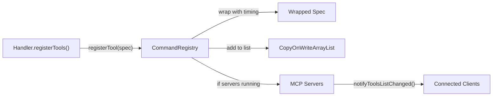
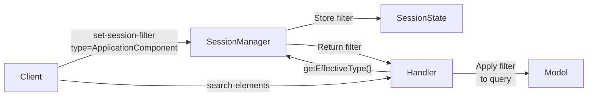
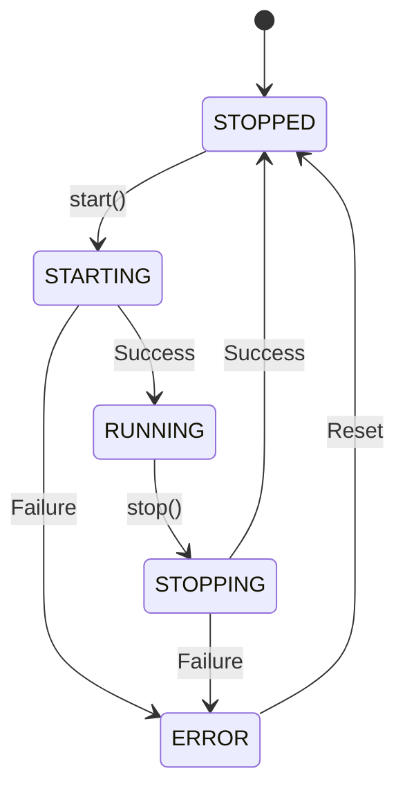

# MCP Protocol Integration

This document describes how the plugin integrates with the Model Context Protocol (MCP), including tool registration, response formatting, error handling, session management, resources, and transport configuration.

## Table of Contents

- [Tool Registration](#tool-registration)
- [Response Envelope](#response-envelope)
- [Error Responses](#error-responses)
- [Session Management](#session-management)
- [MCP Resources](#mcp-resources)
- [Transport Layer](#transport-layer)

## Tool Registration

The `CommandRegistry` is the central registry for all MCP tool definitions.

### Registration Flow



1. Each handler calls `registry.registerTool(spec)` during initialization
2. The registry wraps the spec with timing instrumentation (injects `durationMs` into `_meta`)
3. The spec is added to the thread-safe tool list
4. If MCP servers are already running, the tool is added to both Streamable-HTTP and SSE servers, and connected clients are notified

### Tool Specification Structure

Each tool defines:
- **Name** (kebab-case): `get-element`, `create-relationship`, `assess-layout`
- **Description**: product-quality documentation (purpose, parameters, related tools)
- **Input schema**: JSON Schema defining parameters with types and descriptions
- **Call handler**: `BiFunction<McpSyncServerExchange, CallToolRequest, CallToolResult>`

### Thread Safety

- `CopyOnWriteArrayList` for the tool spec list (safe reads from multiple Jetty threads)
- Volatile server references for cross-thread visibility
- Synchronized registration + notification for atomic tool addition

**Source:** `registry/CommandRegistry.java`

## Response Envelope

All tool responses use a consistent JSON envelope built by `ResponseFormatter`.

### Success Response

```json
{
  "result": {
    "id": "abc-123",
    "name": "Application Service",
    "type": "ApplicationService",
    "layer": "Application"
  },
  "nextSteps": [
    "Use get-relationships to explore connections",
    "Use search-elements to find related elements"
  ],
  "_meta": {
    "modelVersion": "v-1042",
    "resultCount": 1,
    "totalCount": 1,
    "isTruncated": false,
    "sessionActive": true,
    "durationMs": 42
  }
}
```

### Response Fields

| Field | Always Present | Description |
|-------|---------------|-------------|
| `result` | Yes (success) | DTO object or collection |
| `error` | Yes (error) | ErrorResponse object |
| `nextSteps` | Yes | Array of suggested next actions for LLM guidance |
| `_meta.modelVersion` | Yes | Current model hash (for change detection) |
| `_meta.resultCount` | Yes | Items in this response |
| `_meta.totalCount` | Yes | Total available items |
| `_meta.isTruncated` | Yes | Whether results were truncated |
| `_meta.sessionActive` | Yes | Whether session is valid |
| `_meta.durationMs` | Yes | Execution time in milliseconds |
| `_meta.modelChanged` | Optional | Set if model changed since last query |
| `_meta.cursor` | Optional | Pagination cursor (Base64) |
| `_meta.cacheHit` | Optional | Set if response served from cache |
| `_meta.dryRun` | Optional | Set for cost estimation responses |

### Alternative Response Formats

| Method | Top-Level Key | Use Case |
|--------|--------------|----------|
| `formatSuccess()` | `result` | Standard queries and mutations |
| `formatError()` | `error` | Error responses |
| `formatGraph()` | `graph` | Graph-format queries (nodes + edges) |
| `formatSummary()` | `summary` | Natural language summaries |
| `formatDryRun()` | `dryRun` | Cost estimation responses |

### Post-Call Meta Mutations

Handlers can add flags to the envelope after initial formatting:

- `addModelChangedFlag(envelope)` — model updated since last session query
- `addCursorToken(envelope, cursor)` — pagination cursor for next page
- `addCacheHitFlag(envelope)` — response served from session cache
- `addSessionWarning(envelope, warning)` — session health warning

### Implementation Notes

- Jackson ObjectMapper with `NON_NULL` inclusion (null fields omitted from JSON)
- CamelCase field names (Jackson default for Java records)
- LinkedHashMap for predictable field ordering
- Single shared ObjectMapper instance (thread-safe after configuration)

**Source:** `response/ResponseFormatter.java`

## Error Responses

All errors follow a structured format for consistent LLM parsing.

### Structure

```json
{
  "error": {
    "code": "ELEMENT_NOT_FOUND",
    "message": "No element found with ID 'xyz-789'",
    "details": "The model contains 2,341 elements.",
    "suggestedCorrection": "Use search-elements with a name query to find the element",
    "archiMateReference": null
  }
}
```

| Field | Required | Description |
|-------|----------|-------------|
| `code` | Yes | Machine-readable error code from `ErrorCode` enum |
| `message` | Yes | User-facing error description |
| `details` | No | Technical context |
| `suggestedCorrection` | No | Actionable fix suggestion |
| `archiMateReference` | No | Link to ArchiMate specification |

### Error Code Categories

| Category | Codes |
|----------|-------|
| **Query errors** | ELEMENT_NOT_FOUND, RELATIONSHIP_NOT_FOUND, VIEW_NOT_FOUND, FOLDER_NOT_FOUND |
| **Mutation errors** | MUTATION_FAILED, RELATIONSHIP_NOT_ALLOWED, INVALID_RELATIONSHIP_TYPE |
| **Validation errors** | INVALID_PARAMETER, BULK_VALIDATION_FAILED |
| **Mode errors** | BATCH_NOT_ACTIVE, APPROVAL_NOT_ACTIVE, BATCH_ALREADY_ACTIVE |
| **State errors** | MODEL_NOT_LOADED, PROPOSAL_STALE, PROPOSAL_NOT_FOUND |
| **System errors** | INTERNAL_ERROR |

**Source:** `response/ErrorResponse.java`, `response/ErrorCode.java`

## Session Management

The `SessionManager` maintains per-session state including filters, field selection, and query caching.

### Session Filters



**Available filters:**

| Filter | Values | Effect |
|--------|--------|--------|
| `type` | Any ArchiMate element type | Only return elements of this type |
| `layer` | Business, Application, Technology, etc. | Only return elements in this layer |
| `fields` | `"minimal"`, `"standard"`, `"full"` | Control response verbosity |
| `exclude` | Array of field names | Additional fields to exclude |

**Precedence:** Per-query parameters override session filters. Session filters apply when the query omits the parameter.

### Session Caching

- Query results are cached per-session with keys encoding command name + effective filters
- `ModelVersionTracker` invalidates all caches when the model changes
- `dryRun=true` queries use cached results when available
- Cache entries are cleared when the active model changes in Archi's UI

### Model Change Detection

The SessionManager implements `ModelChangeListener`. When the active ArchiMate model changes:
1. All session states are cleared
2. All version trackers are reset
3. All session caches are invalidated

Subsequent queries detect the version change and set `_meta.modelChanged = true`.

### Session ID

Extracted from the MCP exchange. Falls back to `"default"` if unavailable.

**Source:** `session/SessionManager.java`, `handlers/SessionHandler.java`

## MCP Resources

The plugin serves static reference materials as MCP Resources via the `ResourceHandler`.

### Available Resources

**Prompts (workflow templates):**

| URI | Name | Content |
|-----|------|---------|
| `archimate://prompts/model-exploration-guide` | Model Exploration Guide | Strategy for efficient model exploration |
| `archimate://prompts/explore-dependencies` | Explore Dependencies | Systematic dependency analysis workflow |
| `archimate://prompts/landscape-overview` | Landscape Overview | Architecture landscape summary generation |

**References (domain knowledge):**

| URI | Name | Content |
|-----|------|---------|
| `archimate://reference/archimate-layers` | ArchiMate Layers Reference | All layers with element types |
| `archimate://reference/archimate-relationships` | ArchiMate Relationships Reference | Relationship types with valid combinations |
| `archimate://reference/archimate-view-patterns` | ArchiMate View Patterns | Layout and diagramming best practices |

### Loading and Serving

1. Resources load from the classpath at server startup
2. Content is cached in memory (HashMap)
3. LLM clients request resources via URI
4. Handler returns content as `TextResourceContents` with MIME type `text/markdown`

**Source:** `handlers/ResourceHandler.java`, `net.vheerden.archi.mcp/resources/`

## Transport Layer

The plugin embeds a Jetty server supporting two MCP transport protocols.

### Dual Transport

| Transport | Endpoint | Protocol | Primary Client |
|-----------|----------|----------|----------------|
| Streamable-HTTP | `/mcp` | Stateful HTTP | Claude CLI |
| Server-Sent Events (SSE) | `/sse` | SSE streaming | Cline |

Both transports serve the same tool and resource registrations. Tools registered at runtime are added to both simultaneously.

### TLS/HTTPS

Optional TLS support via PKCS12/JKS keystore:

- When enabled, both endpoints use HTTPS
- Self-signed certificate generation available via preferences
- Keystore path and password configured in Archi preferences
- Validated at startup (path existence, password correctness)

### Server Lifecycle



**Startup errors** are mapped to user-friendly messages:

| Error Code | Message |
|------------|---------|
| `PORT_IN_USE` | Port already in use |
| `INVALID_BIND_ADDRESS` | Invalid bind address |
| `INVALID_TLS_CONFIG` | TLS configuration error |

### Listener Pattern

Components register for server state changes via `McpServerStateListener`:

```java
manager.addStateListener((oldState, newState) -> {
    // React to STOPPED, STARTING, RUNNING, STOPPING, ERROR
});
```

**Source:** `server/McpServerManager.java`, `server/TransportConfig.java`

---

**See also:** [Architecture Overview](architecture.md) | [Mutation Model](mutation-model.md) | [Extension Guide](extension-guide.md)
