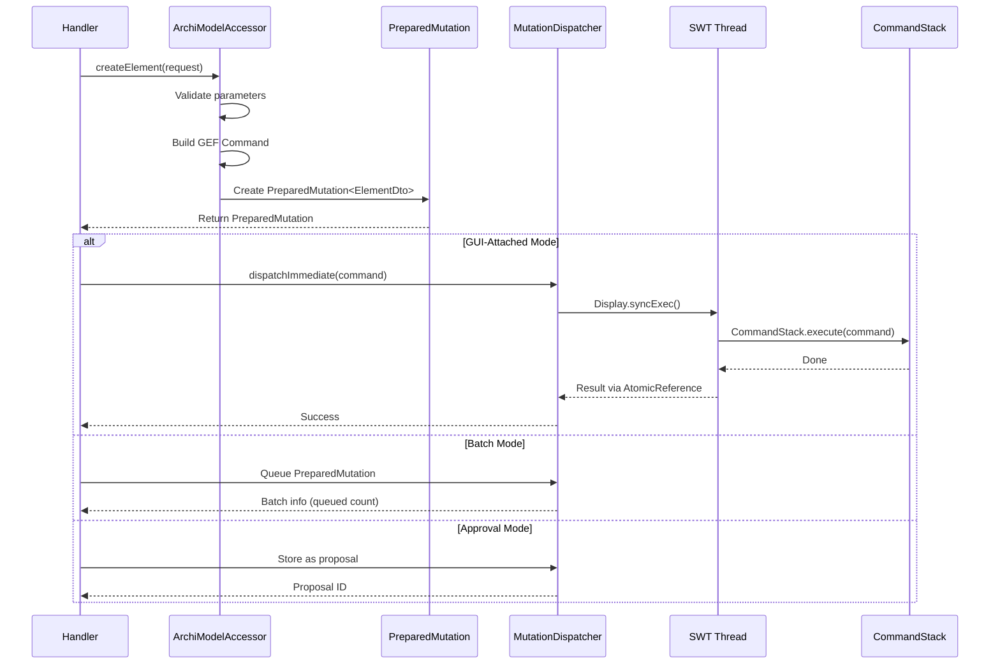
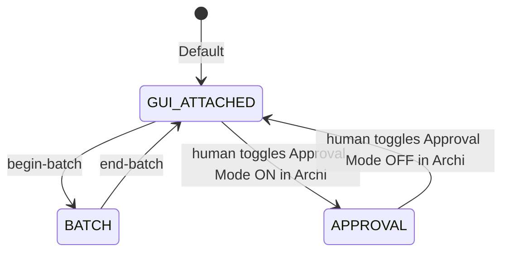

# Mutation Model

This document describes how the ArchiMate MCP Server handles model mutations, including the PreparedMutation pattern, CommandStack integration, operational modes, and the approval workflow.

## Table of Contents

- [Mutation Flow Overview](#mutation-flow-overview)
- [PreparedMutation Pattern](#preparedmutation-pattern)
- [Effective-State Reporting](#effective-state-reporting)
- [MutationDispatcher](#mutationdispatcher)
- [Operational Modes](#operational-modes)
- [Undo and Redo](#undo-and-redo)
- [Approval Workflow](#approval-workflow)
- [Batch Mode](#batch-mode)
- [Bulk Mutate](#bulk-mutate)
- [Inline Specialization Parameter](#inline-specialization-parameter)
- [Specialization Icons](#specialization-icons)
- [Relationship Semantic Attributes](#relationship-semantic-attributes)
- [Empty-String Field Semantics](#empty-string-field-semantics)
- [Model Metadata Mutation](#model-metadata-mutation)
- [Container Fill Recession (auto-backdrop)](#container-fill-recession-auto-backdrop)
- [Error Handling](#error-handling)

## Mutation Flow Overview

All model mutations follow a strict path from handler through CommandStack to the EMF model.



**Key invariant:** All mutations go through GEF `CommandStack.execute()` on the SWT UI thread. Direct EMF modification corrupts the model and breaks undo/redo.

## PreparedMutation Pattern

`PreparedMutation<T>` is an immutable record that encapsulates the complete state of a mutation before dispatch. It enables two-phase execution: prepare (validate) first, execute second.

```java
record PreparedMutation<T>(
    Command command,      // GEF Command ready for CommandStack
    T entity,             // DTO representation of the result
    String entityId,      // Unique identifier of created/updated entity
    Object rawObject      // Raw EMF object (for bulk back-references)
)
```

### Two-Phase Execution

- **Phase 1 (Preparation):** The handler calls `ArchiModelAccessor`, which validates parameters, creates the EMF object and GEF Command, and returns a `PreparedMutation<T>` — but does not execute.
- **Phase 2 (Dispatch):** The handler checks the operational mode and either dispatches immediately, queues for batch, or stores as a proposal.

### Why Two Phases

Bulk operations pre-validate **all** mutations before executing **any**. If any operation fails validation, the entire bulk operation is rejected (all-or-nothing). This prevents partial model corruption from mid-batch failures.

That sentence is about `bulk-mutate` and about `apply-positions`, and about nothing else in this pattern: every other tool here prepares one mutation, so it has no set of siblings to pre-validate against. The two multi-entry tools behave the same way and report the same way — see [Failure Semantics](#failure-semantics) for `bulk-mutate` and [apply-positions failure semantics](#apply-positions-failure-semantics) for the other. Neither stops at its first bad entry.

### Generic Type Parameter

The type parameter `<T>` constrains to the appropriate DTO type:

- `PreparedMutation<ElementDto>` for element creation
- `PreparedMutation<RelationshipDto>` for relationship creation
- `PreparedMutation<ViewDto>` for view creation
- `PreparedMutation<MutationResultDto>` for updates and deletions

**Source:** `model/PreparedMutation.java`

### Folder-Type Validation (fail-fast)

ArchiMate organises concepts into typed top-level folders by layer (Business, Application, Technology, Motivation, …). Placing a concept into a folder whose layer is illegal for its eClass produces a model that **host Archi refuses to save** ("Object is in wrong folder type"). To surface that at mutation time instead of at save time, the prepare phase calls `validateFolderLayerMatch`, which **delegates to Archi's own `getDefaultFolderForObject`** (widened to `IArchimateConcept`, so it covers relationships too) rather than re-encoding the platform's type→folder map. An illegal placement is rejected with `FOLDER_LAYER_MISMATCH`.

Two paths enforce it:

- **`create-element`** — validates the optional `folderId` before creating. (It was previously guarded by a hand-rolled `getExpectedFolderType` switch that returned `null` for Junction, Grouping, and Location — so those silently skipped validation. The drift-prone switch is gone.)
- **`move-to-folder`** — now validated for the first time, reusing the identical check and payload, so create and move are symmetric.

> Never re-encode the platform's type→folder map in MCP code; delegate to `getDefaultFolderForObject` so the rule cannot drift from Archi's.

## Effective-State Reporting

A mutating tool's success response reports **what the model holds after the write**, never the values the caller passed in. This is a cross-tool invariant, not a per-tool nicety.

### Why the request is not the answer

Archi silently auto-fits a container to its children, and the parent-fit cascade can carry that fit several levels up the containment chain. A requested `width` / `height` / `x` / `y` therefore may not survive the write. The client is an LLM agent that cannot see the canvas, so the response *is* its only ground truth: a `success` that echoes the request while the model diverged is a **correctness defect, not a cosmetic one**. The agent builds its next call on the wrong number, and the failure surfaces far downstream where it can no longer be attributed.

The rule follows directly: after the command runs, **re-read the object from the model** and return the persisted geometry.

### Two rulings that decide the ambiguous cases

**A count or a flag is not effective state.** A field that reports *that* something changed, without reporting *what it changed to*, does not discharge the invariant when the changed value is agent-actionable. `resizedCount: 3` tells the agent something moved and leaves it unable to say where — a flag is an index into missing data, not a report of state. Equally, **a field named as an outcome must not be sourced from the request that asked for it**: a `groupResized` populated from the caller's `autoResize` parameter is an echo wearing an outcome's name.

**Batched and proposal modes discharge the invariant by labelling, not by value.** Nothing is effective in those modes by construction (`MutationResult.isBatched()` / `isProposal()`), so a projection is the only thing a response there *can* honestly contain. The obligation becomes structural: the entity is nested under `preview`, beside a `batch` or `proposal` sibling naming the deferred state, and never appears at the top level of `result` where an agent would read it as state the model holds. Do **not** "fix" a queued projection by duplicating the executor's resolution at prepare time — that re-creates the prepare/execute divergence the label exists to declare.

### The collateral fields

An operation frequently changes objects the caller never named. Those changes are reported by name and geometry, not by count:

| Field | Carried by | What it reports |
|---|---|---|
| `effectiveBounds` | `bulk-mutate` per-operation | The rectangle the model holds after the write, when the operation targeted a view object |
| `parentViewObjectId` | `add-to-view`, `add-group-to-view`, `add-note-to-view`, `update-view-object`, `bulk-mutate` per-operation | The container the object sits in after the write, or absent when it sits on the view itself — the same key `get-view-contents` publishes, so the read and write surfaces spell one concept one way. It is what makes the geometry beside it readable: a nested object's `x`/`y` are relative to its immediate parent's top-left corner, so a rectangle reported without its origin cannot be placed. Taken from the resolved container, never from the request's `parentViewObjectId` — a request names a parent as a reference still to be resolved, and one that resolved to a container the caller did not intend is exactly the case this exists to expose |
| `effectiveConnection` | `bulk-mutate` per-operation | The state a view connection holds after the write — line colour and width, typography, label position, bendpoints, and the view objects and anchor points it joins. The same report the single-tool caller gets. Its anchors are absolute canvas centres derived from the endpoints' live geometry, so an operation **later** in the same call that moves an endpoint is reflected here — a change no field on that later operation would report |
| `effectiveRelationship` / `effectiveElement` | `bulk-mutate` per-operation | The state an ArchiMate relationship or element holds after the write — for a relationship the semantic attributes (`accessType`, `associationDirected`, `influenceStrength`), for an element its `documentation`, each alongside the concept's own identity. The same report the single-tool caller gets, composed from the same readers, so a relationship subtype that cannot hold an attribute omits it here exactly as it does there. Read after dispatch, so an operation **later** in the same call that changes the same concept again is reflected in the earlier operation's entry. Attached only where the entry already says what its entity is, which every operation on a concept now does — a `move-to-folder` whose subject is an element or a relationship carries one too, and it agrees with that operation's `entityType` rather than refining it: a move reports the same exact eClass every other operation does |
| `resizedAncestors` | `add-to-view`, `update-view-object`, `layout-within-group`, `adjust-view-spacing`, `bulk-mutate` | Containers the call **grew** that it was not asked to touch — icon-band reservation, parent-fit cascade — each with the rectangle it ended at |
| `ancestorPropagation` | `layout-within-group` | How the upward pass ended, as `code: phrase`. **The one field here that is never omitted** — it ships on every response, including the common one where nothing was asked for, because a zero `ancestorsResized` is true in four different situations that ask for different actions, and because the pass can stop early *having already re-fitted* ancestors. See [Layout Engine — layout-within-group](layout-engine.md#layout-within-group) for the code table |
| `resizedGroups` | `resize-elements-to-fit`, `auto-route-connections` | Groups the parent-fit cascade grew, accumulated across the whole pass so a group is reported once at its final size |
| `movedObjects` | `update-view-object`, `resize-elements-to-fit`, `bulk-mutate` | Objects **anchored** to something the call moved or grew, each with where it landed |

The list-valued fields are omitted when empty, so a call that changed nothing collateral serializes as it did before they existed. All report **observations**: an ancestor recomputed to an unchanged rectangle appears in neither the count nor the list.

`ancestorPropagation` is the deliberate exception to the omit-when-empty rule, and the reason is worth stating because it looks like an inconsistency. The other fields answer *what changed*, and having nothing to say is itself the answer — an absent `resizedAncestors` means no ancestor grew, unambiguously. `ancestorPropagation` answers *why nothing changed*, and there an absent field is indistinguishable from a build that does not report it. A field defaulted to absent beside a published list of the values it can take is a false all-clear.

### The operation's own name

`entityName` is not a collateral field — it names the entity the operation was aimed at — but it is read the same way and for the same reason. On a call that was applied it is re-read from the model **after every operation has run**, so an operation that renames reports the new name, an operation whose entity a *later* operation in the same call renames again reports the final name, and a name cleared to `""` is reported as `""` rather than as the name the entity used to have. Reporting the pre-write name here was the sharper form of the echo defect: the value matched neither the request nor the result, so an agent reading it as confirmation would conclude the rename had not taken.

The re-read only ever **replaces a name that is already reported**; it never introduces one. Operations that name nothing — a placed connection or note, and a removal — still carry no `entityName`. A folder operation, a model update and a `move-to-folder` each name their subject and report its type, so the re-read reaches them: a folder and the model are both nameable and both resolve by id. In batch and approval mode the value is the name as prepared, for the same reason the collateral fields are absent there: nothing has executed — and for a model rename "as prepared" is the name the update **will** write, not the one the model still holds, which is the value a live read at prepare time would have supplied.

A **deletion** is the one case the re-read cannot reach, because the entity's id stops resolving the moment the delete applies — so it is not served by the re-read at all. The deleting command records what its subject was called inside its own `execute()`, and the post-dispatch pass reads that back off the dispatched compound. Both `entityName` and `deletion.name` therefore report the name the entity was destroyed under, including when an earlier operation in the same call renamed it first. The capture is taken at execution rather than read off the removed object afterwards, because an EMF object removed from its container is detached rather than destroyed and can still be written to: in `[delete X, rename X]` the rename lands on the detached object, and a read afterwards would report the deletion as having destroyed a name the entity never carried while it existed.

A deletion records a name **only if it actually destroyed something**, and the gate covers two cases. A deletion that **declined** returned before touching the model. A **redundant** deletion — the same subject deleted twice in one call, which prepares cleanly because nothing has executed while both are being prepared — runs in full but removes nothing, because the earlier one already took the subject out. Both leave `deletion.name` as prepared; without the gate the second would report the name the rename in `[delete X, rename X, delete X]` wrote onto the detached object, which is the same lie one ordering over.

Beside the name, `entityType` says **what** the operation touched, and it says it in one vocabulary: the **EMF eClass name**, whichever tool produced the row. A view is `ArchimateDiagramModel` whether it was created, cleared, label-stamped, deleted or moved; a group removed from a view is `DiagramModelGroup` exactly as one added to it is; a moved relationship is `AssociationRelationship`, not a coarse `Relationship`. That is what makes the field safe to key dedup, filtering or branching off — and the approval card renders this same field as the row type to a human, so a second spelling would be a second name for one thing on both surfaces at once. There is **one** deliberate exception: a specialization reports `Specialization:<conceptType>`, because an Archi specialization's identity is the concept type it binds and the bare eClass would say less rather than more. Where a tool's own payload carries a coarser noun of its own — `move-to-folder`'s `objectType`, `remove-from-view`'s `removedObjectType`, both of which a human reads and callers branch on — that noun is unchanged and the translation happens in the projection.

A **declined** operation keeps whatever the re-read found for `entityName`, unlike `resizedAncestors` / `movedObjects`, which are retracted: those describe a placement that did not happen, whereas the name is a live read of an entity that still exists — a folder whose delete declined is still there, so its `entityName` is the name it holds now, which may differ from both the prepared name and its `deletion.name`. `skippedOperations` remains the authority on whether an operation ran.

### Enforcement

The rule is checked like the size ratchet, not left to review.

- **`EffectiveStateContractTest`** walks every registered tool — registration runs through `HandlerRegistrar`, so a tool behind a brand-new handler class is still forced through the check.
- Each tool must classify **exactly once** as read-only, covered by an oracle, or listed in **`tools/effective-state-gaps.txt`** with a stated reason. **A tool classified nowhere fails the build.**
- The registry's entry count is a **lower-only ceiling** (`GAP_ENTRY_CEILING`), clicked down in the same commit that closes a gap. Adding a tool that cannot report effective state therefore requires a deliberate, reviewable admission rather than silence.
- A **path-parity axis** compares each oracle-covered tool's leaf field names standalone versus through `bulk-mutate`, with the subject set derived at runtime from the bulk operation table. Nothing may be lost undeclared on the bulk path, and a newly bulk-reachable tool must register or fail.

> Serializing the DTO proves a value was **computed**, not **sent**. Handlers hand-build each response map key by key, so a field can be populated on the record and never leave the JVM. Oracles assert through the registered tool, not against the DTO.

## MutationDispatcher

The `MutationDispatcher` is the single point where Jetty threads cross to the SWT UI thread.

### Thread Crossing

```java
dispatchImmediate(Command command) {
    Display.syncExec(() -> {
        CommandStack.execute(command);
    });
    // Result passed back via AtomicReference
}
```

### Version Tracking

`ArchiModelAccessorImpl` holds a private `AtomicLong versionCounter`; `getModelVersion()` returns its current value as a string (or `null` when no model is loaded). The value is a **monotonic change-detection token**: it *strictly increases* on every model change — agent mutations **and** human GUI edits alike — and never decreases (even an `undo` advances it, because the model did change). Consumers compare it for **equality only** ("did it change since I last looked"), which invalidates session caches, invalidates stale pagination cursors, and enables the `_meta.modelChanged` flag in responses. **Nothing consumes the delta** — only whether the value differs.

Because only equality is consumed, the *magnitude* of an increment is deliberately unspecified. A single change can advance the counter by more than one: an agent `CommandStack.execute` advances it via the inline per-method bump **and** via Archi's `PROPERTY_ECORE_EVENT` (see below), so an agent op is observed live to advance it by **+2**. This multi-bump is **benign by design** for a change-token and is long-standing (the `PROPERTY_ECORE_EVENT` lifecycle bump predates the approval work).

The increment sources are:

- **`handleModelContentChanged()`** — fires on Archi's `PROPERTY_ECORE_EVENT`, i.e. for **every** EMF notification on the active model. This is the source that covers **human GUI edits** (hand-draw, drag, rename, delete) as well as agent ops, and it is the per-op bump that fires live regardless of the inline guards.
- **Inline per-method bumps + the immediate-dispatch callback** — `versionCounter.incrementAndGet()` guards on each mutation body (and the `setOnImmediateDispatchCallback` on the approve path). These exist because the **headless** test harness uses a mock `IEditorModelManager` that fires **no** `PROPERTY_ECORE_EVENT`; without them the counter would not advance in offline tests.
- **Lifecycle bumps** — `setActiveModel()` and the no-model branch advance the counter on a model switch / close (a different model is now active ⇒ the token must change).

> Note: a class named `ModelVersionTracker` (`model/ModelVersionTracker.java`) does exist, but it is the **session-side** version-diff store — `checkAndUpdateVersion` records the last version seen per session and returns whether it changed (`!previousVersion.equals(currentVersion)`). It does **not** increment the model version; the `versionCounter` `AtomicLong` is the incrementer.

### Per-Session State

`MutationDispatcher` maintains per-session operational mode and batch state via `ConcurrentHashMap<String, MutationContext>`.

**Source:** `model/MutationDispatcher.java`

## Operational Modes



| Mode | Behavior | Undo Granularity |
|------|----------|------------------|
| **GUI-ATTACHED** | Mutations execute immediately, UI updates in real-time | Each mutation is a separate undo unit |
| **BATCH** | Mutations are queued; committed atomically on `end-batch` | Entire batch is a single undo unit |
| **APPROVAL** | Mutations become proposals; executed only on explicit **human** approval | Each approved mutation is a separate undo unit |

> **Approval mode is global, not per-session.** It is one human-owned switch for the whole plugin, toggled only from Archi's desktop UI. The setting is persisted in MCP preferences and restored on start; a fresh install defaults to ON (gated).

## Undo and Redo

The `CommandStackHandler` exposes Archi's native GEF CommandStack as MCP tools.

### undo

- **Parameters:** `steps` (integer, default 1, minimum 1)
- Pops N commands from the undo stack
- Returns list of undone command labels
- Standard sequential undo (most recent first)
- **Scoped to agent-authored changes** — see below

### redo

- **Parameters:** `steps` (integer, default 1, minimum 1)
- Pushes N commands back from the redo stack
- Redo stack is cleared on any new mutation post-undo
- **Scoped to agent-authored changes** — see below

### Origin tagging and scoped agent undo/redo

A native GEF `CommandStack` carries **no per-entry provenance** — once a command is on the stack
there is no way to recover who authored it. So every agent mutation is stamped with its origin **at
admission**: `MutationDispatcher.dispatchImmediate` wraps each command in an
`AgentAuthoredCompoundCommand` (a plain single-child `CompoundCommand` implementing the
`AgentAuthoredCommand` marker) immediately before `CommandStack.execute`. Every agent write —
immediate single ops, the batch-commit compound, and approved proposals — funnels through that one
chokepoint, so all of them are tagged; human GUI edits reach Archi's CommandStack directly and stay
untagged. The wrapper is behaviourally transparent (delegates `execute/undo/redo` to its one child
and reports the delegate's label) and is **one stack entry**, so the undo/redo menu, tool labels, and
the speculative-undo arithmetic are unchanged.

The **`undo`/`redo` MCP tools are scoped to the agent's own changes** (the "betrayal" guard): they
act only on agent-authored top-of-stack entries.

- If the top of the stack is the **human's** change, the agent's `undo`/`redo` performs **zero**
  operations and returns a distinct refusal — *"Cannot undo — the most recent change is the
  human's."* — never silently evaporating hand-drawn work. To revert a human change the agent must
  submit a **new proposal** the human decides on. This refusal is distinct from an empty stack
  (*"Nothing to undo"*).
- For `steps > 1`, the agent undoes consecutive agent entries and **stops without error** at the
  first human entry, returning the labels actually undone (it never crosses a human edit).
- **Archi's native Edit ▸ Undo/Redo (Ctrl+Z / Ctrl+Y) is unchanged** — it calls `CommandStack`
  directly and is **not** scoped, so the human still owns the whole timeline and can undo anything,
  including the agent's work.

### Compound-undo ordering (successor anchors)

A compound that deletes several sibling diagram objects or model elements at once — `bulk-mutate`
with multiple deletes, or a forced folder delete — must restore not only **membership** on undo but
also the children's **paint order (z-order)** and the model-tree **folder order**. The hazard: a
`CompoundCommand` undoes its members in **reverse**, so if each delete captured an **absolute**
insertion index and re-inserted there, a later delete would restore into a list whose earlier members
were not yet back, landing at the wrong slot and perturbing order.

The delete commands (`DeleteElementCommand`, `RemoveFromViewCommand`, `RemoveViewObjectCommand`)
therefore capture each removed item's **surviving-successor sibling** at construction time (prepare
time, while the lists are still intact) and, on undo, re-insert the item **directly before that
anchor** — falling back to the clamped absolute index only when the item was the tail or the anchor is
transiently absent. Single deletes and the common ascending-order multi-delete are exact and remain
byte-identical to the old behaviour; membership and connection integrity are always preserved. (A
documented residual remains only for 3+ co-deleted siblings supplied in non-monotonic order, where
rare paint-order drift can survive.)

The same hazard reaches the **model tree**, not just a view's children, through any prepare that
captures a sibling index for undo. `DeleteRelationshipCommand`, `DeleteViewCommand`,
`DeleteFolderCommand` and `MoveToFolderCommand` share the successor anchor via `SiblingUndoAnchor`:
any co-queued operation that inserts or removes a sibling in the same folder invalidates a captured
absolute index, so a multi-delete batch used to undo to `[F1, F3, F2]`. A fifth suspected site — the
cascaded-placeholder path in `DeleteViewCommand` — was **measured and found not vulnerable**: it
captures relatively at execute time and is self-consistent under reverse undo.

A related failure is **redundancy**, not ordering. Two delete commands targeting the same object each
captured their own re-insertion anchor at construction, so reverse-order undo re-added the target
twice into an EMF unique containment list and raised `IllegalArgumentException("no duplicates")`.
Undo is now idempotent per target, fixed at the command layer (`SiblingUndoAnchor.restore`,
`DeleteElementCommand`'s safe-add helpers, and `DeleteProfileCommand`'s removed flag) rather than in
the shared batch queue — that queue is a semantics-agnostic `List<Command>` every mutation passes
through, and pushing operation identity into it would put target semantics on a critical spine.

### Experimental Workflow

Undo/redo enables speculative layout workflows:

```text
1. auto-layout-and-route (apply layout)
2. assess-layout (check quality)
3. If unsatisfied: undo (revert to previous state)
4. Try different parameters and repeat
```

**Source:** `handlers/CommandStackHandler.java`

## Approval Workflow

The approval workflow provides human-in-the-loop control for high-risk mutations. **The control plane is the human's**: the agent submits mutations and observes the gate but cannot move it. A self-ungating safety control would be theatre, so the toggle and the approve/reject decision live on the human (desktop) side, and the corresponding MCP tools (`set-approval-mode`, `decide-mutation`) no longer exist.

### Human-owned toggle (Archi UI, not MCP)

- Toggled from the checkable **MCP Server → Approval Mode** menu item in Archi. There is no MCP tool to flip it (the only robust guard is non-existence).
- The bit is **global** (one human, one desktop, one gate), **persisted in MCP preferences and restored on start**; a fresh install defaults to ON (gated) — fail safe.
- Friction asymmetry: turning the gate **on** is one click; turning it **off** requires a confirmation.

### list-pending-approvals (the agent's only approval tool — read-only)

- Returns all pending proposals for the current session, and the current `approvalMode`.
- Each proposal includes: proposalId, tool name, description, parameters.
- Its `nextSteps` direct the agent to tell the human to approve/reject in Archi — never to call a removed tool.
- The agent can also read `approvalMode` from `get-model-info`.

### What a deferred response may say (batched and awaiting-approval arms)

A tool measures the same things whichever arm it is on. The router computes the routes a queued call will lay down; the quality loop ranks the attempt a human has not yet approved; the layout walk reaches the same ancestor either way. So a deferred arm **keeps the measurement and rescopes the remedy**: it publishes every id, count and rating it genuinely established, it **never asserts applied state**, and its guidance names only **a recovery that exists** on that arm — `undo` once applied, `end-batch` (or `end-batch rollback:true`) while queued, and **no tool at all** while awaiting approval, where the agent can neither approve nor reject its own change and the human decides in Archi. Naming a tool that cannot perform the recovery is worse than naming none.

Two corollaries. Rescoping is not withdrawing: suppressing a measurement because the remedy changed deletes a fact that was legitimately established, and a silent omission reads as an all-clear. And the reverse — where the comparison genuinely never ran, because the control loop reset the model before snapshotting, the honest disclosure is an **abstention** that says so, not silence and not a fabricated verdict. Compose the evidence once and vary only the remedy clause; editing a tail inside a finished sentence is how a shared constant acquires a second, wrong meaning.

A third clause, and it is the limit on the first. A deferred arm may state as measured only what the command it queued will actually do. Where the command **re-derives at execute** — `clear-view` re-walks the view inside `execute()` and empties whatever it then finds, so its prepare-time counts describe a different model — or where the value is an **id the approval rebuild will re-mint** — a stored proposal keeps a rebuild handle, so `add-to-view`'s previewed view-object id is not the id the approved placement receives — the disclosure **omits it rather than restating it in the future tense**. A future-tense restatement of a value the write will not produce is not a rescoped remedy but a fabricated measurement, and a confident wrong value is worse for a caller that cannot see the canvas than no value at all. This does not license withdrawing a count whose command is frozen at prepare: `remove-from-view` hands its cascade list to the command at construction and disconnects exactly that list, so the future tense is true of it.

Mechanically, the deferred-arm guidance is supplied on its own parameter (`HandlerUtils.formatMutationResponse`'s `approvalDisclosures` overload, appended after the three fixed approval lines). The immediate arm's `nextSteps` are **never forwarded** to the approval arm: they are present tense by construction, so forwarding them would tell an unapproved caller their change was applied and offer `undo` for it.

### Approve / reject (human side, via `ApprovalService`)

Approve/reject orchestration lives in the UI-callable `server/ApprovalService` (no MCP surface) that the Pending Approvals view binds to:

- **Approve:** execute the proposal's command immediately (or queue it if a batch is active).
- **Reject:** discard the proposal, no model change.
- **Stale proposals:** if the held command fails to apply because the model changed since proposal creation, approval surfaces a stale error (the held-`Command` hazard is retired by storing the request rather than a live command — see *Store-the-request* below).

### Pending Approvals view (the human surface)

The human reviews and decides in the **Pending Approvals** dock view in Archi (`ui/PendingApprovalsView`), which calls `ApprovalService` directly — there is no MCP path to it.

- **One card per proposal** = one card per gated tool-call (a whole `bulk-mutate` is a single card, never N). Cards are the cross-session union (`ApprovalService.listAllPending()`), oldest first; each carries its `sessionId` so Approve/Reject routes to the right session.
- **Effect rollup** is derived client-side from the proposal's `tool` + `proposedChanges` by the headless `ui/ApprovalCardModel` (destructive counts in amber, deletes hoisted, names resolved where the DTO provides them). The `ViewPart` is a thin renderer over it.
- **Live refresh** rides a new `model/ApprovalQueueListener` fired from the dispatcher's store/remove/approve/reject/clear points; the view marshals to the SWT thread (`Display.asyncExec`) — `model/` stays SWT-free.
- A destructive card keeps `Approve` disabled until its changes are expanded once; bulk **`Approve all safe`** / **`Approve all ⚠`** chain whole-card approvals oldest-first and halt on the first stale proposal.

### Effect vs. intent

A proposal carries **two separate, nullable description fields** that are **never merged** — they hold different trust levels:

- **`effectDescription` (server-owned).** Rich, human-readable, non-spoofable text the server generates from the model's own truth: real element **names** and types, relationship **source→target** names, and server-derived consequences already on the result DTO (cascade counts). Relationship effects are named at propose time — `Create ServingRelationship: 'Payment Gateway' → 'Fraud Engine'` and `Delete …: 'A' → 'B' (cascade: 2 view connections)` — resolved by a private helper in `model/ArchiModelAccessorImpl` (no new accessor-interface surface). The **visual-connection** tools name their endpoints the same way: `add-connection-to-view` → `Add connection ServingRelationship: 'A' → 'B'` and `update-view-connection` → `Update connection …: 'A' → 'B'` (the drawn connection is *for* an existing model relationship, so its endpoints resolve cleanly at propose time). For `bulk-mutate`, `proposedChanges.operations` is a **structured list** (`{index, tool, name, type, source, target}`) so the card renders named rows without the human opening `Technical details`.

  Every **view-visual** add / update / delete effect text also **names the destination view**: the server resolves `viewId` — or, for the update tools that carry only an object id, the object's owning diagram — to the live `IDiagramModel.getName()` and appends it, so the card reads `Add ApplicationComponent 'X' to view 'Main View'`, `Update connection …: 'A' → 'B' in view 'Main View'`, or `Remove … from view 'Main View'`. This covers the whole family (`add-to-view`, `add-group-to-view`, `add-note-to-view`, `add-view-reference-to-view`, `add-image-to-view`, `add-connection-to-view`, `update-view-object`, `update-view-connection`, `remove-from-view`) via the same private `model/ArchiModelAccessorImpl` resolver (no accessor-interface surface). The view name degrades cleanly: an unresolvable id or blank name yields the bare un-named text (never `view ''`).

The card icon encodes the concept **kind** so the four are distinguishable at a glance: model element `▢`, model relationship `↔`, visual object (a placed node) `▣`, visual connection (a drawn line) `⇿`; a destructive op is always `🗑` and an update always `✎` (action dominates kind). Kind is carried by the icon + wording only — **colour is never used to encode kind** (amber stays destructive-only), and card fonts are unchanged: the cards are dock chrome (peers of Properties/Navigator) and read as native Archi UI via `parent.getFont()`. (Archi exposes no readable global default-diagram-font preference to inherit anyway, and its diagram-object font exists for canvas-object portability across OSes when a model is shared — irrelevant to ephemeral local dock chrome. Settled UX decision.) These are pure decisions in `ui/ApprovalCardModel` (`iconOf`/`verbOf`/`categoryOf`), unit-tested headlessly.
- **`intent` (agent-supplied).** The agent's optional plain-language "why". It is **batch-seam only** — an optional `intent` string on **`begin-batch`** and **`bulk-mutate`** (never a per-tool param). On `bulk-mutate` it lands on that proposal's `intent`; on `begin-batch` it is recorded on the session's `MutationContext` (`batchIntent`). The **server never depends on intent** — with it absent every path behaves exactly as before, and it is never logged at INFO.

The card prefers `effectDescription` over the mechanical `description` for its row/headline, falling back to `description` then to a raw id (the honesty ladder). Intent renders as a quiet, italic `agent's note:` line **below** the effect and never outranks it; **hollow intent** (empty/whitespace, generic phrases like "Updating the model", or text that merely restates the tool) is **suppressed** by a pure `ApprovalCardModel.isHollowIntent` predicate so vagueness never occupies the trust slot. Both fields are `@JsonInclude(NON_NULL)`, so when absent they cost nothing on the wire (`list-pending-approvals` is byte-identical when both fields are absent).

### The disclosure contract

`proposedChanges` is not a debugging aid. It is the **only** description of a pending write that anybody gets, and it is consumed twice: verbatim onto the wire as `ProposalDto.proposedChanges` (which any agent reads back through `list-pending-approvals`), and verbatim into the card's `Technical details` / Copy-JSON disclosure. `ui/ApprovalCardModel` also derives the rollup, the rows and the headline sentence from it. A parameter the accessor accepts and applies but never puts into that map is therefore **applied on approval and named nowhere**: the approval is real, the disclosure is not.

Two obligations follow, and both are keyed on the map rather than on the parameter list:

- **Completeness — every parameter the write will apply is disclosed.** Including the ones that change *what* gets applied rather than how it was computed (`force` on the `auto-route-connections` sites, `wrapFit` on `resize-elements-to-fit`), which sit on the frozen-compound family where Approve applies the reviewed compound rather than re-deriving it.
- **No over-disclosure.** A parameter read by a command that this prepare does not wrap must **not** appear, or the card announces a change the write never makes. `recede` is the worked example: `StylingParams.hasAnyValue()` checks sixteen of its seventeen fields and deliberately excludes it, so gating a disclosure on that method would hide a `recede`-only call — while disclosing it outside the one command that reads it would invent a styling change. It is disclosed by the container-visuals path alone. Under-disclosing hides a write; over-disclosing invents one.

The card's **prose** is bound to the same map. `model/UpdateViewObjectCardText` and `model/UpdateViewConnectionCardText` compute the aspect list from `proposedChanges`' own keys — not from the parameter names — so a field that reaches the map is named and one the map omits cannot be. A collaborator keyed on parameter names would compile, pass its own unit tests and silently never fire, because the connection card discloses `bendpointCount` / `absoluteBendpointCount` rather than the parameter spellings. Both the `description` and the `validationSummary` read **one** aspect computation, so a call cannot be described one way and validated another; `bendpointCount` and `absoluteBendpointCount` fold to a single `bendpoints` aspect exactly as the four anchor keys fold to `anchoring` (a polyline is one decision); and a call disclosing nothing degrades to neutral wording rather than claiming a change.

**Enforced, not maintained.** This family had been closed once before, tool by tool, with nothing holding it — and the next omission surfaced thirty days later by accident. `ApprovalCardContractTest` parses every proposal site in the accessor and requires each to be **COMPLETE** or to carry a line in `tools/approval-card-gaps.txt` naming the exact parameters it exempts and why; a site registered for one reason does **not** blanket-exempt the rest of its card, and a site classified in neither — or in both — fails the build. The registry's `ENTRY_CEILING` is lowered, never raised, by the commit that closes a gap, exactly as `CEILING_LOC` and the effective-state registry work. The test asserts it found all **42** sites before asserting anything about their contents, because a parser that matches nothing reads exactly like a clean scan. It parses **source** only, so unlike its effective-state sibling it needs no runtime and guards every commit in the headless lane.

Disclosing more must not cost the size-ratcheted facade a line per key: runs of guarded `if (x != null) proposedChanges.put(…)` fold onto `ProposalBuilder.putIfPresent` in the un-ratcheted `model/` collaborator, for the same reason `putBounds` lives there.

### Store-the-request, staleness guard, and version counter

The review window is **human-paced** — minutes can pass between an agent proposing a change and the human approving it. A proposal therefore **stores the request, not a pre-built `Command`**: it no longer holds a frozen GEF `Command` closed over propose-time `EObject`s (which could NPE, misapply, or clobber the human's hand-edits if they touched a targeted object in the meantime). Instead `model/PendingProposal` holds a **deferred rebuild handle** (`Supplier<PreparedMutation<?>>`, closing over param primitives / id-strings — never live objects) plus a `StalenessCapture`. The propose-time card fields (`entity`, `effectDescription`, `intent`, `proposedChanges`, …) are unchanged (the propose-time card enrichment runs verbatim).

- **Re-resolve, re-check, rebuild fresh (approve path).** `MutationDispatcher.approveProposal` first vets staleness, then asks `model/ProposalBuilder` to re-invoke the **same** per-tool `prepareXxx(...)` the immediate path runs — against the **current** model — producing a fresh command + re-resolved entity. The fresh command dispatches through the same `dispatchImmediate` seam, so it is still **one** agent-authored stack entry (the agent-origin tag holds). The two paths share the `prepareXxx` family, so they cannot drift. A target that no longer resolves makes `prepareXxx` throw, which `ProposalBuilder` translates into a clean stale `MutationException` — never an NPE or raw exception.
- **Staleness guard (`model/ProposalStalenessGuard`).** Registers **exactly one** `CommandStackEventListener` on the active model's `CommandStack` (re-registered on model switch, removed on close — no leak). Every post-change stack event advances a monotonic sequence; a non-`AgentAuthoredCommand` (human) event also advances `lastHumanSequence`. At propose it captures `{sequence, per-target fingerprint, per-target name}` for the proposal's `targetIds`. At approve it re-resolves each target: a target that **no longer resolves** ⇒ stale (named), a target whose **attribute fingerprint changed while a human command intervened** ⇒ stale (named, *"…edited…"*), and — for a diagram-object target — a target whose **bounds fingerprint changed** (a pure drag/move) **while a human intervened** ⇒ stale (named, *"…moved…"*; tracked orthogonally to the attribute fingerprint so an edit and a drag stay distinguishable). Unrelated human edits never touch the proposal's targets, so they never trip staleness — the reviewed change still applies. The reject-stale reason is plain-language and **names what the human touched** (e.g. *"This proposal is stale because you edited 'Payment Gateway' after the agent proposed it. Reject it and ask the agent to retry."*), surfaced on the Pending Approvals card's inline strip.
- **Single-op vs. compound proposals.** Single create/update/delete/folder proposals carry a true re-resolving handle (`() -> prepareXxx(args)`) — rebuild is cheap and deterministic-equivalent, fully retiring the frozen-command hazard. Layout/route/spacing compounds (`apply-positions`, `auto-route-connections`, `auto-layout-and-route`, `auto-connect-view`, `layout-within-group`, `layout-flat-view`, `optimize-group-order`, `arrange-groups`, `resize-elements-to-fit`) and `bulk-mutate` are **reviewed-or-reject**: the handle returns the already-reviewed compound rather than re-running the algorithm (which could differ from what was reviewed — that would violate the approved-or-nothing contract). Their tracked set is **broadened**: the guard walks the already-built compound's typed child commands at propose-time and tracks the id of every pre-existing view-object / connection the compound touches (plus the `viewId`), so it rejects-stale if a human **deletes**, **edits**, or **drags** any of those children during review — without ever re-running the layout/route algorithm. All fourteen build that set the same way. `bulk-mutate` did not until v1.9: it fingerprinted each operation's own new entity id, which resolves nowhere at propose-time, so a bulk of creates vetted an **empty** set and the guard passed without checking anything.
  - **What is caught.** For a compound proposal the guard now tracks the affected child view-objects/connections (extracted from the compound's `UpdateViewObjectCommand` / `UpdateViewConnectionCommand` / `SetTextPositionCommand` / `SetTextRelativePositionCommand` / `AddConnectionToViewCommand` / `AddToViewCommand` / `AddGroupToViewCommand` / `AddNoteToViewCommand` children via their typed accessors, recursing into nested compounds — this project never uses Archi's accessor-less `SetConstraintCommand`), and for `bulk-mutate` it tracks that same walked set **plus** each op's own entity id and the resolvable source/target endpoint ids of create-relationship ops. For the three placement commands what is tracked is the **container being placed into**, not the object being placed: the object does not exist until the command executes, while the container is the thing an approval can outlive. The nested-compound recursion widened one further tool, which is worth stating because it is easy to miss: `auto-connect-view` wraps every connection it creates in a placement guard that is itself a compound, so before the recursion its `AddConnectionToViewCommand` children were never reached and its tracked set was the view id alone. It now tracks both endpoints of every connection it draws — the same set the single-tool `add-connection-to-view` has always tracked. So a human deleting a child node on the targeted view, editing it, dragging it, or removing a relationship endpoint between propose and approve now reject-stales the compound (the frozen child command can no longer no-op/misapply on a detached object). Bounds are fingerprinted orthogonally to attributes, so a drag is reported as *moved* and a rename as *edited*.
    - **Remaining residual (deliberate).** Ids that name a **not-yet-created** object — a being-created connection (`auto-connect-view`) or a `bulk-mutate` back-reference / created relationship — are not resolvable at propose-time (`getSource()`/`getTarget()` are null until the command executes), so they are skipped by capture. For a **re-preparing** proposal they then fall through to the `ProposalBuilder` rebuild-throw safety net, which surfaces a clean stale message rather than an NPE. ⚠ **That safety net cannot fire for a frozen compound** — there is no rebuild to throw, so the tracked set is the only thing standing between an approval and a command applied against objects that are gone. Measured before v1.9 closed it: a `bulk-mutate` proposal referencing a container an enclosing batch had queued and then rolled back approved cleanly and reported `action: "placed"` for a view that gained nothing. What remains deliberate for `bulk-mutate` is narrower: an id naming a not-yet-created object (a back-reference of either form, a created relationship) is still skipped, since nothing resolvable exists to fingerprint. A human edit to a view object the compound does **not** touch (e.g. `auto-route-connections` rectifies only connections; a human moves an unrelated node) does **not** reject — that is correct, the frozen route does not depend on it. Single-op proposals never had this gap (they rebuild fresh and re-resolve every target; a drag of a single-op's own diagram-object target also reject-stales it, which is the intended behaviour — the human touched the exact target).
- **Cascade-drift refusal (what the staleness guard structurally cannot see).** The card is built from the propose-time DTO; the command that runs is rebuilt against the current model at approve. Those are two measurements of the same blast radius taken minutes apart, and only the first is ever shown to a human. The staleness guard does **not** close that gap: it fingerprints a target's own *attributes*, and a folder gaining contents changes none of them — containment is an `EReference`, and a folder has no bounds. So a folder proposed for a force-delete while holding two elements vets as perfectly fresh after three more are dragged in, the rebuild re-prepares a cascade over five, and five are deleted against a card that said two; the same shape is reachable on `delete-element`, whose tracked ids are the element alone while its card names the relationship and view-reference counts. `approveProposal` therefore compares the cascade counts the card was reviewed with against the counts the rebuilt command would actually remove, and **refuses when they disagree, naming both numbers**. The refusal is thrown before anything is dispatched.
- **A domain refusal keeps its own reason.** `ProposalBuilder.rebuild` caught `RuntimeException` and replaced every message with the generic stale sentence. `ModelAccessException` extends `RuntimeException`, so a structured domain refusal raised by the re-invoked `prepareXxx` was swallowed and the human was told the wrong reason with the actionable remedy destroyed — the clearest case being content arriving in a folder with a pending non-force delete, where `prepareDeleteFolder` correctly refuses with `FOLDER_NOT_EMPTY` and a message already carrying *"Use `force: true` to cascade-delete all contents."*, and the dock rendered *"a targeted object was changed or removed"* instead. A `ModelAccessException` arm now sits above the `RuntimeException` arm and surfaces the message verbatim, keeping the original as the cause. **Approve All** reports the same reason when it halts, rather than the sentence it used to invent from an exception it never read; counts are stated before the reason so the reason is what truncates on a one-row status line.
- **The card says which kind of gate it is.** Most proposals re-invoke their `prepareXxx` at approve, so what runs is recomputed when the human clicks. Fourteen — `apply-positions`, `resize-elements-to-fit`, `layout-within-group`, `layout-flat-view`, `optimize-group-order`, `arrange-groups`, both `auto-route-connections` passes, all four `auto-layout-and-route` arms, `auto-connect-view` and `bulk-mutate` — apply the compound that was already built and already reviewed. That freeze is the reviewed-or-reject position above, not an oversight: re-running a layout, routing or bulk pass can legitimately produce a different result from the one on the card, and handing the human an outcome they never reviewed is worse than refusing. What was missing is that the human was never told *which* gate they were looking at — whether Approve means "do this" or "work out what to do now". All fourteen cards now say so, through one shared constant.
- **TTL / expiry sweep.** Abandoned proposals are swept after `MutationDispatcher.PROPOSAL_TTL` (30 min) on both `list-pending-approvals` and on propose, so the per-session queue never silently fills to the `MutationContext.MAX_PENDING_PROPOSALS` (100) hard cap. Expiry is **surfaced** (logged + the proposal drops out of the live list), never a destructive model change, and the proposal under approval is never swept (approve removes it from the map before rebuilding).
- **Version counter.** `getModelVersion()` already advances on **every** model change — human edits included — because `ArchiModelAccessorImpl.handleModelContentChanged` bumps the counter on Archi's `PROPERTY_ECORE_EVENT`, which fires for all EMF notifications on the active model. The staleness work therefore adds **no** version-counter logic (the listener it adds serves the staleness guard only). **Contract:** the counter is a **monotonic change-token** — it advances strictly on every change; the **exact delta is unspecified and not consumed**. In practice a single agent op advances it by **+2** (the inline/callback bump *plus* the `PROPERTY_ECORE_EVENT` bump on the same `CommandStack.execute`). That multi-count is a **benign, long-standing** property of a change-token — consumers compare for equality only (see "Version Tracking" above) — not a defect.

### Workflow Example

```text
1. Human toggles Approval Mode ON in Archi (or it is already gated on a fresh start)
2. create-element(...)          → returns proposal p-1 (NOT applied)
3. create-relationship(...)     → returns proposal p-2 (NOT applied)
4. agent: list-pending-approvals → shows p-1, p-2; tells the user to confirm in Archi
5. Human approves p-1 in Archi  → element created
6. Human rejects p-2 in Archi   → relationship discarded
```

**Source:** `handlers/ApprovalHandler.java` (read-only tool), `server/ApprovalService.java` (approve/reject + cross-session aggregation), `server/ApprovalMode.java` (human-owned bit), `ui/PendingApprovalsView.java` + `ui/ApprovalCardModel.java` (the human surface), `model/ApprovalQueueListener.java` (live-refresh seam)

## Batch Mode

Batch mode groups multiple mutations into a single atomic, undoable operation.

### begin-batch

- **Parameters:** `description` (optional string — undo-history label), `intent` (optional string — the agent's "why", recorded on the batch context; see [Effect vs. intent](#effect-vs-intent))
- Transitions session from GUI-attached to BATCH mode
- Subsequent mutations are queued, not executed
- Error if batch already active

### end-batch

- **Parameters:** `rollback` (optional boolean, default false)
- **Commit** (`rollback=false`): execute all queued mutations as a single `NonNotifyingCompoundCommand` — one undo unit
- **Rollback** (`rollback=true`): discard all queued mutations, model unchanged

### get-batch-status

- Returns current mode (GUI_ATTACHED or BATCH) and queued count. `approvalRequired` is `true` or absent (never `false`), `pendingApprovalCount` is absent rather than `0` on an empty queue, and queue fields are absent outside batch mode

**Source:** `handlers/MutationHandler.java`

### Prepare-time reads versus execute-time state

The two-phase pattern has one recurring hazard, and it is the root cause of an entire family of batch defects: **a `prepare` reads the live model, while commands queued earlier in the same batch have not executed yet.** The prepare therefore sees a world that no longer matches what the batch will produce. Symptoms all look different — an anchor silently not applied, a cascade measured against a stale size, an id reported as not found — but the mechanism is one.

Two mitigations, applied according to when the correct value can first be known:

- **Resolve against the queue.** `MutationContext` walks the queued commands (recursing into compounds) so a prepare can find the command that created an id, and so the parent-fit cascade reads a **queue-derived bounds map** rather than live geometry. This is what lets a batch create a view and add to it, create an element and place it, use a container it just created as a `parentId`, or update an object it created a moment earlier. The mode check is taken **inside the session lock** — a check-then-act outside it is a TOCTOU window between two sessions.
- **Resolve at execute time.** Where the correct value cannot exist at any prepare time, the command resolves it when it runs. Anchor targets work this way: a prepare-time snapshot is defeated by *any* other queued writer, so `UpdateViewObjectCommand.execute()` re-resolves the anchor against post-batch bounds.

Because every cascade in a batch reads the same queue-derived geometry, two independently-queued cascades over a shared ancestor no longer emit competing absolute resizes where the second discards the first. A size queued earlier in the batch survives a later pass over the same view.

> When adding a mutation path, check **every** prepare→execute route for order-dependence: immediate, folder-cascade, batch, approval, and bulk. A fix applied to one route does not protect the others.

### Execute-time integrity guards

A precondition validated when a command is *built* is worthless on a deferred path, because a sibling operation queued in the same batch can invalidate it before the command *runs*. Guards that protect model integrity therefore re-check inside `execute()`.

This placement is deliberate and makes the guard **path-agnostic**: one implementation covers batch, bulk-immediate and bulk-approval (whose frozen compound cannot be re-prepared) uniformly. Single-tool approval was already safe, because it re-runs its prepare at approve time.

`CommitSkippableCommand` is the mechanism. A guard that trips **declines that one operation** and records a skip reason rather than proceeding:

- The reason surfaces in the batch summary (`MutationContext.collectSkippedOperations`, which recurses into compounds) and in `bulk-mutate`'s `skippedOperations`, which also flips `allSucceeded` — a skipped destructive operation must never be reported as done.
- `undo()` is inert on a decline, and `redo()` re-checks.
- Sub-command declines **aggregate upward**. A flat cascade otherwise defeats its own protection: an inner folder that declined stayed attached, and the outer command then removed the parent unconditionally, taking the protected subtree out by containment.

Guards enforced this way: folder circular reference, view-hierarchy placement and folder-layer match (`move-to-folder`), and specialization usage plus unauthorised-profile protection (`delete-specialization`). `delete-folder` re-reads its contents at execute, so a queued delete cannot destroy content that arrived after it was prepared.

**Resolvability guards — the container the operation creates into.** The same shape covers every command that resolves a *container* at prepare and writes into it later. `create-view`, `create-folder` and `clone-view` resolve a target folder; `add-to-view` resolves a parent view object. If an earlier operation in the same request removed that container, the new object was still created — really written, unreachable from the model root, gone on reload, and reported as a success. Each now declines with a named reason instead. Two adjacent cases ship with them, both reachable only through an open batch:

- A view-nesting `parentId` that belongs to a **different** view is rejected rather than producing a cross-view containment.
- The connections a placement draws **for itself**: `add-to-view` with `autoConnect` and `auto-connect-view` both scan the view when the request is prepared and build connections to *other*, pre-existing view objects. Guarding the new object's own parent says nothing about those endpoints, so a preceding `remove-from-view` left a connection joined to a detached object.

Because those two passes do the same work, they now decline the same pair. Neither draws a connection between an object and something it is nested inside: on a view, nesting already expresses containment, so the line would leave a box and re-enter the same box — the self-pass-through `assess-layout` reports as a connection-edge coincidence. `auto-connect-view` has declined it since it learned to see it; `add-to-view` with `autoConnect` drew it, on exactly the nested shape this server's own layout guidance prescribes, so placing a function inside its owning component created the defect the assessor exists to catch. Both now report what they declined as **pairs, never a count** — `skippedDueToNesting` on each, carrying both view-object ids and the relationship, which is preserved either way. `add-to-view` reports the ones its fifty-connection cap dropped the same way, under `skippedByCap`; `skippedAutoConnections` still counts them and is no longer the only account of them. This is disclosure, not validation: both nestings the live run produced are legal ArchiMate, so nothing here refuses anything, and an agent that wants the line has everything it needs to draw it with `add-connection-to-view`.

A hazard qualifies for this treatment when it has **both** properties: containment (the object ends up owned by something that is leaving) *and* an inability to decline (nothing on the path throws). Either alone is not enough.

> A veto is worthless if an ancestor can do the same damage. When adding an execute-time guard on a cascading command, check what the *parent* command does when the child declines.

## Bulk Mutate

The `bulk-mutate` tool executes multiple mutations in a single request.

### Parameters

| Parameter | Required | Description |
|-----------|----------|-------------|
| `operations` | Yes | Array of mutation objects |
| `description` | No | Undo history label |
| `intent` | No | The agent's plain-language "why" — shown as a quiet `agent's note:` on the approval card; server never depends on it (see [Effect vs. intent](#effect-vs-intent)) |
| `continueOnError` | No | `false` = all-or-nothing (default), `true` = partial failure |

### Supported Operations

28 operations are supported in bulk: create, update, view placement (including `add-view-reference-to-view` and `add-image-to-view`), the view-scoped `set-view-label-expression` (see [View-Scoped Label Expressions](#view-scoped-label-expressions)), `update-model`, folder, deletion, and specialization tools. Query tools, undo/redo, approval tools, and session tools are not supported. The full list is maintained as `BulkOperation.SUPPORTED_TOOLS_ORDERED` — both the tool description and the operations-array parameter description derive from this single source of truth.

> Note: these are `bulk-mutate` *operations*, not top-level MCP tools. `set-view-label-expression` runs only inside a bulk-mutate batch, so the server's top-level tool count is unchanged.

**`add-image-to-model` is deliberately excluded, and both descriptions say why.** An archive write has no inverse — `IArchiveManager` exposes `addImageFromFile` / `addByteContentEntry` / `copyImageBytes` and no removal of any kind — so no honest `undo()` exists, and the ordering traps both ways: writing at prepare time lands the images *before* the approval gate, so a declined proposal still writes them, while writing inside a `Command` leaves the archive empty when a same-call `add-image-to-view` validates its path, which is the very use case batching would be for. Batching is solved on the tool instead: `add-image-to-model` takes an `images` array capped at `BulkOperation.MAX_OPERATIONS`, so the two limits cannot drift apart, and reports every entry that landed with its archive path *and the caller's request index* — with failures removed, result position and request index diverge, and only the index maps a path back to the file asked for. The write was never transactional, so a partial batch leaves exactly what the same imports issued one at a time would have left.

For the same reason the tool sits **outside the batching contract entirely**: it holds no command and never consults batch state, so inside an open batch it writes immediately and returns plain success for a write `end-batch --rollback` cannot reverse. That is stated in its description rather than declared in the response, and the distinction matters. The structural-declaration rule governs responses whose *values are deferred* — nothing is effective yet, so the entity nests under `preview`. This case is the exact inverse: the write is already real and always will be, so the response is truthful as it stands and there is no per-call divergence to declare. What was missing is a fact about the tool, not about any one call.

**A queued or parked call reports no verdict.** A `bulk-mutate` inside an open batch, or awaiting approval, executes nothing — the compound is collected for later — so its skip reasons are necessarily empty and `allSucceeded` computed `true` for operations that may still decline at commit, after which the enclosing batch reported the very decline the bulk response had already called a success. `allSucceeded` is therefore **omitted** in both modes rather than guessed at, which is the gate every other outcome field in the same response map already uses (`modelChanged` is false there, `effectiveBounds` appears only for dispatched operations, and the resized-ancestor and displaced-object lists are gated identically). The approval arm is gated with the batch arm deliberately: it fabricates the same way, passing a *validation* verdict where an *execution* verdict is read.

### View-Scoped Label Expressions

`set-view-label-expression` stamps one `labelExpression` template onto every eligible diagram object on a single view in one atomic command — collapsing what used to be one `update-view-object` call per object into one operation per view. It is the common case when an agent retro-fits an evidence-mark or status glyph onto an existing diagram (e.g. `${name} ${property:evidenceMark}`).

| Parameter | Required | Description |
|-----------|----------|-------------|
| `viewId` | Yes | The diagram whose objects are stamped |
| `labelExpression` | Yes | The template to apply; an empty or blank value **clears** the override on every matched object |
| `objectTypes` | No | Widens the scope beyond the default. Default = ArchiMate **element** objects only; add `note` / `group` to include those |

Semantics:

- **One GEF command writes all N objects**, so the whole sweep is a single undo unit. The command reuses the same `labelExpression` `IFeatures` put/remove + empty-to-null handling as `update-view-object`, so a cleared expression removes the feature rather than storing a blank.
- **Idempotent** — re-applying the same template is a no-op on already-matching objects.
- **Non-blank-name guard** — when *setting* a template, an object whose name is blank is skipped (so a placed object never renders a half-empty glyph); when *clearing*, the guard is bypassed so the override is removed everywhere.
- The per-operation result (`SetViewLabelExpressionResultDto`) reports `appliedCount` and `skippedCount`; `BulkOperationResult` carries these through on the per-op wire response.

### Back-Reference Syntax

An operation can reference the result of an earlier operation in the same call, naming that
operation **either by its position or by a name it declares**. The two forms are interchangeable,
may be mixed in one call, and are governed by the same rules throughout this section.

```json
{
  "operations": [
    {"tool": "create-element", "params": {"type": "ApplicationComponent", "name": "Service A"}},
    {"tool": "create-element", "params": {"type": "ApplicationComponent", "name": "Service B"}},
    {"tool": "create-relationship", "params": {
      "type": "ServingRelationship",
      "sourceId": "$0.id",
      "targetId": "$1.id"
    }}
  ]
}
```

By position, back-references are **0-indexed**: `$0.id` is the result of the first operation.

By name, an operation carries `as` — a **sibling of `tool` and `params`, not a key inside `params`**
— and a later operation writes `$name.id`:

```json
{
  "operations": [
    {"tool": "add-group-to-view", "as": "coreBanking", "params": {"viewId": "…", "label": "Core Banking"}},
    {"tool": "update-view", "params": {"viewId": "…", "name": "Integration"}},
    {"tool": "add-to-view", "params": {"viewId": "…", "elementId": "…", "parentViewObjectId": "$coreBanking.id"}}
  ]
}
```

A name must start with a letter or underscore, continue with letters, digits or underscores, and be
unique within the call. It may not begin with a digit, so a name can never be mistaken for a
position. It is scoped to the call it appears in: it does not address an enclosing batch's queue and
does not survive the call. Declaring a name does not suppress the positional form — the same
operation can still be referenced as `$N.id`.

**Either way, a reference must be the whole value of a top-level `params` entry.** Resolution walks
the top-level string entries of `params` and matches the reference pattern against the *entire*
string, so `"$0.id"` is substituted while `"grp-$0.id"` is not, and neither is a reference sitting
inside a nested array or object. This is deliberate, and the cascade check that turns a failed
reference into a stated `BACK_REFERENCE_FAILED` has exactly the same blind spots — that symmetry is
the safety property: a reference the cascade check cannot see is one resolution never substitutes
either, so it stays the literal text and fails honestly rather than being half-handled. What reaches
the tool is the text as written, which is not an id, so the operation fails naming the literal
`$0.id` it was handed — the signal that a reference was never substituted, as distinct from one that
resolved to the wrong object.

Either way, a reference may only point *backward* — to an operation that has already produced a
result.

**Why the choice matters, and when to prefer the name.** The two namespaces have opposite failure
modes. A position is **dense**: every integer below the current index names some legal earlier
operation, so `$5.id` mistyped as `$4.id` resolves — into a different container, which nothing can
reject because nesting one `ApplicationComponent` inside another is legal ArchiMate. A name is
**sparse**: `coreBankng` matches no declaration, so the only thing a mistyped name can do is refuse.
That difference is worth most in exactly the calls where a position is easiest to miscount: long
ones, and ones whose operations were reordered after they were written.

The per-operation `parentViewObjectId` on the write response discloses where a placement actually
landed, but it discloses it **only on a call that was applied** — a call queued into an open batch
or parked awaiting approval has written nothing, so that field is absent from every operation. A
name is checked in the prepare pass, upstream of the mode branch, so it refuses in **all four**
arms.

An operation carrying a top-level key that is none of `tool`, `params` or `as` is **refused, naming
the key**. Unknown keys were once dropped in silence, which meant a name written under a misspelt
key left the operation looking unnamed and pushed the failure onto whichever later operation
referenced it.

**Reference validation** distinguishes two failure modes with separate, actionable messages:

- **Self-reference** — a reference inside the operation it names. A create tool cannot reference its own not-yet-created result. For a *positional* reference above index 0 the error includes a `Did you mean $(N-1).id?` suggestion; a *named* one does not get it, because a caller who wrote a name never counted operations and `$(N-1).id` would point them at a form they deliberately did not use.
- **Forward-reference** — naming an operation that comes *later*. The referenced result does not exist yet. A name declared later in the array is a forward reference exactly as a higher index is.
- **Unknown name** — `$name.id` where no operation declared that name. This has no positional counterpart: it is the failure mode the named form exists to create. It **refuses**; it never resolves to `null`, which on an optional parameter such as `parentViewObjectId` would be dropped in silence and land the object at the view root.
- **Repeated name** — two operations declaring the same `as`. **Both** declarations are refused, naming both positions, so a reference to the name cascades loudly rather than being answered by position after all.
- **Malformed name** — an `as` value the grammar does not accept. Refused where it is *declared*, not where it is used.

All reject with `INVALID_PARAMETER`; the distinct diagnostics let a caller tell an operator off-by-one apart from a forward-reference mistake on the first response. Every message names the reference the way the caller wrote it — an index-shaped message about a named reference tells its reader nothing they can act on.

**A back-reference is not only a parent reference.** A reference to an `add-group-to-view` resolves both as a `parentViewObjectId` (nest into the new group) **and** as the `viewObjectId` of a later `update-view-object` in the same call, so a group can be created and then re-sized or renamed without ending the call. These were once two separate finders answering the same question — *did this call already create the object this id names?* — and only one of them consulted the map groups are tracked in, so the identical id resolved on one path and reported "not found" on the other. They are now one lookup; whether a hit may serve as a *parent* is decided downstream, where parents are resolved and notes and connections are rejected, so unifying the lookup did not widen what can be nested.

**A note is a target and never a parent, and that is why it gets its own lookup.** `add-note-to-view` is on the back-referenceable create-tool list, so a reference naming a note passes validation — but a note is not an `IDiagramModelContainer`, so the container lookup above cannot hold one and could not return one if it did. A second, note-typed lookup answers for it, consulted only when the container lookup misses. That is a split of exactly the kind the paragraph above records as a mistake, and it is admissible here for one reason: the parent answer for a note is a **permanent no** — `resolveParentContainer` admits groups and elements only — so the "works as a parent, fails as a target" asymmetry a split once opened for groups has no shape to take for a note. The two questions genuinely differ for a note where for a group they must not. Nothing that *can* be nested was widened: the container lookup still returns a container, so the five parent call sites keep a compile-time guarantee rather than trading it for five runtime checks.

The residual, deliberately left: a reference naming something with **no view object yet** — a `create-element` or `create-relationship` result used as a `viewObjectId` — is a legal back-reference that still reports not found, and reports it against the *resolved* id rather than the `$N.id` the caller typed. Recovering the token would mean carrying the pre-resolution value into the prepare or indexing token→id, a new mechanism for a message. The advice on that not-found instead names the distinction that actually resolves it: a back-reference addresses something **on a view**, so back-reference the `add-to-view` that places the concept, not the create that made it.

**A nested `bulk-mutate` addresses the enclosing batch's queue, on the tools that resolve it.** Nesting is a supported composition rather than a misuse: the nested call is queued into the open batch like any other operation, and an id that batch has queued resolves on **every tool that places something on a view** — `add-to-view`, `add-group-to-view`, `add-note-to-view`, `add-image-to-view` and `add-view-reference-to-view` — in the `viewId` it is placed on, the `parentViewObjectId` it nests into, and the element or referenced view being placed; and as the target of `update-view-object` and `update-view-connection`. The rule governs **addressability** — naming a queued id as a target — not visibility; `add-to-view` has always *read* the queue for parent-fit without being able to address it, and still does.

The placement arms reach that state through the two helpers they already share rather than arm by arm: `resolveParentContainer` coalesces a queued container **above** its destined-view check, so a queued parent belonging to another view is still rejected with the same cross-view message a committed one would get, and the `viewId` slot coalesces to a queued view through one helper called from each arm. Because the single-tool entries already passed those queued values, closing the bulk arms made the two paths agree rather than introducing a new semantic.

`add-connection-to-view` resolves a queued id in **all four** of its ids — `relationshipId`, `viewId`, `sourceViewObjectId` and `targetViewObjectId` — whether or not the operation also carries a back-reference of its own. The bulk pass routes a connection operation to a second, back-reference-aware prepare as soon as *any* of those four names something this call created — the routing reads the **resolved** id out of this call's own maps, so it cannot tell a `$N.id` from a `$name.id` and does not need to; that prepare once resolved endpoints against committed containment only, so a nested call that created a relationship and connected it in one go reported the enclosing batch's endpoint ids as **not found** while the identical operation without a back-reference resolved them. Both prepares now consult the queue, and the endpoint fallback stays view-scoped: an object the batch is placing on a *different* view still takes the ordinary not-found path rather than joining two diagrams together.

Resolving the relationship out of the queue does not weaken what is checked. The skip that lets a relationship *this call* created through — its ends are null and it is not yet in containment, so there is nothing to validate against — tests conditions that a relationship pulled from an **enclosing** batch's queue also satisfies, while that one's ends *are* knowable. The two are told apart by whether the call itself created the relationship, and the ends are read off the queued create that will connect them, so a mismatched outer-queued relationship is rejected exactly as a committed one is.

What still reports such an id as not found is the set of tools that **update, delete or re-file** a concept rather than place it: `update-element`, `update-relationship`, `update-view`, `remove-from-view`, `clear-view`, `set-view-label-expression`, the `delete-*` family, `move-to-folder`, and `create-relationship`'s endpoints. That is a gap rather than a deliberate boundary, and it is not only a nesting gap — on those arms the **single-tool** call inside the same batch is blind too, because both callers share one `prepare*` that takes no session. Closing them means putting the lookup inside that prepare, and the delete family needs a rule for what deleting a not-yet-created object should mean before any of it is written. Until then, prefer queueing those operations in the batch directly. An id that genuinely exists nowhere gets the same not-found message inside a batch and outside one.

**A back-reference still wins over the queue.** A reference naming an object the same bulk call created is resolved from that call's own maps before the enclosing batch's queue is consulted, so call-scoped state always shadows batch-scoped state rather than the other way round.

### Failure Semantics

**All-or-nothing** (`continueOnError=false`, default):
- Pre-validate all operations before executing any
- Any failure rejects the entire bulk operation, and **every** operation that failed is reported in that one refusal — the rejection is total, the report is not first-only
- No model changes if any operation fails

The refusal always leads with the first failure in `message`, `details` and `suggestedCorrection`. When exactly one operation failed those three fields are byte-for-byte what they have always been. From two failures upward `message` gains a clause naming how many failed, `details` gains a `failedOperationCount`, and the error also carries a `failed` array inside the `error` object, whose rows are the same shape the `continueOnError=true` response publishes: `index` (the caller's request index, not the position in the list), `tool`, that operation's **own** `errorCode`, `message`, and `suggestedCorrection` when it has one — subject to the one-copy rule below. `nextSteps` names the first ten and then states how many are not listed.

**What every row says, the refusal says once.** A refusal is largest exactly when many entries are wrong in the same way, and entries wrong in the same way carry the same remedy: a hundred and fifty operations naming an unsupported tool used to republish the whole supported-tools list once per row. So a long ending that every row of one error code shares is published once, beside the `failed` array, and the rows name it:

- `corrections` and `messages` are objects keyed by error code, each holding one shared string. They sit next to `failed` — inside the `error` object on a refusal, inside `result` on a `continueOnError=true` response — so a row is never a reference into something the caller did not receive.
- A row that shares a string names it with `correctionRef` or `messageRef`, whose value is the key to look up.
- **Nothing is lost.** A split row keeps its own head under the field's own name, and the head followed by the shared string is byte-for-byte what the row used to carry. A row that shares the *whole* of a `suggestedCorrection` carries `correctionRef` and no `suggestedCorrection` at all — absent rather than shortened, so a client that ignores the reference finds a gap rather than a fragment it would read as complete. A `message` is never taken away whole: it is the row's own account of what went wrong, and only a trailing clause shared with its siblings is ever split off it.
- **Every row remains self-describing.** Whether a key is present on a row depends only on that row's own content, never on what the row before it carried, so rows can be read independently and in any order.
- The rule pays for itself or does not apply: a string shorter than the keys that would replace it, or one only a single row carries, stays on the row. A one-failure refusal publishes no `failed` array and therefore no dictionary either.

Operations that cannot be read at all — an entry that is not an object, a missing or misspelled `tool`, a missing `params` — are refused the same way one layer earlier, under `INVALID_PARAMETER` rather than `BULK_VALIDATION_FAILED`, and `continueOnError` does not apply to them: an operation whose shape cannot be parsed cannot be executed under any flag.

### apply-positions Failure Semantics

`apply-positions` is all-or-nothing and has no `continueOnError`: either every entry is applied or none is. It reads its payload in two stages, and **both** stages now report every entry that failed rather than the first.

- **Shape stage** (in the handler). Entries that cannot be read — an entry that is not an object, a missing or blank `viewObjectId`/`viewConnectionId`, a malformed bendpoint — are refused under `INVALID_PARAMETER`. Both arrays are read before either is judged, so a bad `positions` entry no longer hides the `connections` array.
- **Resolution stage** (in the accessor). Entries whose ids do not resolve are refused with each entry's own code, typically `VIEW_OBJECT_NOT_FOUND`. Both walks run to completion; nothing is dispatched, the compound is never built and the approval gate is never reached.

**The two stages are separate refusals.** A payload carrying a malformed entry *and* an unresolvable id reports the malformed shapes first, because the accessor never runs on a payload the handler could not read. A single refusal therefore lists everything wrong at one stage, not everything wrong with the payload.

The refusal leads with the first failure in `message` and keeps that entry's own error code. When exactly one entry failed there is no count clause and no `failed` array, and the `error` object is what it has always been — with one deliberate exception: a failure that names something **inside** a readable entry, which is the bendpoint family. Those are raised by helpers shared with the single-connection tools and report a bendpoint index alone, so read from inside an array they told a caller a bendpoint was malformed but never which connection carried it; they now gain the entry, e.g. `connections[1]: Bendpoint[0] is missing required integer field 'endY'`. Everything else is unchanged for a single failure — an unresolvable id keeps its existing wrapper, an unreadable entry already named its own index, and a missing or blank id is republished verbatim. From two upward, `message` gains a clause naming how many failed and how many are listed, and the error carries a `failed` array whose rows are the same shape `bulk-mutate` publishes, extended with the array each entry came from: `index` (the caller's index **within that array**), `array` (`positions` or `connections`), `id` when the entry named one, that entry's **own** `errorCode`, `message`, and `suggestedCorrection` when it has one. The per-row codes are the authority; the single code on the error describes the first failure alone. The one-copy rule above applies here unchanged, and for the same reason it is stated once: both tools build their rows with the same projection, so `corrections`, `messages`, `correctionRef` and `messageRef` mean here exactly what they mean there. This is the tool where it matters most — replaying a stale layout makes every id fail the same way, and the advice those failures share was most of the refusal.

**The rows are capped at 50 and `nextSteps` at 10.** This tool accepts 10,000 entries and the all-fail case is ordinary rather than pathological — replaying a saved layout onto a view that was cleared and rebuilt makes every id stale — so an uncapped array would be a response-size defect of its own. Every count the refusal publishes is derived from the true failure total, never from the length of the capped list: past the cap the message says how many are listed rather than promising every one is.

**Partial failure** (`continueOnError=true`):
- Execute all valid operations, report failures
- Failed operations invalidate dependent back-references (cascading failures)
- Response includes both `succeeded` and `failed` arrays

### Maximum Operations

150 per `bulk-mutate` call.

### Bulk Profile Deduplication Cache

When a `bulk-mutate` batch creates multiple elements or relationships with the same new specialization, a `ThreadLocal<Map<String, IProfile>>` bulk profile cache prevents duplicate specialization profiles from being created. The problem arises because bulk-mutate runs all prepare methods before dispatching any commands — so `resolveOrCreateProfile` cannot find profiles created by earlier (not yet executed) operations in the same batch.

The cache is scoped to a single `executeBulk` call:

1. **Set** before phase 1 (prepare) begins
2. **Consulted** by `resolveOrCreateProfile` before the model lookup — on cache hit, the existing profile is reused
3. **Populated** on both miss-paths (new profile created, or existing model profile found)
4. **Managed** by specialization mutation prepares: `prepareCreateSpecialization` publishes new profiles, `prepareUpdateSpecialization` re-keys on rename, `prepareDeleteSpecialization` evicts
5. **Cleared** in `finally` after all commands dispatch

Single-call (non-bulk) paths see a `null` cache reference and behave exactly as before. The cache key is `lowercase(name) + "|" + conceptType` for case-insensitive deduplication.

### Integration with Other Modes

- **Approval mode:** wraps entire bulk result in a proposal
- **Batch mode:** queues the compound operation
- **GUI-attached:** executes immediately as a single undo unit

**Source:** `handlers/MutationHandler.java`

## Inline Specialization Parameter

`create-element`, `create-relationship`, `update-element`, and `update-relationship` accept an optional `specialization` parameter that ties the concept to an ArchiMate specialization (an IS-A subtype like "Microservice" or "Cloud Server"). The parameter integrates with the standard mutation pipeline — no separate command stack invocation is required.

### Auto-Create on First Use

On `create-element` and `create-relationship`, if the named specialization does not yet exist for the concept's type, the server creates it and applies it to the new concept in a single GEF `CompoundCommand`:

```text
CompoundCommand
  ├── CreateProfileCommand("Microservice", ApplicationComponent)
  └── CreateElementCommand(ApplicationComponent "Order Service")
        └── ApplySpecializationCommand("Microservice")
```

The compound command becomes a single undo unit. Undoing the create removes both the element and the auto-created specialization (if no other concept references it).

### Update Semantics

On `update-element` and `update-relationship`:

| `specialization` value | Behavior |
|---|---|
| omitted | Specialization is unchanged |
| `"Microservice"` | Replace the primary specialization. Auto-creates the specialization if missing |
| `""` (empty string) | Clear all specializations on the concept |

The clear semantics use `ClearSpecializationCommand`. The reassign path uses `ApplySpecializationCommand`, which detaches the previous primary before attaching the new one.

### Identity and Type Binding

A specialization is identified by `(name, conceptType)` — the same name on a different concept type is a different specialization. The accessor enforces:

- Case-insensitive name matching against existing specializations
- Concept-type binding to the concrete EClass of the mutation target (e.g. `Node`, not `ArchimateConcept`)
- Rejection of abstract bases (`ArchimateConcept`, `ArchimateElement`, `ArchimateRelationship`)

### Bulk-Mutate Pre-Registration Pattern

`create-specialization` is supported in `bulk-mutate`, enabling vocabulary pre-registration in a single atomic batch:

```json
{
  "operations": [
    {"tool": "create-specialization", "params": {"name": "Microservice", "conceptType": "ApplicationComponent"}},
    {"tool": "create-specialization", "params": {"name": "API Gateway", "conceptType": "ApplicationComponent"}},
    {"tool": "create-element", "params": {"type": "ApplicationComponent", "name": "Order Service", "specialization": "Microservice"}},
    {"tool": "create-element", "params": {"type": "ApplicationComponent", "name": "Public API Edge", "specialization": "API Gateway"}}
  ]
}
```

`create-specialization` is idempotent — re-running the same `(name, conceptType)` returns the existing specialization rather than failing. This makes pre-registration safe to retry across sessions.

### Multi-Profile Caveat

A concept can technically carry more than one specialization in the underlying EMF model, but the inline `specialization` parameter reads and writes only the **primary** (first) specialization. The `specialization` field on `ElementDto` and `RelationshipDto` exposes the same primary value. For multi-faceted classification, prefer multiple specializations on different relationships, or use properties.

**Source:** `model/CreateProfileCommand.java`, `model/UpdateProfileCommand.java`, `model/DeleteProfileCommand.java`, `model/ApplySpecializationCommand.java`, `model/ClearSpecializationCommand.java`, `handlers/SpecializationHandler.java`

## Specialization Icons

`create-specialization` and `update-specialization` accept an optional `imagePath` parameter that ties an image stored in the model's archive to the specialization. Archi renders the named image as the specialization's icon on every element or relationship of that specialization.

| Tool | Parameter | Semantics |
|------|-----------|-----------|
| `create-specialization` | `imagePath` (optional) | Set the icon at definition time. Idempotent re-creation by `(name, conceptType)` returns the existing specialization unchanged (no icon swap on duplicate) |
| `update-specialization` | `imagePath` (optional) | Set or change the icon on an existing specialization |
| `update-specialization` | `clearImagePath: true` (optional) | Explicitly clear the icon. Mutually exclusive with `imagePath` |

`update-specialization` relaxed `newName` from required to optional in v1.5 — at least one of `newName`, `imagePath`, or `clearImagePath` must be supplied. Supplying `imagePath` and `clearImagePath` together is rejected with `INVALID_PARAMETER`.

The `imagePath` value is the archive path returned by `add-image-to-model` or surfaced by `list-model-images`. It is **opaque**: Archi mints it as `images/` + a generated identifier + the source file's extension, lower-cased (`ArchiveManager.createArchiveImagePathname`), so neither half is predictable from the caller's side — the identifier is not a content hash, and the extension is not always `.png`. Pass the value back exactly as received; never construct one or parse it. A typo'd path is rejected with `IMAGE_NOT_FOUND` — a deliberate deviation from the validation-sync principle, since Archi's GUI silently renders a broken-image placeholder rather than surfacing the failure.

Under the hood, `UpdateProfileCommand` snapshots `oldName` and `oldImagePath` on execute and restores both on undo. The image-path apply is idempotence-guarded (same-value sets are no-ops) to avoid spurious model-dirty notifications.

`list-specializations` returns each specialization's `imagePath` field (omitted when no icon is set), so an agent can audit the icon vocabulary without a separate call.

**Source:** `model/UpdateProfileCommand.java`, `handlers/SpecializationHandler.java`

## Relationship Semantic Attributes

`create-relationship` and `update-relationship` accept three additive, type-conditional optional parameters for ArchiMate's relationship-subtype semantics. Each applies only to one relationship subtype; supplying a parameter on the wrong subtype is rejected at the prepare boundary with `INVALID_PARAMETER` and a `suggestedCorrection` naming the valid type.

| Parameter | Applies To | Type | Semantics |
|-----------|-----------|------|-----------|
| `accessType` | `AccessRelationship` | enum (`"access"` / `"read"` / `"write"` / `"readwrite"`) | `"access"` is unspecified (the default). The enum is closed; empty-string `accessType` is rejected — use `"access"` to set back to unspecified |
| `associationDirected` | `AssociationRelationship` | boolean | `true` renders an arrowhead; `false` (default) renders an undirected line |
| `influenceStrength` | `InfluenceRelationship` | string (max 255 chars) | Free text qualifier (e.g. `"+"`, `"++"`, `"-"`, `"--"`, or any convention you prefer). Empty string clears the field |

`RelationshipDto` carries the three fields under `@JsonInclude(NON_NULL)` — they populate only when the relationship is the matching subtype, so JSON shapes for relationships of any other type are unchanged. Every read surface (`get-relationships`, `search-relationships`, `get-view-contents`, `find-concept-usage`) inherits the fields automatically through the single DTO conversion path.

`UpdateRelationshipCommand` snapshots the previous values of all three fields on execute and restores them on undo for full Cmd+Z fidelity. The apply path is idempotence-guarded to avoid spurious change notifications when a value matches the existing one.

**Source:** `model/UpdateRelationshipCommand.java`, `response/dto/RelationshipSemanticAttributes.java`, `response/dto/RelationshipDto.java`, `handlers/ElementCreationHandler.java`, `handlers/ElementUpdateHandler.java`

## Empty-String Field Semantics

Across the mutation tools, `null` (or an omitted key) always means **leave unchanged**. What an *empty string* means is decided per field, and the rules are not uniform — so they are collected here rather than left to be inferred from one tool's schema.

| Tool | Field | `""` means |
|---|---|---|
| `update-relationship` | `name` | **Clears the name.** ArchiMate relationships may be unnamed |
| `update-relationship` | `documentation` | **Clears the documentation** |
| `update-relationship` | `influenceStrength` | **Clears the field** (see [Relationship Semantic Attributes](#relationship-semantic-attributes)) |
| `update-relationship` | `accessType` | **Rejected** — the enum is closed; use `"access"` for unspecified |
| `update-element` / `update-relationship` | `specialization` | **Clears all specializations** (see [Update Semantics](#update-semantics)) |
| `update-element` | `name`, `documentation` | **Ignored** — treated as "leave unchanged", the same as omitting the key |
| `update-model` | `purpose` | **Clears the field** |
| `update-model` | `name` | **Rejected** — a model must have a name |
| `add-group-to-view` | `label` | **Creates an untitled group.** `""` is the canonical stored value for untitled — never `null`. The key itself stays required; omitting it is an error |
| `add-note-to-view` | `content` | **Creates an empty note** |
| `update-view-object` | `text` | **Clears the text**, leaving a group untitled or a note empty. **Rejected** for element view objects — use `update-element` to change an element's name |

Two consequences worth stating outright:

- **`update-element` and `update-relationship` deliberately differ** on `name` and `documentation`. The relationship tool clears; the element tool ignores. This is not an oversight to be tidied up later — an ArchiMate element with an empty name is a modelling error worth refusing to create silently, while an unnamed relationship is ordinary and common. Each tool's own parameter descriptions state its policy, and that description is the contract.
- **A clear is a real update.** `{"id": R, "documentation": ""}` on its own is a complete, valid `update-relationship` call — it does not trip the "provide at least one of…" guard, because a supplied empty string is a supplied value.
- **The three view-composition rows are the same rule read on the way in.** `add-group-to-view` and `add-note-to-view` accept `""` on all four paths — immediate, `bulk-mutate`, inside an open batch, and awaiting approval — because the tool surface should not be stricter than the model it wraps: Archi holds and renders an untitled group correctly, and the GUI's `"Group"` is a palette default for a shape a user drew, not a model constraint. A server-side refusal there does not prevent the case; it relocates the decision to every caller, and callers answer it by inventing placeholders.

`bulk-mutate` applies exactly the same rules: each supported tool's bulk case reads its parameters with the same empty-string policy as the standalone tool, so a clear that works on one path works identically on the other.

### The same rule on the way out

A clear is only half-reported if the response then omits the field it cleared. On a mutation response an omitted key and a key holding `""` are indistinguishable to a caller that cannot see the model, and the omission reads as *"unchanged"* — the opposite of what happened. So `update-relationship` and the `effectiveRelationship` that `bulk-mutate` carries **preserve the empty string** for `documentation`, exactly as they already do for `name`, and both also resolve `sourceName` / `targetName` so a caller is not handed back two opaque ids.

The read tools keep the opposite convention: `get-relationships`, `get-view-contents` and `search-relationships` normalise empty to `null` so `@JsonInclude(NON_NULL)` omits it. That asymmetry is deliberate and it is why one mapper takes a flag rather than being split in two — a concept's documentation defaults to `""` and is never `null`, so without the normalisation every row of every list would carry an empty `documentation`.

What decides whether a read caller sees those fields at all is the **field preset**, not the mapper. `documentation`, `properties`, `sourceName` and `targetName` are named by the relationship `full` preset only, so they are absent from a default response and arrive when a caller asks for `fields:"full"` — on `get-relationships` at `depth: 0`, on `get-view-contents`, and on `search-relationships`. At `depth: 1+` the `fields` preset governs the expanded *element* data instead, which is what that parameter's description has always described.

**Source:** `model/DtoMapper.convertToRelationshipDto`, `model/BulkResultProjection.withLiveEntityState`

### Whitespace-only strings

The readers that preserve `""` test for *is a string*, not for *is non-blank*. A whitespace-only value such as `"   "` is therefore stored verbatim wherever `""` clears — Archi permits such names, and the caller asked for it explicitly. There is no third sentinel between "clear" and "set": `""` clears, any other string sets, `null` leaves alone.

One place does test for blank rather than empty, and deliberately: the **human-readable effect descriptions** on the approval card and in the response text. `isBlank()` and `isEmpty()` are not complements, so a description written against `isEmpty()` renders a whitespace-only label as `Add group '   ' to view X`. The descriptions test blank; the stored value stays verbatim.

**Source:** `handlers/HandlerUtils.optionalStringParamAllowEmpty`, `model/ArchiModelAccessorImpl.optionalAllowEmptyParam`

## Model Metadata Mutation

`update-model` is the write counterpart to `get-model-info` — it sets the loaded model's own `name`, `purpose`, and custom `properties` as a single undo unit. The shape mirrors `update-view`.

| Parameter | Required | Semantics |
|-----------|----------|-----------|
| `name` | Optional | New display name. Empty string is rejected (provide a non-empty name or omit the parameter) |
| `purpose` | Optional | New free-text description. Empty string clears the field |
| `properties` | Optional | Object of key→value pairs; `null` value removes a key. Omit the parameter entirely to leave properties unchanged |

At least one of the three must be provided; omitted parameters stay unchanged.

`IArchimateModel` in Archi 5.7/5.8 does not extend `IDocumentable` — there is no separate model-level `documentation` field. `purpose` IS the model-level free-text field Archi exposes.

`get-model-info` gained read-side parity for the same fields: its response now carries `purpose` and `properties` alongside the existing counts and distributions. Default-state models (no purpose, no properties) see byte-identical responses because the new fields are omitted under `@JsonInclude(NON_NULL)`.

`bulk-mutate` accepts `update-model`. If a property key appears multiple times on the model, only the first occurrence is updated; the response DTO may report the last value for that key, mirroring `update-view`'s multi-key behaviour.

**Source:** `model/UpdateModelCommand.java`, `response/dto/ModelInfoDto.java`, `handlers/ModelQueryHandler.java`

## Container Fill Recession (auto-backdrop)

When `add-to-view` or `add-group-to-view` places a child *inside* a container view-object, the placement also recedes the container's fill to a subtle light backdrop (`#F4F4F4`) so the nested content reads as foreground-on-depth instead of a flat single-colour block — the standard "the container is the canvas, the children are the figures" convention applied automatically. This is the mutation-side counterpart to the assessor's [container-fill-equals-child](layout-engine.md#container-fill-equals-child-flat-blob) backstop detection.

The recession is performed by `RecedeContainerFillCommand` and is **provenance-gated** so it is safe and idempotent:

- Only a container whose fill is **unauthored** (null fill — never explicitly set by a user or agent) is receded. An explicitly coloured container is **sacrosanct** and left untouched.
- An already-receded parent is left alone, so re-running placement is a no-op on the fill.
- The **root view** is excluded structurally (it is the canvas, not a figure).
- The recede rides the placement as part of one atomic `NonNotifyingCompoundCommand`, so it is a single undo unit with the add and does not emit its own notification.

| Parameter | Required | Semantics |
|-----------|----------|-----------|
| `recede` | Optional (tri-state `Boolean`) | `null` / omitted = default (auto-recede an unauthored-fill parent on nesting); `false` = opt out for this call. There is no `true`-only mode — `true` is the default behaviour |

The opt-out is carried through the styling pipeline even when no other styling field is set, so `recede: false` is honoured on an otherwise-bare placement. The flag is plumbed through both the single-add prepare path and the bulk add-to-view fork (and both styling extractors), so it behaves identically under `bulk-mutate`.

**Source:** `model/RecedeContainerFillCommand.java`, `model/StylingParams.java`, `handlers/ViewPlacementHandler.java`

## View Object Anchoring

`update-view-object` can record an **anchor** on a view object (note or child) so its position is resolved from a *target container's current bounds at commit time* instead of a frozen absolute snapshot. This lets an object follow a target that grows or moves — the flagship case is a note that stays below a group as the group grows, where a captured absolute position would silently drift out of alignment the moment the group changes size.

The anchor is `{anchorTarget, anchorEdge, dx, dy}`:

| Field | Semantics |
|-------|-----------|
| `anchorTarget` | The view-object id of the container to anchor to. An empty string **clears** the anchor. Self-anchoring and cross-coordinate-space anchoring (a target under a different parent) are rejected on set |
| `anchorEdge` | `below` (default — tracks the target's growing bottom), `above`, `right`, or `left` (each tracks the corresponding edge) |
| `dx` / `dy` | Integer offsets from the resolved edge |

Mechanics:

- The anchor is persisted as four `IFeatures` keys on the child, captured at construction and undone as a rail on `UpdateViewObjectCommand` (mirroring how `labelExpression` is carried).
- Resolution and the **commit-time cascade** live in a dedicated `model/AnchorResolver` collaborator (kept out of `ArchiModelAccessorImpl`). When a mutation changes a target's bounds, every object anchored to that target is repositioned **within the same undo unit**.
- Target and object must share a coordinate space (same parent); a self-anchor or cross-space anchor is skipped in the cascade as well as rejected on set.
- `add-note-to-view`'s content-relative placement delegates to the same edge resolver, so anchored and content-relative placement round identically.
- `ViewObjectDto` reports the resolved anchor on the `update-view-object` result for read-back.

**Source:** `model/AnchorResolver.java`, `model/UpdateViewObjectCommand.java`, `handlers/ViewPlacementHandler.java`

## Error Handling

### Error Response Structure

```json
{
  "error": {
    "code": "RELATIONSHIP_NOT_ALLOWED",
    "message": "ServingRelationship is not valid between BusinessActor and ApplicationComponent",
    "details": "Archi's validation rules do not permit this relationship type",
    "suggestedCorrection": "Use AccessRelationship instead",
    "archiMateReference": null
  }
}
```

### Common Error Codes

| Code | Meaning |
|------|---------|
| `ELEMENT_NOT_FOUND` | Element/relationship/view not found by ID |
| `RELATIONSHIP_NOT_ALLOWED` | Violates ArchiMate relationship validation |
| `MUTATION_FAILED` | Command execution failed |
| `BATCH_NOT_ACTIVE` | Tried to end batch when not in batch mode |
| `BATCH_ALREADY_ACTIVE` | Tried to begin batch when already in batch |
| `APPROVAL_NOT_ACTIVE` | Tried to decide when not in approval mode |
| `PROPOSAL_STALE` | Model changed since proposal creation |
| `BULK_VALIDATION_FAILED` | Pre-validation failed for bulk operation |
| `INVALID_PARAMETER` | Parameter validation failure |
| `MODEL_NOT_LOADED` | No ArchiMate model open |
| `IMAGE_NOT_FOUND` | Supplied `imagePath` does not resolve to bytes in the model archive (`add-image-to-view`, `create-specialization` / `update-specialization` icon path) |

### Validation Sync Principle

Relationship validation delegates to Archi's own `ArchimateModelUtils.isValidRelationship()`. The MCP server is never stricter nor more forgiving than Archi itself. If Archi allows it, the server allows it. If Archi rejects it, the server rejects it.

### Verbatim-Store Validation (HTML/XML entity rejection)

The plugin is a **faithful verbatim store**: what a caller supplies in a name or label is what Archi stores. The one place this bites is a literal HTML/XML entity token pasted from JSON-escaping muscle memory — `&amp;amp;`, `&amp;lt;`, `&amp;#160;` — where the model would otherwise store the multi-character literal exactly where a human expects a single `&`. Auto-unescaping is lossy and ambiguous (a genuinely-intended `&amp;amp;amp;` would be corrupted), so a new `InputValidation.reject` pass **rejects** such a value with a corrective hint instead of silently storing or unescaping it.

- **Grammar:** `&(amp|lt|gt|quot|apos|#[0-9]+|#[xX][0-9a-fA-F]+);` — the required trailing `;` is what lets a bare `&` through. Bare ampersands and non-entity text (`R&D`, `A & B`, `<tag>`, `${name} & ${property:x}`) are accepted and stored byte-for-byte.
- **Coverage:** element / relationship / folder / view / specialization / clone names, group and note labels, view-object text, the `update-view-object` and `set-view-label-expression` `labelExpression`, and `update-model` / `update-specialization` — across the `create-*` / `update-*` / `add-*` ops and their `bulk-mutate` equivalents.
- The validator is a pass-through wrapper (`InputValidation`), so the accessor delegates via in-place argument wraps only — no signature change.

---

**See also:** [MCP Integration](mcp-integration.md) | [Architecture Overview](architecture.md) | [Extension Guide](extension-guide.md)
