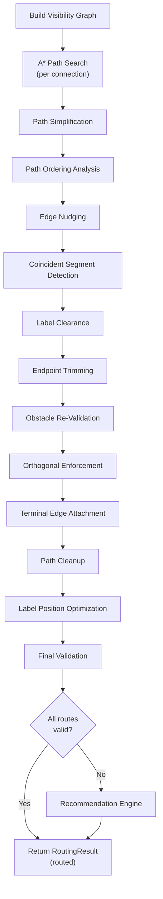

# Connection Routing Pipeline

This document describes the obstacle-aware orthogonal connection routing system. All routing classes are pure-geometry implementations with no EMF or SWT dependencies.

## Table of Contents

- [Pipeline Overview](#pipeline-overview)
- [Visibility Graph Construction](#visibility-graph-construction)
- [A* Path Search](#a-path-search)
- [Path Simplification](#path-simplification)
- [Path Ordering](#path-ordering)
- [Edge Nudging](#edge-nudging)
- [Coincident Segment Detection](#coincident-segment-detection)
- [Label Clearance](#label-clearance)
- [Terminal Edge Attachment](#terminal-edge-attachment)
- [Path Cleanup and Validation](#path-cleanup-and-validation)
- [Label Position Optimization](#label-position-optimization)
- [Recommendation Engine](#recommendation-engine)
- [Data Structures](#data-structures)
- [Configuration Constants](#configuration-constants)

## Pipeline Overview

The routing pipeline processes all connections in a view through multiple refinement stages. Each stage builds on the previous result.



**Key principles:**

- All paths are orthogonal (horizontal and vertical segments only)
- Obstacles are expanded by a margin (10px default) for clearance
- Later stages never undo earlier work
- Failed connections include move recommendations for blocking elements

**Source:** `model/routing/RoutingPipeline.java`

## Visibility Graph Construction

The `OrthogonalVisibilityGraph` builds a grid-like graph from obstacle rectangles.

### Build Process

1. **Obstacle expansion** — expand each obstacle by margin (default 10px) to maintain clearance
2. **Corner collection** — extract 4 corners from each expanded obstacle (top-left, top-right, bottom-left, bottom-right)
3. **Perimeter boundary nodes** — add 4 corner nodes beyond all obstacles to prevent graph disconnection in sparse layouts
4. **Interior pruning** — remove corner nodes that fall inside other expanded obstacles
5. **Scan line projection** — collect all unique x-coordinates and y-coordinates from corner nodes, create `SCAN_INTERSECTION` nodes at grid points not inside obstacles
6. **Edge building** — connect adjacent nodes on the same horizontal or vertical scan line if the segment is not blocked by obstacles

### Segment Blocking (Strict Mode)

A segment is blocked if it passes **strictly between** an obstacle's expanded boundaries (not touching them). Segments touching boundaries pass through freely.

This strict mode is essential — inclusive blocking breaks graph connectivity for corner nodes on obstacle boundaries.

### Port Node Injection

For each connection's source and target, the graph injects PORT nodes at element centers:

1. Check if a node already exists at `(x, y)`
2. If not, create a new PORT node
3. Connect to the graph by finding the nearest visible node in each cardinal direction (UP, DOWN, LEFT, RIGHT)

### Congestion Density

`computeEdgeDensity(from, to)` counts obstacles within a 60px radius of the edge midpoint. This density value feeds into congestion-aware A* cost calculation.

**Source:** `model/routing/OrthogonalVisibilityGraph.java`

## A* Path Search

The `VisibilityGraphRouter` performs A* search with **direction-aware state space** to minimize unnecessary bends.

### Search State

```text
State = (VisNode, entryDirection)
entryDirection in {UP, DOWN, LEFT, RIGHT, null}
```

Two arrivals at the same node from different directions are distinct states, allowing the search to explore different bend configurations.

### Cost Function

```text
f(state) = g(state) + h(state)

g = edgeCost + bendCost + directionCost + congestionCost

  edgeCost       = Euclidean distance to neighbor (axis-aligned = Manhattan)
  bendCost       = bendPenalty (30px) if direction changes, 0 if same direction
  directionCost  = DIRECTION_PENALTY (15px) if moving away from target on dominant axis
  congestionCost = congestionWeight (5.0) * edgeDensity (if density >= 2)

h = Manhattan distance to target (admissible heuristic)
```

**Bend penalty tuning:** Higher values produce fewer bends with longer paths. Lower values produce shorter paths with more bends. The default of 30px balances both.

**Source:** `model/routing/VisibilityGraphRouter.java`

## Path Simplification

After A* produces a path, greedy simplification removes unnecessary waypoints that result from grid traversal.

**Algorithm:**

1. From the current position, find the farthest reachable point
2. Test three strategies: straight line, horizontal-first L-turn, vertical-first L-turn
3. If endpoints differ in both x and y, insert an L-turn midpoint
4. Advance to the farthest reachable point and repeat

This eliminates staircase patterns common in grid-based pathfinding.

## Path Ordering

The `PathOrderer` analyzes parallel segments from different connections to detect unnecessary crossings.

### Segment Extraction

Only intermediate segments are extracted (not terminal segments connecting to source/target). This preserves which face connections enter/exit elements.

### Grouping

Segments are grouped by orientation and shared coordinate:
- `"H:150"` — horizontal segments at y=150 (within 2px tolerance)
- `"V:200"` — vertical segments at x=200 (within 2px tolerance)

### Crossing Detection

For each corridor group, the orderer compares:
- **Perpendicular order** — y-midpoint of connection endpoints (for horizontal corridors)
- **Parallel order** — x-midpoint of segments

If perpendicular order disagrees with parallel order, the crossing is topologically unnecessary.

**Source:** `model/routing/PathOrderer.java`

## Edge Nudging

The `EdgeNudger` separates overlapping parallel segments by distributing them across available corridor space.

### Corridor Bounds

For each segment group sharing a coordinate:

1. Compute the union of parallel ranges (x-ranges for horizontal segments)
2. Scan obstacles to find nearest boundaries above and below (for horizontal corridors)
3. Apply obstacle margin to prevent nudging into expanded zones
4. Result: `(lowerBound, upperBound)` defining available corridor width

If an obstacle straddles the corridor (entirely blocks it), nudging is skipped for that group.

### Distribution

1. Sort segments by perpendicular endpoint position (crossing-consistent order)
2. Compute spacing: `min(maxSpacing, max(minSpacing, corridorWidth / (count + 1)))`
3. Center the group: `startOffset = sharedCoord - (spacing * (count - 1)) / 2`
4. Assign new coordinates: `newCoord[i] = startOffset + i * spacing`
5. Clamp to corridor bounds

**Source:** `model/routing/EdgeNudger.java`

## Coincident Segment Detection

After edge nudging, the `CoincidentSegmentDetector` identifies segments from different connections that share identical coordinates.

### Criteria

Two segments are coincident if:
- Same orientation (horizontal or vertical)
- Same shared coordinate (within 2px tolerance)
- Overlapping parallel ranges (minimum 5px overlap)

### Offset Application

For each coincident pair:
1. Track which segments have already been offset (prevent double-processing)
2. Compute stacking ordinal for 3+ way coincidence
3. Apply perpendicular offset: `delta = 10px * ordinal`
4. If blocked by obstacle in positive direction, try negative
5. If both blocked, keep on shared coordinate

**Source:** `model/routing/CoincidentSegmentDetector.java`

## Label Clearance

For connections with non-empty labels, the pipeline checks whether the estimated label rectangle overlaps any obstacle.

### Label Rectangle Estimation

- Character width: 7px, height: 14px
- Padding: 10px horizontal, 6px vertical
- Label width: `text.length() * 7 + 10`
- Label height: `14 + 6 = 20px`

### Position Along Path

- `textPosition 0`: 15% from source (near source)
- `textPosition 1`: 50% along path (middle)
- `textPosition 2`: 85% from source (near target)

The position is computed by walking path segments, accumulating distance, and interpolating at the target fraction.

### Clearance Action

If the label overlaps an obstacle, the pipeline finds the nearest segment and shifts it perpendicular by label height + margin. After shifting, the path is cleaned up (micro-jog removal, dedup, collinear removal).

**Source:** `model/routing/LabelClearance.java`

## Terminal Edge Attachment

The `EdgeAttachmentCalculator` computes terminal bendpoints where connections attach to element perimeters.

### Face Determination

Compare the direction from element center to the nearest bendpoint:
- `|dx| > |dy|` — horizontal approach (LEFT or RIGHT based on sign)
- `|dy| >= |dx|` — vertical approach (TOP or BOTTOM based on sign)

### Distributed Attachment Points

When multiple connections attach to the same face of an element:

1. Build unified face groups (combining inbound and outbound connections per element face)
2. Sort by perpendicular approach coordinate
3. Distribute attachment points evenly across the face with 5px corner margin
4. If face is too narrow: center with 8px minimum spacing

### Perpendicular Enforcement

After placing terminal bendpoints, the calculator ensures the terminal segment is perpendicular to the element face:

- TOP/BOTTOM: `terminal.x` must equal `adjacent.x`
- LEFT/RIGHT: `terminal.y` must equal `adjacent.y`

If alignment is blocked by obstacles, try alternative offsets at +/-8, 16, 24, 32 pixels.

**Source:** `model/routing/EdgeAttachmentCalculator.java`

## Path Cleanup and Validation

After each major pipeline stage, the following cleanup passes run:

### Micro-Jog Removal

Detects segments shorter than 15px (vertical jogs with `dx==0, dy<=15` and horizontal jogs with `dy==0, dx<=15`). Snaps to the dominant direction's coordinate and propagates along connected segments.

### Deduplication and Collinear Removal

- Remove duplicate consecutive points
- Remove intermediate points on collinear segments (3+ points on the same horizontal or vertical line)

### Obstacle Re-Validation

After any modification (nudging, attachment, cleanup), re-check all segments against obstacle boundaries. Remove bendpoints whose adjacent segments cross obstacles. Iterate until clean (max iterations = path size + 5).

### Orthogonal Enforcement

If any consecutive bendpoint pair forms a diagonal segment, insert an intermediate L-turn point (horizontal-first) to restore orthogonality.

## Label Position Optimization

After routing completes, the `LabelPositionOptimizer` selects the best label position for each connection.

### Algorithm (Greedy)

1. Collect connections with non-empty labels
2. Sort by path length descending (longest paths first — most flexibility)
3. For each connection, evaluate all 3 positions (source=0, middle=1, target=2):
   - Score = element overlaps (1.0 each) + proximity near-misses (0.5 each)
   - Exclude source, target, ancestors, and descendants from scoring
4. Select position with minimum score
5. Lock the label rectangle (affects future scoring)

**Source:** `model/routing/LabelPositionOptimizer.java`

## Recommendation Engine

When connections fail routing (still crossing obstacles after all pipeline stages), the `RoutingRecommendationEngine` computes element move suggestions.

For each failed connection:
1. Identify which obstacle blocks the route
2. Compute displacement vector to clear the path
3. Check that the suggested move does not collide with other elements
4. Return `MoveRecommendation` with elementId, dx, dy, reason, and connections unblocked

**Source:** `model/routing/RoutingRecommendationEngine.java`

## Data Structures

### RoutingRect

```java
record RoutingRect(int x, int y, int width, int height, String id)
```

Lightweight rectangle in absolute canvas coordinates. Provides `centerX()` and `centerY()` convenience methods. Optional `id` for traceability.

### VisNode

```java
record VisNode(int x, int y, NodeType type)
// NodeType: OBSTACLE_CORNER, PORT, SCAN_INTERSECTION
```

### VisEdge

```java
record VisEdge(VisNode target, double distance, Direction direction)
// Direction: UP, DOWN, LEFT, RIGHT
```

### RoutingResult

```java
record RoutingResult(
    Map<String, List<AbsoluteBendpointDto>> routed,
    List<FailedConnection> failed,
    List<MoveRecommendation> recommendations,
    Map<String, List<AbsoluteBendpointDto>> violatedRoutes,
    int labelsOptimized,
    Map<String, Integer> optimalPositions)
```

- `routed` — connections that passed all validation
- `failed` — connections still crossing obstacles, with constraint details
- `violatedRoutes` — actual bendpoints for failed connections (for force-mode application)
- `recommendations` — move suggestions for blocking elements

### FailedConnection

```java
record FailedConnection(String connectionId, String sourceId,
                        String targetId, String constraintViolated,
                        String crossedElementId)
```

### MoveRecommendation

```java
record MoveRecommendation(String elementId, String elementName,
                          int dx, int dy, String reason,
                          int connectionsUnblocked)
```

## Configuration Constants

| Constant | Value | Purpose |
|----------|-------|---------|
| `DEFAULT_BEND_PENALTY` | 30px | A* cost per direction change |
| `DEFAULT_MARGIN` | 10px | Obstacle clearance distance |
| `MICRO_JOG_THRESHOLD` | 15px | Segments shorter than this are removed |
| `DEFAULT_CONGESTION_WEIGHT` | 5.0 | A* congestion cost multiplier |
| `DIRECTION_PENALTY` | 15px | A* cost for moving away from target |
| Segment grouping tolerance | 2px | Parallel segments within 2px share a corridor |
| Corner margin | 5px | Minimum gap from element corners for attachment |
| Coincident offset delta | 10px | Perpendicular offset between coincident segments |
| Coincident overlap minimum | 5px | Minimum parallel overlap to trigger coincidence |
| Label char width | 7px | Estimated character width for label sizing |
| Label char height | 14px | Estimated character height |
| Label padding | 10px x 6px | Horizontal and vertical label padding |

---

**See also:** [Layout Engine](layout-engine.md) | [Coordinate Model](coordinate-model.md) | [Architecture Overview](architecture.md)
