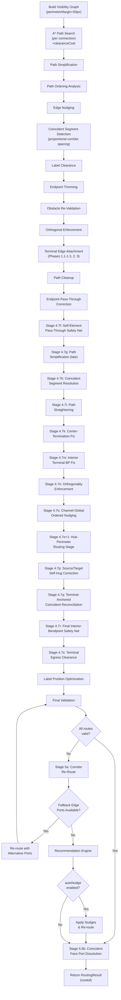

# Connection Routing Pipeline

This document describes the obstacle-aware orthogonal connection routing system. All routing classes are pure-geometry implementations with no EMF or SWT dependencies.

## Table of Contents

- [Pipeline Overview](#pipeline-overview)
- [Pipeline Invariants](#pipeline-invariants)
- [Best-of-K Seeded Multi-Start](#best-of-k-seeded-multi-start)
- [Visibility Graph Construction](#visibility-graph-construction)
- [A* Path Search](#a-path-search)
- [Path Simplification](#path-simplification)
- [Path Ordering](#path-ordering)
- [Edge Nudging](#edge-nudging)
- [Coincident Segment Detection](#coincident-segment-detection)
- [Channel-Global Ordered Nudging](#channel-global-ordered-nudging)
- [Label Clearance](#label-clearance)
- [Terminal Edge Attachment](#terminal-edge-attachment)
- [Path Cleanup and Validation](#path-cleanup-and-validation)
- [Post-Processing Stages](#post-processing-stages)
- [Label Position Optimization](#label-position-optimization)
- [Endpoint Pass-Through Correction](#endpoint-pass-through-correction)
- [Hub-Perimeter Routing Stage](#hub-perimeter-routing-stage)
- [Terminal-Segment Corridor Migration](#terminal-segment-corridor-migration)
- [Corridor Re-Route](#corridor-re-route)
- [Corridor Diversity](#corridor-diversity)
- [Fallback Edge Port Strategy](#fallback-edge-port-strategy)
- [Auto-Nudge on Route Failure](#auto-nudge-on-route-failure)
- [Recommendation Engine](#recommendation-engine)
- [Data Structures](#data-structures)
- [Configuration Constants](#configuration-constants)
- [References](#references)

## Pipeline Overview

The routing pipeline processes all connections in a view through multiple refinement stages. Each stage builds on the previous result.


```mermaid
flowchart TD
    A["Build Visibility Graph\n(perimeterMargin=50px)"] --> B["A* Path Search\n(per connection)\n+clearanceCost"]
    B --> C["Path Simplification"]
    C --> D["Path Ordering Analysis"]
    D --> E["Edge Nudging"]
    E --> F["Coincident Segment Detection\n(proportional corridor spacing)"]
    F --> G["Label Clearance"]
    G --> H["Endpoint Trimming"]
    H --> I["Obstacle Re-Validation"]
    I --> J["Orthogonal Enforcement"]
    J --> K["Terminal Edge Attachment\n(Phases 1.1-1.3, 2, 3)"]
    K --> L["Path Cleanup"]
    L --> L2["Endpoint Pass-Through\nCorrection"]
    L2 --> L3["Stage 4.7f: Self-Element\nPass-Through Safety Net"]
    L3 --> L4["Stage 4.7g: Path\nSimplification (late)"]
    L4 --> L5["Stage 4.7h: Coincident\nSegment Resolution"]
    L5 --> L6["Stage 4.7i: Path\nStraightening"]
    L6 --> L7["Stage 4.7k: Center-\nTermination Fix"]
    L7 --> L8["Stage 4.7m: Interior\nTerminal BP Fix"]
    L8 --> L9["Stage 4.7n: Orthogonality\nEnforcement"]
    L9 --> L9o["Stage 4.7o: Channel-Global\nOrdered Nudging"]
    L9o --> L9o1["Stage 4.7o+1: Hub-Perimeter\nRouting Stage"]
    L9o1 --> L9p["Stage 4.7p: Source/Target\nSelf-Hug Correction"]
    L9p --> L9q["Stage 4.7q: Terminal-Anchored\nCoincident Reconciliation"]
    L9q --> L9r["Stage 4.7r: Final Interior-\nBendpoint Safety Net"]
    L9r --> L9s["Stage 4.7s: Terminal\nEgress Clearance"]
    L9s --> M["Label Position Optimization"]
    M --> N["Final Validation"]
    N --> O{"All routes\nvalid?"}
    O -->|Yes| P5["Stage 5.0b: Coincident\nFace Port Dissolution"]
    P5 --> P["Return RoutingResult\n(routed)"]
    O -->|No| N2["Stage 5a: Corridor\nRe-Route"]
    N2 --> Q{"Fallback Edge\nPorts Available?"}
    Q -->|Yes| B2["Re-route with\nAlternative Ports"]
    B2 --> N
    Q -->|No| R["Recommendation Engine"]
    R --> S{"autoNudge\nenabled?"}
    S -->|Yes| T["Apply Nudges\n& Re-route"]
    T --> P5
    S -->|No| P5
```

**Key principles:**

- All paths are orthogonal (horizontal and vertical segments only)
- Obstacles are expanded by a clearance margin (10px default)
- Perimeter boundary nodes extend beyond obstacles by a separate perimeter margin (50px default) for exterior routing
- Later stages never undo earlier work
- Failed connections include move recommendations for blocking elements
- The whole pipeline runs inside a never-worse-by-construction best-of-K wrapper — see [Best-of-K Seeded Multi-Start](#best-of-k-seeded-multi-start)

**Source:** `model/routing/RoutingPipeline.java`

## Pipeline Invariants

### Perimeter-Terminal Immutability

Once `EdgeAttachmentCalculator` selects a terminal face for a connection, that face is captured in a `TerminalAnchoring(Face)` record (`model/routing/TerminalAnchoring.java`), and **the record** is immutable: the two parallel lists are filled once, at edge attachment, and every later reference only reads them.

**The record's immutability is not the terminal's.** An earlier revision of this section claimed that a downstream stage needing to swap the face applies the swap and its dependent terminal-segment update as a single atomic mutation, naming the Stage 4.7p self-hug correction as the example. No such mechanism exists in the pipeline. Stage 4.7p modifies interior bendpoints only — that is its contract and its javadoc says so — so it never swaps a face. The one stage that genuinely re-selects a face is the Stage 4.7f self-element pass-through correction, and it installs a terminal on the new face while leaving the record naming the old one.

A census over the fixture corpus, instrumented at every terminal-touching call from edge attachment through the final port spread and run once end to end, measured where terminals actually leave the recorded face line:

| stage | mechanism | terminals taken off the recorded face line |
|---|---|---:|
| micro-jog removal — in the Stage 4.5 cleanup, and again in the post-Stage-4.7 clearance cleanup | propagates a neighbour's coordinate onto the terminal index, unguarded | 59 |
| Stage 4.7o channel-global ordered nudging | writes the terminal index behind a centre-alignment check | 53 |
| obstacle re-validation — in the Stage 4.2 pass, and again in the post-Stage-4.7 clearance cleanup | repositions the terminal along its own face where it can, and otherwise **deletes** it, promoting its neighbour to terminal | 4 |
| Stage 4.7f self-element pass-through correction | re-selects a face and installs a terminal on it | 2 |
| every other terminal mutator, including 4.7h, 4.7i, 4.7k, 4.7m, 4.7p, 4.7p+1, 4.7q, 4.7r, 4.7s and 5.0b | — | 0 |

**These are per-stage creation events, not survivors, and they are frame-dependent — read both qualifiers before quoting a number.** A stage's count is how many terminals it took off the recorded face line at that point in the run; the Stage 4.6b realignment then repairs everything created before it, so the columns do not sum to the population that reaches the output. The counts are from the container-aware corpus frame, in which group frames are routing boundaries rather than obstacles; routing the same corpus with every parent treated as an obstacle gives 81 / 12 / 7 / 2 instead, and the four stages and the zeros are the same with only the weights moving.

The population that actually survives to the routed output is smaller than any of these figures and is measured separately. `RoutingComparisonTest`'s checked-in characterisation counts it in the plain-obstacle frame — terminals on no face line at all, **21** across the six fixtures over 169 routed connections — and isolates the channel-nudging pass's own share of it, 12, by toggling that stage's gate. It was 46 before the second terminal realignment and the terminal repositioning described below; two of the six fixtures are the same substrate, so the deduplicated figure is 21 of 139. **A per-stage creation count and a surviving-population count are different quantities; comparing one against the other without converting the frame will not reconcile.**

Obstacle re-validation is the row to watch when reading a write-range table for terminal safety, because deleting a terminal is not a write into the terminal index — the bendpoint behind it simply becomes the terminal, on whatever coordinate it happens to hold. A census keyed on writes cannot see that at all.

It now tries to repair rather than delete: when a terminal's own segment crosses an obstacle, the terminal is slid to its neighbour's coordinate along the element face it already sits on, clamped to that face's extent, and the move is kept only if the resulting segment is clean. The slide **abstains** where there is no face to slide along — a terminal on no face line, or one exactly on a corner where two hold and neither is identifiably the departure face — and where that one candidate position is itself obstructed. **It tries a single position, not the whole face**: the neighbour-aligned one, which is the position that makes the terminal segment perpendicular to the face. A different point on the same face might also clear the obstacle while leaving the segment diagonal, and that trade is not made — the terminal is deleted instead, because leaving an obstacle crossing in place is the worse defect. Measured over the corpus in the plain-obstacle frame: **4 terminals repositioned, 3 still deleted**, down from 7 deletions, with **no obstacle crossing introduced** and the routed-connection count unchanged at 169. Simply refusing to delete was measured too and is not the remedy: it takes the off-face population **up** from 23 to 27 and moves the routed count, because the promoted neighbour is then re-examined and the loop deletes elsewhere.

Micro-jog removal propagates a neighbouring coordinate onto the terminal index through `propagateCoord` with no face-line condition of any kind. Channel nudging guards its writes with a check on orthogonality to the element **centre**, which a terminal can satisfy while sitting off its face.

Terminal restoration is the Stage 4.6b realignment, and it now runs **twice**. The first invocation restores the edge-attachment terminals and repairs everything created before it, so the Stage 4.5 share never reaches the output. The second is seeded from a capture taken at the first one's exit — the last rung at which the terminals are known to be on their face lines — and runs immediately after the point-clearance cleanup, which is where the largest uncompensated displacement is created. It is placed **before** the Stage 4.7f face correction and **before** Stage 4.7o channel nudging, because both shape terminals by contract: restoring a coordinate over a deliberately re-selected face would leave the terminal on the old face while the record names the new one, and restoring one over a nudged hub port would undo the port distribution. Everything those later stages create is still uncompensated.

A third placement, after the whole Stage 4.7 series, was measured and rejected. It takes the surviving population lower still, but it restores terminals over the later stages' own terminal fixes, and one of those restorations lands a terminal on a face **line** beyond the element's extent — which the off-face census accepts, because its predicate tests the infinite line rather than the face segment, and a perimeter check rejects.

An **earlier** placement was then measured as well — a realignment after the two uncompensated Stage 4.7 cleanups but before the orthogonality check, the centre alignment and the face correction, so those stages keep the last word. It behaves better on every population figure: the off-face census falls from 21 to 13, the routed-connection count stays at 169, no connection fails to route, and the live-client quality pins on the hardest fixture are unmoved. It is rejected all the same, on the same gate as the later placement and with the same diagnostic, and the two are identical down to the coordinate: routed in the perimeter frame, both restore the source terminal of the same integration-oracle connection to `(1291, 1423)` on `General Ledger System`, whose left face line is x=1291 and whose own extent runs y=1363 to y=1418 — on the line, five pixels below the bottom of the element. The shipped pipeline puts that same terminal at `(1291, 1390)` in that frame, on the face segment. Both coordinates are perimeter-frame readings; the plain-obstacle frame puts the terminal somewhere else again, which is the point of the two-frame pinning described below. **Three mechanistically unrelated changes have now reached that one artefact**: changing which side a micro-jog collapse writes to, and two different placements of an extra realignment. The blocker is the artefact, not the mechanism, and a fourth mechanism aimed at the same population should expect it.

The self-element pass-through correction is the only one of the four that produces a *stale record* rather than a displaced point: it deliberately moves the terminal to a different but legitimate face. Stage 4.7f re-derives the anchoring from the terminal it installs, so the record follows the face. That refresh is conservative by design — it rewrites the record only when the relocated terminal sits exactly on the re-derived face's line, because a terminal on no face line carries no evidence of which face it belongs to, and guessing there would replace a stale record with an invented one.

Of the terminals that do survive to the routed output, the great majority sit on **no** face line at all while both face-deriving functions still agree on which face they belong to. That population is neither a guard failure nor a stale record, so neither guarding a mutator nor re-deriving the face would address it.

The census is pinned by `RoutingComparisonTest`'s off-face-line characterisation, which counts terminals sitting on no face line of their own element and turns red if that population moves.

That characterisation has a **perimeter-strength companion**, in the same file, counting the population the off-face predicate cannot see: terminals that keep a face-line coordinate but sit past the end of the element, which the weaker predicate scores as correct and a perimeter check rejects. It is pinned in **two frames**, because they disagree and only one of them is visible to the perimeter gates. In the plain-obstacle frame the shipped pipeline leaves **4** such terminals over 169 routed connections; in the perimeter frame — exterior margin 50, group rectangles passed as routing boundaries rather than obstacles — the same six fixture files over the same 169 connections carry **16**, alongside **60** terminals off every face line against the plain-obstacle frame's 21. All four of those figures are checked-in pins, in the same file, so none of them can go stale in this paragraph without a test going red. Those are not one population measured twice: measured once at the commit that added these pins, the two frames' off-face-line sets on the hardest fixture shared only three of the plain-obstacle frame's nine, and even those three sat at different coordinates — a one-off reading, not a pinned number, and it should be re-measured rather than quoted. **A terminal count is meaningless without its frame**, and a corrective measured only in the plain-obstacle frame has not been measured where its pins live — the realignment placements above each moved the perimeter-frame companion while leaving the plain-obstacle one at 4.

The predicate `TerminalAnchoring.preservesTerminalAnchoring` guards five **wrap sites**, which are mutators, not pipeline stages. They are enumerated in the source as `WrapSite`:

1. `SNAP_TO_STRAIGHT` — `PathStraightener.snapToStraight`
2. `ELIMINATE_REVERSALS` — `PathStraightener.eliminateReversals`
3. `COLLAPSE_STAIRCASE_JOGS` — `PathStraightener.collapseStaircaseJogs`
4. `COLLAPSE_BENDS` — `PathStraightener.collapseBends`
5. `APPLY_OFFSETS` — `CoincidentSegmentDetector.applyOffsets`

An earlier revision of this section listed *path simplification, coincident-segment resolution, path straightening, centre-termination fix, interior-BP fix* instead. That list was wrong on two counts: it named stages rather than mutators, and it included the centre-termination fix and the interior-BP fix, which `TerminalAnchoring` declares **outside** the predicate's domain by construction — they are contract-bearing terminal-shaping stages, not guarded mutators.

This prevents the earlier failure mode where a downstream stage moved a terminal away from the face the router had reserved port allocation for, collapsing hub-port distribution and producing fan-in bundles.

#### The rollback policy is a delta, shared by all five sites

The five sites share the predicate **and** the policy applied to its verdict. The policy lives in one place, `TerminalAnchoringRollbackPolicy`, and every site calls it.

All five roll back when a mutation **flips** a terminal from on-faceline to off-faceline, judged per end. What still varies between them is the second arm below — whether a site also pins a terminal that arrived off-face.

The flip rule alone says nothing about an end whose pre-mutation verdict was already negative: it compares faceline membership of whichever point occupies the terminal index, not whether that point is still the *same* point. A second arm covers that, and it is applied **per mutator**, because the sites differ in whether they can reach a terminal at all:

| mutator | write range (augmented frame; terminals at `1` and `size-2`) | pins an off-face terminal? |
|---|---|---|
| `snapToStraight` | `set(i)`, `i ∈ [1, size-2]` | **yes** — both terminals in range; can land one on the element centre |
| `collapseStaircaseJogs` | `set(i)`, `i ∈ [1, size-4]`; `remove(i+1)`, `remove(i+2)` ∈ `[2, size-2]` | **yes** — rewrites one point and removes two, so a removed terminal need not be collinear and the drawn route changes |
| `collapseBends` | `remove(i+1)` ∈ `[1, size-2]`, but only on an **exactly collinear** triple | no — removing a terminal forces the triple *(centre sentinel, terminal, next)*, so the removed point lay on the ray the anchor already draws along and the render is unchanged |
| `eliminateReversals` | confined to `[2, size-3]` by its own `protectTerminals` guard | no — it cannot reach a terminal |
| `applyOffsets` | `set(bpIdx1)`, `set(bpIdx2)` — unaugmented frame, so index `0` and `size-1` are the real terminals | **yes** — the wrap only runs when one of the two written indices *is* a terminal index, and nothing else bounds them |

The asymmetry is derived, not chosen: pin where the write range reaches a terminal and nothing else bounds it. Both exempting properties are pinned by test, so relaxing `collapseBends`' collinearity condition or removing `protectTerminals` fails the build rather than silently widening this wrap. The two ends are decided **independently**: because `preservesEndpoints` conjoins them, comparing that conjunction before and after would leave the target end unprotected on any path whose source arrived off-face — both readings would be negative, no flip would be observed, and a mutation dragging the target off its faceline would commit unchallenged.

Independently of the faceline criterion, a **structural** arm rejects unconditionally: if a mutation collapses the terminal-augmented path below four points, at least one real terminal has been collapsed out of it, and that is rejected whatever the pre-state was. A terminal that was already off its faceline is still a terminal.

`CoincidentSegmentDetector.applyOffsets` — the fifth site — rejected on the **post-state alone** until it was converted to the rule above. That exception is now closed. Because `preservesEndpoints` conjoins the two ends while the wrap only establishes that the offset segment reaches *one* of them, the post-state reading let an end at the far side of the path veto an offset it could not reach — typically an end that a contract-bearing terminal-shaping stage had legitimately moved off its faceline. Measured over the fixture corpus, that accounted for **9 rollbacks**, all of them at stage 4.7p+1 and none at 4.7h. (The corpus is six fixture files but five distinct views: two are the same view under different ids and return byte-identical census rows, so a per-file total double-counts that pair.)

`applyOffsets` needs no **structural** arm: its two call sites run outside the stage-4.7i augmentation, so `path[0]` and `path[size-1]` are the real perimeter terminals, and `tryOffset` writes through `set` only, leaving the path size invariant. The condition could never fire.

One check in the family remains a whole-path conjunction: `applyTerminalAnchoredReconciliation`. That is sound there and nowhere else, because that stage resolves a coincidence by **inserting** a drop bendpoint and never moves a terminal — so its verdict must be invariant, and a change of verdict is a logic-bug signal rather than a policy decision. Its rollback logs at warning level for exactly that reason.

The policy is pinned by `TerminalAnchoringRollbackPolicyTest` for the four `PathStraightener` sites and by `CoincidentSegmentDetectorTest` for `applyOffsets`, both of which drive the mutators. `ChopboxAnchorDegeneracyTest`'s parameterised matrix pins the *predicate* and cannot see the policy — it never invokes a mutator, and its helper returns the same verdict for every wrap site.

The invariant is JUnit-protected by `V4OracleQualityRegressionTest`, which pins:

- `hubPortQualityScore` ≥ 0.70
- `coincidentSegmentCount` ≤ 3
- `nonOrthogonalTerminalCount` ≤ 5

The test source names these constants `HPQ_FLOOR`, `M5_CEILING`, and `M1_CEILING`. The `M5_CEILING` name reflects the constant's release-gate slot, not the M5 hub-port-quality metric (which is bounded separately by `HPQ_FLOOR`). The constant bounds `result.coincidentSegmentCount()` — the legacy parallel-coincident-segment count.

against the V4 manual-routing oracle.

**Source:** `model/routing/TerminalAnchoring.java`, `model/routing/EdgeAttachmentCalculator.java`, `model/routing/RoutingPipeline.java`

## Best-of-K Seeded Multi-Start

`auto-route-connections` wraps the routing pipeline in a **never-worse-by-construction** best-of-K outer loop (`BestOfKRoutingStrategy`, K = 12). The pipeline is run several times from different starting seeds; the candidate with the best aggregate quality is kept.

The "never worse by construction" property holds because the default single-shot seed is always one of the K candidates. The wrapper can only ever return a result at least as good as the un-wrapped pipeline — it never trades a known-good route for a worse exploratory one. Selection uses the same aggregate quality scalar the assessor produces, so the chosen candidate is the one an `assess-layout` call would rate highest.

The wrapper is scoped at the structural level: it is pinned by structural regression tests against the V4 manual oracle and is not, on its own, credited with moving the agent-in-loop visual gate. It is a safety-and-upgrade wrapper, not a new routing algorithm — the per-seed work is the same pipeline documented in the rest of this file.

**Source:** `model/routing/BestOfKRoutingStrategy.java`, `model/routing/RoutingPipeline.java`

## Visibility Graph Construction

The `OrthogonalVisibilityGraph` builds a grid-like graph from obstacle rectangles, following the orthogonal-routing visibility-graph approach in [1], [2], [12].

### Build Process

1. **Obstacle expansion** — expand each obstacle by clearance margin (default 10px) to maintain clearance
2. **Corner collection** — extract 4 corners from each expanded obstacle (top-left, top-right, bottom-left, bottom-right)
3. **Perimeter boundary nodes** — add 4 corner nodes beyond all obstacles by `perimeterMargin` (default 50px). This larger perimeter enables exterior routing — connections can travel around the outside of element clusters rather than being forced through congested interior corridors
4. **Interior pruning** — remove corner nodes that fall inside other expanded obstacles
5. **Scan line projection** — collect all unique x-coordinates and y-coordinates from corner nodes, create `SCAN_INTERSECTION` nodes at grid points not inside obstacles
6. **Edge building** — connect adjacent nodes on the same horizontal or vertical scan line if the segment is not blocked by obstacles

### What Counts as an Obstacle — and What Counts as a Container

A container is **not** an obstacle. Archi renders two different objects as containers, and the router must treat both alike:

| Object | Created by | Router treatment |
|---|---|---|
| Native view group (`IDiagramModelGroup`) | `add-group-to-view` | Excluded from `obstacles`; contributed to `groupBoundaries` as a soft wall to keep clear of |
| ArchiMate `Grouping` element | `create-element` + `add-to-view` | **Same** — excluded from `obstacles`, contributed to `groupBoundaries` |

Three sites build the A* input, and each originally tested the native type alone: two excluded a group from `obstacles` outright, and one routed it into `groupBoundaries`. An ArchiMate `Grouping` matched none of them and fell through into `obstacles` — a solid, impassable rectangle. A connection between two zones therefore detoured around every third zone lying between them, where the identical native-group view routed straight through.

**Measured** on a three-zone corridor whose middle zone is clear at the connection's height: the native-group route holds its own height (vertical deviation 0), while the `Grouping` route deviated 203 px over four bendpoints. Both `auto-route-connections` and `auto-layout-and-route` reach this path. The endpoints' *own* ancestor zone was already excluded by id, so the defect bit third-party zones only — which is exactly the shape the technology and deployment guidance produces at scale.

Each site keeps its existing native-group treatment and merely admits the second kind, rather than one answer being chosen for all three: the terminals-only veto list skips containers, the per-connection list routes them to `groupBoundaries`, and the unified corridor-width list excludes them. The **label-position optimiser builds its obstacle list the same way and moves with them** — leaving it behind would have had the optimiser route a label around a rectangle the assessor no longer counts a label as overlapping, which is two passes disagreeing about one rectangle.

A related gate moves with them: `auto-route-connections` skips its **auto-nudge** pass when a sibling overlap is detected (degenerate element geometry can crash the re-routing pipeline), and that scan excluded native groups but not `Grouping`s. Two zones whose rectangles overlap therefore suppressed the nudge on a `Grouping`-built view and not on the identical native-group view — zones commonly abut or overlap slightly while the elements inside them do nothing degenerate. Both detectors move together, so the pair named in `AUTO_NUDGE_SKIPPED_SIBLING_OVERLAP` is always the pair that triggered the suppression.

#### The third category: a note is neither, and the two lists disagree about it on purpose

Containers and elements are not the whole vocabulary. A **note** is a third thing, and it is the one case where the pipeline's obstacle lists deliberately do **not** agree with each other.

| List | Built at | Notes? | Containers? | Consumed by |
|---|---|---|---|---|
| Per-connection `obstacles` | `ArchiModelAccessorImpl` | **excluded** | routed to `groupBoundaries` | the A* visibility graph, the violation classifier, the clearance passes |
| Terminals-only veto list | `ArchiModelAccessorImpl` | **excluded** | excluded | `pathCrossesObstacles` |
| Unified `allObstacles` | `ArchiModelAccessorImpl` | **INCLUDED** | excluded | edge nudging, coincident-segment offsets, label clearance, the label optimiser, hub-perimeter routing, move recommendations |

So a note is **empty air to the pathfinder and a solid rectangle to everything that measures the space around a settled path.** Both halves are intended:

- **A* ignores it** because notes are often large — a legend on a wide canvas is a big rectangle sitting in the middle of the corridors — and treating one as solid would over-constrain routing for the sake of an annotation. A connection therefore **will** be routed straight through a note that sits in its corridor. That is published in the `auto-route-connections` description and pinned by a test.
- **The post-path passes respect it** because a nudged segment or a connection label landing on a note is exactly as unreadable as one landing on an element. The label optimiser and the assessor have to agree about which rectangles a label may not sit on, and a note is one of them.

The practical consequence for a maintainer: **do not "fix" one list to match the other.** They are not a bug and a copy of the bug; they are two different questions about the same rectangle. `allObstacles` holds every non-container view object — notes, images and view references included — which is why the parameter documentation throughout `model/routing/` says exactly that rather than "element rectangles".

Because the router routes *through* a note by design, the crossing is disclosed rather than prevented: `auto-route-connections` returns `CONNECTION_ROUTED_THROUGH_NOTE` naming each (connection, note) pair, and `assess-layout` reports the same crossings as `connectionThroughNoteCount`. The two share one geometry — the perimeter clip and inward inset in `model/geometry/GeometryUtils.java` — precisely so that the disclosure and the metric can never disagree. Note that this is **not** the router's own obstacle geometry, which expands a rectangle outward by its margin rather than shrinking it inward by the inset; anything reported next to `assess-layout` uses the assessor's.

**Source:** `model/ArchiModelAccessorImpl.java` (the three input-building sites), `model/LabelOptimizationPass.java`, `model/OverlapResolver.java`. The container predicate itself lives in `model/TopLevelGroupTargets.java`, shared with the layout family. The note-crossing detector is `model/routing/ConnectionThroughNoteDetector.java`.

### Segment Blocking (Strict Mode)

A segment is blocked if it passes **strictly between** an obstacle's expanded boundaries (not touching them). Segments touching boundaries pass through freely.

This strict mode is essential — inclusive blocking breaks graph connectivity for corner nodes on obstacle boundaries.

### Port Node Injection

For each connection's source and target, the graph injects PORT nodes at element centers:

1. Check if a node already exists at `(x, y)`
2. If not, create a new PORT node
3. Connect to the graph by finding the nearest visible node in each cardinal direction (UP, DOWN, LEFT, RIGHT)

### Congestion Density

`computeEdgeDensity(from, to)` counts obstacles within a 60px radius of the edge midpoint. This density value feeds into congestion-aware A* cost calculation.

### Perpendicular Clearance

`computePerpendicularClearance(from, to)` measures the distance from a graph edge to the nearest obstacle boundary in the perpendicular direction:

- **Horizontal edges:** measures vertical distance from edge Y to nearest obstacle top/bottom boundary (only for obstacles whose X-range overlaps the edge's X-span)
- **Vertical edges:** measures horizontal distance from edge X to nearest obstacle left/right boundary (only for obstacles whose Y-range overlaps the edge's Y-span)
- Returns `Double.MAX_VALUE` if no nearby obstacles
- Returns `0` if the edge is inside an obstacle

This clearance value feeds into the A* clearance cost (capped at `MAX_EFFECTIVE_CLEARANCE` of 60px), steering the router toward edges with more open space without over-weighting very wide corridors.

**Source:** `model/routing/OrthogonalVisibilityGraph.java`

## A* Path Search

The `VisibilityGraphRouter` performs A* search [6] with **direction-aware state space** to minimize unnecessary bends [1], [12].

### Search State

```text
State = (VisNode, entryDirection)
entryDirection in {UP, DOWN, LEFT, RIGHT, null}
```

Two arrivals at the same node from different directions are distinct states, allowing the search to explore different bend configurations.

### Cost Function

```text
f(state) = g(state) + h(state)

g = edgeCost + bendCost + directionCost + congestionCost + clearanceCost
    + directionalityCost + groupWallClearanceCost

  edgeCost              = effectiveDistance to neighbor
                          effectiveDistance = distance * (1 + occupancyWeight * occupancy)
                          where occupancy = number of prior paths using this corridor
  bendCost              = bendPenalty (30px) if direction changes, 0 if same direction
  directionCost         = DIRECTION_PENALTY (15px) if moving away from target on dominant axis
  congestionCost        = congestionWeight (5.0) * edgeDensity (if density >= 2)
  clearanceCost         = clearanceWeight (75.0) / max(min(clearance, MAX_EFFECTIVE_CLEARANCE), 1.0)
                          (only when clearanceWeight > 0 and clearance < MAX_VALUE)
  directionalityCost    = directionalityWeight (30.0) * (1 - cos(angle)) / 2
                          where angle = angle between edge direction and vector to target
  groupWallClearanceCost = clearanceWeight (75.0) / max(min(groupWallClearance, MAX_EFFECTIVE_CLEARANCE), 1.0)
                          (only when clearanceWeight > 0 and group boundaries exist)

h = Manhattan distance to target (admissible heuristic)
```

**Bend penalty tuning:** Higher values produce fewer bends with longer paths [1]. Lower values produce shorter paths with more bends. The default of 30px balances both.

**Clearance cost tuning** (project-specific contribution — libavoid notably does not use inverse-distance clearance): The clearance cost is inversely proportional to perpendicular clearance — edges running close to obstacles are penalized more heavily. The `MAX_EFFECTIVE_CLEARANCE` cap (60px) prevents exterior corridors with unlimited space from becoming artificially attractive ("perimeter suction"). At weight 75.0, an edge with 1px clearance adds 75px equivalent cost, while an edge with 60px+ clearance adds only 1.25px. This steers paths toward open corridors without overriding bend and distance costs. The clearance cost has no effect on edges far from any obstacle (`clearance = MAX_VALUE`).

**Directionality cost tuning:** The cosine-based penalty steers edges toward the target using a continuous gradient. An edge moving directly toward the target adds 0 cost; perpendicular movement adds `directionalityWeight/2` (15px); movement directly away adds the full `directionalityWeight` (30px). This reduces non-orthogonal terminal segments by encouraging direct approach paths rather than circuitous routes around the perimeter.

**Group-wall clearance cost:** Penalizes edges running close to group boundaries, steering the router toward inter-group gaps (corridor centers) rather than inside-group-wall corridors. Uses the same clearance formula and `MAX_EFFECTIVE_CLEARANCE` cap as obstacle clearance. Only active when group boundaries are provided (grouped views). Measures perpendicular distance from each edge to the nearest group top/bottom (for horizontal edges) or left/right boundary (for vertical edges).

**Source:** `model/routing/VisibilityGraphRouter.java`

## Path Simplification

After A* produces a path, greedy simplification removes unnecessary waypoints that result from grid traversal.

**Algorithm:**

1. From the current position, find the farthest reachable point
2. Test three strategies: straight line, horizontal-first L-turn, vertical-first L-turn
3. If endpoints differ in both x and y, insert an L-turn midpoint
4. Advance to the farthest reachable point and repeat

This eliminates staircase patterns common in grid-based pathfinding.

## Path Ordering

The `PathOrderer` analyzes parallel segments from different connections to detect unnecessary crossings [1], [5].

### Segment Extraction

Only intermediate segments are extracted (not terminal segments connecting to source/target). This preserves which face connections enter/exit elements.

### Grouping

Segments are grouped by orientation and shared coordinate:
- `"H:150"` — horizontal segments at y=150 (within 2px tolerance)
- `"V:200"` — vertical segments at x=200 (within 2px tolerance)

### Crossing Detection

For each corridor group, the orderer compares:
- **Perpendicular order** — y-midpoint of connection endpoints (for horizontal corridors)
- **Parallel order** — x-midpoint of segments

If perpendicular order disagrees with parallel order, the crossing is topologically unnecessary.

**Source:** `model/routing/PathOrderer.java`

## Edge Nudging

The `EdgeNudger` separates overlapping parallel segments by distributing them across available corridor space [1], [4].

### Corridor Bounds

For each segment group sharing a coordinate:

1. Compute the union of parallel ranges (x-ranges for horizontal segments)
2. Scan obstacles to find nearest boundaries above and below (for horizontal corridors)
3. Apply obstacle margin to prevent nudging into expanded zones
4. Result: `(lowerBound, upperBound)` defining available corridor width

If an obstacle straddles the corridor (entirely blocks it), nudging is skipped for that group.

### Distribution

1. Sort segments by perpendicular endpoint position (crossing-consistent order)
2. Compute spacing: `min(maxSpacing, max(minSpacing, corridorWidth / (count + 1)))`
3. Center the group: `startOffset = sharedCoord - (spacing * (count - 1)) / 2`
4. Assign new coordinates: `newCoord[i] = startOffset + i * spacing`
5. Clamp to corridor bounds

**Source:** `model/routing/EdgeNudger.java`

## Coincident Segment Detection

After edge nudging, the `CoincidentSegmentDetector` identifies segments from different connections that share identical coordinates and separates them using proportional corridor spacing.

### Criteria

Two segments are coincident if:
- Same orientation (horizontal or vertical)
- Same shared coordinate (within 2px tolerance)
- Overlapping parallel ranges (minimum 5px overlap)

### Offset Application (Three-Pass Architecture)

**First pass — Corridor collection:** Groups segments by orientation and shared coordinate using tolerance-aware grouping. Key format: `"H:<coordinate>"` or `"V:<coordinate>"`.

**Second pass — Gap computation:** For each corridor group (2+ segments), `computeCorridorGap()` scans obstacles to find the nearest boundary on each perpendicular side of the shared coordinate, within the overlap range. Returns `[nearBound, farBound]` defining available perpendicular space. Defaults to `MAX_UNBOUNDED_EXTENT` (100px) when no bounding obstacle exists.

**Third pass — Offset application:** Tries proportional spacing first, falls back to fixed-delta if the corridor is too narrow.

**Proportional mode** (`computeProportionalOffsets()`): distributes N segments evenly across the corridor gap, following the channel-centring scheme in [4] simplified to a closed-form division:

```text
position[i] = gapStart + gapWidth * (i + 1) / (N + 1)
```

Returns `null` if the resulting spacing would be less than `MIN_SEPARATION` (8px), triggering the fixed-delta fallback.

**Fixed-delta fallback** (`applyFixedDeltaOffsets()`): original stacking behavior. First segment anchors in place; remaining segments offset by `offsetDelta * ordinal` (10px default). Tries positive direction first, then negative if blocked by obstacles.

### Perimeter-Terminal Preservation

Coincident detection skips segments whose endpoints are perimeter terminals — i.e. terminal bendpoints anchored by `TerminalAnchoring(Face)` on a hub element. The same guard is applied in the `collapseBends` post-pass. Without this guard, redistributing two perimeter-terminal segments to separate corridors collapses hub-port distribution back into a single bundled attachment, undoing the work of Phase 1.1 and of the hub-perimeter stage (Stage 4.7o+1 — this sentence carried the ambiguous `4.7m` label while two stages shared it; the interior terminal BP fix, the other `4.7m`, has nothing to do with port distribution). The guard preserves hub-port quality through the full pipeline at the cost of leaving a small number of intentional perimeter-anchored coincidences for downstream channel nudging to address.

**Source:** `model/routing/CoincidentSegmentDetector.java`

## Channel-Global Ordered Nudging

### Stage 4.7o

`ChannelNudgingPass` is a global post-pass that runs after coincident-segment detection and before the post-processing stages, redistributing parallel segment runs across obstacle-bounded corridors. It implements the channel-centring + ordered-nudging pattern from [4] and the channel-grouping primitive from libavoid's `performUnifyingNudgingPreprocessingStep` ([12]).

**Channel keying.** Where the previous corridor-occupancy work reused `(axis, sharedCoord)` keys, `ChannelKey` is `(axis, gapLow, gapHigh)` — the perpendicular obstacle-bounded gap that contains the segment run. Two parallel runs at the same shared coordinate but in different inter-obstacle gaps are now distinct channels and nudged independently. This eliminated the regression where a single key collected runs from both sides of a separating obstacle.

```text
ChannelKey(axis, gapLow, gapHigh)

axis     = HORIZONTAL | VERTICAL
gapLow   = nearest obstacle boundary on the perpendicular-low side
gapHigh  = nearest obstacle boundary on the perpendicular-high side
```

**Algorithm.**

1. Group segment runs by `ChannelKey`.
2. For each channel, sort runs by perpendicular endpoint (crossing-consistent order).
3. Compute per-channel midpoint `(gapLow + gapHigh) / 2` and available width `gapHigh − gapLow − 2·MIN_CLEARANCE_PX`.
4. Distribute runs across the available width, preserving `MIN_CLEARANCE_PX` on each side.
5. Two runs with the same `ChannelKey` but non-overlapping parallel ranges do **not** receive the same track — they are nudged independently.

**Toggle.** The `enableChannelNudging` parameter on `auto-route-connections` defaults to `true`. Setting `false` disables Stage 4.7o entirely (used for diagnostic comparison runs).

**Diagnostic.** Setting `-Darchi.mcp.channelnudging.diagnostic=true` enables verbose channel-by-channel logging via `ChannelNudgingPass.DIAGNOSTIC_PROPERTY`.

**Source:** `model/routing/ChannelNudgingPass.java`, `model/routing/RoutingPipeline.java`

## Label Clearance

For connections with non-empty labels, the pipeline checks whether the estimated label rectangle overlaps any obstacle.

### Label Rectangle Estimation

- Character width: 7px, height: 14px
- Padding: 10px horizontal, 6px vertical
- Label width: `text.length() * 7 + 10`
- Label height: `14 + 6 = 20px`

### Position Along Path

- `textPosition 0`: 15% from source (near source)
- `textPosition 1`: 50% along path (middle)
- `textPosition 2`: 85% from source (near target)

The position is computed by walking path segments, accumulating distance, and interpolating at the target fraction.

### Clearance Action

If the label overlaps an obstacle, the pipeline finds the nearest segment and shifts it perpendicular by label height + margin. After shifting, the path is cleaned up (micro-jog removal, dedup, collinear removal).

**Source:** `model/routing/LabelClearance.java`

## Terminal Edge Attachment

The `EdgeAttachmentCalculator` computes terminal bendpoints where connections attach to element perimeters. Processing runs in multiple phases.

### Phase 1.1: Hub Face Redistribution

For hub elements (>= 6 connections), `redistributeHubFaces()` checks face load balance. If a single face carries more than 60% of connections, excess connections are redistributed to adjacent faces. The Kandinsky orthogonal layout model [8] is the background reference for handling vertices of degree > 4; the redistribution policy itself is a project contribution.

### Phase 1.2: Natural Approach Direction

`correctApproachDirection()` adjusts face selection for nearly-aligned elements where the dominant axis is more than 1.2x the minor axis. For vertical alignment, source exits BOTTOM and target enters TOP (or vice versa). For horizontal alignment, uses LEFT/RIGHT. Hub elements are excluded to preserve distributed port allocation.

### Phase 1.3: Pass-Through-Aware Face Selection

`validateFacesForSelfPassThrough()` builds trial paths using current face assignments and checks whether each path clips through its own source or target element (using a 5px inset). When a pass-through is detected, `findCleanAlternativeFace()` tries alternative faces in angular proximity order until a clean path is found.

This phase must run after Phases 1.1 and 1.2 (which set initial face assignments) and before distributed attachment point calculation.

### Face Determination

Compare the direction from element center to the nearest bendpoint:
- `|dx| > |dy|` — horizontal approach (LEFT or RIGHT based on sign)
- `|dy| >= |dx|` — vertical approach (TOP or BOTTOM based on sign)

### Distributed Attachment Points

When multiple connections attach to the same face of an element:

1. Build unified face groups (combining inbound and outbound connections per element face)
2. Sort by perpendicular approach coordinate
3. Distribute attachment points evenly across the face with 15px corner margin
4. If face is too narrow: center with 8px minimum spacing

### Capacity-Aware Port Distribution

Hub elements that have not been resized to fit their connection count produce a face slot count below the connection count. Before this distribution, the calculator collapsed all over-capacity connections to a single attachment point; the routing pipeline subsequently received a degenerate fan-in geometry and could not recover hub-port distribution.

In v1.4, when face slot count is below connection count, the calculator distributes attachment points proportionally across the available face length using the same crossing-consistent order as the standard distribution path. The user is still encouraged to resize the hub (see [Hub Element Detection in the Layout Engine doc](layout-engine.md#hub-element-detection)) — the proportional distribution is a fallback that prevents the worst-case visual regression rather than a substitute for sufficient face capacity.

A 12px visual-distinguishability floor applies: if proportional distribution would produce sub-12px spacing between adjacent ports, multiple connections collapse into shared slots in a controlled way rather than overflowing the face. The threshold reflects the empirical minimum perceptible separation between distinct line-anchor points on a rendered diagram.

### Perpendicular Enforcement

After placing terminal bendpoints, the calculator ensures the terminal segment is perpendicular to the element face:

- TOP/BOTTOM: `terminal.x` must equal `adjacent.x`
- LEFT/RIGHT: `terminal.y` must equal `adjacent.y`

If alignment is blocked by obstacles, try alternative offsets at +/-8, -8, 16, -16, 24, -24, 32, -32, 48, -48, 64, -64, 96, -96 pixels.

**Source:** `model/routing/EdgeAttachmentCalculator.java`

## Path Cleanup and Validation

After each major pipeline stage, the following cleanup passes run:

### Micro-Jog Removal

Detects segments shorter than 15px (vertical jogs with `dx==0, dy<=15` and horizontal jogs with `dy==0, dx<=15`). Snaps to the dominant direction's coordinate and propagates along connected segments.

### Deduplication and Collinear Removal

- Remove duplicate consecutive points
- Remove intermediate points on collinear segments (3+ points on the same horizontal or vertical line)

### Obstacle Re-Validation

After any modification (nudging, attachment, cleanup), re-check all segments against obstacle boundaries. Remove bendpoints whose adjacent segments cross obstacles. Iterate until clean (max iterations = path size + 5).

### Orthogonal Enforcement

If any consecutive bendpoint pair forms a diagonal segment, insert an intermediate L-turn point (horizontal-first) to restore orthogonality.

## Post-Processing Stages

After path cleanup and endpoint pass-through correction, a sequence of post-processing stages runs per connection. Each stage operates on the cumulative result of all previous stages.

**The sections below are a deliberately partial list**, and no count is given here because a count in prose rots the moment a stage is added. The code carries these stages with no section of their own: the base bendpoint-clearance pass `4.7`, segment clearance `4.7b`, terminal-corridor clearance `4.7c`, terminal-orthogonality verification `4.7d`, the first ChopboxAnchor centre-alignment `4.7e`, the centre-termination safety-net validation `4.7l` (which only logs), and the post-self-hug coincident re-run `4.7p+1`. Channel-global ordered nudging `4.7o` and the hub-perimeter stage that follows it have their own top-level sections rather than entries here. The pipeline order in `RoutingPipeline.routeAllConnections` is the authority; stage letters in this document are labels for the reader, not an index.

> **Read stage numbers as labels, not as an ordering key.** The letters are not contiguous — there is no `4.7a` and no `4.7j` — and the hub-perimeter stage carried a duplicate `4.7m` label until it was renumbered `4.7o+1`. Address a stage by its file and line when it matters.

### Stage 4.7f: Self-Element Pass-Through Safety Net

Re-runs `correctSelfElementPassThrough()` for both source and target elements. This catches pass-throughs introduced by edge attachment (Stage 4) that were not addressed by the initial endpoint correction. While often ineffective for self-element geometry (detours loop back to the source face), it is retained as defense-in-depth.

> **Rating note:** Self-element pass-throughs that survive this safety net are reported by `assess-layout` for visibility but **excluded from the overall rating**. Cross-element pass-throughs continue to penalise the rating as before. See [Layout Engine — Pass-Throughs](layout-engine.md#pass-throughs).

### Stage 4.7g: Late-Stage Path Simplification

`simplifyFinalPath()` performs greedy shortcutting after all post-processing. The algorithm:

1. From the current position, find the farthest reachable point
2. Test three strategies: straight line, horizontal-first L-turn, vertical-first L-turn
3. Advance to the farthest reachable point and repeat

Terminal bendpoints (first and last) are preserved as chain anchors. Requires at least 4 bendpoints. After simplification, runs deduplication and collinear point removal.

This stage eliminates unnecessary bends introduced by edge nudging, coincident detection, and terminal attachment.

### Stage 4.7h: Post-Simplification Coincident Resolution

Reuses `CoincidentSegmentDetector.detect()` and `applyOffsets()` to catch coincident segments introduced by all preceding post-processing stages (approach direction correction, face selection, path simplification). The proportional-spacing fallback follows [4]. After resolution, runs deduplication and collinear cleanup. This is one of the two wrap-carrying `applyOffsets` call sites — the other is stage 4.7p+1 — and both apply the shared rollback policy described above, including the off-face pin.

### Stage 4.7i: Path Straightening

The `PathStraightener` applies four correction passes in order:

1. **Snap-to-straight** — For each interior point, checks alignment with predecessor then successor. Snaps if delta in one axis is within threshold (default 20px) and smaller than delta in the other axis. Only snaps to successor when it straightens a kink, not an L-turn corner. Validates snapped segments are obstacle-free.

2. **Direction reversal elimination** — Iteratively finds the largest reversal (outermost pair of segments with opposite directions on the same axis). If start and end are collinear, collapses directly. Otherwise, tries L-turn replacement (horizontal-first, then vertical-first). Safety bound: `maxIterations = path.size()`.

   When invoked on the terminal-augmented path (with the prepended/appended terminal anchors — see below), a `protectTerminals` guard confines the collapse to the route *interior*: terminal anchors may remain collapse endpoints but are never themselves removed. This is what lets `auto-route-connections` **self-heal the "exit-then-return" terminal zigzag** — a connection that overshoots past its target's far edge and doubles back to attach. Previously the pass could greedily match the widest reversal and delete a terminal anchor along with the overshoot; the perimeter-terminal-immutability guard ([the perimeter-terminal immutability invariant](#perimeter-terminal-immutability)) then rolled the whole straightening pass back, so the overshoot survived until a full re-layout. Confining the collapse to the interior removes the overshoot in place while keeping both terminal attachment points byte-identical. When a foreign element genuinely blocks the straightened corridor, the obstacle check declines the collapse and the route is left untouched.

   The `protectTerminals` guard remains necessary now that the wrap rolls back on a flip rather than on the post-state. Deleting a terminal anchor changes *which point is the terminal*, so the faceline verdict still flips and the whole pass is still rolled back. The guard restricts the mutation; the delta policy corrects the rollback rule. They address different halves of the same failure and neither subsumes the other.

3. **Staircase jog collapse** — Detects H-V(jog)-H or V-H(jog)-V patterns where the perpendicular step is within threshold. Shifts the first point to align with the fourth point's axis, removing the two intermediate points. Validates that the resulting segments are obstacle-free.

4. **Bend collapse** — Removes collinear intermediate points where three consecutive points share the same X or Y coordinate and the direct connection is obstacle-free. Requires at least 4 points.

Before Stage 4.7i runs, the pipeline temporarily prepends source center and appends target center to detect terminal-involving reversals. After processing, these anchors are stripped. All four passes above are wrap sites: each snapshots the path on entry and rolls back on the delta rule described under [the perimeter-terminal immutability invariant](#perimeter-terminal-immutability) — a mutation is rejected only if it moves a terminal off a faceline that terminal was on beforehand, judged per end, or if it collapses the augmented path below four points. Stage 4.7i is the only production caller of these four mutators; the terminals-only re-route path does not reach them.

**Source:** `model/routing/PathStraightener.java`

### Stage 4.7k: Center-Termination Fix

`fixCenterTerminatedPath()` detects bendpoints placed at the exact center coordinates of their source or target element. Archi's ChopboxAnchor draws a ray from the element center to the first/last bendpoint — when a bendpoint is at the center, this ray has zero length, producing a visual "center termination" where the connection appears to start or end at the element's center rather than its edge.

**Algorithm:**

1. Check if the first bendpoint equals the source element's center coordinates
2. If yes, determine the correct exit face toward the second bendpoint using `determineFace()`
3. Replace the center bendpoint with a point 1px outside the edge face midpoint
4. Repeat for the last bendpoint and target element

This stage runs twice: once after edge attachment (primary fix), and once as defense-in-depth after the cleanup loop — post-processing stages can inadvertently shift bendpoints back to center positions.

**Source:** `model/routing/RoutingPipeline.java`

### Stage 4.7m: Interior Terminal BP Fix

`fixInteriorTerminalBPs()` detects and corrects all bendpoints that fall inside their source or target element bounds — a superset of the center-termination problem (Stage 4.7k catches only exact-center matches, while 4.7m catches all interior points including those near boundaries).

**Algorithm:**

1. Check each bendpoint against source and target element bounding boxes
2. **Terminal BPs** (first/last) inside an element: reposition to the appropriate edge face midpoint, 1px outside the element boundary
3. **Intermediate BPs** inside an element: remove entirely
4. After repositioning, check if the modification broke orthogonality (created diagonal segments) and insert L-bend points where needed

This stage includes a defense-in-depth second pass after cleanup to catch regressions.

**Source:** `model/routing/RoutingPipeline.java`

### Stage 4.7n: Orthogonality Enforcement Safety Net

`enforceOrthogonalPaths()` performs a final scan of all routed paths, detecting any remaining diagonal segments (consecutive bendpoints where both dx and dy differ) and inserting horizontal-first L-turn bendpoints to restore orthogonality.

This catches edge cases where cleanup stages (deduplication, collinear removal) remove bendpoints without reinserting the L-bends needed to maintain orthogonal paths.

**Source:** `model/routing/RoutingPipeline.java`

### Stage 4.7p: Source / Target Self-Hug Correction

When a route's first or last interior segment runs along its own source or target element's perimeter on the way to the opposite endpoint, the connection visually overlaps the element edge — distinct from a pass-through but equally hard to read. `correctSourceFaceHug()` and `correctTargetFaceHug()` detect runs colinear with a face line of the source/target rectangle and shift the offending segment outward into the nearest free corridor.

After the correction shifts a segment, the stage re-runs `CoincidentSegmentDetector` to catch coincident segments introduced by the shift (annotated in source as Stage `4.7p+1`).

This is an empirical fix — there is no published algorithm for "perimeter-hugging segments" as a defect class. It is calibrated against the V4 manual-routing oracle.

**Source:** `model/routing/RoutingPipeline.java` (`correctSourceFaceHug`, `correctTargetFaceHug`)

### Stage 4.7q: Terminal-Anchored Coincident Reconciliation

A final reconciliation pass for coincident segments that earlier stages cannot separate because both endpoints are pinned by `TerminalAnchoring(Face)`. Stages 4.7h and 4.7p+1 use the four-argument detector overload that respects perimeter-terminal preservation; Stage 4.7q runs the channel-centring rationale from [4] on the residual to choose the least-bad placement, accepting one offset rather than producing a coincidence.

V4 oracle measurement: legacy `coincidentSegmentCount` 12 → 2 with `hubPortQualityScore` 0.78 preserved. (The legacy metric is the one the regression test bounds via the constant named `M5_CEILING` — distinct from the new M4 `connectionEdgeCoincidenceCount` introduced in the v1.4 assessor redesign.)

**Source:** `model/routing/RoutingPipeline.java`

### Stage 4.7r: Final Interior-Bendpoint Safety Net

Re-runs `fixCenterTerminatedPath()` and `fixInteriorTerminalBPs()` over every path. Stages 4.7n–4.7q can push a terminal back inside an endpoint element after Stage 4.7m has cleaned it, so this pass catches the residue before label optimisation and the final violation check.

On the fixture corpus this pass writes a terminal **once** and changes no route's face-line membership — it is a safety net that currently catches almost nothing, which is the shape a safety net is supposed to have.

**Source:** `model/routing/RoutingPipeline.java` (`fixCenterTerminatedPath`, `fixInteriorTerminalBPs`)

### Stage 4.7s: Terminal Egress Clearance

`TerminalEgressClearancePass` clears an **off-face terminal hug** — a connection that leaves an element face then runs a pixel or two *parallel* to that same face before turning, so the trunk reads as if it is stuck to the box it just departed. The pass detects a terminal-incident segment hugging the departed face and pushes its first trunk clear.

**Dual-axis healthy-floor model.** The accept/reject test (`netImproves`) replaced an earlier over-strict, wrong-axis guard ("never reduce the vertical parallel-gap p10, `V_p10`"), which was both the wrong axis for a *horizontal* hug and too strict (it rolled back the only stub that would clear the hug). The current model enforces a per-axis **healthy floor** (`regressesBelowHealthyFloor`): a lift is accepted as long as it does not push *either* the vertical (`vP10`) or horizontal (`hP10`) parallel-gap p10 below the healthy minimum `HEALTHY_PARALLEL_GAP_PX` (15 px). So a healthy-to-healthy tightening (e.g. 238 → 151) is now allowed, while a push into the danger zone stays blocked. `vP10` / `hP10` are computed from a private `EgressMetrics` record (the horizontal mirror is `HubPerimeterRoutingStage.computeHAxisParallelGapP10`). Because a fixed hug no longer drops M4, the pass is idempotent and cannot ratchet a field down across repeated routes.

**Short-run own-face micro-hugs.** A foreign-edge overlap test requires ≥ 10 px of shared run to register, so a *short* (< 10 px) micro-hug of an element's *own* face was invisible to it. An own-face short-circuit in `tryEgress` treats a terminal pinned on its own face line as a hug at any positive run length (the foreign-edge collectors are unchanged, so the wider corpus stays byte-identical). Because the M4 keep-signal is also 10 px-gated and would roll a sub-10 px fix back, the pass adds an in-pass `computeOffFaceStubCount` (mirroring the assessor's `OFF_FACE_MIN_STUB_PX` = 8 px oracle) to `EgressMetrics`, and `netImproves` keeps a lift on an M4 drop **or** a stub-count drop with M4 non-regress.

This pass drives the assessor's `offFaceParallelTerminalCount` signal (see [layout-engine.md](layout-engine.md)) to zero on the full-route path.

**Source:** `model/routing/TerminalEgressClearancePass.java`, `model/routing/HubPerimeterRoutingStage.java`

### Terminals-Only Egress Clearance

`auto-route-connections` `mode: "terminals-only"` rectifies only the first/last bendpoint of each connection, so it never enters `routeAllConnections` and cannot reuse `TerminalEgressClearancePass` — that pass requires the hug to be the *terminal-incident* segment, whereas terminals-only renders `elementCenter → L-bend → trunk`, so the hug is the **trunk after the L-bend**. The same healthy floor is therefore mirrored as pure geometry in `RoutingPipeline` (`terminalsOnlyEnforceEgressClearance` + `terminalsOnlyRectifyAndClearEgress` + `tryLiftTerminalHug`), reusing `HEALTHY_PARALLEL_GAP_PX` (15 px) and `OFF_FACE_MIN_STUB_PX` (8 px). Detection fires at the assessor's 8 px oracle threshold, so an already-clearing terminal is byte-identical; the push targets 15 px. A per-side **orthogonality backstop** validates the egress segment and the segment beyond the moved trunk (falling back to the opposite element centre on a two-bendpoint path) and declines any lift that would introduce a diagonal. The composition runs egress clearance even when rectification is a no-op, so an already-orthogonal-but-hugging terminal is still fixed. The lifted path still flows through the existing interior / zigzag / obstacle / crossing vetoes.

**Interior collinear collapse.** The terminals-only rectifier prepends/appends terminal L-bends without any collinear sweep, so an inserted L-bend that lands collinear with the existing trunk leaves an exactly-collinear *interior* bendpoint that a full re-route would have removed — it renders as a redundant point on a straight run and shows up in `connectionRedundantBendpointCount`. `terminalsOnlyRectifyAndClearEgress` now runs a plain interior `removeCollinearPoints` sweep with value-based no-op detection, so a pre-existing interior survivor is collapsed even when rectification and egress clearance are both no-ops. The sweep is **interior-only**: the terminal egress anchors (first/last bendpoints) are never removed, preserving the terminal-anchoring / hub-port-distribution invariant. `routeAllConnections` and the assessor are unchanged, so the golden routing corpus stays byte-identical.

**Source:** `model/routing/RoutingPipeline.java` (`terminalsOnlyEnforceEgressClearance`, `terminalsOnlyRectifyAndClearEgress`, `tryLiftTerminalHug`)

### Stage 5.0b: Coincident Face Port Dissolution

> This pass is numbered **5.0b**, not 4.7s. It runs *after* the routed map has been built and after the Stage 5a corridor re-route, so it is outside the `4.7x` sequence entirely and sees only connections that survived the final violation check. Earlier revisions of this document gave it the label `4.7s`, which belongs to terminal egress clearance above.

Downstream terminal stages can pull a connection's source-exit and another connection's target-entry on the *same low-degree element face* onto that face's centre, collapsing two terminals onto one perimeter port (the `coincidentFacePortCount` defect the assessor reports, where two edges appear to leave one point). A gated **final pass in `routeAllConnections`** — running after all terminal stages — separates them: it groups terminals per element face, clusters them by along-face slot, and for each colliding cluster moves whichever member *can* move (swapping the anchor when the one tried is an immovable face-hug), avoiding every other terminal already on that face.

Every move is gated so the pass is a **byte-identical no-op except on an actual collision**: element degree below the hub threshold (a dense hub keeps its own distribution), the terminal on the perimeter, a provable collision within the assessor's `HUB_PORT_SLOT_TOLERANCE_PX`, a free on-line slot at least the 12 px distinguishability floor from every occupied slot (else the collision is accepted rather than forced), the relocated stub staying perpendicular, zero new edge crossing, and no obstacle crossing; a loop-until-stable collinear cleanup leaves no redundant bendpoint behind. Because nothing moves unless all gates pass, the full corpus stays byte-identical with no oracle re-baseline. It is the router half of the `coincidentFacePortCount` oracle above.

**Source:** `model/routing/RoutingPipeline.java` (coincident same-face port spread pass)

## Label Position Optimization

After routing completes, the `LabelPositionOptimizer` selects the best label position for each connection.

### Algorithm (Greedy)

1. Collect connections with non-empty labels
2. Sort by path length descending (longest paths first — most flexibility)
3. For each connection, evaluate all 3 positions (source=0, middle=1, target=2):
   - Score = element overlaps (1.0 each) + proximity near-misses (0.5 each)
   - Exclude source, target, ancestors, and descendants from scoring. Both families are
     **transitive**: a node nested at any depth inside an endpoint is that endpoint's own
     content, never a third-party obstacle to its label. The router's per-connection obstacle
     set is built from the same rule, so a connection terminating on a populated container is
     not blocked by that container's own grandchildren. Both families are also **filtered by
     geometry**: membership is selected on `parentId`, which Archi lets drift freely from the
     rectangles, so a node whose rectangle is fully disjoint from the endpoint is *not* excluded
     — it is a real obstacle, and `assess-layout` already reports it as a boundary violation.
     Partial overlap keeps the exclusion: a child a few pixels over its parent's edge is still
     between that parent and the connection's terminus.
4. Select position with minimum score
5. Lock the label rectangle (affects future scoring)

### Unplaceable labels and `labelPolicy`

Step 3 already computes the fact needed to answer "is there anywhere this label can go?", and the optimizer used to throw it away — it kept only the winner, and because the all-equal tie-break re-picks the connection's *current* position, a label that collided at all three positions emitted no signal at all, leaving it indistinguishable downstream from a label that was already perfect.

That per-connection verdict is now retained and carried out of the pipeline. `labelPolicy: "auto-hide-on-collision"` on `auto-route-connections` and `auto-layout-and-route` acts on it: exactly the unplaceable labels are hidden, every placeable one stays visible, and each hide is reported individually in `hiddenLabels` (`connectionId` + reason), never truncated to a count, so every one is auditable and reversible with `update-view-connection(showLabel: true)`.

Two calibration decisions are load-bearing:

- **Unplaceable means every position carries a collision the engine cannot escape.** A proximity near-miss scores 0.5 against a real overlap's 1.0, so a residual keyed on the *raw* score would hide a perfectly readable label that merely passed close to two boxes. The verdict reads element overlaps only.
- **A Middle label the perpendicular Label Offset can still lift clear is not unplaceable.** The offset (next section) runs after position selection and is a real escape route, so the policy must not pre-empt it. Note the decision is orientation-blind by construction, unlike the assessor's own narrower own-endpoint detector.

The policy is **off by default** — omit it and label visibility is byte-identical. A label the caller hid themselves (`showLabel: false`) is never overridden and never claimed as a policy hide; the hides ride the routing pass's own compound, so one undo reverts them together with the routes; and because the approval gate applies a reviewed compound without recomputing it, an approval card names the labels the proposal will hide. On `auto-layout-and-route` the policy is honoured wherever a routing pass runs — grouped mode, and flat mode with a `targetRating`. Flat mode *without* a target takes ELK's own edge routes and never invokes this optimizer, so it **rejects** the parameter with a remedy rather than accepting it and doing nothing.

**Source:** `model/routing/LabelPositionOptimizer.java`

## Connection Label Offset (Archi 5.10)

The greedy position optimizer above picks the best of three *along-path* slots (source / middle / target), but it scores against everything **except** the connection's own endpoints. On a tight, position-preserving layout that leaves a residual defect the optimizer cannot see: a Middle label rendered *on* its own source or target box. Archi 5.10 adds a per-connection **Label Offset** — a Centre-plus-eight-compass anchor (`IDiagramModelConnection.relativePosition`, feature `textRelativePosition`) that nudges a Middle label off the connection midpoint — and the pipeline uses it as the perpendicular channel to lift that label clear.

When the chosen Middle position still leaves the label flagged by the own-endpoint overlap rule (the `≥ 0.30` fraction from [Label Overlaps](layout-engine.md#label-overlaps)) or a residual third-party inset overlap, the optimizer scores the eight compass offsets and applies the first that lifts the label clear. The candidate order is derived from the **hosting segment's** orientation (not the source→target vector), so a Z-routed connection gets the correct perpendicular tried first.

Key properties:

- **Metric-neutral.** The assessor reads `textPosition`, not `relativePosition`, so an offset moves the rendered label without changing the geometry the quality metrics score. Offsets are therefore merged through `LabelOffsetSupport` even when `labelOverlapCount` does not improve.
- **Where it fires.** On `auto-route-connections` the offset is the *only* channel that can clear own-endpoint bleed, because a hand-tuned view keeps its positions (`emitLabelOffsets = true` on the primary and auto-nudge re-route paths). On `auto-layout-and-route` it is a last-resort fallback in `executeLabelFallback`, after ELK has re-spread elements — the delegating routing paths pass `emitLabelOffsets = false` to avoid double-applying.
- **Runtime-guarded.** All EMF writes go through a reflective `RelativePositionFeature` / `SetTextRelativePositionCommand`; there is no compile-time reference to the 5.10 accessors, so on Archi 5.7 the step is a silent no-op and the PDE target floor is unchanged.
- **Read-back.** `get-view-contents` surfaces the applied anchor as `ViewConnectionDto.relativePosition`. Note that Archi's PNG/SVG export renderer does **not** draw the offset — only the live editor and the Properties panel do — so verification is via `get-view-contents` or the editor, not `export-view`.

**Source:** `model/routing/LabelPositionOptimizer.java` (offset scoring), `model/routing/LabelOffsetSupport.java` (write-back), `model/commands/SetTextRelativePositionCommand.java` (reflective EMF write)

## Endpoint Pass-Through Correction

After all pipeline stages (simplification, nudging, edge attachment, cleanup), the pipeline runs a final correction pass for connections that pass through their own source or target elements.

### Detection

The `correctEndpointPassThroughs()` method checks each routed connection. Segment-versus-rectangle clipping uses Liang-Barsky [13]:

1. Identifies bendpoints that fall inside the source or target element's bounding box
2. Detects segments that cross through endpoint elements (not just near edges)
3. Skips groups (transparent containers)

### Correction Strategies

When a pass-through is detected:

1. **Remove interior bendpoints** — bendpoints inside the endpoint element are removed
2. **Fix diagonals** — `fixDiagonalsAvoidingElement()` resolves diagonal segments created by bendpoint removal, routing around the element
3. **Insert detours** — `insertDetourAroundElement()` creates corrective L-shaped detours when simple fixes are insufficient

### Routing-Level Re-Route

At the routing level, `routeConnection()` checks if the initial route passes through a source or target element. If detected, it re-routes with the offending element(s) added as obstacles using `calculateEdgePort()` edge ports.

### Self-Element Pass-Through Backstop (v1.4)

Empirical pass-through correction stages (4.7f safety net, 4.7m interior-BP fix) cannot always converge for self-element geometry — detours frequently loop back to the source face. v1.4 introduces an assessment-side backstop: `LayoutQualityAssessor.terminalSegmentOverPenetrates()` detects the residual cases at measurement time using the unclipped path against the assessment node, regardless of whether the pipeline managed to clear them. Live verification across four model states reports zero self-element pass-throughs after the predicate landed.

The predicate runs in the assessor, not in the routing pipeline. It does not change routes — it surfaces residuals so they show up in `assess-layout` rather than being silently masked.

**Source:** `model/routing/RoutingPipeline.java`, `model/LayoutQualityAssessor.java` (`terminalSegmentOverPenetrates`)

## Hub-Perimeter Routing Stage (Stage 4.7o+1)

`HubPerimeterRoutingStage` routes hub-incident segments along the hub's perimeter so that connections fanning out of a high-degree element spread across its faces instead of bundling onto one attachment region. It is part of the hub-perimeter routing programme that also includes the capacity-aware port distribution and the perimeter-terminal immutability invariant.

The stage is, by design, scoped to **multi-bendpoint geometry**. On simple L-shaped routes — size-3 paths whose only candidate segments are terminal-incident and therefore outside the stage's partitioner range — the stage is a documented structural no-op: the partitioner loop has an empty range and produces no change. This is intentional, not a defect; such routes are handled by terminal edge attachment and the Stage 4.7 post-processing chain. The stage targets the longer multi-segment routes typical of a hub-and-spoke integration view.

Like the other v1.4 hub-and-spoke work, the stage is scoped at the structural level (pinned against the V4 manual oracle).

**Source:** `model/routing/HubPerimeterRoutingStage.java`, `model/routing/RoutingPipeline.java`

## Terminal-Segment Corridor Migration

`TerminalSegmentCorridorMigrator` (Axis-3 of the hub-perimeter routing programme) is a post-routing stage that migrates a connection's terminal segment onto a better-fitting parallel corridor when the terminal-incident segment is the one creating edge coincidence. Earlier corridor work (channel-global ordered nudging, coincident-segment detection) operates on interior segments and deliberately preserves perimeter terminals under the perimeter-terminal immutability invariant; this stage closes the remaining gap for the terminal segment itself, moving it as a unit so the perimeter anchor is respected.

It reduces terminal-incident `connectionEdgeCoincidenceCount` on multi-bendpoint routes. Scoped at the structural level; it is the v1.4-final-scope portion of the corridor-migration track.

**Source:** `model/routing/TerminalSegmentCorridorMigrator.java`, `model/routing/RoutingPipeline.java`

## Corridor Re-Route

Stage 5a re-routes connections that failed final validation due to element crossings.

### Behavior

For each `FailedConnection` with `constraintViolated == "element_crossing"`:

1. Re-route using fresh A* search on the visibility graph
2. Apply the full pipeline cleanup sequence (path simplification, obstacle re-validation, orthogonal enforcement, terminal edge attachment, endpoint pass-through correction, and all Stage 4.7 post-processing)
3. Validate the re-routed path against all constraints
4. If clean: promote from `failed`/`violatedRoutes` to `routed` map
5. If still failing: preserve in `violatedRoutes` for fallback edge port strategy

This stage catches connections that initially failed due to congestion but can succeed when re-routed after other connections have been processed and moved by nudging or coincident resolution.

**Source:** `model/routing/RoutingPipeline.java`

## Corridor Diversity

The `CorridorOccupancyTracker` enables inter-connection awareness during sequential A* routing. After each connection is routed, its path is recorded. Later connections query corridor occupancy to discover which corridors are already carrying traffic. The multiplicative occupancy penalty is a single-pass simplification of the negotiation-based congestion model in PathFinder [9].

### How It Works

1. **Path recording:** After each connection is routed, `recordPath()` extracts axis-aligned segments and increments a counter for each corridor key
2. **Corridor keying:** Keys use the format `"H:y"` (horizontal corridors at y-coordinate) and `"V:x"` (vertical corridors at x-coordinate), with tolerance-aware grouping (2px tolerance) matching the `CoincidentSegmentDetector` and `PathOrderer` formats
3. **Occupancy query:** During A* search, `getOccupancy(x1, y1, x2, y2)` returns the number of prior paths using the corridor containing the edge
4. **Cost application:** The A* router multiplies edge distance by `(1 + occupancyWeight * occupancy)`, making occupied corridors progressively more expensive

### Effect

With default `occupancyWeight` of 0.75:
- An unoccupied corridor has cost multiplier 1.0 (no penalty)
- A corridor with 1 prior path has multiplier 1.75
- A corridor with 2 prior paths has multiplier 2.5
- A corridor with 4 prior paths has multiplier 4.0

This encourages later connections to explore alternative corridors rather than stacking on top of earlier routes, reducing coincident segments without relying solely on post-processing resolution. The multiplicative (not additive) application ensures that shorter corridors remain preferred when alternatives would add significant distance.

**Source:** `model/routing/CorridorOccupancyTracker.java`, `model/routing/VisibilityGraphRouter.java`

## Fallback Edge Port Strategy

When the primary edge port choice leads to a failed route (e.g., the port points directly into an adjacent obstacle), the router tries alternative edge ports before giving up.

### Fallback Sequence

1. Try the primary edge port (nearest edge to target)
2. If the route fails, try up to 3 alternative source ports with the primary target port
3. Try alternative target ports with the primary source port
4. Try all remaining source+target combinations
5. First clean route is accepted; if all fail, the primary re-route result is preserved (no regression)

### Alternative Port Calculation

`calculateAlternativeEdgePorts()` returns 3 alternative edge ports ordered by angular proximity to the target element. This ensures the most geometrically promising alternatives are tried first.

**Source:** `model/routing/RoutingPipeline.java`

## Auto-Nudge on Route Failure

The `auto-route-connections` tool supports an `autoNudge` parameter that automatically applies move recommendations and re-routes failed connections in a single atomic operation.

### Behavior

When `autoNudge: true` and routing failures exist with move recommendations:

1. Apply move recommendations via position updates
2. Resize parent groups if needed to accommodate moved elements (via the shared `resizeParentGroupIfNeeded` helper)
3. Re-route previously failed connections with updated positions
4. All commands bundled in a single compound command (atomic undo)
5. Up to `MAX_NUDGE_ITERATIONS = 2` iterations

### Guards

- `force: true` takes precedence over `autoNudge` (no point nudging when force-applying all routes)
- `clear` strategy ignores autoNudge (straight lines have no pass-throughs)
- Overlapping sibling elements detected via `OverlapResolver.hasOverlappingElements()` — if sibling overlaps exist, autoNudge is skipped, a `structuredWarnings[]` entry is emitted (see "Structured Warnings" below), and standard failure reporting is used (overlapping geometry creates degenerate routing conditions). Containment overlaps (parent-child nesting, e.g., ApplicationFunction inside ApplicationComponent) are excluded from this check.

### Post-routing Overflow-Detection Pass

After the nudge loop completes (or is skipped), a post-pass iterates every visual object on the view and checks whether any child element's position now lies outside its parent group's bounds. For each violation, the pass calls the shared `resizeParentGroupIfNeeded` helper to grow the parent. The pass is gated by `effectiveAutoNudge` (preserves caller intent — non-autoNudge calls do not trigger parent resizes).

The pass shares an extracted `ArchiModelAccessorImpl.childExceedsParentBounds` static predicate with the spacing-tool path (see [Layout Engine — View Spacing Adjustment](layout-engine.md#view-spacing-adjustment)) so the boundary rule is computed in exactly one place. The autoNudge nudge-driven resizes and the post-pass overflow-driven resizes share a single `virtualGroupBounds` + `groupResizeCommands` consolidation map; the consolidated commit appends as one compound command. Pinned by `AutoNudgeGroupBoundsFollowupTest` (15 tests across the boundary predicate, the post-pass regression, the V4 hub-heavy synthetic fixture, and a 2-element minimal cascade).

### Structured Warnings

The response carries a `structuredWarnings: List<StructuredWarningDto>` field in parallel with the free-text `warnings: List<String>` field. Each entry has `{code, message, remediationTool, remediationViolatorIds}` for deterministic LLM iteration.

| Code | Trigger | `remediationTool` | `remediationViolatorIds` |
|------|---------|-------------------|--------------------------|
| `AUTO_NUDGE_SKIPPED_SIBLING_OVERLAP` | `autoNudge: true` but `OverlapResolver.hasOverlappingElements()` returned true | `layout-within-group` | The offending sibling-pair element IDs (call the remediation tool on their shared parent) |
| `EGRESS_LIFT_LAYOUT_BOUND` | The router generated one or more off-face terminal egress lifts but rolled them back, because applying them would narrow a parallel-connection gap below `HEALTHY_PARALLEL_GAP_PX` (15 px) — the residual off-face hug is layout-bound, not a routing bug | (layout — spread the elements) | — |
| `AUTO_ROUTE_CROSSINGS_REGRESSED` | A **full** re-route left `crossingsAfter > crossingsBefore` on a view whose input was already routed | `undo` once applied; `end-batch` while queued; none while awaiting approval | — |
| `CONNECTION_NOT_FOUND` | One or more ids in `connectionIds` did not resolve on the view | `get-view-contents` | Every missing connection id |
| `CONNECTION_ROUTED_THROUGH_NOTE` | A route this call applied penetrates a note — notes are excluded from the A* obstacle set on purpose, so this is a **disclosure, not a violation** (see *The third category: a note is neither, and the two lists disagree about it on purpose*) | `update-view-object` | The crossed **note** ids — the note is what moves, not the route |
| `AUTO_NUDGE_NET_ZERO` | `autoNudge` moved one or more elements and their summed per-iteration displacement was `(0, 0)` — each ended where it started | `apply-spacing-recommendations` | Every net-zero element's view-object id |

**Key off the `code`, never off `warnings[]`.** Many independent conditions write to the free-text list — the count grows with every new signal, so it is deliberately not tallied here — and its emptiness therefore carries no information about which condition fired. That was a real defect: the "some connection IDs were not found" `nextSteps` entry was gated on `!warnings.isEmpty()`, so seven unrelated producers made it emit a false claim about connection ids alongside a true warning. It is now gated on `CONNECTION_NOT_FOUND`, matching the two sibling predicates in the same method that already keyed off a structured code — that asymmetry was what identified the bug.

The autoNudge skip is a **hard gate** that the pipeline cannot resolve on its own — re-running `auto-route-connections` without first separating the siblings will reproduce the same skip. LLM agents should call the named `remediationTool` on the parent of `remediationViolatorIds` before re-routing.

`AUTO_ROUTE_CROSSINGS_REGRESSED` closes a gap the pre-existing crossings warning could not cover. That older signal compares `crossingsAfter` against a **straight-line topology estimate**, never against the view's own `crossingsBefore` — it is a "this layout is too dense" signal whose advice is to increase spacing, not a non-monotonicity check. On a view with no straight-line crossings it short-circuits and is **structurally incapable of firing**, so a genuine 2 → 8 regression was completely silent; on a denser view it fired with the wrong diagnosis. Both counts were already measured on an identical basis (centre + bendpoints + centre) and already present in `AutoRouteResultDto`, so only the comparison was missing — no DTO change was needed.

The asymmetry that identified the defect: `terminals-only` **already** refuses crossing-adding rectifications (`vetoedByCrossing`), while full mode did exactly what its sibling refused, unguarded. That is why the remedy is a mode switch rather than auto-selecting `terminals-only` on the caller's behalf.

Two deliberate constraints on the warning:

- It is **gated on the input having been routed**. A first-time route of an unrouted view compares against straight centre-to-centre lines, which are near-crossing-free by construction, so every such route would look like a regression and the agent would be advised to undo a good result.
- `remediationTool` names a **recovery of this call**, never `auto-route-connections` — the field carries a bare tool name and cannot express `mode: "terminals-only"`, so naming the tool that caused the regression would send an automation loop straight back into full mode. This follows the `EGRESS_LIFT_LAYOUT_BOUND` precedent of naming a *different* corrective tool. Because it names a recovery, it is the one routing code whose tool varies **by dispatch arm**: **`undo`** once the re-route has been applied, **`end-batch`** while it is queued in an open batch (the queued command is not on the command stack at all, so `undo` there pops whatever the human or an earlier call left on top of it), and **no tool at all** while it awaits a human's decision — the agent cannot approve or reject its own proposal, so the field is empty and `@JsonInclude(NON_EMPTY)` drops the key rather than serving a tool the caller cannot usefully run. The other five routing codes name a lookup or a layout corrective, which are just as applicable to a routing that has not landed yet, so their tools do not vary.

`AUTO_NUDGE_NET_ZERO` exists because filtering alone would have been worse than the bug. The nudge loop runs up to two iterations and accumulates each element's actual displacement, and two different mechanisms leave that sum at zero: a move applied on one iteration and reversed on the next, and a move fully absorbed on its only iteration by the clamp that keeps a nested child inside its parent and clear of the parent's title band. Measured on a live conversion run, such an element was listed in `nudgedElements` with `deltaX: 0, deltaY: 0` and counted in `nextSteps` as *"1 element(s) were automatically nudged to resolve pass-throughs"* while the same response's `failed` array still held the connection the move was meant to unblock and its `recommendations` repeated the identical move — the next call reproduced it verbatim. Dropping the row without a signal would have turned that visible contradiction into a silence, so the outcome is disclosed instead.

- The **cumulative-delta map is not filtered** — it drives applied geometry (the virtual re-positioning for re-routing, the terminal re-alignment and relative-bendpoint re-encode pass, and the parent-fit cascade). Only the reported list is split. The defect was publishing a summed row without asking whether the sum was zero, not the summing.
- The message **states the outcome and declines to name a mechanism**, because naming either producer would be a false statement whenever the other was the cause. It says explicitly that the two are not distinguished.
- `remediationTool` is **`apply-spacing-recommendations`**, not `auto-route-connections` — both producers are properties of the geometry the tool was handed, so a re-run recomputes the same recommendation and reproduces the same zero. This follows the `EGRESS_LIFT_LAYOUT_BOUND` precedent.
- The parent-fit cascade is **grow-only**, so a group grown for a move a later iteration reversed is not shrunk back and outlives the nudge that grew it. The `resizedGroups` next step therefore says the groups were resized *to fit their contents* rather than *to contain nudged elements*, which would assert a nudge the same response no longer reports.

`EGRESS_LIFT_LAYOUT_BOUND` surfaces an honest decline rather than a silent one. The count of rolled-back lifts is threaded `RoutingResult.egressRolledBack` → `OrthogonalRoutingResult` and emitted through an unmeasured `AutoRouteWarnings` helper into both the `structuredWarnings` and free-text `warnings` surfaces, accompanied by a matching layout-bound `nextSteps` entry (spread the elements sharing the departed face). The routing decision, the routed geometry, and the assessed rating are all unchanged — this is signal only.

### Response

When nudges are applied, the response includes a `nudgedElements` list with viewObjectId, elementName, deltaX, and deltaY for each moved element, plus a `resizedGroups` list for any parent groups that grew in the consolidated commit. **"Each moved element" is exact**: an element whose iterations summed to `(0, 0)` ended where it started and is not on the list — it is named by an `AUTO_NUDGE_NET_ZERO` structured warning instead. The list is `@JsonInclude(NON_EMPTY)`, so a call whose only nudge netted to zero returns **no `nudgedElements` key at all** rather than an empty array; absence means nothing was moved, not that `autoNudge` did not run.

**Source:** `model/ArchiModelAccessorImpl.java`

## Recommendation Engine

When connections fail routing (still crossing obstacles after all pipeline stages), the `RoutingRecommendationEngine` computes element move suggestions.

For each failed connection:
1. Identify which obstacle blocks the route
2. Compute displacement vector to clear the path
3. Check that the suggested move does not collide with other elements
4. Return `MoveRecommendation` with elementId, dx, dy, reason, and connections unblocked

**Source:** `model/routing/RoutingRecommendationEngine.java`

## Data Structures

### RoutingRect

```java
record RoutingRect(int x, int y, int width, int height, String id)
```

Lightweight rectangle in absolute canvas coordinates. Provides `centerX()` and `centerY()` convenience methods. Optional `id` for traceability.

### VisNode

```java
record VisNode(int x, int y, NodeType type)
// NodeType: OBSTACLE_CORNER, PORT, SCAN_INTERSECTION
```

### VisEdge

```java
record VisEdge(VisNode target, double distance, Direction direction)
// Direction: UP, DOWN, LEFT, RIGHT
```

### RoutingResult

```java
record RoutingResult(
    Map<String, List<AbsoluteBendpointDto>> routed,
    List<FailedConnection> failed,
    List<MoveRecommendation> recommendations,
    Map<String, List<AbsoluteBendpointDto>> violatedRoutes,
    int labelsOptimized,
    Map<String, Integer> optimalPositions)
```

- `routed` — connections that passed all validation
- `failed` — connections still crossing obstacles, with constraint details
- `violatedRoutes` — actual bendpoints for failed connections (for force-mode application)
- `recommendations` — move suggestions for blocking elements
- `egressRolledBack` — count of off-face terminal egress lifts the router generated then rolled back (applying them would breach the healthy parallel-gap floor). Consumed by `AutoRouteWarnings.emitEgressLiftLayoutBound` to raise the `EGRESS_LIFT_LAYOUT_BOUND` structured warning; `0` when no lift was declined

### FailedConnection

```java
record FailedConnection(String connectionId, String sourceId,
                        String targetId, String constraintViolated,
                        String crossedElementId)
```

### MoveRecommendation

```java
record MoveRecommendation(String elementId, String elementName,
                          int dx, int dy, String reason,
                          int connectionsUnblocked)
```

### NudgedElementDto

```java
record NudgedElementDto(String viewObjectId, String elementName,
                        int deltaX, int deltaY)
```

Returned in the `AutoRouteResultDto.nudgedElements` list when `autoNudge` is enabled and elements were moved. One entry per element, carrying the summed displacement across every iteration. An element whose sum is `(0, 0)` is excluded — see `AUTO_NUDGE_NET_ZERO` above.

## Configuration Constants

### A* Search (VisibilityGraphRouter)

| Constant | Value | Purpose |
|----------|-------|---------|
| `DEFAULT_BEND_PENALTY` | 30px | A* cost per direction change |
| `DIRECTION_PENALTY` | 15px | A* cost for moving away from target |
| `DEFAULT_CONGESTION_WEIGHT` | 5.0 | A* congestion cost multiplier (density >= 2) |
| `DEFAULT_CLEARANCE_WEIGHT` | 75.0 | A* clearance cost multiplier (inversely proportional to perpendicular clearance) |
| `DEFAULT_DIRECTIONALITY_WEIGHT` | 30.0 | A* corridor directionality cost (cosine-based penalty for edges not moving toward target) |
| `DEFAULT_OCCUPANCY_WEIGHT` | 0.75 | A* corridor occupancy cost multiplier — multiplicative penalty for corridors already carrying traffic |
| `MAX_EFFECTIVE_CLEARANCE` | 60.0px | Clearance cap — prevents exterior corridors from becoming artificially attractive |

### Visibility Graph (OrthogonalVisibilityGraph)

| Constant | Value | Purpose |
|----------|-------|---------|
| `DEFAULT_MARGIN` | 10px | Obstacle clearance distance |
| `DEFAULT_PERIMETER_MARGIN` | 50px | Perimeter boundary extension beyond obstacles for exterior routing |
| `CONGESTION_RADIUS` | 60px | Radius for edge density computation |

### Pipeline (RoutingPipeline)

| Constant | Value | Purpose |
|----------|-------|---------|
| `MICRO_JOG_THRESHOLD` | 15px | Segments shorter than this are removed |
| `DEFAULT_SNAP_THRESHOLD` | 20px | Snap-to-straight threshold for near-aligned segments |
| `MIN_CLEARANCE` | 8px | Minimum bendpoint clearance from obstacles |
| `CROSSING_INFLATION_THRESHOLD` | 1.5 | Crossing count inflation detection multiplier |
| `HEALTHY_PARALLEL_GAP_PX` | 15px | Per-axis parallel-gap p10 healthy floor for terminal egress clearance (Stage 4.7r and terminals-only). A lift is declined if it pushes either axis below this. |
| `OFF_FACE_MIN_STUB_PX` | 8px | Off-face hug detection threshold (mirrors the assessor oracle). Detection fires at this gap; the egress push targets `HEALTHY_PARALLEL_GAP_PX`. |

### Edge Attachment (EdgeAttachmentCalculator)

| Constant | Value | Purpose |
|----------|-------|---------|
| `DEFAULT_CORNER_MARGIN` | 15px | Minimum gap from element corners for attachment |
| `DEFAULT_MIN_SPACING` | 8px | Minimum spacing between attachment points on narrow faces |
| `DEFAULT_HUB_THRESHOLD` | 6 | Connection count threshold for hub treatment |
| `MAX_FACE_LOAD_RATIO` | 0.60 | Maximum connection ratio per face before redistribution |
| `SELF_ELEMENT_INSET` | 5px | Inset for self-element pass-through detection in Phase 1.3 |
| `REDIRECT_MARGIN` | 12px | Margin for terminal segment re-routing after face swap |
| Approach direction ratio | 1.2x | Dominant-to-minor axis ratio threshold for Phase 1.2 natural approach direction |

### Channel Nudging (ChannelNudgingPass)

| Constant | Value | Purpose |
|----------|-------|---------|
| `enableChannelNudging` (param) | `true` | Toggle for Stage 4.7o. False disables channel-global nudging entirely. |
| `MIN_CLEARANCE_PX` | source-defined | Per-side clearance preserved within each `ChannelKey` gap during distribution. |
| `DIAGNOSTIC_PROPERTY` | `archi.mcp.channelnudging.diagnostic` | System-property toggle for verbose channel-by-channel logging. |

### Coincident Detection (CoincidentSegmentDetector)

| Constant | Value | Purpose |
|----------|-------|---------|
| Segment grouping tolerance | 2px | Parallel segments within 2px share a corridor |
| Coincident offset delta | 10px | Perpendicular offset between coincident segments (fixed-delta mode) |
| Coincident overlap minimum | 5px | Minimum parallel overlap to trigger coincidence |
| `MIN_SEPARATION` | 8px | Minimum spacing in proportional mode (triggers fixed-delta fallback) |
| `MAX_UNBOUNDED_EXTENT` | 100px | Default corridor bound when no bounding obstacle exists |

### Label Sizing

| Constant | Value | Purpose |
|----------|-------|---------|
| Label char width | 7px | Estimated character width for label sizing |
| Label char height | 14px | Estimated character height |
| Label padding | 10px x 6px | Horizontal and vertical label padding |

---

## References

[1]: bibliography.md#ref-1
[2]: bibliography.md#ref-2
[4]: bibliography.md#ref-4
[5]: bibliography.md#ref-5
[6]: bibliography.md#ref-6
[8]: bibliography.md#ref-8
[9]: bibliography.md#ref-9
[12]: bibliography.md#ref-12
[13]: bibliography.md#ref-13

See [Bibliography](bibliography.md) for full citations.

---

**See also:** [Layout Engine](layout-engine.md) | [Coordinate Model](coordinate-model.md) | [Architecture Overview](architecture.md)
